My adventures into improving Box Projected Specular Reflections!

[You can find the Github Repository Here!](https://github.com/frostbone25/Unity-Improved-Box-Projected-Reflections/tree/main)

*NOTE: In-case it isn't obvious, most of the examples/images shown here are of a pure metallic/reflective material to show the effects more clearly. Specifically the material is configured to be fully metallic, with smoothness/perceptualRoughness at 0.5 or 50%.*

<p float="left">
  
  
</p>

#### Table of Contents
- [Preface](#preface)
- [Contact Hardening](#contact-hardening)
    - [Contact Hardening: None](#contact-hardening-none)
    - [Contact Hardening: Approximated](#contact-hardening-approximated)
    - [Contact Hardening: HDRP Approximation / Frostbite Engine](#contact-hardening-hdrp-approximation--frostbite-engine)
    - [Contact Hardening: Godot Approximation](#contact-hardening-godot-approximation)
    - [Contact Hardening: Raytraced](#contact-hardening-raytraced)
    - [Contact Hardening: Raytracing Options](#contact-hardening-raytracing-options)
        - [Static Noise *(Non-Deterministic Sampling)*](#static-noise-non-deterministic-sampling)
        - [Animated Noise *(Non-Deterministic Sampling)*](#animated-noise-non-deterministic-sampling)
        - [Deterministic Sampling](#deterministic-sampling)
- [Beveled Box Projection](#beveled-box-projection)
- [Box Based Specular Occlusion](#box-based-specular-occlusion)
- [Credits / Sources](#credits--sources)

# Preface

Cubemap Reflections are a very common and simple way to provide reflection/specular data to a set of objects in a scene *(or a specific area within a scene)*. 

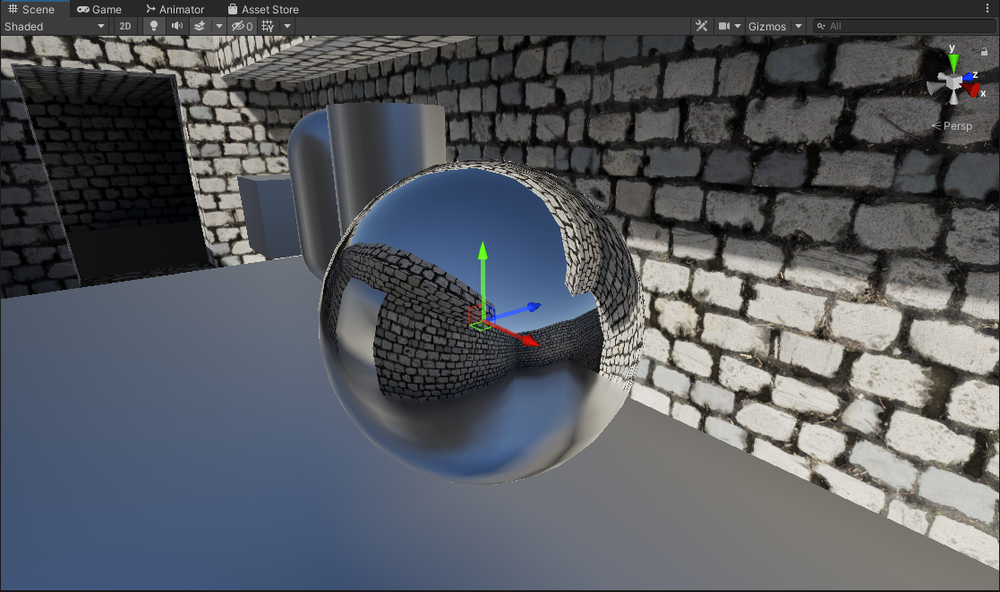

A probe is placed at a specific point, and at runtime *(or during baking)* a camera captures the scene at 6 different orientations *(90 degrees, within a square)*. 


*Graphic from [LearnOpenGL](https://learnopengl.com/Advanced-OpenGL/Cubemaps)*

Each of the faces of this "cube" are combined into a cubemap texture asset. Then this texture asset goes through an additional process step called "specular convolution" which effectively generates a convolved or "blurred" version of the cubemap that coresponds with "rougher" reflections that get stored in the mips of the texture. *(This is important so when the cubemap reflection gets sampled, objects with rougher surfaces can have blurrier reflections)*

| Mip 0 | Mip 1 | Mip 2 | Mip 3 | Mip 4 | Mip 5 |
 ------------- | ------------- | ------------- | ------------- | ------------- | ------------- |
| 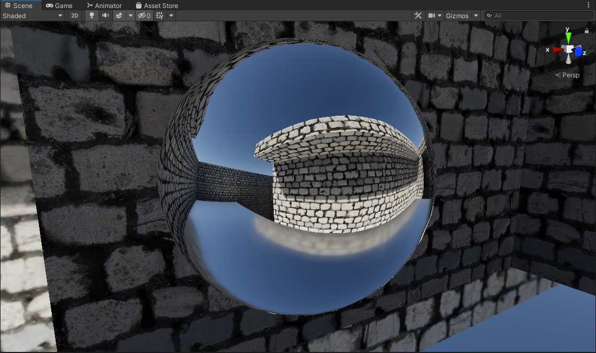 |  |  |  | 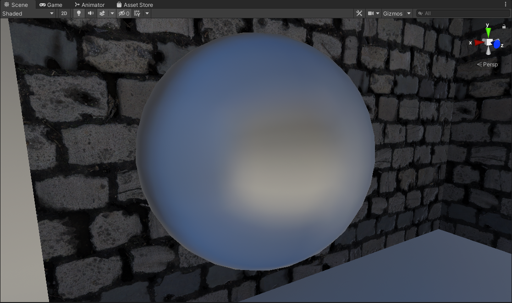 | 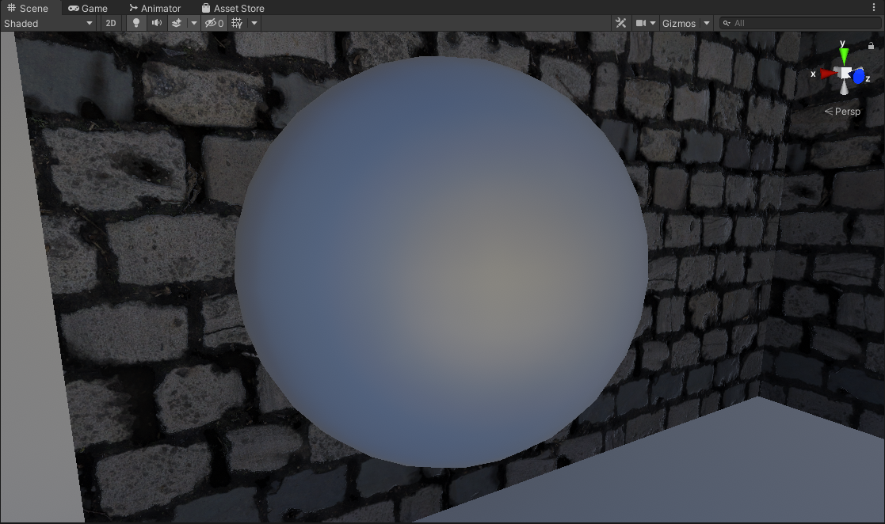 |

This then can be fed to objects within an Axis-Aligned Bounding Box (AABB) Volume inside a scene to sample environment reflections.

<p float="left">
  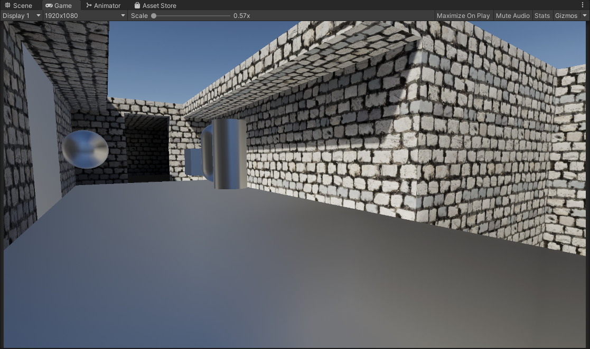
  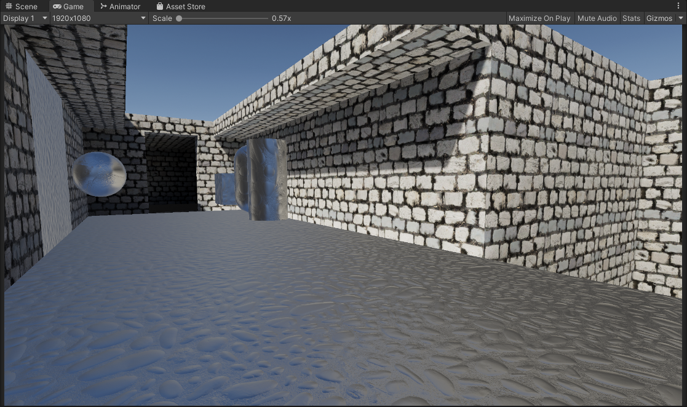
</p>

*Left: No Normal Mapping | Right: Normal Mapped*

However, as Physically Based Rendering and Shading became standard, reflections are a huge part of how an object is shaded now. Sampling this cubemap for environment reflections as-is is not convincing enough in most cases.

These reflection probes are usually authored to be placed using an Axis-Aligned Bounding Box Volume (AABB), to tell objects within the volume to use a specific reflection cubemap.

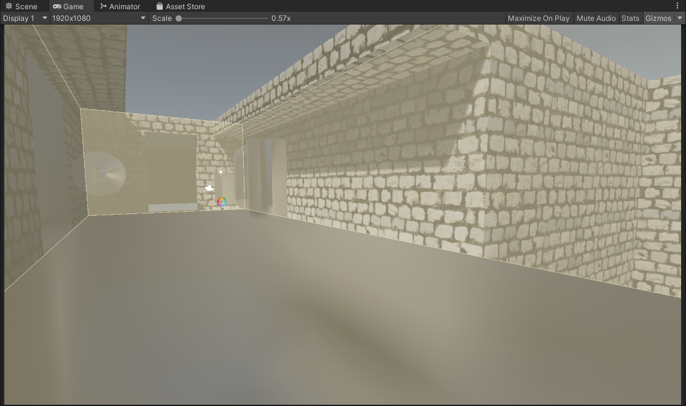

Now fortunately the industry devised a clever way to improve upon the quality of these reflections by projecting the reflection vector onto a box-shape. The box shape in question is the very same AABB volume used to define the reflection volume in the first place, this is parallax-corrected cubemaps.

```HLSL
//compute reflection vector
float3 vector_reflectionDirection = reflect(-vector_viewDirection, vector_normalDirection);

//project reflection vector onto box
vector_reflectionDirection = BoxProjectedCubemapDirection(
    vector_reflectionDirection,     //the original reflection vector to project
    vector_worldPosition,           //world position
    vector_reflectionProbePosition, //the reflection probe position
    vector_reflectionProbeBoxMin,   //reflection probe AABB min
    vector_reflectionProbeBoxMax);  //reflection probe AABB max
```

<p float="left">
  
  
</p>

*Left: Box Projected + No Normal Mapping | Right: Box Projected + Normal Mapped*

However, there is an issue with this approach... 

When sampling the reflection, we choose the mip level based on surface roughness. Meaning that the reflection has a consistent mip level *(or sharpness)* wherever it is being sampled from within the volume. 

This assumption works fine for non-parallax corrected cubemaps *(because the volume is essentially infinitely large)*, but factoring in parallax correction where we have a finite-sized volume this assumption starts to fall apart.

```HLSL
float perceptualRoughness = 1.0 - _Smoothness;

float mip = perceptualRoughness * MAX_REFLECTION_PROBE_MIP_LEVEL; //<--- this is not enough anymore!
```

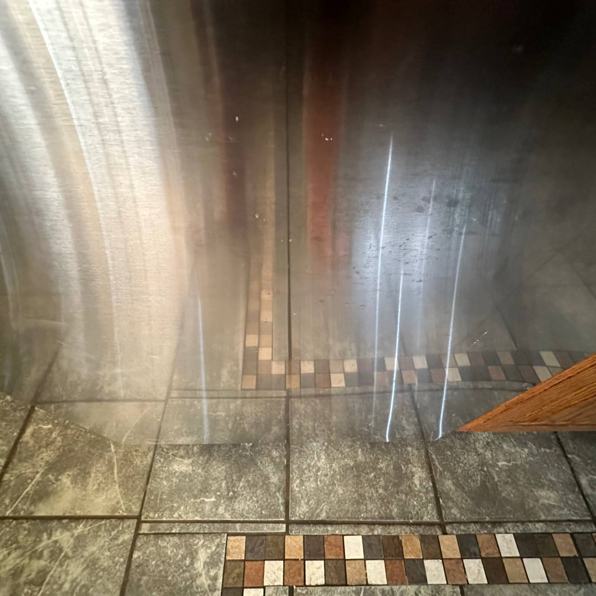

When we look at the real world, we notice that when reflections are closer to the source they remain relatively sharp. The further it goes the blurrier/rougher it gets. This phenomena is not accounted for when sampling our own reflection probes.

So when sampling the reflection cubemap, the mip level should vary not just based on surface roughness, but also depending on how close we are to the source.

## Contact Hardening

#### Contact Hardening: None


#### Code

```HLSL
//Unity's Default Box Projection function
inline float3 UnityBoxProjectedCubemapDirectionDefault(float3 worldRefl, float3 worldPos, float4 cubemapCenter, float4 boxMin, float4 boxMax)
{
    float3 nrdir = normalize(worldRefl);

    float3 rbmax = (boxMax.xyz - worldPos) / nrdir;
    float3 rbmin = (boxMin.xyz - worldPos) / nrdir;

    float3 rbminmax = (nrdir > 0.0f) ? rbmax : rbmin;

    float dist = min(min(rbminmax.x, rbminmax.y), rbminmax.z);

    worldPos -= cubemapCenter.xyz;
    worldRefl = worldPos + nrdir * dist;

    return worldRefl;
}
```
```HLSL
//in object fragment shader...

//compute reflection vector
float3 vector_reflectionDirection = reflect(-vector_viewDirection, vector_normalDirection);

//if box projection is enabled, modify our vector to project reflections onto a world space box (defined by the reflection probe)
vector_reflectionDirection = UnityBoxProjectedCubemapDirectionDefault(vector_reflectionDirection, vector_worldPosition, unity_SpecCube0_ProbePosition, unity_SpecCube0_BoxMin, unity_SpecCube0_BoxMax);

//remap our smoothness parameter to PBR roughness
float perceptualRoughness = 1.0 - _Smoothness;
float roughness = perceptualRoughness * perceptualRoughness;

//compute the cubemap mip level based on perceptual roughness
//NOTE: in unity this is perceptualRoughness * UNITY_SPECCUBE_LOD_STEPS
float mip = UnityPerceptualRoughnessToMipmapLevel(perceptualRoughness);

//sample the environment reflection
enviormentReflection = UNITY_SAMPLE_TEXCUBE_LOD(unity_SpecCube0, vector_reflectionDirection.xyz, mip);
enviormentReflection.rgb = DecodeHDR(enviormentReflection, unity_SpecCube0_HDR);
```

This is the usual way to sample box-projected cubemap reflections. The issue as I described though is that the roughness of the reflection is consistent across the entire volume regardless of camera position, and object position. This is not the case when you compare it to the the real world, or a proper raytraced/ground truth result.

With that there are a few implementations I explored that attempt to alleviate that problem and make them more true to life and higher fidelity.

#### Contact Hardening: Approximated

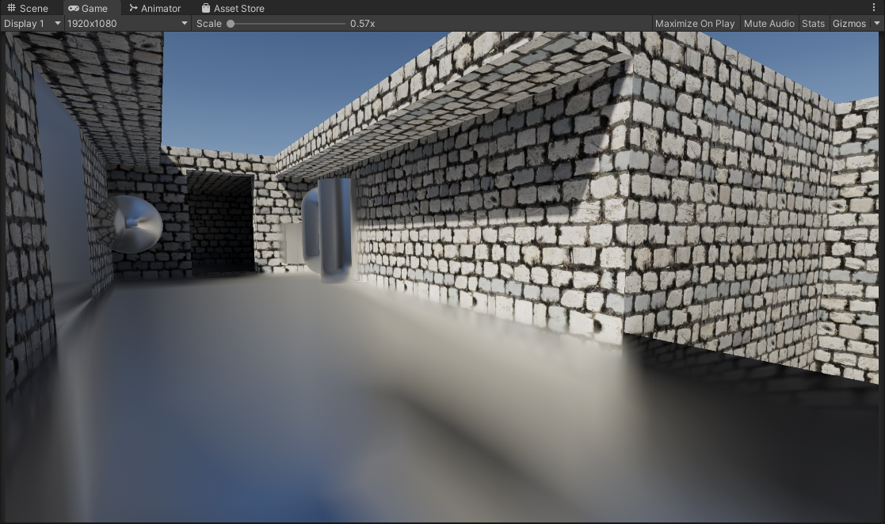

#### Code
```HLSL
//Unity's Default Box Projection function, tweaked to output hit distance
inline float3 UnityBoxProjectedCubemapDirectionDefault(float3 worldRefl, float3 worldPos, float4 cubemapCenter, float4 boxMin, float4 boxMax, out float distanceToHitPoint)
{
    float3 nrdir = normalize(worldRefl);

    float3 rbmax = (boxMax.xyz - worldPos) / nrdir;
    float3 rbmin = (boxMin.xyz - worldPos) / nrdir;

    float3 rbminmax = (nrdir > 0.0f) ? rbmax : rbmin;

    distanceToHitPoint = min(min(rbminmax.x, rbminmax.y), rbminmax.z);

    worldPos -= cubemapCenter.xyz;
    worldRefl = worldPos + nrdir * distanceToHitPoint;

    return worldRefl;
}
```
```HLSL
//in object fragment shader...

//compute reflection vector
float3 vector_reflectionDirection = reflect(-vector_viewDirection, vector_normalDirection);

//remap our smoothness parameter to PBR roughness
float perceptualRoughness = 1.0 - _Smoothness;
float roughness = perceptualRoughness * perceptualRoughness; //offical roughness term for pbr shading

//compute the cubemap mip level based on perceptual roughness
//NOTE: this is basically perceptualRoughness * UNITY_SPECCUBE_LOD_STEPS
float mipOriginal = UnityPerceptualRoughnessToMipmapLevel(perceptualRoughness);

//this will store the "intersectionDistance" result from the box projection
float intersectionDistance = 0;

//if box projection is enabled, modify our vector to project reflections onto a world space box (defined by the reflection probe)
vector_reflectionDirection = UnityBoxProjectedCubemapDirectionDefault(vector_reflectionDirection, vector_worldPosition, unity_SpecCube0_ProbePosition, unity_SpecCube0_BoxMin, unity_SpecCube0_BoxMax, intersectionDistance);

//added a clamp to the mip offset, helps to make sure that when a fragment is far away the mip level doesn't climb to a high value and look wierd
//this tends to look much better when clamped
intersectionDistance = clamp(intersectionDistance, 0.0f, UNITY_SPECCUBE_LOD_STEPS);

//compute new mip level based on the intersectionDistance value (this is mostly arbitrary)
float mip = lerp(0.0f, mipOriginal, intersectionDistance / UNITY_SPECCUBE_LOD_STEPS);

//sample the provided reflection probe at the given mip level
enviormentReflection = UNITY_SAMPLE_TEXCUBE_LOD(unity_SpecCube0, vector_reflectionDirection.xyz, mip);
enviormentReflection.rgb = DecodeHDR(enviormentReflection, unity_SpecCube0_HDR);
```

This is achieved by modifying the existing box projection method to output a hit distance from the bounds of the box, to where the current fragment/pixel is. 

This hit distance is then used to offset the mip level when sampling the cubemap to be sharper when closer to the bounds of the probe, and rougher when farther from the bounds. It's very cheap and fast, though not accurate as it fails to model anisotropic reflections *(Isotropic, or specular elongation)*.

Despite that, this alleviates a couple of visual problems we saw before. 
1. This attempts to solve the problem of reflections being too consistent across the entire volume, making them look closer to a proper raytraced result. *(I.e the closer to the actual source of the reflection bounds, the sharper the reflection gets)*
2. In most situations this contact hardening actually contributes to improved specular occlusion. Since the contact hardening reflections reveal the underlying cubemap more, there is less of a glowing appearance in the corners of the bounds. *(NOTE: This is assuming your reflection probe is placed and configured well to approximate the geometry of the space/room, if it's not this might also contribute to light leaking)*

This is a marginal improvement over the classic method, and it's really cheap!

**NOTE:** *The approximation is mostly arbitrarily tweaked by hand with random values until it looks right, or otherwise known as "banging random rocks together until we get something decent". In addition, any possible tricks to help with mimicking anisotropic reflections would help here.*

#### Contact Hardening: HDRP Approximation / Frostbite Engine

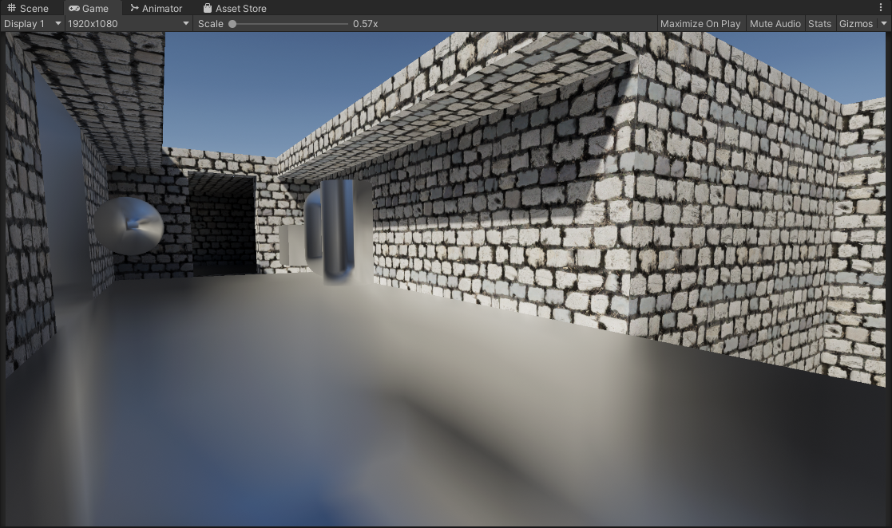

```HLSL
//From Moving Frostbite to PBR document
//This function fakes the roughness based integration of reflection probes by adjusting the roughness value
//NOTE: Untouched from HDRP
float ComputeDistanceBaseRoughness(float distanceIntersectionToShadedPoint, float distanceIntersectionToProbeCenter, float perceptualRoughness)
{
    float newPerceptualRoughness = clamp(distanceIntersectionToShadedPoint / distanceIntersectionToProbeCenter * perceptualRoughness, 0, perceptualRoughness);
    return lerp(newPerceptualRoughness, perceptualRoughness, perceptualRoughness);
}

//This simplified version assume that we care about the result only when we are inside the box
//NOTE: Untouched from HDRP
float IntersectRayAABBSimple(float3 start, float3 dir, float3 boxMin, float3 boxMax)
{
    float3 invDir = rcp(dir);

    // Find the ray intersection with box plane
    float3 rbmin = (boxMin - start) * invDir;
    float3 rbmax = (boxMax - start) * invDir;

    float3 rbminmax = float3((dir.x > 0.0) ? rbmax.x : rbmin.x, (dir.y > 0.0) ? rbmax.y : rbmin.y, (dir.z > 0.0) ? rbmax.z : rbmin.z);

    return min(min(rbminmax.x, rbminmax.y), rbminmax.z);
}

//return projectionDistance, can be used in ComputeDistanceBaseRoughness formula
//return in R the unormalized corrected direction which is used to fetch cubemap but also its length represent the distance of the capture point to the intersection
//Length R can be reuse as a parameter of ComputeDistanceBaseRoughness for distIntersectionToProbeCenter
//NOTE: Modified to be much simpler, and to work with the Built-In Render Pipeline (BIRP)
float EvaluateLight_EnvIntersection(float3 worldSpacePosition, inout float3 R)
{
    float projectionDistance = IntersectRayAABBSimple(worldSpacePosition, R, unity_SpecCube0_BoxMin.xyz, unity_SpecCube0_BoxMax.xyz);

    R = (worldSpacePosition + projectionDistance * R) - unity_SpecCube0_ProbePosition.xyz;

    return projectionDistance;
}
```
```HLSL
//in object fragment shader...

//compute reflection vector
float3 vector_reflectionDirection = reflect(-vector_viewDirection, vector_normalDirection);

float perceptualRoughness = 1.0 - _Smoothness;

//use HDRP method to compute the intersection distance (and also box project vector_reflectionDirection)
float projectionDistance = EvaluateLight_EnvIntersection(vector_worldPosition, vector_reflectionDirection);

//use HDRP formula to calculate roughness based on distance
float distanceBasedRoughness = ComputeDistanceBaseRoughness(projectionDistance, length(vector_reflectionDirection), perceptualRoughness);

//the output of distanceBasedRoughness is the new perceptual roughness
perceptualRoughness = distanceBasedRoughness;

float roughness = perceptualRoughness * perceptualRoughness;

//compute the cubemap mip level based on perceptual roughness
float mip = UnityPerceptualRoughnessToMipmapLevel(distanceBasedRoughness);

//sample the provided reflection probe at the given mip level
enviormentReflection = UNITY_SAMPLE_TEXCUBE_LOD(unity_SpecCube0, vector_reflectionDirection.xyz, mip);
enviormentReflection.rgb = DecodeHDR(enviormentReflection, unity_SpecCube0_HDR);
```

This I found about recently, where [Unity HDRP](https://docs.unity.cn/Packages/com.unity.render-pipelines.high-definition@13.1/manual/whats-new-10.html) had a very similar implementation to the original approximation I stumbled upon. *(The implmentation also stems from improvements made to the Frostbite engine)*

The difference being that the approximation used here is less obvious/extreme than the other original approximation I had, and it tries to stay somewhat physically plausible. 

Comparing it to ground truth it is closer in some cases than the other, for a very similar cost. A big improvement over the classic method, and it's really cheap!

#### Contact Hardening: Godot Approximation


```HLSL
//Unity's Default Box Projection function, tweaked to output hit distance
inline float3 UnityBoxProjectedCubemapDirectionDefault(float3 worldRefl, float3 worldPos, float4 cubemapCenter, float4 boxMin, float4 boxMax, out float distanceToHitPoint)
{
    float3 nrdir = normalize(worldRefl);

    float3 rbmax = (boxMax.xyz - worldPos) / nrdir;
    float3 rbmin = (boxMin.xyz - worldPos) / nrdir;

    float3 rbminmax = (nrdir > 0.0f) ? rbmax : rbmin;

    distanceToHitPoint = min(min(rbminmax.x, rbminmax.y), rbminmax.z);

    worldPos -= cubemapCenter.xyz;
    worldRefl = worldPos + nrdir * distanceToHitPoint;

    return worldRefl;
}
```
```HLSL
//in object fragment shader...

//calculate a basic fresnel term (cheap)
float fresnelTerm = 1.0f - max(dot(vector_normalDirection, vector_viewDirection), 0.0f);

//note: higher power means that you effectively need to be closer to the surface for the contact hardening to appear
fresnelTerm = pow(fresnelTerm, _ApproximationGodotFresnelPower);
//fresnelTerm = fresnelTerm * fresnelTerm; //hardcoded pow 2.0
//fresnelTerm = fresnelTerm * fresnelTerm * fresnelTerm; //hardcoded pow 3.0
//fresnelTerm = fresnelTerm * fresnelTerm * fresnelTerm * fresnelTerm; //hardcoded pow 4.0 (this was the chosen value in the original godot improvement)

//compute reflection vector
float3 vector_reflectionDirection = reflect(-vector_viewDirection, vector_normalDirection);

//remap our smoothness parameter to PBR roughness
float perceptualRoughness = 1.0 - _Smoothness;
float roughness = perceptualRoughness * perceptualRoughness;

//compute the cubemap mip level based on perceptual roughness
//NOTE: this is basically perceptualRoughness * UNITY_SPECCUBE_LOD_STEPS
float mipOriginal = UnityPerceptualRoughnessToMipmapLevel(perceptualRoughness);

//this will store the "intersectionDistance" result from the box projection
float intersectionDistance = 0;

//if box projection is enabled, modify our vector to project reflections onto a world space box (defined by the reflection probe)
vector_reflectionDirection = UnityBoxProjectedCubemapDirectionDefault(vector_reflectionDirection, vector_worldPosition, unity_SpecCube0_ProbePosition, unity_SpecCube0_BoxMin, unity_SpecCube0_BoxMax, intersectionDistance);

//remap distance to be relative to amount of mips.
float reflectionRoughness = intersectionDistance / UNITY_SPECCUBE_LOD_STEPS;

//reflection roughness shifts depending on the fresnel term
reflectionRoughness *= 1.0 - fresnelTerm;

//increase roughness when viewing angle is perpendicular to avoid overly sharp reflections on rough surfaces.
reflectionRoughness += (1.0 - fresnelTerm) * perceptualRoughness;
reflectionRoughness = saturate(reflectionRoughness);

//ensures fully rough materials don't have reflection contact hardening.
float mipMin = (roughness * roughness) * UNITY_SPECCUBE_LOD_STEPS;
float mip = lerp(mipMin, mipOriginal, reflectionRoughness);

//sample the provided reflection probe at the given mip level
enviormentReflection = UNITY_SAMPLE_TEXCUBE_LOD(unity_SpecCube0, vector_reflectionDirection.xyz, mip);
enviormentReflection.rgb = DecodeHDR(enviormentReflection, unity_SpecCube0_HDR);
```

This is a recent development I've been following. As a result of this repository the folks with Godot Engine have been implementing this feature to improve their reflections rendering.

- [Godot Proposal 11670](https://github.com/godotengine/godot-proposals/issues/11670)
- [Godot Pull 106292](https://github.com/godotengine/godot/pull/106292)

Their implementation is based on my original approximation but a fresnel term has been added as an additional attribute *(beyond just surface position/distance)* to offset the mip level of the reflection. This has been checked against Blender Cycles renderer for ground-truth comparisons, and [accuracy is much improved](https://github.com/godotengine/godot/pull/106292).

Apperance wise the effect is more muted and less pronounced, but when at grazing angles the effect starts to become more noticable.

If we check the Godot approximation against my inital one we can see that the reflections get sharper when we get closer to the surface *(thanks to the fresnel term)* where with my original approximation it does not.

<p float="left">
  
  
</p>

*Left: Approximation | Right: Godot Approximation with Fresnel*

<p float="left">
  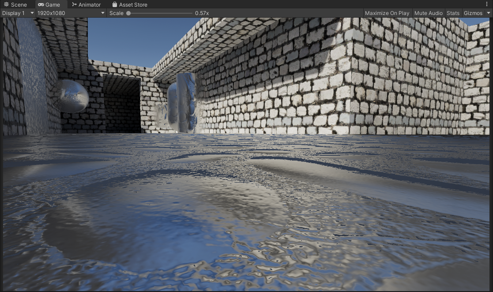
  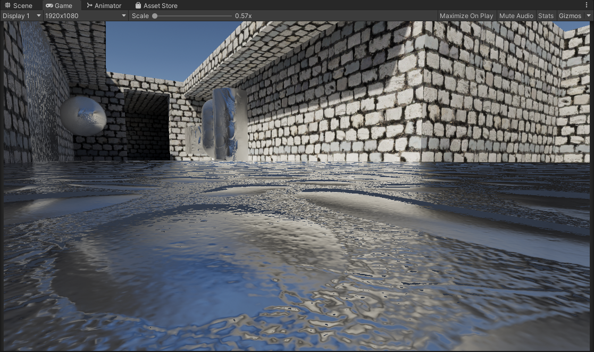
</p>

*Left: Approximation + Normal Mapping | Right: Godot Approximation with Fresnel + Normal Mapping*

An additional improvement/optimization to this would be utilizing the actual PBR fresnel term that normally gets calculated and multiplied with your environment reflection, rather than just calculating a new fresnel term for this specific instance.

Once again, a big improvement over the classic method, and it's cheap!

#### Contact Hardening: Raytraced

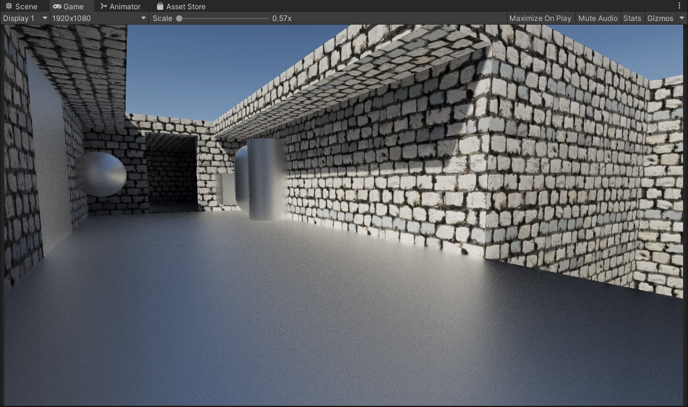

Code can be found in here...
- [ReflectionTracing.cginc](https://github.com/frostbone25/Unity-Improved-Box-Projected-Reflections/blob/main/ImprovedBoxProjectedReflections/Assets/Shaders/ReflectionTracing.cginc)
- [ImprovedBoxProjectedReflections.shader](https://github.com/frostbone25/Unity-Improved-Box-Projected-Reflections/blob/main/ImprovedBoxProjectedReflections/Assets/Shaders/ImprovedBoxProjectedReflections.shader)

This is the most accurate method out of the previous ones we had. This is equivalent to ground truth, and unlike the approximations it can properly model anisotropic specular *(specular elongation)*. It's the most accurate and best looking one. However in comparison it is more complicated and slower than previous methods and requires alot of samples to mitigate artifacts *[(More on this later)](#contact-hardening-raytracing-options)*.

It's a massive improvement over the classic method and the approximations, but it's more complicated and expensive *(Again more on this later, it's not as bad as you think)*

### Contact Hardening Comparisons (Non-Normal Mapped Material)

<p float="left">
  
  
  
  
  
</p>

*Left To Right: None, Approximation, HDRP Approximation, Godot Approximation, Raytraced*

### Contact Hardening Comparisons (Normal Mapped Material)

<p float="left">
  
  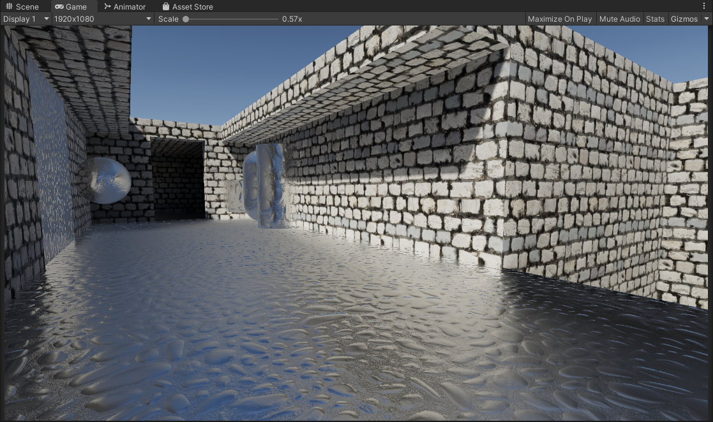
  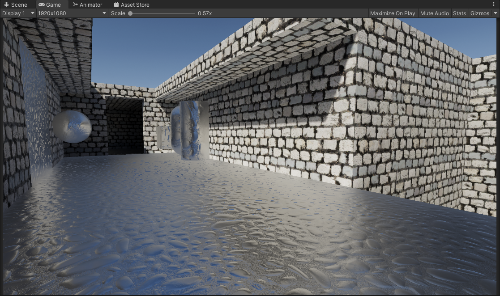
  
  
</p>

*Left To Right: None, Approximation, HDRP Approximation, Godot Approximation, Raytraced*

#### Contact Hardening: Raytracing Options

Earlier we mentioned that while this method is the most accurate and high quality, it's also expensive when compared to it's approximated counterparts. I also want to note that it's important also to keep in mind the "raytracing" being done here is fairly simple compared to what one might expect, it's just AABB ray testing against the reflection probe bounds. It's all software-based and can even run on a Quest 2 standalone at a decent framerate. With that said there are a few of things we can do here to try to help both improve quality and performance.

The current implementation also is using an Importance Sampled GGX Function for specular convolution, at 64 samples.

The blue noise also being used later in the examples/project is a precomputed 3D Texture with 64 slices (64 iterations). The 3D texture being built from 64 slices of precomputed blue noise textures from [Moments in Graphics by Christoph Peters](https://momentsingraphics.de/BlueNoise.html). I do also have precomputed [Spatio-Temporal Blue Noise (STBN)](https://developer.nvidia.com/blog/rendering-in-real-time-with-spatiotemporal-blue-noise-textures-part-1/) volumes in the project that I also combined, however for some reason the result's I got were worse than with the ones from [Christoph Peters](https://momentsingraphics.de/BlueNoise.html). Might be something I did wrong or incorrectly, someone let me know please!

#### Static Noise *(Non-Deterministic Sampling)*

*Left: Static White Noise | Right: Static Blue Noise*

<p float="left">
  
  
</p>

By default white noise is being used. In the current implementation we can use blue-noise sampling to try to improve the perceptual quality. Comparing side by side the difference is small in a static scenario like this, but the blue noise is noticably more consistent and pleasing compared to white noise. At lower sample counts obviously the blue noise shows it's strengths more but of course lower samples = lots of noise regardless.

One other thing also featured in the shader is a "Mip Offset" cheat. As it turns out the approximations we have earlier actually work great here and work as a way to blur the results the further the fragment/pixel is. This is something that can be done but in my opinon I would caution against it. Reason being that it alters the reflection properties by blurring the underlying reflection a little too much, and you will start to lose out on that specular enlongation.

*Left: Blue Noise | Right: Static Blue Noise With Mip Offsetting*

<p float="left">
  
  
</p>

#### Animated Noise *(Non-Deterministic Sampling)*

*Left: Animated White Noise | Right: Animated Blue Noise*

<p float="left">
  
  
</p>

One common solution we can try here is to animate the noise, and accumulate samples over time. This scenario is also where blue noise shines the most, since we are using 1 sample per pixel for every frame, and the sample pattern changes every frame. Using Unity's Default TAA Here and with a stationary camera the results get cleaned up very nicely, and it's performant as it's only 1 sample per pixel, accumlated across multiple frames. 

Now obviously the drawback of this solution is that it is temporal, it accumulates results over multiple frames. Because of that you'll have to deal with the problems that come about with temporal rendering such as disocclusion events, changing perspective, ghosting, and that whole mess. Filtering this with an additional blur that is normal aware will help you here but that introduces inaccuracies as well with trying to retain sharp reflections. Pick your poison.

#### Deterministic Sampling

If you don't like noise, you can choose to forgo Monte-Carlo random sampling and instead go for a more uniform/deterministic sampling type. You swap artifacts from noise to aliasing, just like the noise however the more samples you have the better. Better performance in theory *(better cache coherence)* but can look pretty bad.

*Left: Deterministic Sampling | Right: Deterministic Sampling With Mip Offset*

<p float="left">
  
  
</p>

I also introduced a comparison with the enabled "Mip Offsetting" approximation which can be used in conjunction with this deterministic sampling approach to get you usable results on smooth surfaces. However just like I mentioned earlier, introducing this does overly blur the reflection and you lose out on that specular elongation.

## Beveled Box Projection

#### Beveled Box Projection: Off


Classic box projection, it's fast and simple, but has sharp edges and can look jarring at grazing angles especially when the cubemap is sampled at a higher mip level.

#### Beveled Box Projection: On


Using a beveled box projection with an adjustable bevel factor, to smooth out the sharp edges you'd get with the classic method.

The initial idea here is 
1. Give an artist-controlled parameter to smooth out the reflection probe projection.
2. A more complex but optically inspired approach by mapping the bevel factor to increased roughness, so the blurrier the reflection gets, the smoother the edges of the box projection are.

Granted the current implementation has artifacts at high bevel values, note the top left and right sides. You also have to deal with added complexity/instruction counts for a bevel box projection. 

**In my opinion**: For most circumstances this is not as transformative as contact hardening, which already visually "un-boxes" the appearance of your box projected reflection for a much cheaper cost.

## Box Based Specular Occlusion

Another oddball thing we can do, since we have the information of an environment with a box shape. We can use the hit distance from that to do a form of specular occlusion. The closer a pixel/fragment is to the bounds of the box, the more occluded it becomes. So in circumstances where push comes to shove you need to occlude specular or reflections, this is a possible route.

#### Box Occlusion: Off


Using the classic box projected reflections, note the glowing apperance where the floor meets the walls.

#### Box Occlusion: On


With box occlusion, there is an added darkening that is introduced. Eliminating the glowing apperance. 

***NOTE:*** The material here is a pure metallic/reflective material so the results here can look pretty rough. In cases where you have non-metallic materials this can work well for specular occlusion. It depends on your project/use cases.

```HLSL
//recompute reflection direction
float3 vector_specularOcclusionReflectionDirection = reflect(-vector_viewDirection, vector_normalDirection);

//This is the output hit distance, but we will use it as our specular occlusion factor
float specularOcclusionFactor = 0;

vector_specularOcclusionReflectionDirection = UnityBoxProjectedCubemapDirectionDefault(vector_specularOcclusionReflectionDirection, vector_worldPosition, unity_SpecCube0_ProbePosition, unity_SpecCube0_BoxMin, unity_SpecCube0_BoxMax, specularOcclusionFactor);

//artistic parameters for specular occlusion
specularOcclusionFactor = pow(specularOcclusionFactor, _ExperimentalSpecularOcclusionPower);
specularOcclusionFactor *= _ExperimentalSpecularOcclusionMultiplier;

//clamp so we stay within 0..1
specularOcclusionFactor = saturate(specularOcclusionFactor);

//apply to environment reflection
enviormentReflection *= lerp(1.0f, specularOcclusionFactor, _ExperimentalSpecularOcclusionIntensity);
```

### TODO/Ideas:

- Raytraced: Reflection-Luminance Importance Sampling
- Bevel Box Projection: Fix Artifacts

### Credits / Sources

- **[Inigo Quilez](https://iquilezles.org/articles/intersectors/)**: Beveled Box Code
- **[Christoph Peters](http://momentsingraphics.de/BlueNoise.html)**: Free blue noise textures.
- **[Unity HDRP](https://github.com/Unity-Technologies/Graphics/blob/504e639c4e07492f74716f36acf7aad0294af16e/Packages/com.unity.render-pipelines.high-definition/Runtime/Lighting/)**: Approximated Distance Based Roughness Implementation
- **[Unity SRP Core](https://github.com/Unity-Technologies/Graphics/blob/504e639c4e07492f74716f36acf7aad0294af16e/Packages/com.unity.render-pipelines.core/ShaderLibrary/)**: Various Functions
- **[Unity.cginc](https://github.com/TwoTailsGames/Unity-Built-in-Shaders/blob/master/CGIncludes/)**: Unity Box Projection
- **[Cactus_On_Fire](https://www.reddit.com/r/Unity3D/comments/rtmtfz/i_made_a_shader_that_accurately_diffuses_the/)**: Inital inspiration
- **George**: Tipping me off to Unity HDRP's implementation
- **[Calinou](https://github.com/Calinou)**: Improved Godot version of Contact Hardening Approximation.
- **[lander-vr](https://github.com/lander-vr)**: Improved Godot version of Contact Hardening Approximation.
- **[clayjohn](https://github.com/clayjohn)**: Improved Godot version of Contact Hardening Approximation.