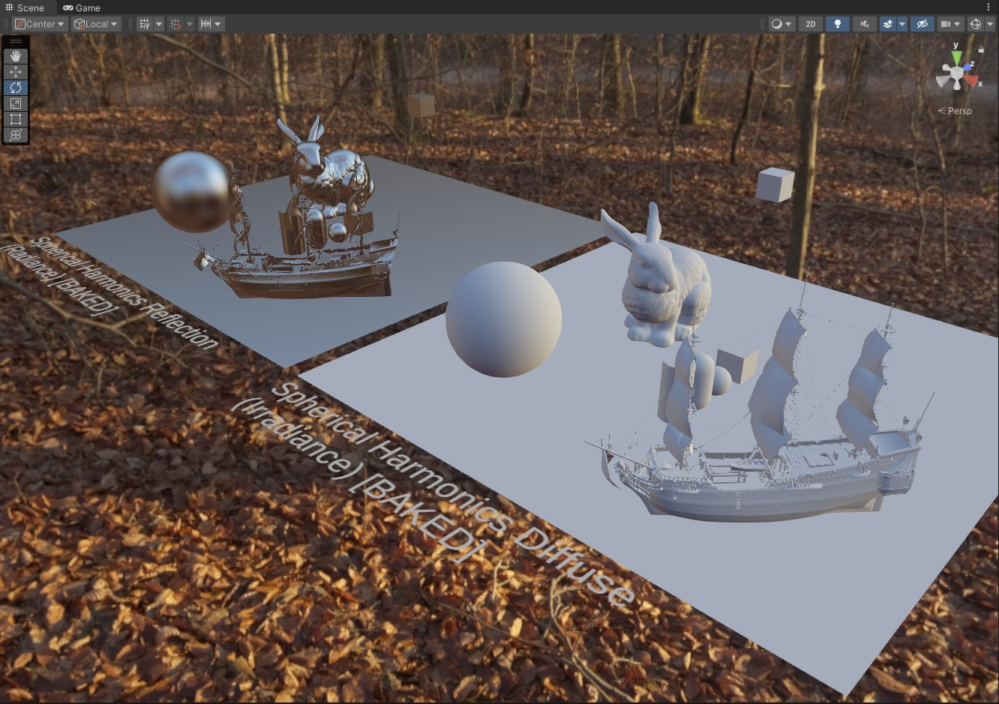
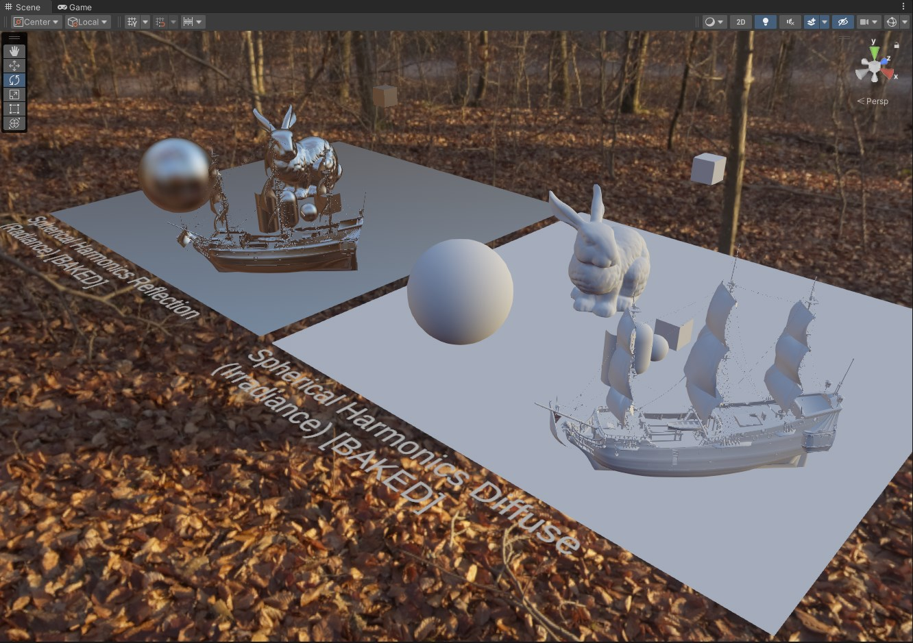
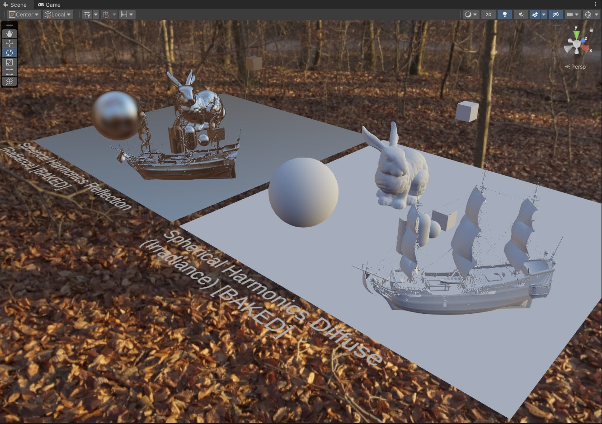
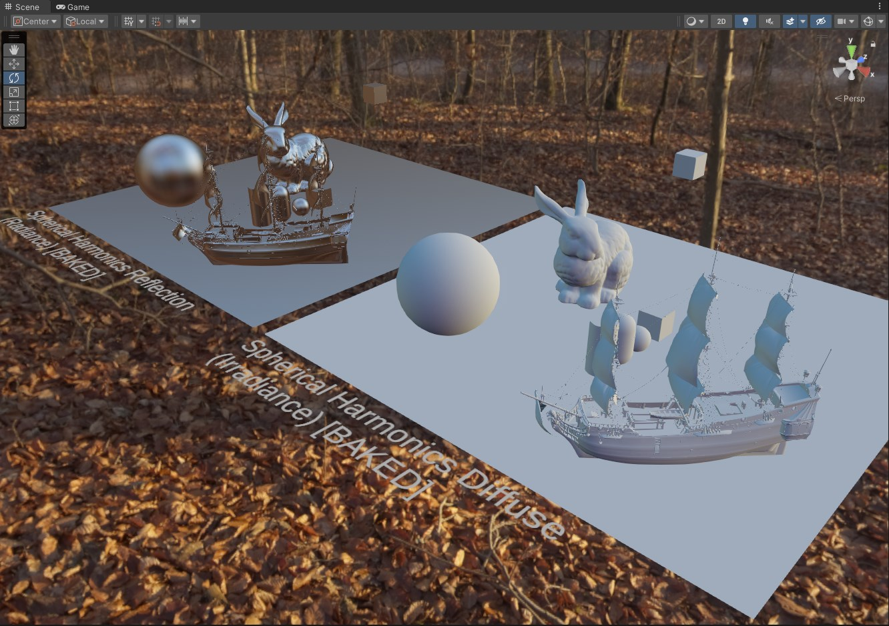
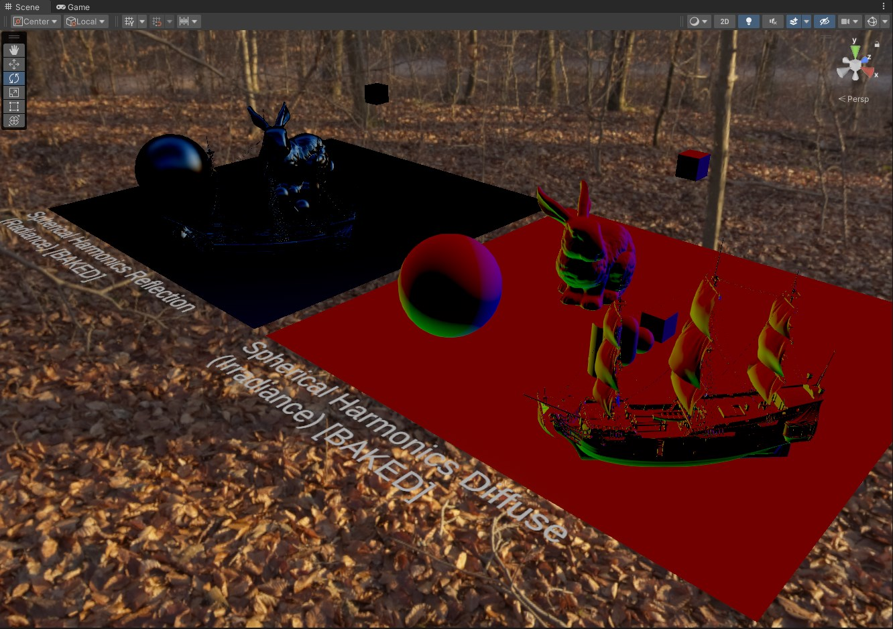
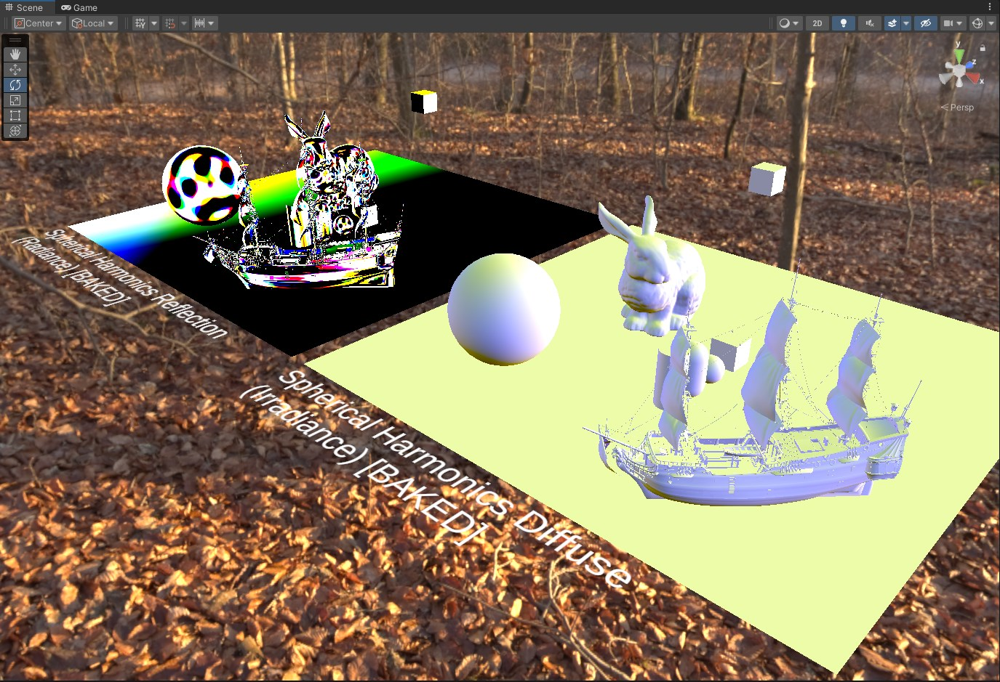
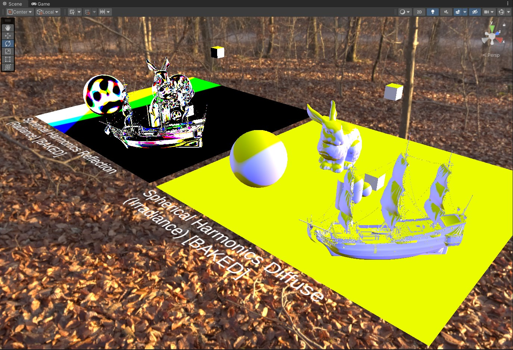
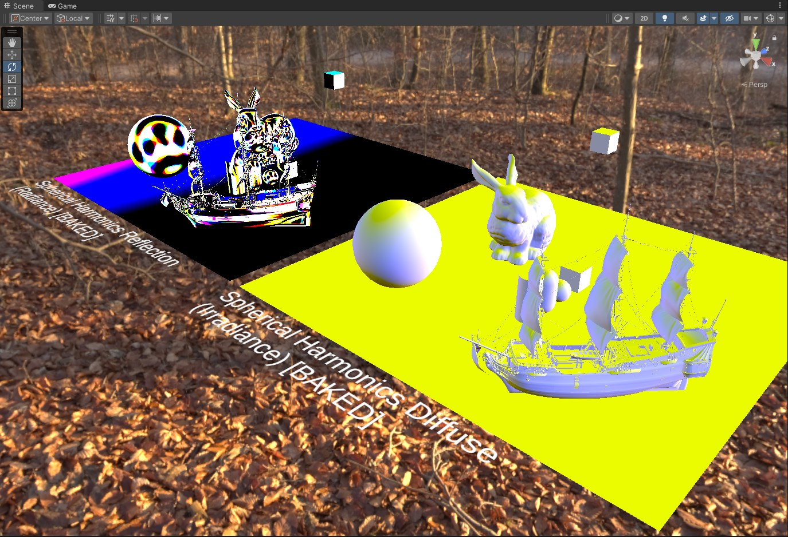
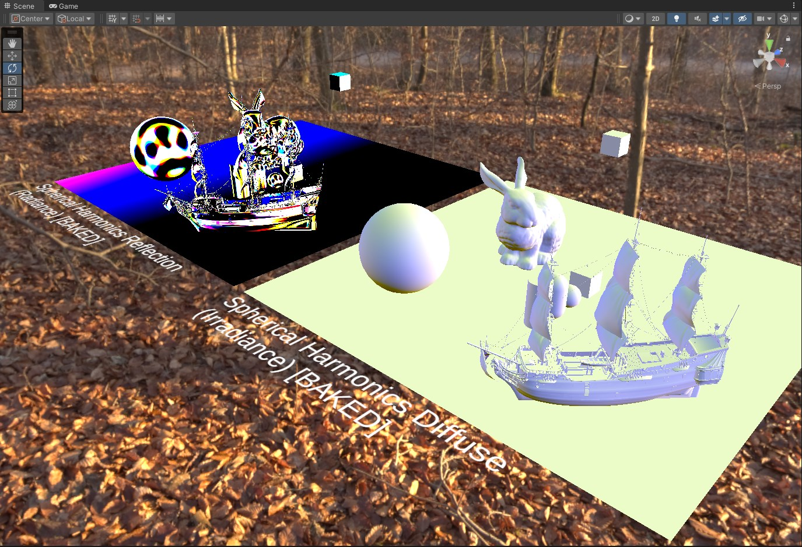
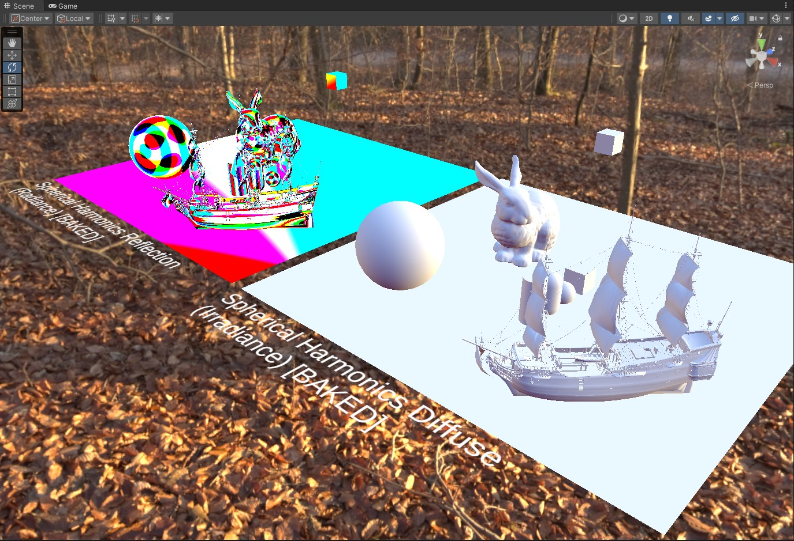

## Preface
So you have your Spherical Harmonic coefficents generated... Cool! Now let's say you are developing a system where you want to use spherical harmonics to retain spherical information across a wide area. 

Good examples of this are a light probe system for determining the diffuse shading of an object at a specific position. Another one is visibility information to determine if something is occluded or not. 


**The important thing to keep in mind here is that, especially depending on the amount of spherical harmonic orders you are using, and the context they are applied in, you may need to store a little or a lot.**

The solution to handling large stacks of data is to reduce the size of it. Done either with compression or reducing precison. This is something I wanted to experiment with and explore as I have not seen any material online covering this, nor showing the consequences of compression in the context of spherical harmonics.

In my case I am exploring spherical harmonics in the context of holding diffuse light information so I require 3 components *(Red, Green, Blue / RGB)* and I need to cover a value range beyond 1.0. 

Now in a different example, like storing visibility information, you usually only need 1 component and a value range between 0 and 1 so the requirements are different. *(And would like to point out that consequences of less data precison would likely be less impactful here)*

Now depending on how you handle lighting in your engine/setup the range of light information can vary widely. In my case the range of light values with these HDRIs I'm testing go up to 5 at it's highest. Now in some engines/setups if you are using a full HDR range with physical light units you may have value ranges that skyrocket past 5 so keep that in mind because you'll need a datatype that can handle that full range or more.

Some Notes before we begin...

- I tested signed values along with unsigned since spherical harmonic projection can usually generate coefficents with negative values, and this is usually refered to as ringing. So even results with unsigned were shown because I wanted to have a visual example of how it mangles things, but don't forget about this phenomena when using spherical harmonics.

- Since we are in a lighting context it's possible that you can use HDR value compression techniques here, however I have not in these tests.

- In addition to reducing data precison/compression, depending on how you go about it you will most likely be trading processing cost for disk/memory usage. Keep this in mind and make sure to profile your project.

Lets start by showing the highlights of the experiment (the rest of the result's will be shown later).

### Float32 [4 Bytes | 32 bits] (Original)

We have 2 Order Spherical Harmonic Irradiance data. This requires a set of 9 float3's *(RGB)* coefficents. 9 float3's is 27 floats total. 

We also have 6 Order Spherical Harmonic Radiance data. This requires a set of 49 float3's (RGB) coefficents. 49 float3's is 147 floats total. 

There are 4 bytes in a float so the sizes come about to... 

```
2nd Order Irradiance/Diffuse  = 4 * 27  = 108 bytes. 
6th Order Radiance/Reflection = 4 * 147 = 588 bytes.
```

**108 bytes** to store diffuse/irradiance spherical lighting information, and **588 bytes** to store reflection/radiance spherical lighting information. Both with floating point precison, which yields a very large value range that is also signed. This is fairly standard but we can do better!

![Float32 [4 Bytes | 32 bits]](example-1-float.jpg)

### Half16 [2 Bytes | 16 bits]

A Half16 is 2 bytes, so that yields... 

```
2nd Order Irradiance/Diffuse  = 2 * 27  = 54 bytes. 
6th Order Radiance/Reflection = 2 * 147 = 294 bytes.
```

The size/precison of the data is literally half of a float. This is a fairly common thing to do when floating point precison is not required and the values are still signed.

Checking the results visually, we can see that pretty much in all circumstances everything looks identical. Keep in mind that our light value ranges don't exceed 5.0 so your results may vary.

![Half16 [2 Bytes | 16 bits]](example-2-half.jpg)

### Signed 10 Bit Decimal 2 [4 Bytes | 32 bits for 3 RGB Values]

Lets go further, and this is what I was most curious to see. How does the reconstruction fall apart when there is a lack of precison.

Note that this will approach the territory where you need to watch for your value ranges. My computed coefficent ranges for the HDRIs I've tested against were `[-0.5f - 5.0f]` roughly. 

So I chose to reduce the values down to a signed 10 bit value. Which affords you `[-512, 511]` value range. In my testing I also found that atleast 2 decimal places were needed to keep results looking fairly close to the original. 

So with some basic compression math the actual range would be `[-5.12, 5.11]`. You can pack these small 10 bit values into a full 32 bit (4 byte) value. `(R 10 | G 10 | B 10 | 2 unused)`. You could also try something similar to D3Ds R11G11B10 format often used for HDR to squeeze a little extra data for some of the channels, but I wanted to keep things consistent here. 

So 3 floats effectively compressed into 4 bytes, so that yields... 

```
2nd Order Irradiance/Diffuse  = 4 * 9  = 36 bytes. 
6th Order Radiance/Reflection = 4 * 49 = 196 bytes.
```

This is about as low as we can get it in theory while trying to respect the HDR values we have. If we go any lower then we will just mangle the data *(you can see this happening later)*

![Signed 10 Bit Decimal 2 [4 Bytes | 32 bits for 3 RGB Values]](example-3-signed-10-2.jpg)

I should note that these examples are the most basic and simple way to reduce/compress these kind of values. However I mentioned earlier that this boils down to effectively compressing HDR color data since we are in a lighting context. So if you wanted to get fancy you could employ concepts behind HDR compression i.e. like using RGBM, RGBE, or even LogLUV to get better results. But you need to keep in mind that depending on the data reduction/compression methods used, you will trade memory/space with processing power. 

Now I'll show the results with the many different variations I have...

# Full Data Reduction Results

                             