*By: David Matos*

Sharing personal my notes, and experiments with bent normals.

*NOTE: I would like to preface this by saying if there are any inaccuracies with my explanations or defintions please let me know. If you have suggestions or techniques to share that leverage bent normals in this context also let me know!*

#### Table of Contents
- [Preface](#Preface)
- [What are Bent Normals?](#what-are-bent-normals)
- [Why?](#why)
    - [Why should I bother using a bent normal map?](#why-should-i-bother-using-a-bent-normal-map)
    - [Will bent normals replace normal maps?](#will-bent-normals-replace-normal-maps)
    - [Will bent normals will cost an extra texture sample?](#will-bent-normals-will-cost-an-extra-texture-sample)
    - [Are bent normals really worth it?](#are-bent-normals-really-worth-it)
- [How to Generate Bent Normals](#how-to-generate-bent-normals)
- [Using Bent Normal in an Object Shader](#using-bent-normal-in-an-object-shader)
    - [Optimization Bonus](#optimization-bonus)
- [Bent Normals Use Case: Specular Occlusion](#bent-normals-use-case-specular-occlusion)
    - [Bent Normal Specular Occlusion Implementation](#bent-normal-specular-occlusion-implementation)
- [Bent Normals Use Case: Diffuse Global Illumination](#bent-normals-use-case-diffuse-global-illumination)
    - [Bent Normal Diffuse Global Illumination Implementation](#bent-normal-diffuse-global-illumination-implementation)
- [References / Sources](#references--sources)

<p float="left">
    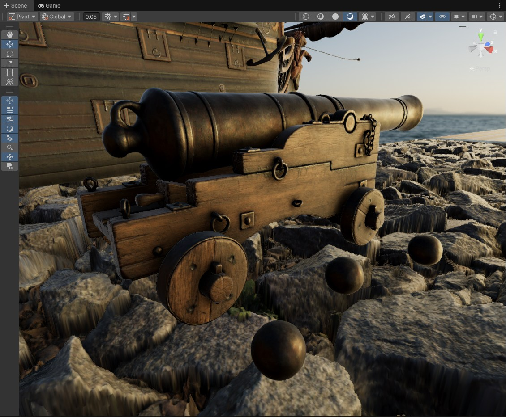
    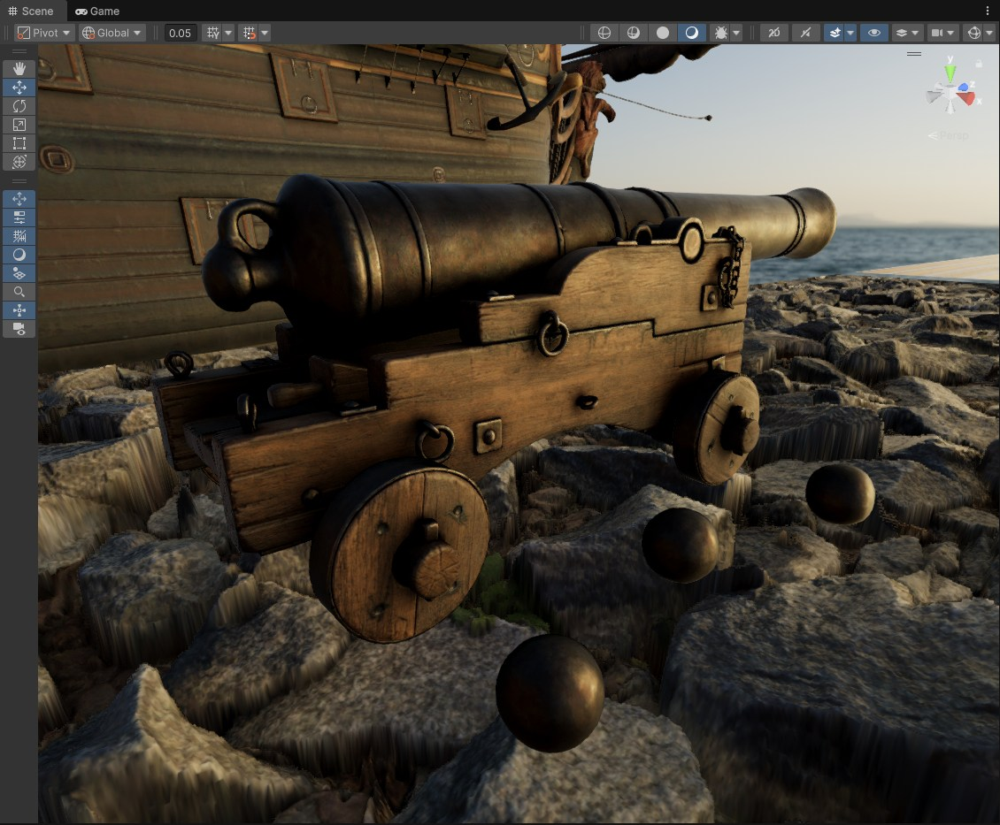
</p>

*Left: No bent normals | Right: Bent Normals*

# Preface

If you were like me before learning about bent normals, you might have been very confused by them, wondering what the fuss is all about. 

Many popular engines have them and even document it, but unfortunately some of those documentations I stumbled across were not enough for me to really illustrate the full effects of bent normals. Not only that the application of bent normals to regular shading I found to be a bit of a mystery.

Well, I hope with my post here I can at the very least help explain and show you bent normals, how to generate them, and more importantly the actual applications of bent normals and what they can be used to do *(in the context of object shaders)*. After taking the plunge and diving into it myself and implementing it in my projects, I find it to be quite transformative, I hope you will too!

# What are Bent Normals?

Before getting into Bent Normals, you need to be familiar with Ambient Occlusion.


*[Ambient Occlusion Map of the Gray Rocks Texture Asset from PolyHaven](https://polyhaven.com/a/gray_rocks)*

Ambient Occlusion is a technique used to calculate the occlusion/darkening of light in areas. It's intended to solve part of a bigger problem in rendering, that being Global Illumination. When objects get close to each other a soft shadowing or darkening effect starts to appear, this is because the light rays that are normally lighting the objects are now being blocked by each other. 

In the occlusion map up above you can see that the rocks on the surface are mostly white, but as you look deper into the crevices and cracks the shadowing increases because there is more geometry around blocking light.

Now this final occlusion map texture is usually just a single-scalar value used to darken the final lighting. 

<p float="left">
    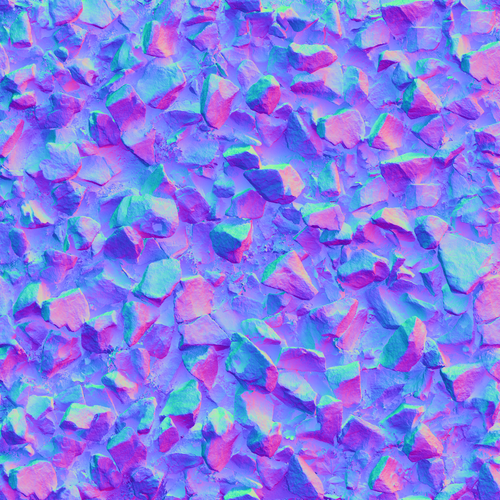
    
</p>

*Left: Generated Bent Normal Map | Right: Normal Map*

Bent Normals can be viewed as an extension of ambient occlusion maps. Instead of storing the single final "occlusion" scalar value, **it stores the average least occluded direction of light.**

In simpler terms, it's the same as a surface normal map, except the original surface normals are shifted/biased away from dark areas and towards the the light. This direction is made up of 3 values *(X, Y, Z)* and gets stored in a texture map just like a regular normal map.

# Why?

This is the important question, and the question I was left wondering... why?

I won't write all of the possible questions, but these were the main ones questions that I wanted answers to before I was convinced to use them in my projects.

#### Why should I bother using a bent normal map? 

If you want to bump up the quality of your shading, without adding too much cost bent normals are a good way to start. In this post I share a couple of the main cases where using bent normals has great benifits. 

For instance using bent normals to shade objects from [global illumination](#bent-normals-use-case-diffuse-global-illumination) *(or indirect lighting)* sources like light probes, or using it to calculate a term for [specular occlusion](#bent-normals-use-case-specular-occlusion) to improve the quality of your specular/reflections.

They can also be used for more artistic control if your going for a specific look, i.e. you want to exagerate bounce light coming from direct lights.

#### Will bent normals replace normal maps?

No! They dont replace normal maps. Normal maps are still critical for describing surface detail, especially for direct lighting responses. 

Bent normals on the other hand are only used for supplement lighting terms. Sampling global illumination is one example.

#### Will bent normals will cost an extra texture sample? 

This is correct for the most part, Bent Normals are basically another normal map that you have to sample and deal with. Memory and performance wise this can be a huge deterrent.

But...

It's actually possible to combine bent normals with regular normal maps! *[(I share some code later on how to do this)](#optimization-bonus)* That way you only have to deal with just 1 texture in the end, which is good for keeping memory and performance tight. 

The only expense really is some more instructions to recalculate a component and lug around a "bent normal direction" vector in the shader, along with some additional terms that you can calculate later for improving shading thanks to the bent normal vector.

#### Are bent normals really worth it?

If your project uses a lot of static lighting, I think bent normals are a must. Either with lightmaps or with light probes. Even if you also have real-time lighting and provide data to objects in your scene in the form of probes, or an irradiance volume bent normals can help you out there.

If it's something you think is worth implementing, I invite you to check out the rest of this post as I show the applications of it in the context of object shaders. Then you can really determine if it's worth implementing for your own projects or not.

Ok, so where can I start?

# How to Generate Bent Normals

To start using bent normals you need to have bent normal maps. If you have art assets already generated with them, your in luck as you can start using them right away!

If your like me and probably most people however... how can I generate one?

Fortunately there are a number of different ways that exist. To start, programs like [Substance Painter](https://www.adobe.com/products/substance3d/apps/painter.html) for example have an option when baking mesh maps where you can actually generate bent normals.

If you don't have access to such apps, you can use a tool like [Fewes's BakerBoy](https://github.com/Fewes/BakerBoy) asset for Unity which can generate both an ambient occlusion map, and a bent normal map for your art assets.

If you don't have any of that and are curious as to how it's actually generated, I'll walk you through it!

Conceptually, Bent Normals are generated in almost the same exact way you calculate ambient occlusion. The only big difference is that instead of outputting the final averaged occlusion value, you output only the averaged and "valid" sample directions that were used during the ambient occlusion calculation.

To help illustrate things, I will share some code from an offline tool I built where I could generate ambient occlusion for a material given a height map and a normal map. 

*NOTE: I would like to point out the assumptions here was that this is only for a flat planar surface, not an actual object with a complex surface/mesh. Despite that though the underlying concepts I go over still remain the exact same.*

```HLSL
float occlusion = 0.0f;

//accumulate samples
for (int i = 0; i < OcclusionSamples; i++)
{
    //random point
    float2 random = float2(GenerateRandomFloat(uv, i));

    //get sample direction
    float3 vector_rayDirection = SampleHemisphereCosine(random.x, random.y, vector_normalDirection);

    //start off assuming we have visibility
    float occlusionFactor = 1.0f;

    //current surface point position
    float3 vector_currentRayPosition = float3(vector_normalizedUV, currentHeight);

    //raymarch a ray in the sampled direction (this is our intersection test)
    for (int step = 0; step < RaySteps; step++)
    {
        float sampleHeight = SampleHeightMap(uv) * HeightScale;

        //if the current sampled height is greater than the current height, then we are intersecting geometry!
        if (sampleHeight > currentHeight + RayBias)
        {
            occlusionFactor = 0.0f; //no visibility, we hit something!
            break; //terminate ray
        }
            
        //advance the ray
        vector_currentRayPosition += vector_rayDirection / Resolution.x * RayStepSize;

        //accumulate hits
        occlusion += occlusionFactor;
    }
}

//average samples
occlusion /= OcclusionSamples;

//final occlusion value is in 'occlusion'
```

Generating Ambient Occlusion is done Monte-Carlo style where given a point *(position)* on a surface, and it's normal *(orientation)*, we want to know how visible is this point?

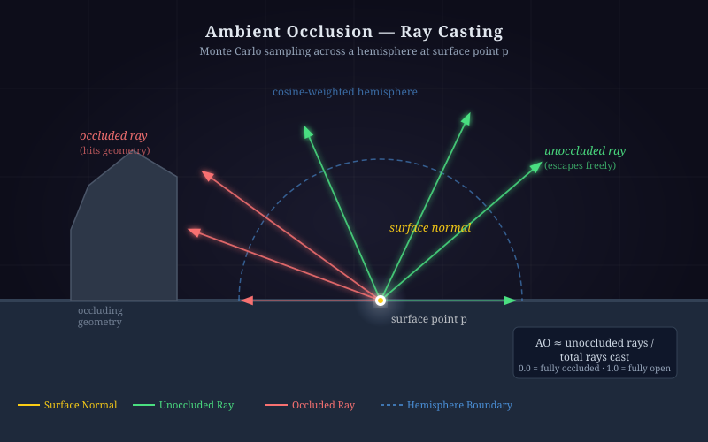

To answer this question we will take samples about the environment by firing off multiple rays in a hemisphere *(cosine-weighted hemisphere)*. We use a hemisphere because this is a point on a surface, if we did a sphere half of the samples would hit the surface point itself which is not what we want. This surface point is not being occluded by itself, we want to know if it's being occluded by things other than itself.

We take a a random sample direction *(for a cosine-weighted hemisphere)*, and do an occlusion test to see if we hit something or if we don't.

If there is a hit we return black *(or 0)* to represent that this sample we tested is occluded *(or in shadow)*. We do this multiple times for multiple samples, accumulate results and we end up with ambient occlusion!

Now for Bent Normals, we actually do the same thing, only with a few minor differences...

```HLSL
//variable to store the accumulated valid ray directions
float3 vector_accumulatedRayDirections = float3(0, 0, 0);

//amount of sucessful 'un-occluded' ray directions, we divide by this later
float unoccludedCount = 0.0f;

//accumulate samples
for (int i = 0; i < OcclusionSamples; i++)
{
    //random point
    float2 random = float2(GenerateRandomFloat(uv, i));

    //get sample direction
    float3 vector_rayDirection = SampleHemisphereCosine(random.x, random.y, vector_normalDirection);

    //start off assuming we have visibility
    float occlusionFactor = 1.0f;

    //current surface point position
    float3 vector_currentRayPosition = float3(vector_normalizedUV, currentHeight);

    //raymarch a ray in the sampled direction
    for (int step = 0; step < RaySteps; step++)
    {
        float sampleHeight = SampleHeightMap(uv) * HeightScale;

        //if the current sampled height is greater than the current height, then we are intersecting geometry!
        if (sampleHeight > currentHeight + RayBias)
        {
            occlusionFactor = 0.0f; //no visibility, we hit something!
            break; //terminate ray
        }
            
        //advance the ray
        vector_currentRayPosition += vector_rayDirection / Resolution.x * RayStepSize;

        //accumulate NON-hits
        if (occlusionFactor > 0.0f)
        {
            vector_accumulatedRayDirections += vector_rayDirection;
            unoccludedCount += 1.0f;
        }
    }
}

//fallback to regular normal if for this pixel there were no good samples
float3 vector_bentNormal = vector_normalDirection;

if(unoccludedCount > 0.0f)
    vector_bentNormal = normalize(vector_accumulatedRayDirections / unoccludedCount);

//reduce range from -1..1 to 0..1 so we can store in a texture
vector_bentNormal = vector_bentNormal * 0.5f + 0.5f;

//final bent normal value is in 'vector_bentNormal'
```

For bent normals, we do the same things we did for ambient occlusion as before. Except... instead of returning black *(or 0)* to represent occlusion, we do something different. **We return only the sample directions that did not hit anything.**

**We shift things a bit so rather than using hits to get occlusion, we use hits to invalidate sample directions.** This is because we only care about which sample directions are not occluded.

If you look back at the diagram up above, for bent normals we only care about keeping the green unoccluded rays. We take multiple samples to get the valid unoccluded sample directions, average the results and you have your bent normal!

# Using Bent Normal in an Object Shader

Once you have a bent normal map generated, you sample it just like another normal map.

```HLSL
float3 texture_normalMap = SAMPLE_TEXTURE2D(_NormalMap, sampler_NormalMap, vector_uv).xyz;
float3 texture_bentNormalMap = SAMPLE_TEXTURE2D(_BentNormalMap, sampler_BentNormalMap, vector_uv).xyz;

float3 vector_tangentNormalDirection = texture_normalMap * 2.0f - 1.0f; //scale from 0..1 to -1..1
float3 vector_tangentBentNormalDirection = texture_bentNormalMap * 2.0f - 1.0f; //scale from 0..1 to -1..1

float3 vector_worldNormalDirection = TransformTangentToWorld(vector_tangentNormalDirection, tangentToWorld);
float3 vector_worldBentNormalDirection = TransformTangentToWorld(vector_tangentBentNormalDirection, tangentToWorld);

//both normal directions are ready to use in shading terms
```

Keep in mind you are not replacing the normal map you have for your material, nor are you blending it with the regular normal map. *(If you want to be artistic and use it for effect you certainly can, that is up to you.)*

Most shading terms need to have access to surface normals in order for them to look correct, especially specular/reflections. But the bent normal direction is intended to be used independently of the normal direction for specific lighting terms.

#### Optimization Bonus

Earlier I described that you can actually combine a normal map and a bent normal map into a single texture map. This saves you from doing an extra texture sample, and on memory since now you have 1 texture that contains both your normal and bent normal.

This can be done by just simply omitting the Z/Blue channel from both of the normal maps, and combining them together into a single 4 component RGBA texture. 

When it comes to sampling the texture, the Z/Blue can be recalculated for both the normal and bent normal at runtime to complete the terms.

```HLSL
//normal and bent normal are packed together to a single texture map
//saves on memory and 1 texture sample
float4 texture_normalAndBentNormalMap = SAMPLE_TEXTURE2D(_NormalAndBentNormalMap, sampler_NormalAndBentNormalMap, vector_uv);

//scale from 0..1 to -1..1
texture_normalAndBentNormalMap *= 2.0f - 1.0f;

float3 vector_tangentNormalDirection = float3(texture_normalAndBentNormalMap.xy, 0);
float3 vector_tangentBentNormalDirection = float3(texture_normalAndBentNormalMap.zw, 0);

//recalculate Z components
vector_tangentNormalDirection.z = sqrt(1.0f - saturate(dot(vector_tangentNormalDirection.xy, vector_tangentNormalDirection.xy)));
vector_tangentBentNormalDirection.z = sqrt(1.0f - saturate(dot(vector_tangentBentNormalDirection.xy, vector_tangentBentNormalDirection.xy)));

float3 vector_worldNormalDirection = TransformTangentToWorld(vector_tangentNormalDirection, tangentToWorld);
float3 vector_worldBentNormalDirection = TransformTangentToWorld(vector_tangentBentNormalDirection, tangentToWorld);
```

# Bent Normals Use Case: Specular Occlusion

One of the main primary applications of bent normals in this context, is using them for specular occlusion. 

With PBR materials and rendering being the standard now, specular/reflections contribute significantly to the final apperance of an object. Sometimes depending on how materials are authored, materials are shaded only with specular/reflections. 

The issue is that in real-time rendering, specular/reflections is often lackluster in quality *(it's much harder and often a more expensive problem to solve performance wise)*. The solutions that do exist can only approximate them so well, and unfortunately for the most part this lack of quality often manifests into objects/materials that look like the following...

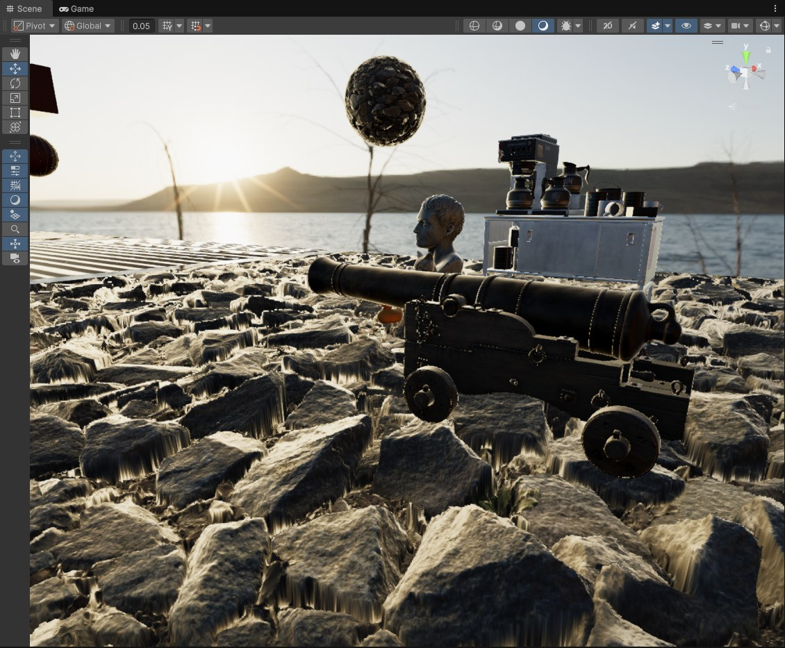

You can see that the materials on the objects here have a strange glowing apperance. Yeugh!

Now the objects in this scene are lit purely with an HDRI Probe, which is not the best case. We could try to improve things by using a reflection probe that renders the scene object themselves in here. 

*NOTE: To show off the results here is what the scene looks looking at the specular/reflection term only.*

<p float="left">
    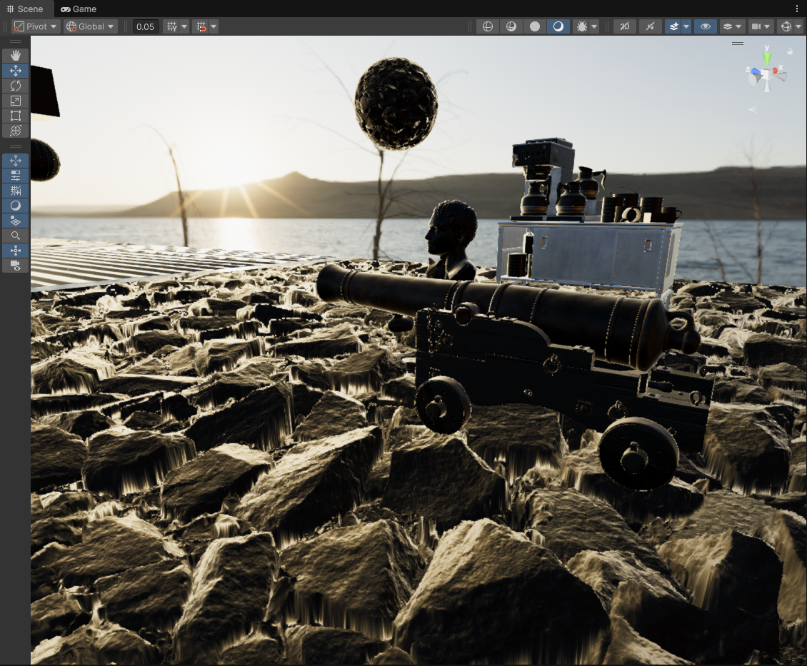
    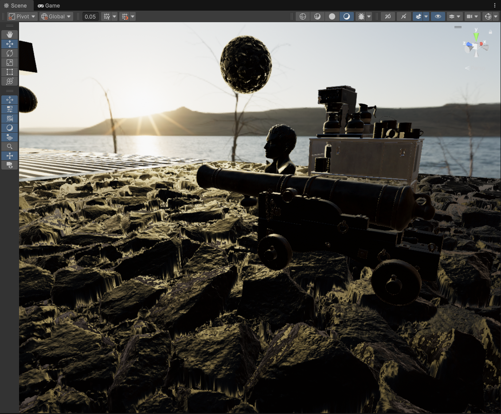
</p>

*Left: HDRI Only | Right: Box Projected Reflection Probe with Rendered Objects*

Using a reflection probe that reflects the objects in the scene certainly helped a bit, but we are still seeing a lot of glowing/leaking in places where there shouldn't be any! The reflection probe is parallax corrected so the ground plane is correct but unfortunately it can't accurately represent the more complex objects in the scene itself. What can we do?

Fortunately there are a number of ways to solve this problem. The most common is using the ambient occlusion map we generated before and just multiplying the specular/reflections term by it. [Horizon Fading](https://marmosetco.tumblr.com/post/81245981087) is also another technique used in tandem to further darken things some more if the resulting surface normal goes past the vertex normal.

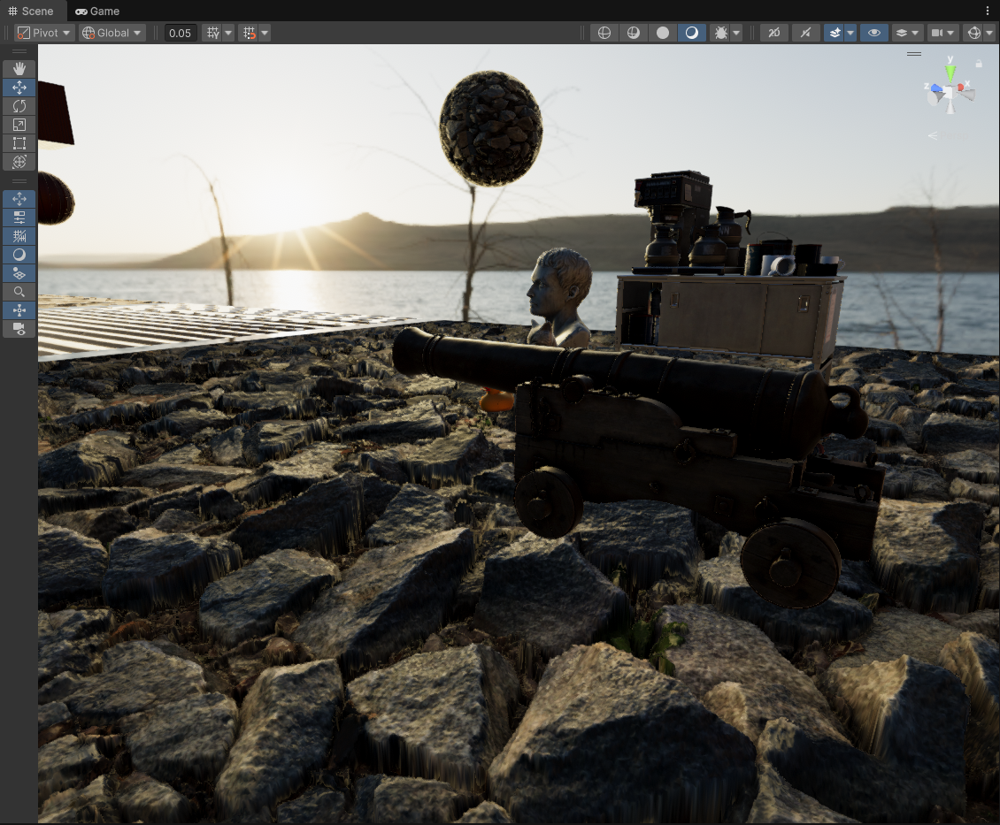

It's better... but still not quite enough.

<p float="left">
    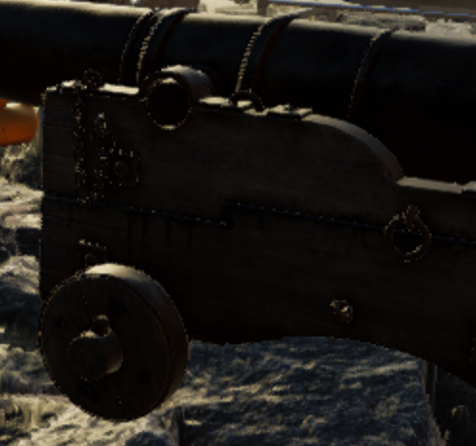
    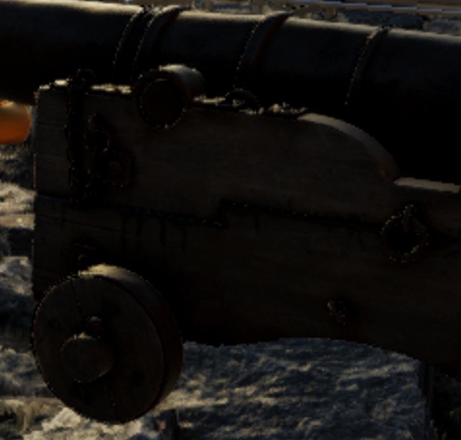
</p>

*Left: No Specular Occlusion | Right: Occlusion + [Horizon Fading](https://marmosetco.tumblr.com/post/81245981087)*

If we look closely here, we can see that using both occlusion and the horizon fading together significantly reduces the leaking that we get. 

However much of the reflection is still bleeding through for the most part, and this can get worse especially if you have high contrast lighting environments, you'll have bright sources bleeding through areas of darkness and it won't look right.

Enter specular occlusion with bent normals...

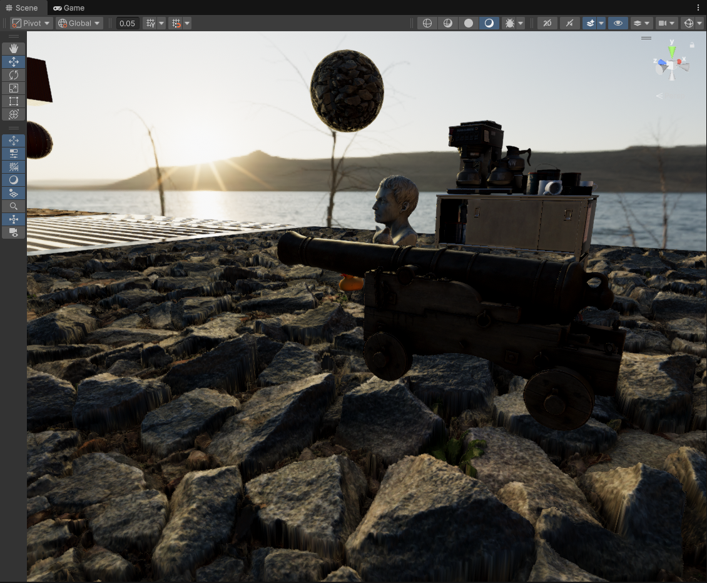

The reflection across the board now appear much less prevelant and dark. That makes sense considering our scene mostly consists of rough materials here. Importantly though if I look in the problematic areas like before...

<p float="left">
    
    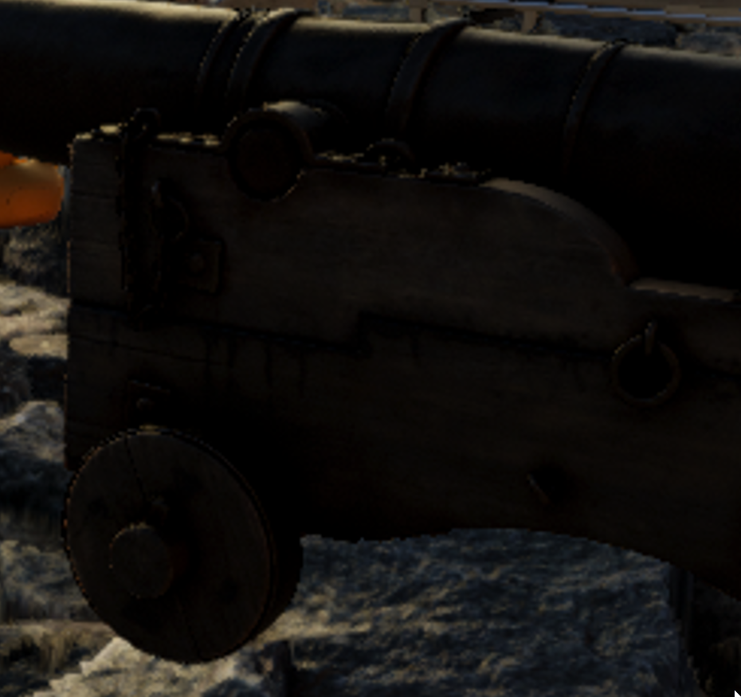
</p>

*Left: Occlusion + [Horizon Fading](https://marmosetco.tumblr.com/post/81245981087) | Right: Bent Normal Specular Occlusion + [Horizon Fading](https://marmosetco.tumblr.com/post/81245981087)*

The leaking that I described is almost completely gone now. The reflections of the wheel is fully blocked along with most of the chains and rings that are in the shadow side. Some of the detail above still has some leaking but it's much reduced. It feels way more plausible.

Overall this is significant improvement. This is using both a specular occlusion term derrived from the bent normal, and also the horizon fading technique.

<p float="left">
    
    
    
</p>

*Left: No Specular Occlusion | Middle: Ambient Occlusion + Horizon Fading | Right: Bent Normal Specular Occlusion + Horizon Fading*

Ok cool, how can I actually do this?

### Bent Normal Specular Occlusion Implementation

As for implementation, the best one I've found is from Jimenez 2016 from "Practical Realtime Strategies for Accurate Indirect Occlusion".

```HLSL
float GetSpecularOcclusionUsingBentNormal(half3 vector_reflectionDirection, float3 vector_bentNormal, float occlusion, float roughness)
{
    //precompute this term: log(10.0f) / log(2.0f)
    //so we don't have to use log at runtime
    const float LOG10_OVER_LOG2 = 3.32192809488737f;

    //clamp to 0.01 to avoid edge cases
    roughness = max(roughness, 0.01f);

    //get unoccluded half-angle cone from AO
    //assuming occlusion is cosine weighted
    float cosUnoccludedConeAngle = sqrt(1.0f - occlusion);
    float angleUnoccludedCone = acos(cosUnoccludedConeAngle);

    //approximate specular lobe cone derived from half-angle roughness
    //float cosSpecularConeAngle = exp2((-log(10.0f) / log(2.0f)) * (roughness * roughness)); //original
    float cosSpecularConeAngle = exp2(-LOG10_OVER_LOG2 * (roughness * roughness));
    float angleSpecularCone = acos(cosSpecularConeAngle);

    //angle between bent normal and reflection direction
    float cosBentNormalToReflection = dot(vector_bentNormal, vector_reflectionDirection);
    float angleBentNormalToReflection = acos(cosBentNormalToReflection);
    
    float intersectedArea = 0.0f;

    if (angleBentNormalToReflection <= max(angleUnoccludedCone, angleSpecularCone) - min(angleUnoccludedCone, angleSpecularCone))
    {
        //one cap is completely inside the other
        intersectedArea = TWO_PI - TWO_PI * max(cosUnoccludedConeAngle, cosSpecularConeAngle);
    }
    else if (angleBentNormalToReflection >= angleUnoccludedCone + angleSpecularCone)
    {
        //no intersection
        intersectedArea = 0.0f;
    }
    else
    {
        //partial overlap
        float angleDifference = abs(angleUnoccludedCone - angleSpecularCone);
        float blendRange = angleUnoccludedCone + angleSpecularCone - angleDifference;
        float blendFactor = 1.0f - saturate((angleBentNormalToReflection - angleDifference) / max(blendRange, 0.0001f));
        intersectedArea = smoothstep(0.0f, 1.0f, blendFactor);
        intersectedArea *= TWO_PI - TWO_PI * max(cosUnoccludedConeAngle, cosSpecularConeAngle);
    }

    return intersectedArea / (TWO_PI * (1.0f - cosSpecularConeAngle));
}
```

It's quite a few instructions, there are couple of approximations that do exist *([Fewes](https://github.com/Fewes/BakerBoy/blob/master/Assets/BakerBoy/Shaders/Lib/BakerBoyLighting.hlsl#526) or [Unity SRP Core](https://github.com/Unity-Technologies/Graphics/blob/master/Packages/com.unity.render-pipelines.core/ShaderLibrary/CommonLighting.hlsl#342))* but this is all where they mostly stem from.

Now contrary to what you might think, this does more than just simply darken the final result. This specular occlusion actually has some interesting and accurate/plausible behaviors.

<p float="left">
    
    
</p>

Specular occlusion varies depending on both the viewing angle, and the surface normal.

<p float="left">
    
    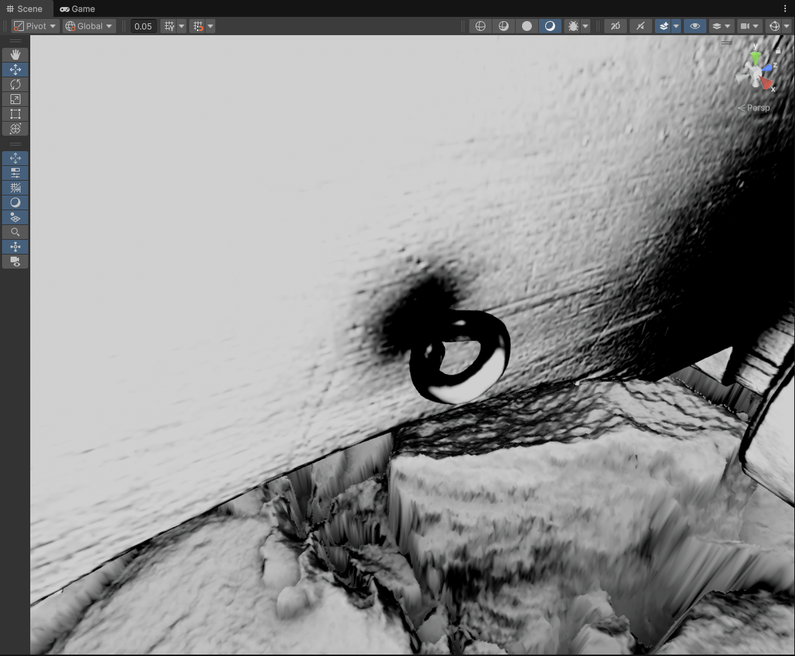
</p>

Specular occlusion also varies with roughness. Rougher materials will have a smoother occlusion falloff, and smoother materials will have a sharper occlusion falloff. 

You can see that as the material gets smoother it almost looks like you can see a rough self-reflection of the ring on the object. 

Granted of course with this technique you won't get perfect self-reflections, but with most real-time graphics techniques this is good and plausible enough. The main goal here was to reduce specular/reflection leaking and this does a pretty good job with it.

## Bent Normals Use Case: Diffuse Global Illumination

The secondary application of bent normals, is using them to sample indirect/ambient lighting from global illumination sources.

Often in environments, if avaliable you might have probes spread throughout the scene that store the illumination in the form of spherical harmonics. This can be sampled to give you the full lighting at a specific point for an object/material.

```HLSL
//NOTE: ShadeSH9 is a unity function that samples spherical harmonic coefficents

//sample environment lighting
float3 sphericalHarmonicsColor = ShadeSH9(float4(vector_worldNormalDirection, 1));
```

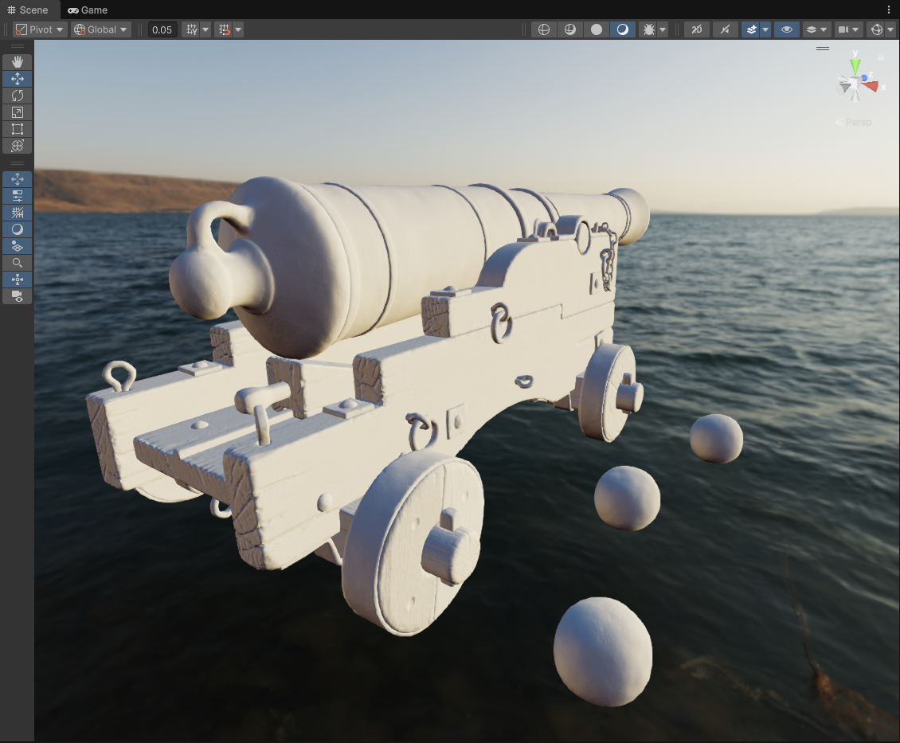

Not bad, the lighting colors make sense and match the environment decently well. However just like with specular occlusion there are issues. 

While generally if you have baked *(or runtime)* light probes in your scene they usually will factor in occlusion from surrounding geometry and objects, but it won't factor in occlusion from the object itself.

This fortunately can be fixed by just simply sampling the ambient occlusion map, authored for this object, and multiplying it with the final probe lighting.

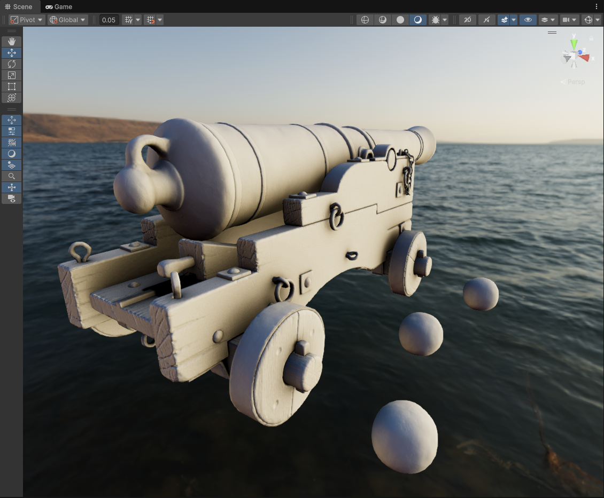

This helps a tremendous amount, the object now is shaded with the lighting probe and it's receiving occlusion from itself thanks to the object's ambient occlusion map. 

So... how can bent normals change things here up?

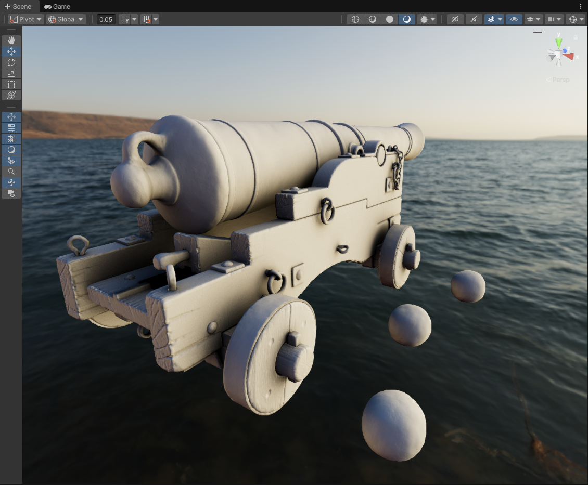

The difference is small, but noticable. To help with that I will put both side by side here...

<p float="left">
    
    
</p>

*Left: Irradiance sampled with regular normals and occlusion | Right Irradiance sampled with bent normals and occlusion*

If we look closely we can actually see some interesting behaviors happening. 

Some spots now seem to appear like they recieve more occlusion that before, the colors also shifted in some of those areas and actually appear more plausible than before.

Lets try looking at the object even closer.

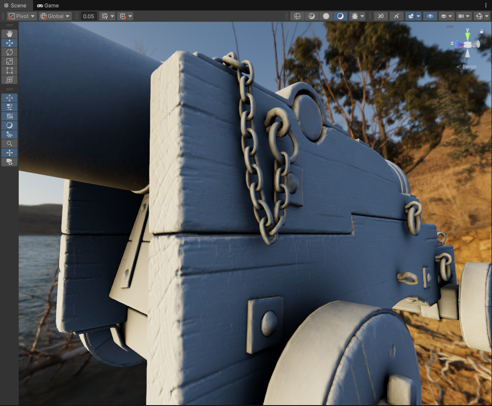

Again starting off with the regular surface normal being shaded with the HDRI probe, with occlusion being applied ontop. It looks good, but lets see how it looks when we use the bent normal to shade rather than the surface normal.

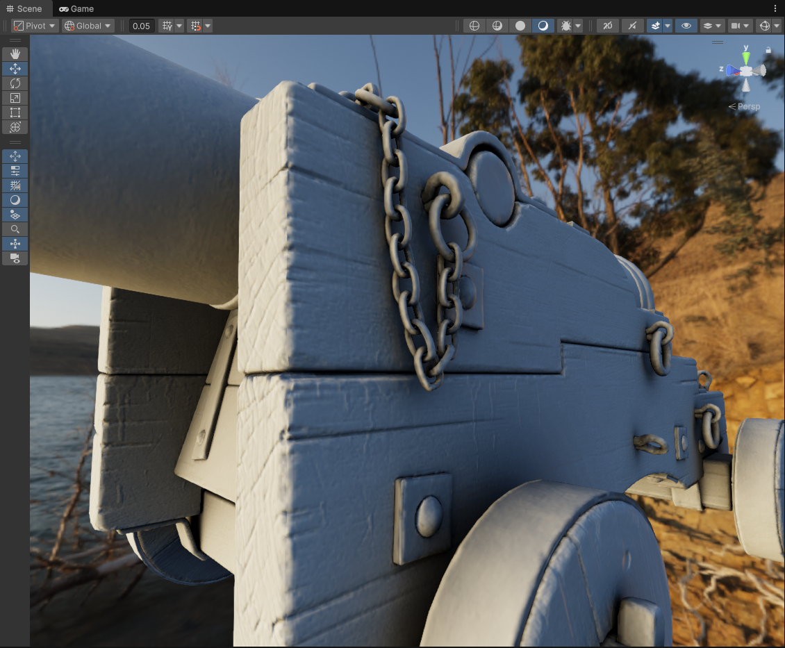

Oh wow, that is quite dramatic. It actually looks like light is bouncing around in multiple areas. The occlusion is definetly much improved in dark areas and the shadow colors are more plausible. It's a pretty dramatic transformation.

Just for kicks here is how both terms look like without occlusion so you can see the full effects.

<p float="left">
    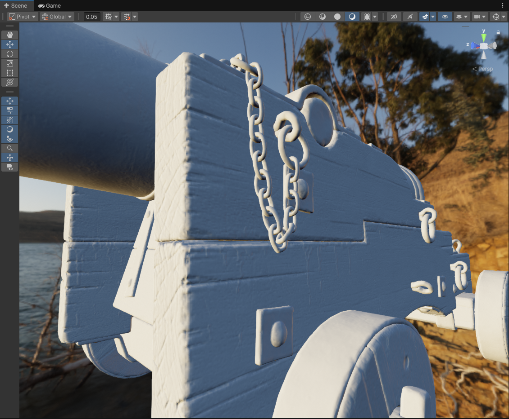
    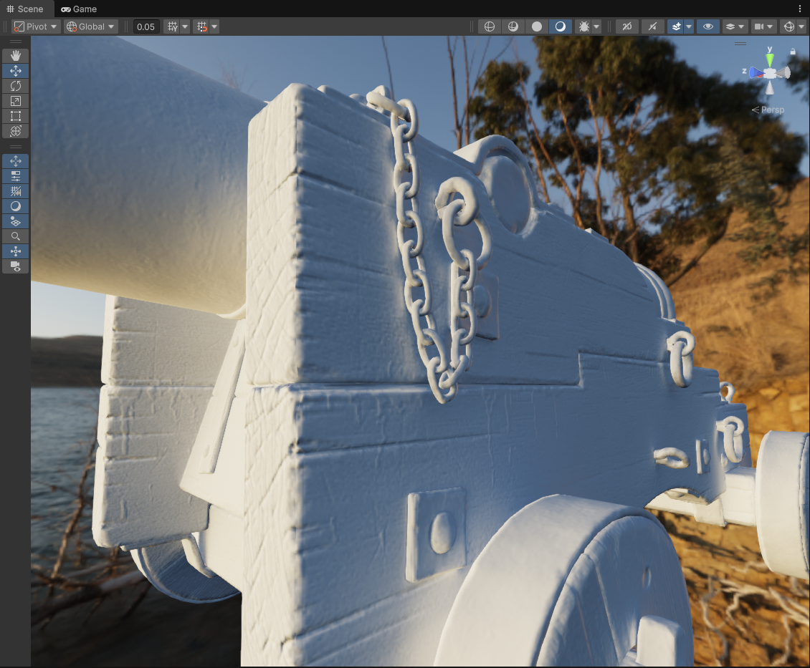
</p>

*Left: Irradiance sampled with regular normals | Right Irradiance sampled with bent normals*

<p float="left">
    
    
</p>

*Left: Irradiance sampled with regular normals and occlusion | Right Irradiance sampled with bent normals and occlusion*

### Bent Normal Diffuse Global Illumination Implementation

Fortunately implementing this for diffuse is very simple compared to the specular occlusion. In unity for objects, shading with light probes is done as such...

```HLSL
//ShadeSH9 is a unity function that samples spherical harmonic coefficents

//sample environment lighting
float3 sphericalHarmonicsColor = ShadeSH9(float4(vector_worldNormalDirection, 1));
```

The only change we need to make, is once we have the bent normal term sampled and calculated in the shader. We just simply plug it in, in place of the normal direction here.

```HLSL
//ShadeSH9 is a unity function that samples spherical harmonic coefficents

//sample environment lighting using bent normal
float3 sphericalHarmonicsColor = ShadeSH9(float4(vector_worldBentNormalDirection, 1));
```

Just like that, your global illumination probe lighting will sample using the object bent normals!

<p float="left">
    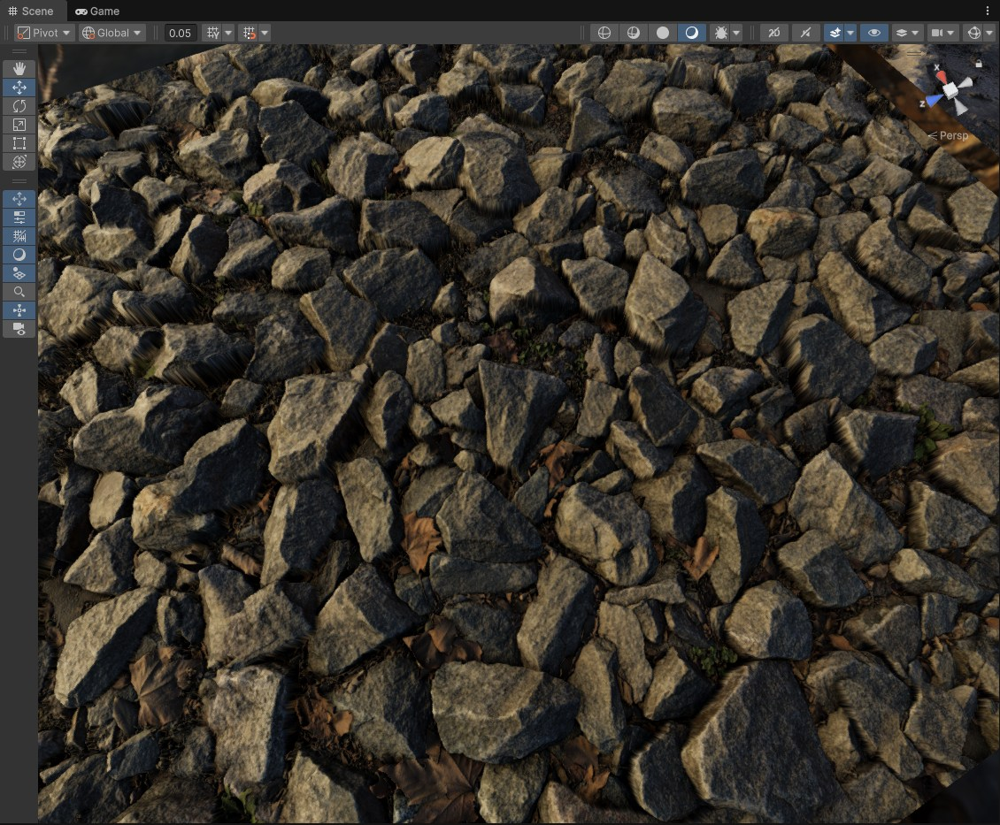
    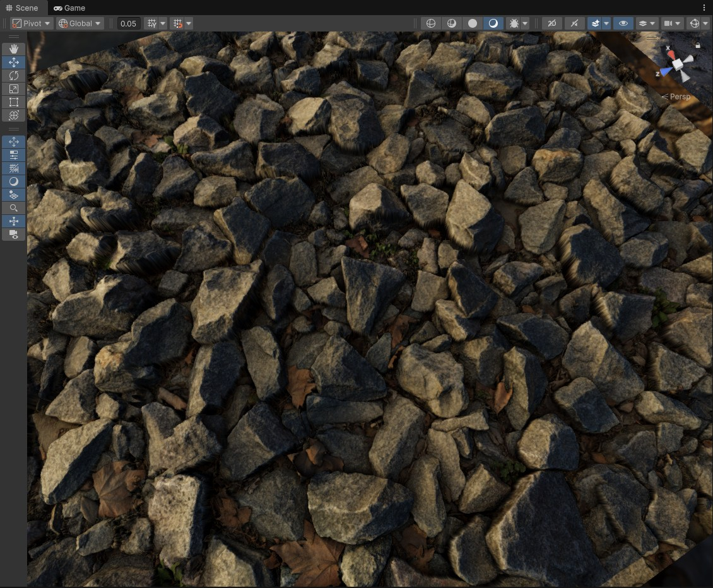
</p>

*Left: No bent normals | Right: Bent Normals*

# References / Sources
List of references that helped with my implementations and understanding.

- [(unreal engine) bent-normal-maps-in-unreal-engine](https://dev.epicgames.com/documentation/en-us/unreal-engine/bent-normal-maps-in-unreal-engine)

- [(unreal engine) unreal-engine-visual-guide-for-ao-and-bentnormal-maps](https://dev.epicgames.com/community/learning/tutorials/9Gr9/unreal-engine-visual-guide-for-ao-and-bentnormal-maps)

- [(substance 3d designer) bent-normal](https://helpx.adobe.com/substance-3d-designer/substance-compositing-graphs/nodes-reference-for-substance-compositing-graphs/node-library/filters/normal-map/bent-normal.html)

- [(unity) unity-srp-core-common-lighting](https://github.com/Unity-Technologies/Graphics/blob/master/Packages/com.unity.render-pipelines.core/ShaderLibrary/CommonLighting.hlsl)

- [(fewes) baker-boy](https://github.com/Fewes/BakerBoy/blob/master/Assets/BakerBoy/Shaders/Lib/BakerBoyLighting.hlsl)

*By: David Matos*