*By: David Matos*

Sharing my personal notes and experimentation with improving the overall indirect lighting presentation for one of my favorite games in recent memory, Final Fantasy 7 Rebirth, into actual run-time gameplay *[(at the end)](#video-preview)*

*NOTE: This will be updated as time goes on with any new or incorrect information.*

<p float="left">
    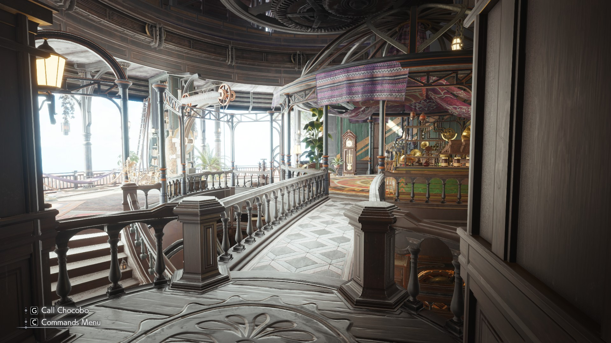
    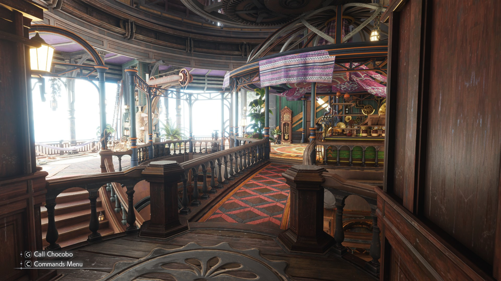
</p>

*[Final Fantasy 7 Rebirth, Square Enix](https://www.square-enix.com/ffvii/en-us/games/rebirth/) with [Shader Injector 2.1 Mod](https://www.nexusmods.com/finalfantasy7rebirth/mods/2153)*

#### Table of Contents
- [Preface](#preface)
    - [Context](#context)
- [Closer Look](#closer-look)
    - [Deferred GBuffer](#deferred-gbuffer)
    - [Direct Lighting](#direct-lighting)
    - [Sample GI](#sample-gi)
    - [SSR](#ssr)
    - [Reflection Environment](#reflection-environment)
- [The work begins...](#the-work-begins)
    - [Breaking Reflection Enviornment Apart...](#breaking-reflection-enviornment-apart)
        - [Correcting Stretched Reflection Vectors](#correcting-stretched-reflection-vectors)
        - [Darkening Cubemap Reflections](#darkening-cubemap-reflections)
        - [Using Baked "Radiance" for Rough Reflections](#using-baked-radiance-for-rough-reflections)
        - [Bent Normal Specular Occlusion](#bent-normal-specular-occlusion)
        - [Modifying Baked Irradiance/Diffuse Term](#modifying-baked-irradiancediffuse-term)
        - [Character Shading](#character-shading)
        - [Final Reflection Environment Timings](#final-reflection-environment-timings)
- [Turning Sample GI's "Reflection" to Reflection](#turning-sample-gis-reflection-to-reflection)
    - [The Order: 1886 Inspiration](#the-order-1886-inspiration)
    - [Squeezing Rough Reflections out of Irradiance Data](#squeezing-rough-reflections-out-of-irradiance-data)
    - [The game uses Ambient Cube?](#the-game-uses-ambient-cube)
    - [Reprojecting Ambient Cube to Spherical Harmonics](#reprojecting-ambient-cube-to-spherical-harmonics)
    - [Deconvolve Irradiance to Radiance](#deconvolve-irradiance-to-radiance)
    - [Scaling Radiance With Surface Roughness](#scaling-radiance-with-surface-roughness)
    - [Dominant Direction Specular](#dominant-direction-specular)
    - [Sample GI Timings](#sample-gi-timings)
    - [Sample GI: Final In-Game Results...](#sample-gi-final-in-game-results)
- [Screen Space Reflections *(SSR)*](#screen-space-reflections-ssr)
    - [SSR: Final In-Game Results...](#ssr-final-in-game-results)
    - [SSR Future Notes](#ssr-future-notes)
    - [SSR Timings](#ssr-timings)
    - [SSR In-Game](#ssr-in-game)
- [Bonus: Screen Space Ground Truth Visibility Bitmask Ambient Occlusion + Global Illumination](#bonus-screen-space-ground-truth-visibility-bitmask-ambient-occlusion--global-illumination)
- [Conclusion](#conclusion)
- [References / Sources](#references--sources)

## Preface

#### [Digital Foundry Video](https://www.youtube.com/watch?v=zBFViJCICUA)

#### Context

In a [previous article](https://frostbone25.github.io/p/ff7-rebirth-contact-shadows/#timings-on-1920x1080-and-3840x2160) I was exploring the idea of implementing contact shadows into Final Fantasy 7 Rebirth in an effort to improve the quality of it's direct lighting terms. I was able to do it quite sucessfully, and after building a framework that would allow me to run that modified shader in-game during runtime, this was released to the public as the 1.0 version of the [Shader Injector](https://www.nexusmods.com/finalfantasy7rebirth/mods/2153) mod.

Initally I thought I was done, I had done what I set out to do... but because I spent all of this time building the Shader Injector framework which allowed me to replace multiple shaders within the game, I had the very dangerous thought... 

What else can I do with the lighting presentation of the game? 

Now [previously](https://frostbone25.github.io/p/ff7-rebirth-contact-shadows/#context) I highlighted that one of the drawbacks to the decisions they made jumping from Lightmaps to Light Probes. Again considering the size of the game world, and other production constraints this was the right call, but the negatives of this is that you lose out on alot of spaital resolution with your ambient lighting. Unfortunately though after further analysis and closer looks at the game's rendering, turns out there are some other wonky stuff happening too.


Here we have quite a difficult lighting situation that unfortunately highlights some of Rebirth's sore spots. This is in Cosmo Caynon inside the tower, which is an interior space that has open windows/areas out into the exterior into broad daylight.

Materials have an odd white cast over all of them, and we can see in many spots where we get seemingly bright light bleeding through most of the geometry that should be blocking it. Giving us a very strange rim-lighting like effect across the entire scene.

What's perplexing is that we are quite deep inside the interior of the environment but we get still get a very large amount of spill from the outside environment. Sure that some makes sense, there is a large opening to the exterior there but it should not be as much as we are seeing!

If we check against a similar real world environment, the differences start to become quite apparent.

<p float="left">
    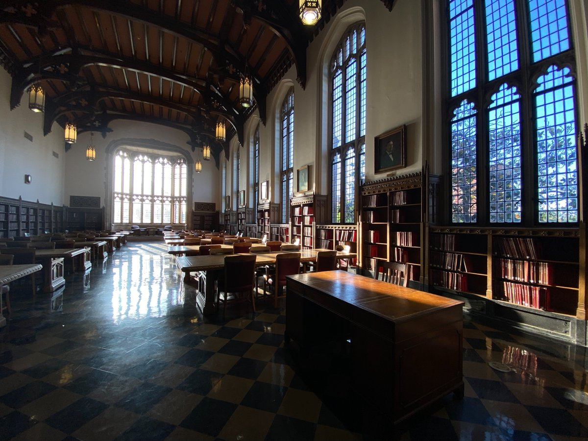
    
</p>

*Left Side: [Real World Reference](https://pbs.twimg.com/media/GraHakjWkAAvCTQ.jpg) | Right Side: Cosmo Caynon*

This reveals that the reflections seem to be quite poor in Rebirth, and this actually manifests in specular/reflection light leaks that pollute the environment as you see. There are a lot of interior spaces in the game *(and even most areas outdoors)* that have the same issue that result's in an odd glowing apperance in ambient/shadowed areas. The other part also is that the reflections don't appear to be very coherent or represenative of the actual surrounding environment at all.

Now the game does try to get around this somewhat using Screen-Space Reflections *(SSR)*, but from what we see it's very toned down and practically invisible most of the time especially with rougher materials. All of these in combination together result lead to the result you see up above. 

So how can we improve this? Well after some further analysis, work, and alot of experimentation, this is the end result that I wound up with...


What a difference! The lighting looks way more coherent and accurate, and the reflections in the environment all make sense and don't lead up to a washed out final image. The areas that should be darker are properly dark, and areas that are in light remain properly lit. As a result many of the material colors and even the lights in this scene are now actually visible unlike before, preserving the original material colors and artistic choices. Because again if we check against [real world reference](https://pbs.twimg.com/media/GraHakjWkAAvCTQ.jpg), these light leaks should not even be happening in the first place! These same improvements are visible across the entire game.

<p float="left">
    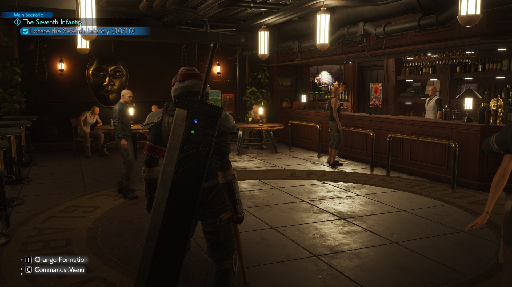
    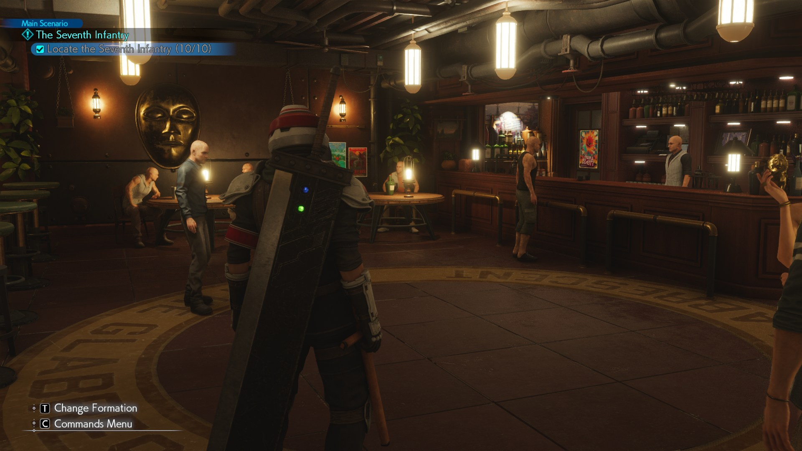
</p>

*Left: Original Game | Right: Shader Injector On*

<p float="left">
    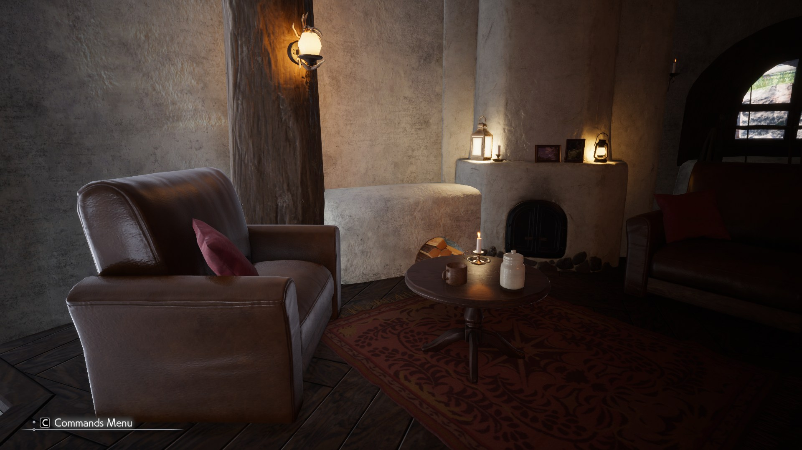
    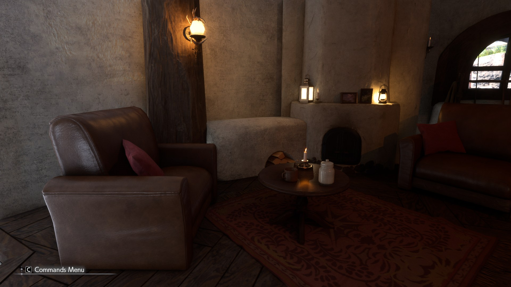
</p>

*Left: Original Game | Right: Shader Injector On*

<p float="left">
    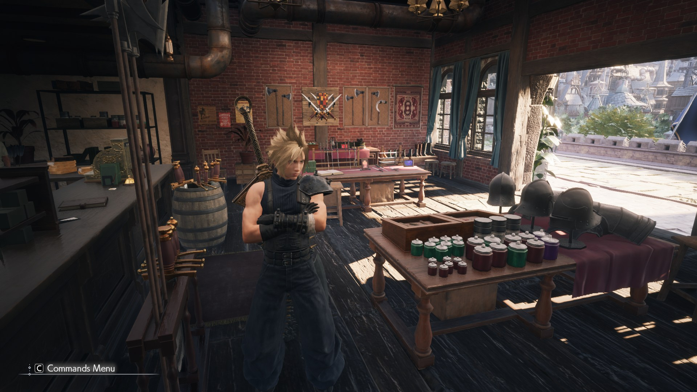
    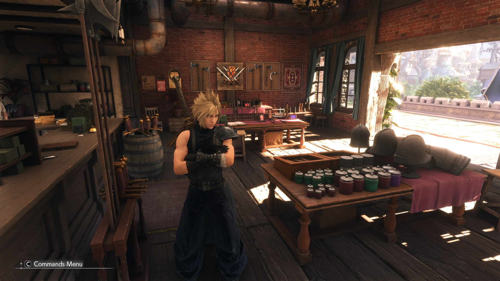
</p>

*Left: Original Game | Right: Shader Injector On*

So with all of that, let's do a breakdown of what's happening!

---

## Closer Look

### Deferred GBuffer

*NOTE: We are working with RenderDoc frame captures, which were captured on an RTX 3080 at native 3840x2160 with no dynamic resolution or DLSS. The game was also running at maximum graphical settings.*

So before we start let's go ahead and break apart the image in Cosmo Canyon and see what the original lighting terms make up this final image. [As mentioned previously Rebirth is using a Deferred Renderer](https://frostbone25.github.io/p/ff7-rebirth-contact-shadows/#brief-game-render-breakdown), so much of the lighting and shading terms are calculated at the end of the frame.

In the case of rebirth, the renderer draws to **7 different GBuffers + Depth**...

<p float="left">
    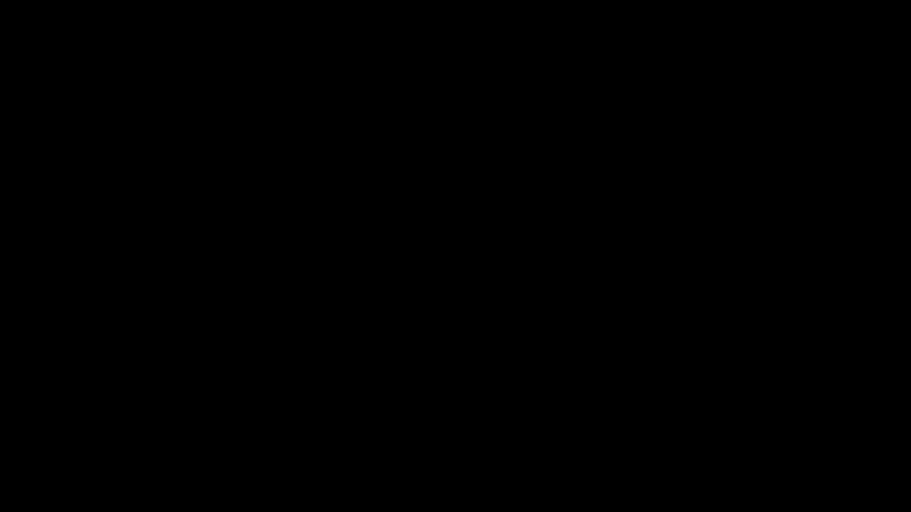
    
</p>

***Left:*** *RT0 | R16G16B16A16_FLOAT | Full black except for alpha channel, I'm not sure what this is used for yet...*
***Right:*** *RT1 | R10G10B10A2_UNORM | WorldNormal (RGB), SelectiveOutputMask (A)*

<p float="left">
    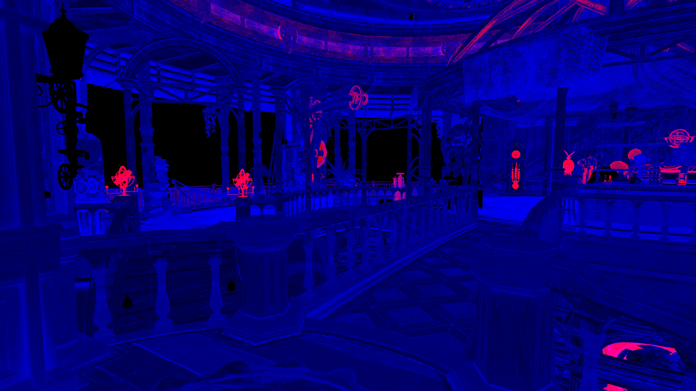
    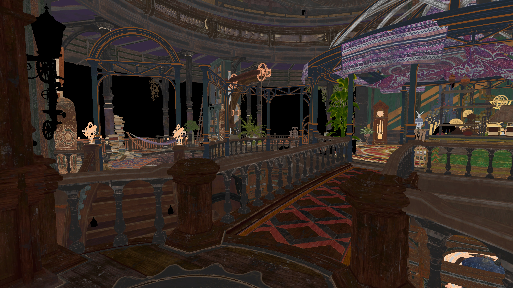
</p>

***Left:*** *RT2 | B8G8R8A8_TYPELESS | Metallic (R) Specular (G) Roughness (B) ShadingModelID (A)*
***Right:*** *RT3 | B8G8R8A8_TYPELESS | BaseColor (RGB) GBufferAO (A)*

<p float="left">
    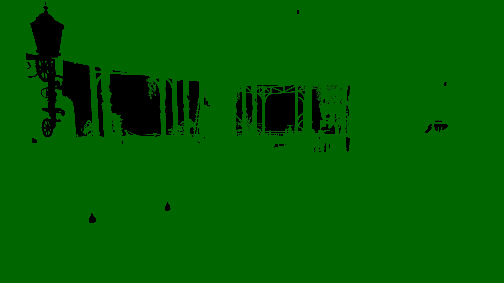
    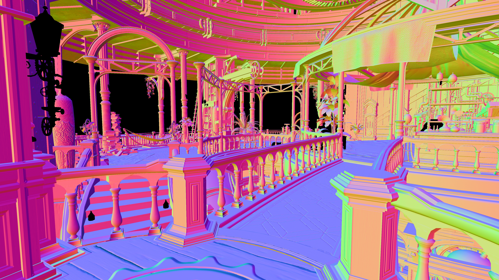
</p>

***Left:*** *RT4 | B8G8R8A8_TYPELESS | Custom Data, This is quite multi-purpose for different parts of the image depending on the ShadingModelID.*
***Right:*** *RT5 | B8G8R8A8_TYPELESS | WorldNormals repeated again, not sure what the purpose of this is.*

<p float="left">
    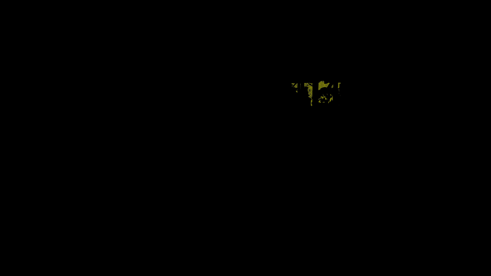
    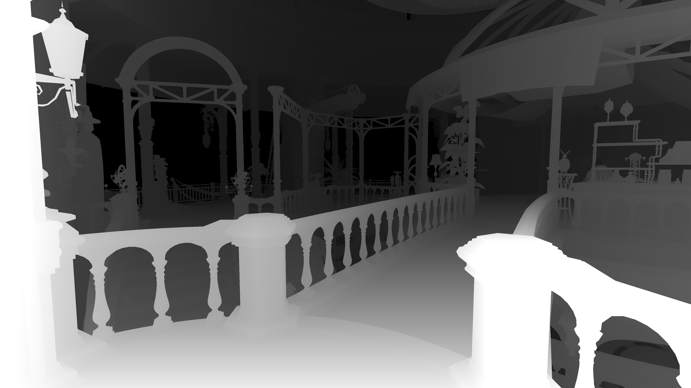
</p>

***Left:*** *RT6 | R16G16_UNorm | Velocity Buffer*
***Right:*** *Depth | D32S8_TYPELESS | Scene Depth*

These renders store all of the necessary information required for doing light shading later, obviously no lighting issues here because nothing is done yet so lets step forward in the rendering timeline.

### Direct Lighting

Stepping forward in the rendering pipeline have a large number of passes that handle shading lights in the scene. This is what we see at first once all the direct lighting draws are finished...

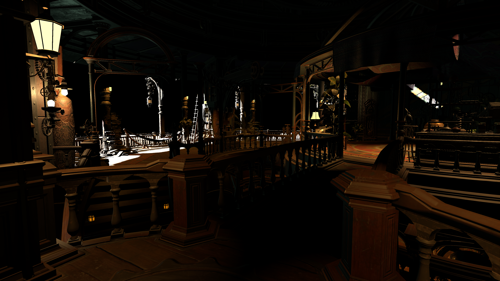

Ok, the source of those leaks are definetly not here and this is to be expected. It's dark of course in this pass because ambient/reflection shading has not been done yet. Direct lighting is explicit, so shading diffuse/specular is usually good quality barring some shadow cutbacks that might be done for some light sources. 

Though with [Shader Injector 1.0](https://frostbone25.github.io/p/ff7-rebirth-contact-shadows/) I made diffuse BRDF adjustments and added contact shadows to the local/directional light shaders. The resulting pass with those changes looks like so...

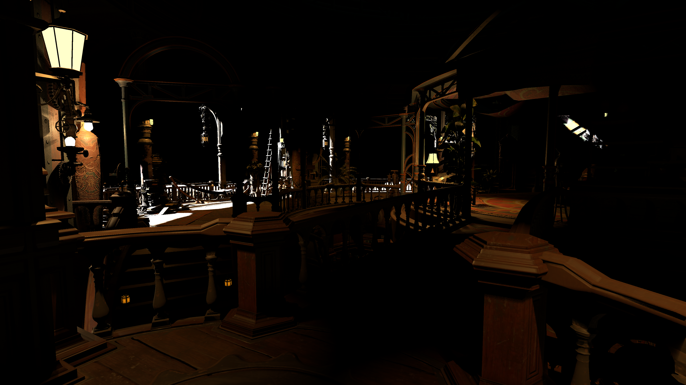

Looking good! The direct lighting sources we do see all have higher quality shadows now thanks to the contact shadows, so there is more coverage and better definition to the scene. Though again we are looking for the culprit of the light/reflection leak problems so let's go step forward again in the rendering timeline....

### Sample GI

<p float="left">
    
    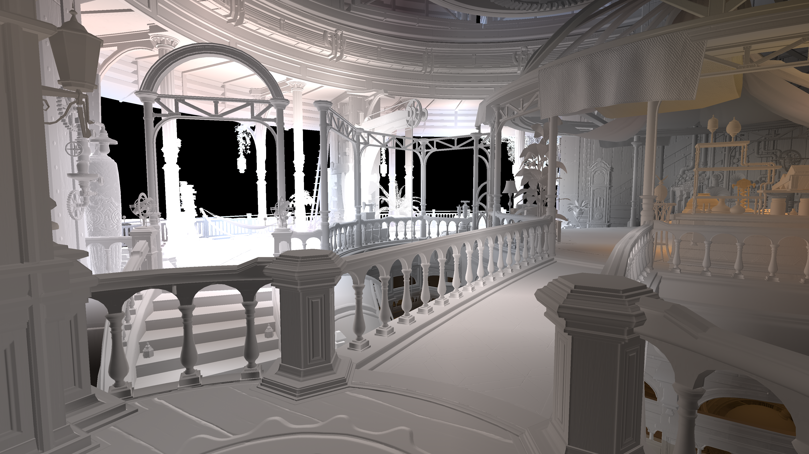
</p>

***Left:*** *RWEnvironmentIrradianceATexture | R16G16B16A16_FLOAT | Radiance Term*
***Right:*** *RWEnvironmentIrradianceBTexture | R16G16B16A16_FLOAT | Irradiance Term*

This is an intresting pass... We do a draw and it spits out two framebuffer textures from a compute shader. This looks to be a pass that samples from the game world's baked global illumination light probes. Though I was quite confused for a long while why there is two Render Targets instead of one? Normally global illumination that gets sampled from game worlds is just irradiance/diffuse data... so what is this other one? 

Initally I thought maybe this was just another irradiance term *(something like another set of spherical harmonic coefficents)* where maybe had it's data split, then it gets blended together into a final high quality diffuse term... but it's not?
 
Well after sometime thinking about it and digging around it turns out that we are actually looking at a "Radiance" term and an "Irradiance" term in that order. I was quite suprised... and then puzzled. It turns out that later in the next pass a little after this *(ReflectionEnvironment)*, these render targets get sampled. Irradiance gets used normally, but the "radiance" actually gets applied to cubemap reflections? 

We'll get to that in a bit, but what we are seeing here certainly has some issues and is a potential source of those light leaks. We can see that the probe lighting is sparse and blobby, this is to be expected but I suspect that these terms get modulated and combined with other lighting terms so I reckon it's mostly fine, but we'll keep an eye on this. 

Let's go ahead and look at the next rendering pass..

## SSR

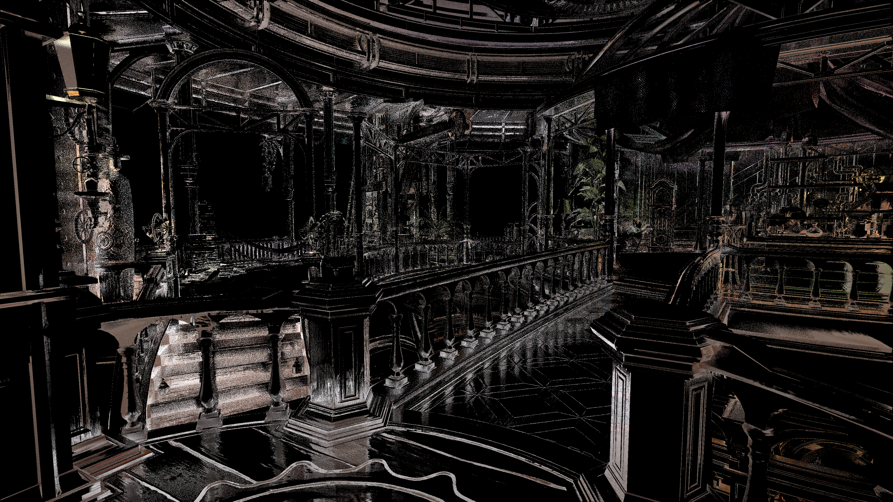

This is the screen space reflections pass, and I'm definetly seeing a potential source of problems in here. The SSR appears to be reflecting framebuffer values in the past as you can see a semblance of the original white-washed environment showing up in the colors. The good news is that this tells me correcting the shading terms will propogate naturally to SSR during runtime which is good. 

For the most part this looks good though I am seeing a strange thing here, that being I recall that the materials in the environment are quite rough and are made up of wood. Yet when we look closely at the reflections they actually appear pin sharp, when really they should be much rougher and blurrier. *[(Wood is not a perfect reflector after all)](https://beamandbaron.com/cdn/shop/files/WalnutFlooring-1.jpg?v=1761251948)*. This can certainly be improved upon later.

Aside from that this looks ok for the most part. It is noisy and clearly running at 1 sample per pixel at full screen resolution, but considering the game has a decent TAA/DLSS pipeline later this isn't a huge problem.

Let's advance to the next rendering pass!

## Reflection Environment

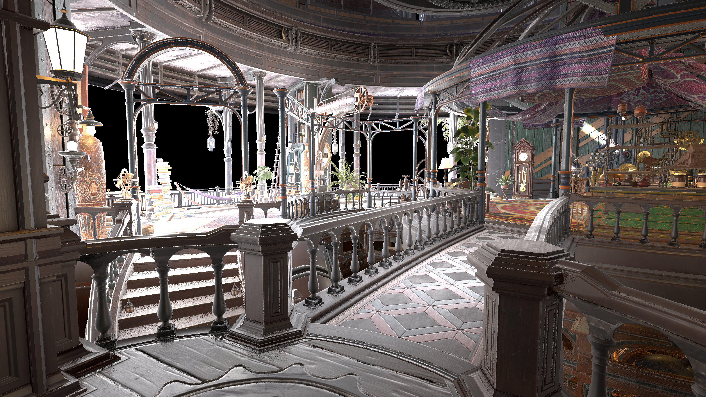

Ok here we go, now this looks like the majority of the lighting and reflection terms come together to shade what looks to be the final image. The leaks we saw in the original image here are the same and on full display which indicates that the issues are definetly here in this specific pass. Now I'll have to reverse engineer the shader from scratch, but after that we can then break apart the shading terms and peek into what each of them look like in isolation.

---

# The work begins...

## Breaking Reflection Enviornment Apart...

So we know that we have some issues here with the Shader that need solving. Let's go ahead and break apart the shading terms. First let's start by looking at the radiance/reflection term in isolation.

<p float="left">
    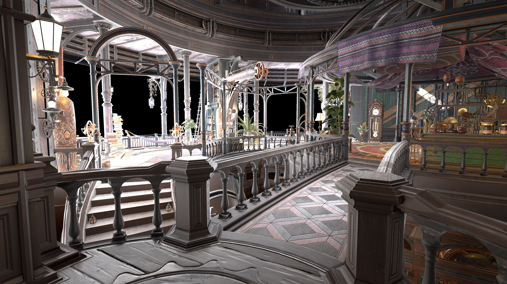
    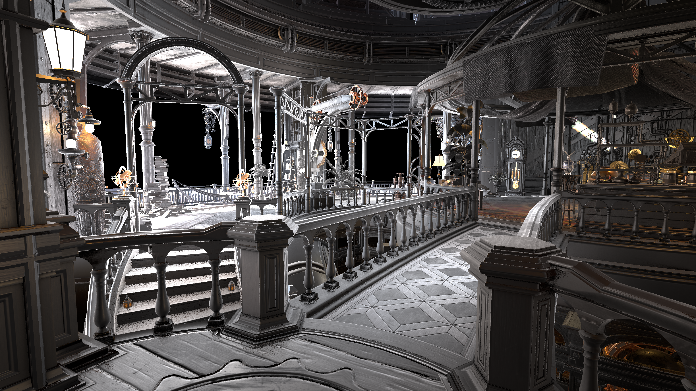
</p>

***Left:*** *Reverse Engineered Reflection Environment*
***Right:*** *Radiance Term Only*

Yep, a majority of this specular light leak and "wash" is coming from the reflections. Let's go ahead and strip back the material color some more so we can more directly look at the reflection color before specular material BRDFs get applied. We will also disable the light ambient occlusion that they do apply.

<p float="left">
    
    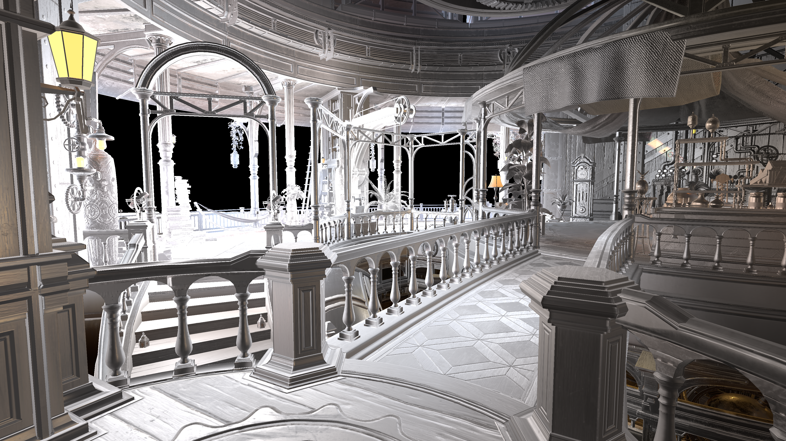
</p>

***Left:*** *Radiance Term Only*
***Right:*** *Raw Radiance Term (No Specular BRDF or Occlusion)*

This certainly is showing us that again most of the reflection leaking is coming from this term specifically, so more confirmation.

Now in the shader they do a few intresting things in this reflection term. Not only do they sample environmental cubemaps *(which is typical)* but they also take that Sample GI radiance term from before and actually blend it together with the environmental cubemaps. Primarily they use it to modulate or "tint" the cubemap reflections for most of the environment as a means of "squeezing" more variable reflections out of their limited cubemap coverage to begin with.

```HLSL
float radianceVolumeLuminance = LuminanceRec709(radianceVolume.rgb);
float radianceVolumeLuminanceInverse = radianceVolumeLuminance > 0.0 ? rcp(radianceVolumeLuminance) : 0.0;

float cubemapReflectionLuminance = LuminanceRec709(environment.CubemapReflection);
float cubemapReflectionLuminanceInverse = cubemapReflectionLuminance > 0.0 ? rcp(cubemapReflectionLuminance) : 0.0;

float cubemapReflectionRoughLuminance = LuminanceRec709(environment.CubemapReflectionRough);
float cubemapReflectionRoughLuminanceInverse = cubemapReflectionRoughLuminance > 0.0 ? rcp(cubemapReflectionRoughLuminance) : 0.0;

float cubemapRadianceAndRadianceVolume = cubemapReflectionRoughLuminanceInverse * radianceVolumeLuminance;
float cubemapRadianceAndRadianceVolumeInvert = cubemapRadianceAndRadianceVolume - 1.0;
float radianceReject = saturate((cubemapRadianceAndRadianceVolumeInvert * cubemapRadianceAndRadianceVolumeInvert) / (cubemapRadianceAndRadianceVolumeInvert * cubemapRadianceAndRadianceVolumeInvert + 0.25));
float3 radianceTarget = cubemapReflectionLuminance * radianceVolume.rgb * radianceVolumeLuminanceInverse;

environment.CubemapReflection = lerp(environment.CubemapReflection, radianceTarget, radianceReject) * cubemapRadianceAndRadianceVolume;
```

In addition they also resample cubemap reflections twice? Once with the usual roughness to mip that is very commonly done to sample rough reflections from cubemaps. But then they also resample a "rough" cubemap reflection that of which is locked to mip level 4 which is quite rough. I found this quite peculiar honestly but in practice all of these terms they try to blend together to form their final reflection term.

Now if I'm honest and for brevity sake, my money from the source of the leaks was coming from the Cubemap Reflections *(Spoilers: I was right)* as in open world environments this would be something that I would expect would be cutback in terms of frequency and quality. So peeling back much of these blending terms, lets go ahead and look at the cubemap reflections and the baked GI radiance terms in isolation from eachother...

<p float="left">
    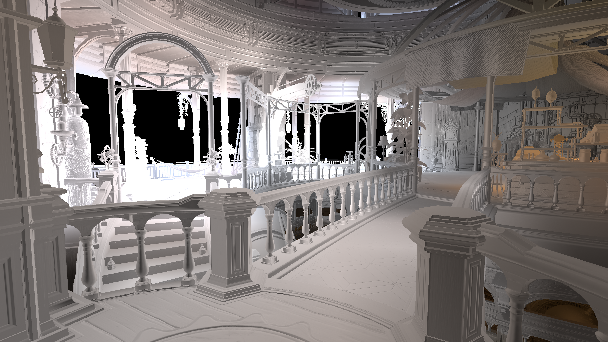
    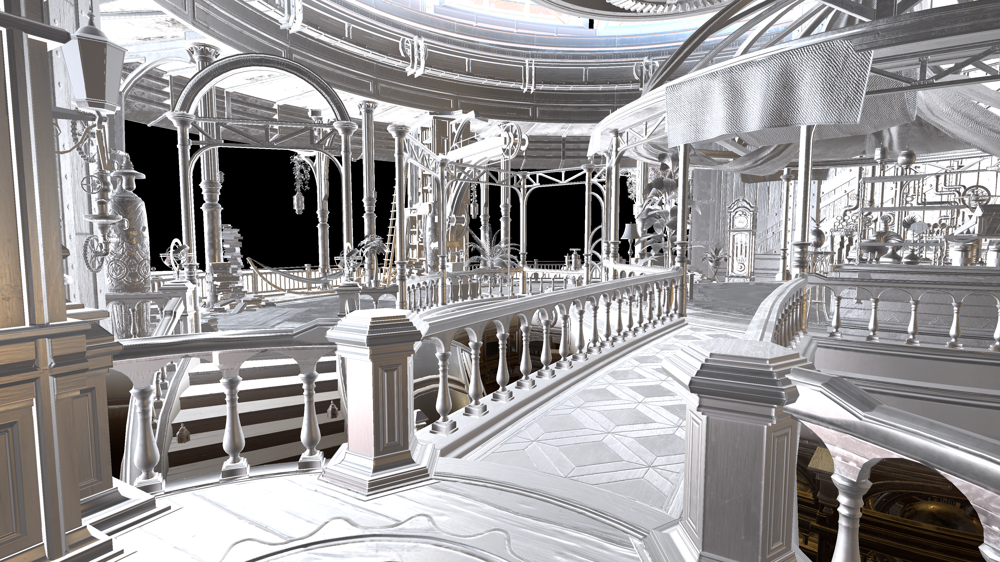
</p>

***Left:*** *Radiance GI*
***Right:*** *Cubemaps Only*

There it is! The cubemaps are definetly the culprit! Now granted I have some things to say about the radiance GI which we will improve quite a bit later, but the cubemap term here is in full display and we can see all of it's reflection leakage in its full glory!

It's important that we do work on this, because in general the cubemap reflections in this game unfortunately are quite inaccurate and sparse, when you peel back the lighting terms it becomes quite obvious that reflections you see don't belong to the surrounding environment in many cases.

<p float="left">
    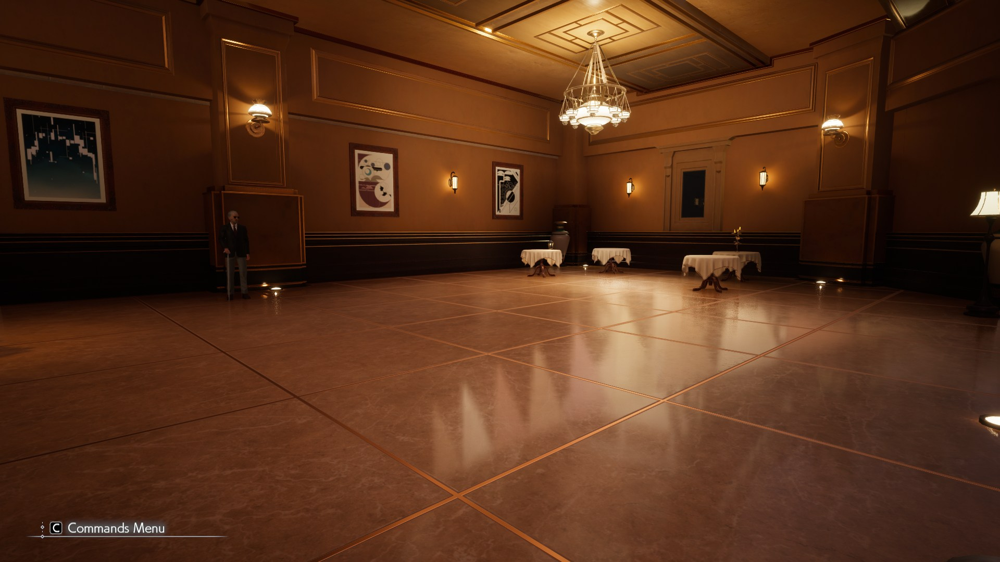
    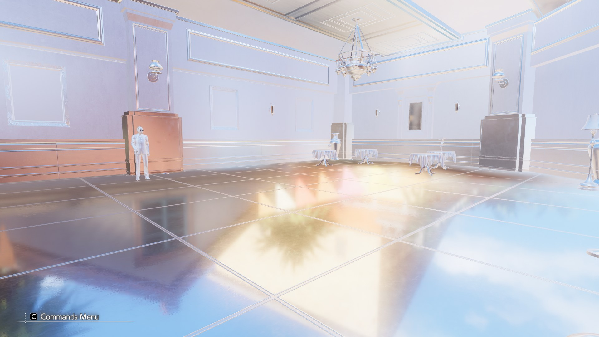
</p>

***Left:*** *In-Game*
***Right:*** *Cubemaps Only*

#### Correcting Stretched Reflection Vectors

Now hold up... a bit of a tangent but this is important, when checking these terms across the different game environments I noticed something really strange going on when checking these reflection terms in insolation during runtime...

<p float="left">
    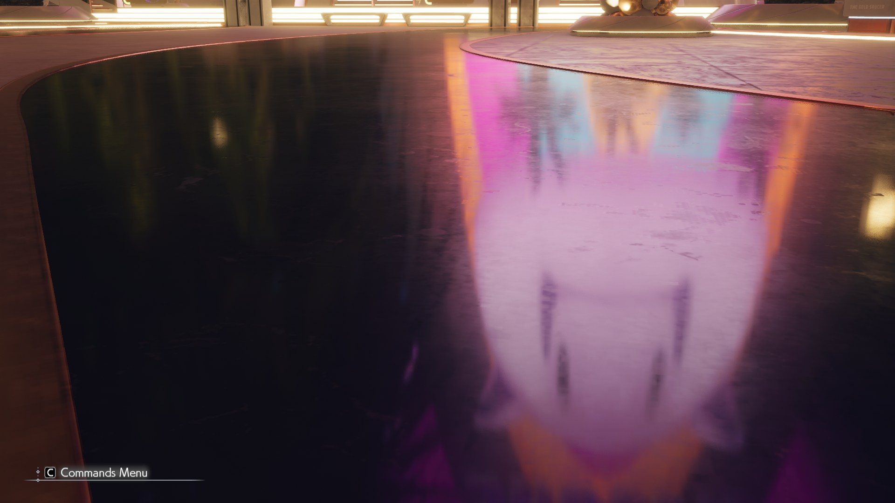
    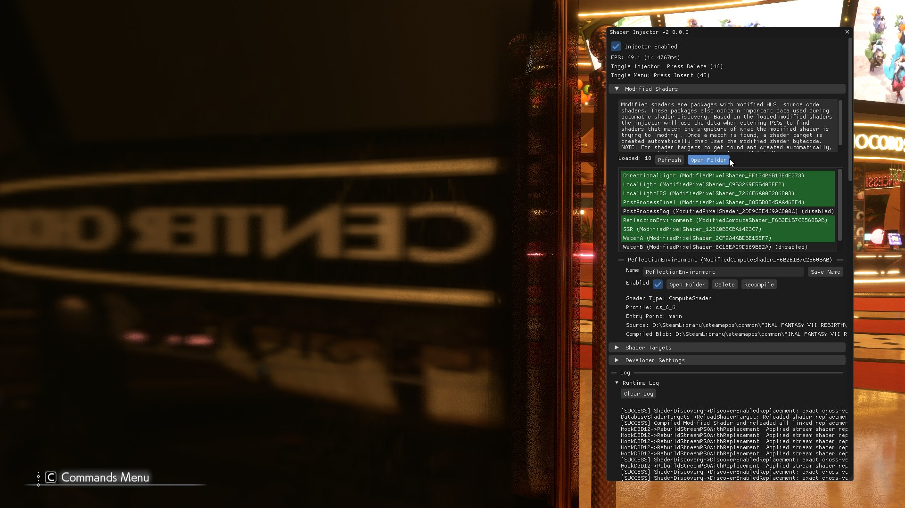
    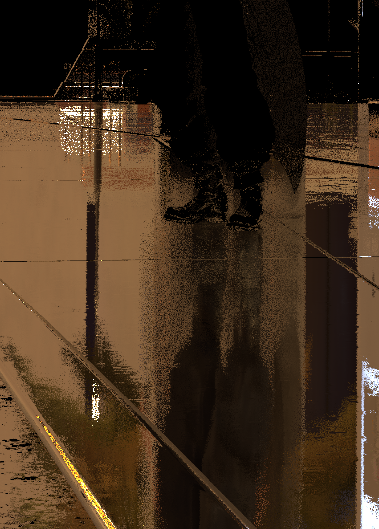
</p>

***Left:*** *In-Game Cubemap Reflections*
***Middle:*** *In-Game Cubemap Reflections*
***Right:*** *Original Game SSR Pass*

The reflections look stretched? Wha... What is this? 

Most of these materials are not anisotropic materials... why would they be stretched?

When looking closer and checking other places, as it turns out... this is happening EVERYWHERE. Not only with the cubemaps, but the Sample GI "Radiance" Term, the SSR, even translucent surfaces like glass or water all have this stretched reflection vectors... what is going on here?

```HLSL
float NoV = dot(vector_normalDirection, vector_viewDirection);
float3 fixedReflection = SafeNormalize(2.0 * (NoV * vector_normalDirection - vector_viewDirection) + abs(NoV) * vector_normalDirection);
float3 reflectionDirection = SafeNormalize(lerp(fixedReflection, vector_normalDirection, roughness * roughness * roughness));
```

As it turns out, they are stretching the reflection direction according to surface roughness. Honestly I have no idea as to why this is happening... but in the name of theorizing here are a couple of explanations that I managed to come up with to try to understand why they might be doing this in the first place.

- Trying to extend coverage of SSR?
    - When SSR data is just at the edge of being cut off you can stretch the reflection to squeeze more coverage out for cheap without tracing more rays. However since stretched reflection vectors don't blend too well with the other unstretched reflection terms you might as well stretch all of them to retain consistency.
- Better Visual "Roughness"?
    - Maybe they thought in their tests that stretching such vectors led them to result's that supposedly looked better with rougher materials? Though for the most part I'd expect that rougher materials would recieve the stretching but it seems that smoother materials recieve the most.

Either way, whatever was happening in here was not acceptable. This stretching certainly led to a much worse quality of reflection as they appeared much more incoherent/unreadable. I just elected instead to completely scrap whatever the original reflection direction implementation was and just keep it simple.

```HLSL
float3 reflectionDirection = normalize(reflect(-vector_viewDirection, vector_normalDirection));
```

This works, it's accurate, and definetly cheaper than whatever shenanigans they were attempting.

<p float="left">
    
    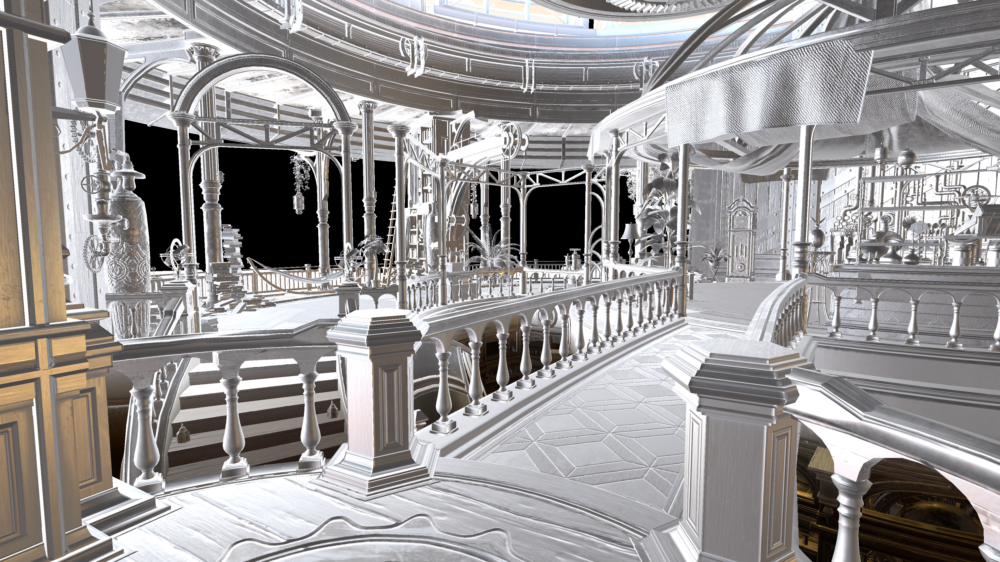
</p>

***Left:*** *Original Cubemaps*
***Right:*** *Corrected Cubemaps*

Looks correct now, and I made sure to apply these changes across the many shaders that I currently had that did any kind of reflection sampling.

<p float="left">
    
    
    
</p>

<p float="left">
    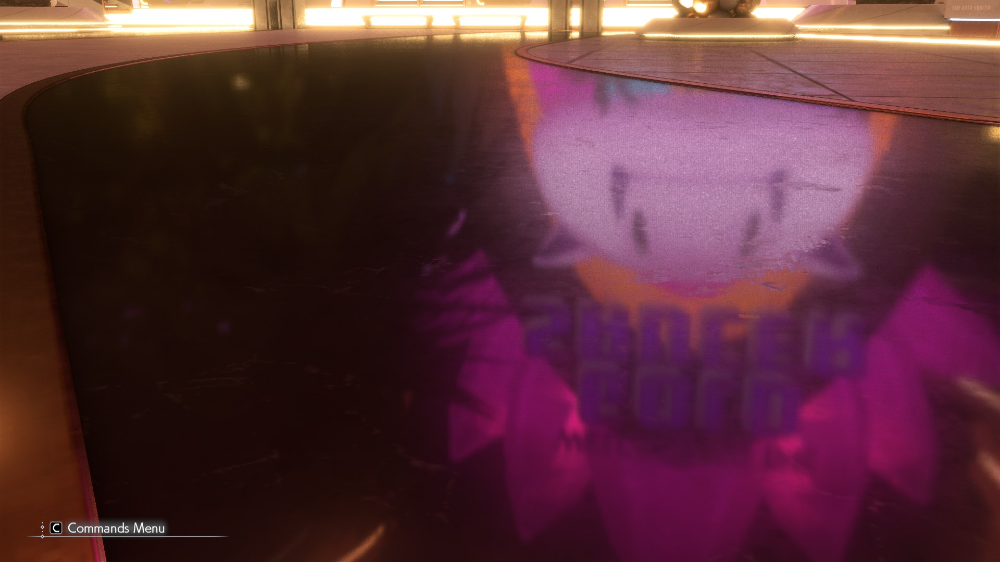
    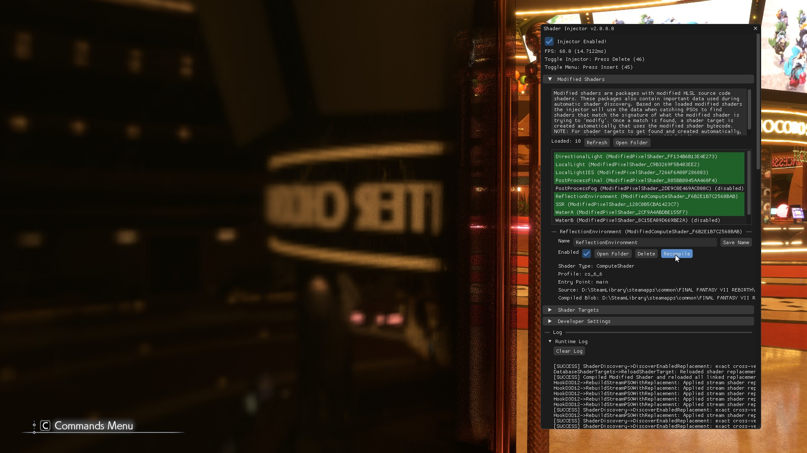
    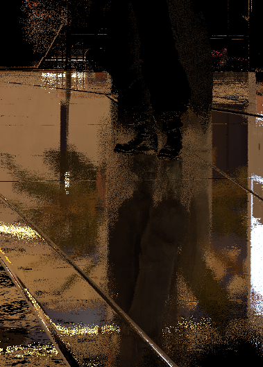
</p>

***Left:*** *In-Game Cubemap Reflections*
***Middle:*** *In-Game Cubemap Reflections*
***Right:*** *Original Game SSR Pass*

Reflections now, regardless if it's cubemap, SSR, or the "radiance" GI terms now are correct and are much more coherent and readable. Now let's get back to what we were just about to do with cubemap reflections.

#### Darkening Cubemap Reflections

<p float="left">
    
    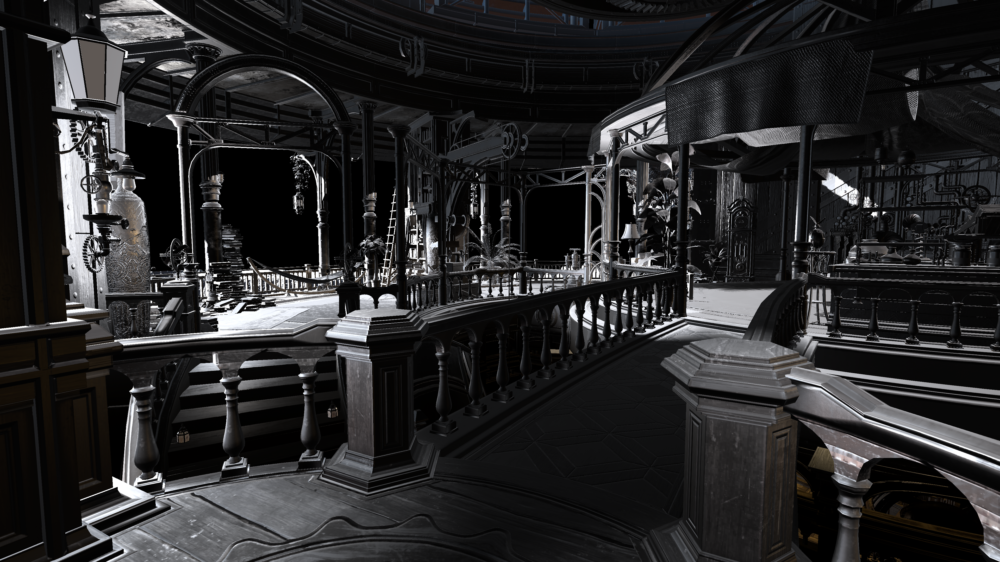
</p>

***Left:*** *Cubemaps*
***Right:*** *Cubemaps darkened when outside of Direct Light*

The first thing that came to mind with the cubemap reflections and due to their inaccuracy/leaking was to supress them. Now the technique here is fairly simple and is actually even done in Final Fantasy 7 Remake and similar titles where environmental reflections are actually supressed/darkened when in areas of shadow or occlusion. This has some physical plausibility because reflections generally are supposed to be lacking in dark areas *(baring some unique exceptions)*.

Now since we don't have "lightmaps" we do have "light probes". So maybe we can darken just by using that! 

Though after experimentation I still found them excessively bright in many areas. Unfortunately in the game I found many areas within cities that had interior spaces and actually had exterior reflections that were over-exposed and washing out the specular response when you were in dark areas or interiors.

The next best thing that I fortunately had access to in this pass was the Direct Light Framebuffer. Recall that just before this pass we draw direct lights before we combine the baked and reflection data. Now since this is a compute shader we can resample this direct lighting buffer and use that to occlude specular reflections when we are in areas of shadow. So this is what I elected to do instead as you see above.

```HLSL
float directLightContribution = saturate(LuminanceRec709(directLighting));
float directLightSpecularOcclusion = lerp(1.0f, min(directLightContribution, 1.0f), SPECULAR_OCCLUSION_DIRECT_LIGHT_SHADOW_FACTOR);

//NOTE: only apply this to the reflection probes, radiance volume and SSR should remain at full intensity as it's the most accurate
environment.CubemapReflection *= directLightSpecularOcclusion; 
environment.CubemapReflectionRough *= directLightSpecularOcclusion; 
```

Simple and cheap! Importantly it supresses a vast majority of these environmental reflections where they shouldn't be showing up for the most part. Great!

Except... we are also creating a problem when we do this, if we are supressing cubemap reflections then that means we will lose out on being able to properly read specular reflections for most materials in the environment. We can't just leave them pure black otherwise they won't look correct. So what else can we do?

#### Using Baked "Radiance" for Rough Reflections

So this was my plan, and this will all make some sense later but just trust me on this for now. With the supression of cubemap reflections, and those being revealed to be incredibly sparse and inaccurate throughout most of the game areas, the next best thing that we have access to is the baked global illumination data itself. [Now I get into much more detail later regarding the specifics](#turning-radiance-to-radiance) but I'll skim over it just for now, but I elected instead to start using these as our rough reflections term. 

Now because it's primarly used for baked global illumination, it's ultimately representing diffuse light which means that on the whole we don't be able to pull any sharp reflections from it. This is true, but [I pull some tricks later to squeeze the best quality reflections that I can out of this term](#turning-sample-gis-reflection-to-reflection) so we can end up with something usable. Not to mention our options are kind of limited to begin with. I also do some work later regarding the gane's SSR to ensure that it's more prevelant and higher quality as it's the only source of accurate reflection data we can use whenever it's available.

Now with the cubemaps supressed when they are outside of direct light and in shadow, we bring back in the original GI radiance term in it's place.

<p float="left">
    
    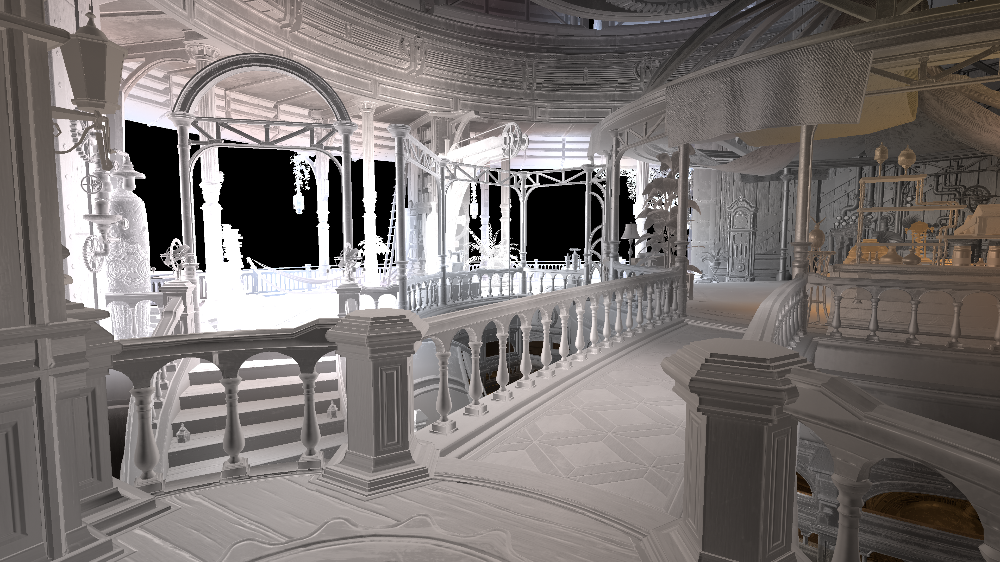
</p>

***Left:*** *Original Cubemap Blended with "Radiance" GI*
***Right:*** *Supressed Cubemaps Blended with "Radiance" GI*

Nice! That certainly knocked down the intensity of those reflections quite a bit, but there is still more that we can do. Some variance with the reflections though are certainly lost, but with some modifications that I do later to the [Sample GI's "Radiance" term](#turning-sample-gis-reflection-to-reflection) we can bring some of these details back.

<p float="left">
    
    
</p>

***Left:*** *Supressed Cubemaps Blended with "Radiance" GI*
***Right:*** *Supressed Cubemaps Blended with Improved "Radiance" GI*

But we will get to that later. Importantly now we were able to knock down the intensity of this cubemap reflections but there is still too much leaking going on all over the place. Especially near areas where ideally we should be seeing some form of occlusion *(i.e. against the banisters or up in the ceiling where most surfaces are facing away from the exterior window)*. What else can we do to occlude these reflections in a plausible way?

#### Bent Normal Specular Occlusion

<p float="left">
    
    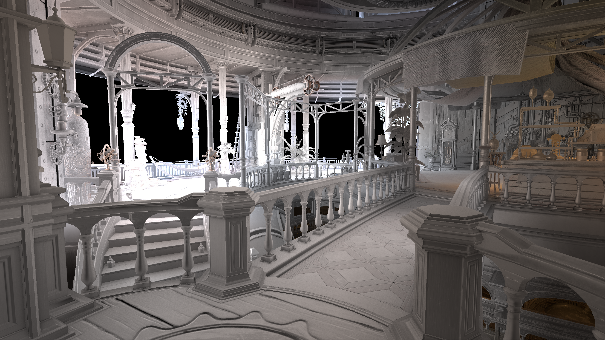
</p>

***Left:*** *Supressed Cubemaps Blended with "Radiance" GI*
***Right:*** *Supressed Cubemaps Blended with "Radiance" GI and Ambient Occlusion*

By default the game generally applies it's screen-space ambient occlusion term + it's material ambient occlusion maps with the reflection term. This is a good way of mitigating specular/reflection leaks but considering the overall severity of the specular reflections that generally are in the game I don't think this is strong enough. I did strengthen the SSAO as I thought it was too weak, but it's obviously not enough. Plus there is also [something I learned the other day](https://frostbone25.github.io/p/using-bent-normals-in-object-shaders/) that we can use to help occlude reflections in a more plausible way.

Enter ["Bent" Normal Specular Occlusion](https://frostbone25.github.io/p/using-bent-normals-in-object-shaders/)...

```HLSL
//based on Oat and Sander's 2008 technique area/solidAngle of intersection of two cone
float SphericalCapIntersectionSolidArea(float cosC1, float cosC2, float cosB)
{
    float r1 = FastACos(cosC1);
    float r2 = FastACos(cosC2);
    float rd = FastACos(cosB);
    float area = 0.0;

    if (rd <= max(r1, r2) - min(r1, r2))
    {
        // One cap is completely inside the other
        area = MATH_PI_TWO - MATH_PI_TWO * max(cosC1, cosC2);
    }
    else if (rd >= r1 + r2)
    {
        // No intersection exists
        area = 0.0;
    }
    else
    {
        float diff = abs(r1 - r2);
        float den = r1 + r2 - diff;
        float x = 1.0 - saturate((rd - diff) / max(den, 0.0001));
        area = smoothstep(0.0, 1.0, x);
        area *= MATH_PI_TWO - MATH_PI_TWO * max(cosC1, cosC2);
    }

    return area;
}

// Original Cone-Cone method with cosine weighted assumption (p129 s2016_pbs_activision_occlusion)
float GetSpecularOcclusionFromBentAO(float3 V, float3 bentNormalWS, float3 normalWS, float ambientOcclusion, float roughness)
{
    float cosAv = sqrt(1.0 - ambientOcclusion);
    roughness = max(roughness, 0.01); // Clamp to 0.01 to avoid edge cases
    float cosAs = exp2((-log(10.0) / log(2.0)) * (roughness * roughness));
    float cosB = dot(bentNormalWS, reflect(-V, normalWS));
    return SphericalCapIntersectionSolidArea(cosAv, cosAs, cosB) / (MATH_PI_TWO * (1.0 - cosAs));
}
```

This is an approach that was introduced by [Jorge Jimenez](https://blog.selfshadow.com/publications/s2016-shading-course/activision/s2016_pbs_activision_occlusion.pdf), and something also that I covered myself in a [different article](https://frostbone25.github.io/p/using-bent-normals-in-object-shaders/). In short this is a form of specular occlusion that has some intresting properties with some basis in reality. Firstly is that occlusion varies with the viewing angle.

<p float="left">
    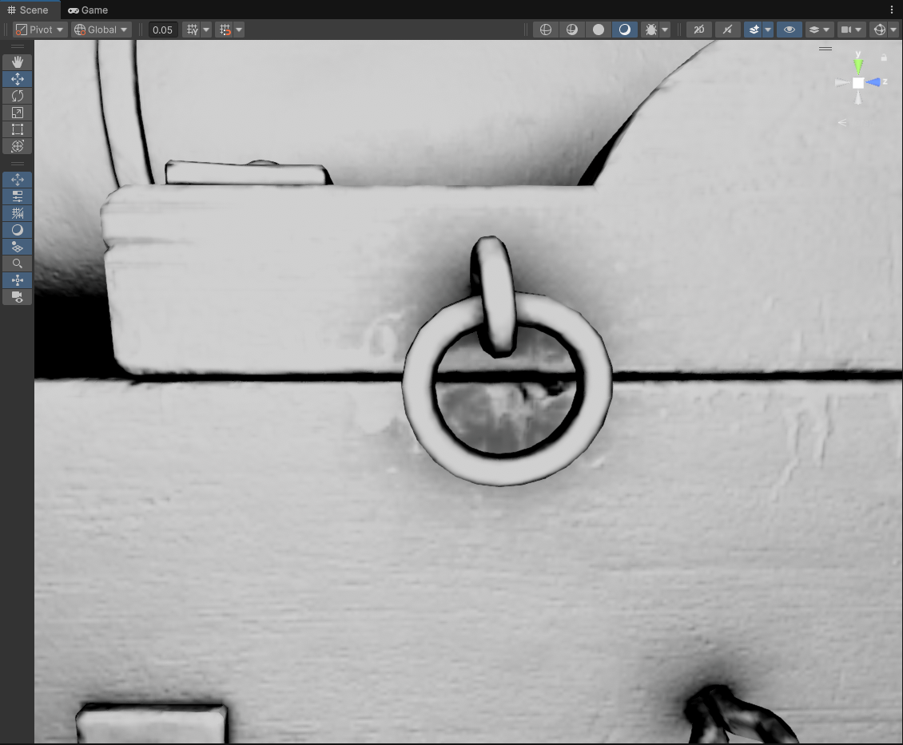
    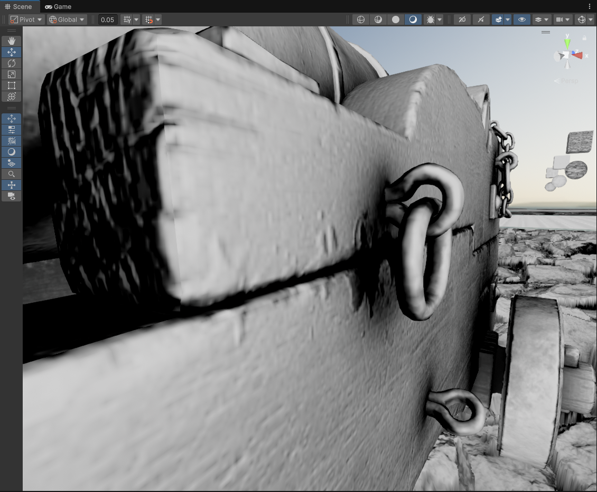
</p>

***Left:*** *Unity Example: Bent Normal Specular Occlusion*
***Right:*** *Unity Example: Bent Normal Specular Occlusion*

With areas that are occluded, when viewing "reflections" at grazing angles occlusion increases. You can see in the following examples that with the added occlusion the ring on this object almost looks like a "self-reflection". Now the other property is that this occlusion also scales with roughness.

<p float="left">
    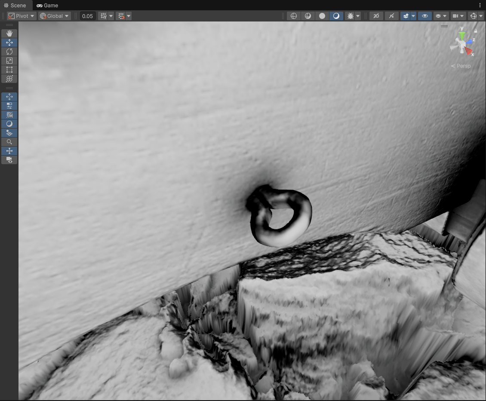
    
</p>

***Left:*** *Unity Example: Bent Normal Specular Occlusion*
***Right:*** *Unity Example: Bent Normal Specular Occlusion*

When the surface becomes smoother, or less rough, specular occlusion will sharpen. Again in this example it almost appears like as the material becomes smoother and more reflective we almost get a semblance of a self reflection from the ring that is protrouding from this surface. These are plausible properties that come about from this specular occlusion, and I'd like to leverage them! 

But wait...

Aren't these are intended to be used with [bent normals](https://frostbone25.github.io/p/using-bent-normals-in-object-shaders/)? Yes!

Ok, does the game have any [bent normals](https://frostbone25.github.io/p/using-bent-normals-in-object-shaders/)?

No...

The game does not have any form of bent normals at all that I was able to track down *(except maybe for hair)*. It's all regular normals, so what can we do? Perhaps we could calculate a screen-space ambient occlusion term that gives us a screen-space bent normal that we can leverage? We could, but that would incur a cost and ultimately I think would be more work than it's worth. What else can we do instead? Well... nothing! 

Honestly in this case we are pretty limited when it comes to options especially regarding performance, but I elected to just say screw it and try this out using this technique with the regular normal vectors in place of the bent normals, and just see what the results are like. Even if we don't have the "proper" data we should still get something helpful.

<p float="left">
    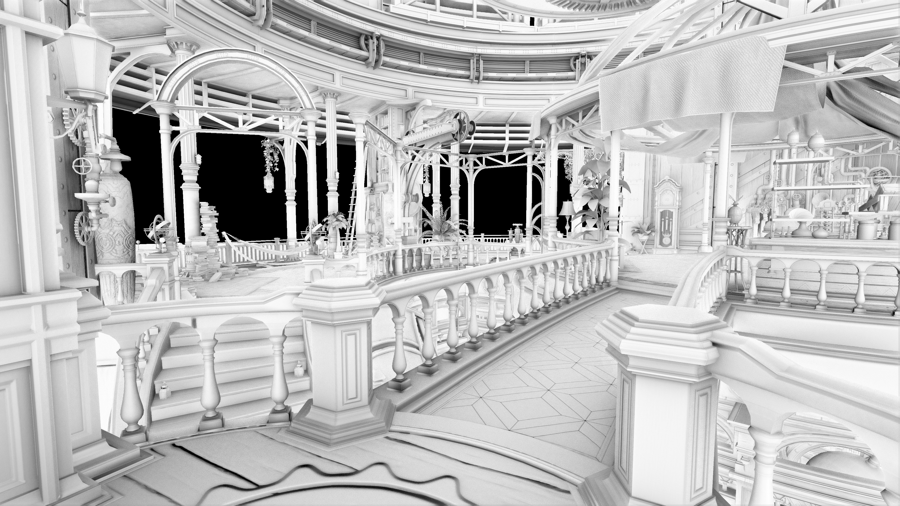
    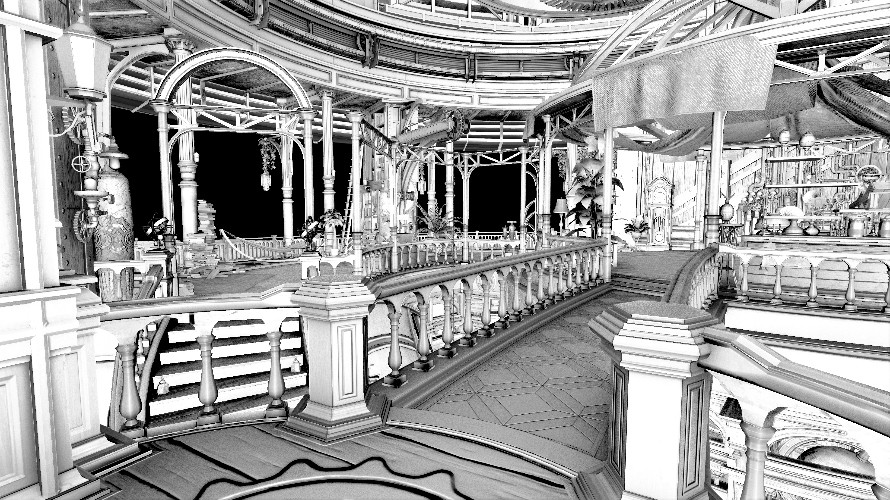
</p>

***Left:*** *Basic Specular Occlusion (SSAO + Material AO)*
***Right:*** *"Bent" Normal Specular Occlusion (SSAO + Material AO)*

Ok that seems about right actually, the occlusion is definetly much stronger now. Depending on the viewing angle there are areas of the scene now that will recieve stronger occlusion, and reflective/rough surfaces will recieve varying levels of "sharpened" occlusion. Not bad, in some areas maybe it's a little strong but we are looking at this term in isolation after all. How does this actually look when we apply it to the overall radiance term?

<p float="left">
    
    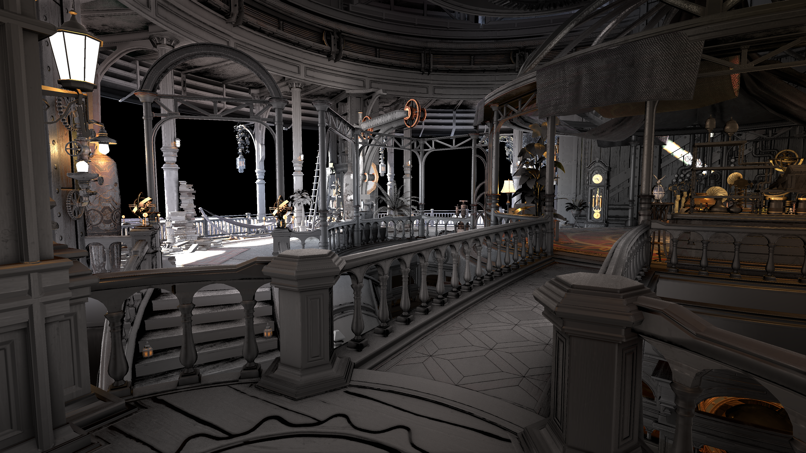
</p>

***Left:*** *Original Raw Radiance Only Term*
***Right:*** *Radiance Term with Supressed Cubemap Reflections and "Bent" Normal Specular Occlusion (SSAO + Material AO)*

Ok that's not looking bad! Compared to where we started these tweaks have definetly mitigated much of the specular light leak we had before! But we are not done yet as I still think there is a lot more we can do. Before we go any further though lets go ahead and check how things look with the regular diffuse and reflections combined once again.

<p float="left">
    
    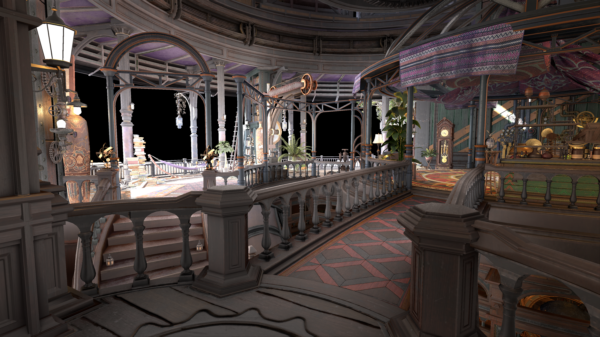
</p>

***Left:*** *Original Reflection Environment*
***Right:*** *Modified Reflection Environment*

Nice! We were definetly able to supress quite a bit of those leaking reflections, and doing it in a somewhat plausible way that works pretty well. Great! I can see much of the material colors coming back, but of course there is still this very wierd "wash" that we are still left with ultimately. Is there anything we can do about it? *Spoiler: [Yes!](#turning-sample-gis-reflection-to-reflection)*

<p float="left">
    
    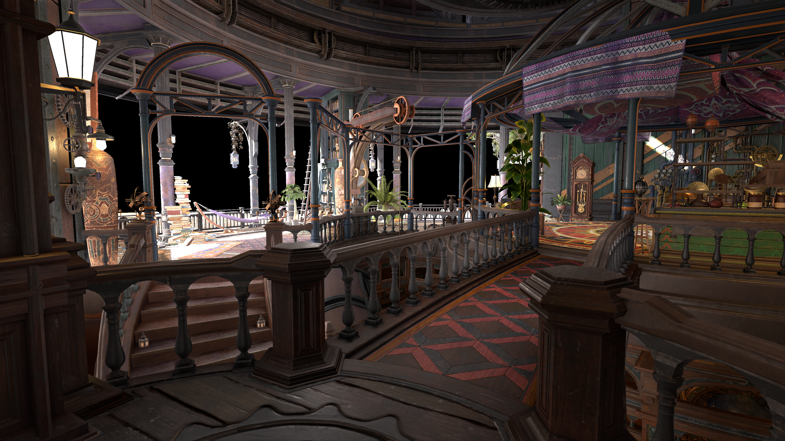
</p>

***Left:*** *Modified Reflection Environment*
***Right:*** *Modified Reflection Environment with Modified Sample GI*

#### Modifying Baked Irradiance/Diffuse Term

The next thing that I elected to do while I was in this shader was to check the irradiance/diffuse term. In other words the games baked global illumination that is used to shade most of the game when in ambient/shadowed areas. In general for the most part from what we saw earlier I thought this pass generally looked pretty good for the most part.

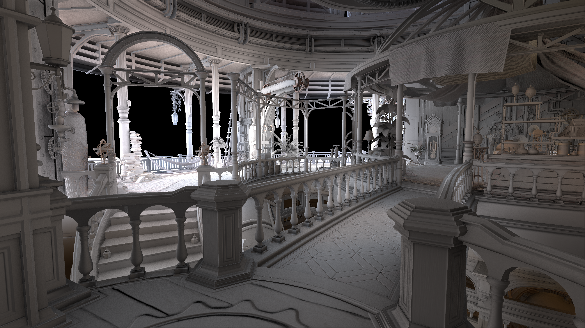

They have baked indirect light probe volumes scattered throughout most of the game world. While they are sparse, they still have a decent amount of coverage, and the lighting generally reflects what I'd expect to see. They of course apply their SSAO + Material Occlusion to this, so for the most part this looks pretty good. But...

There are some areas where there is some funny business going on.

<p float="left">
    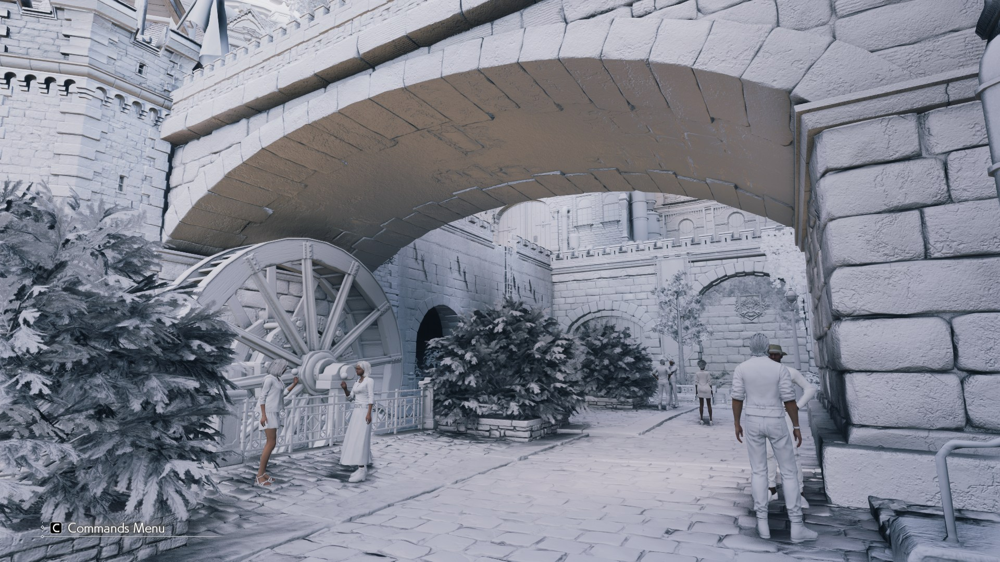
    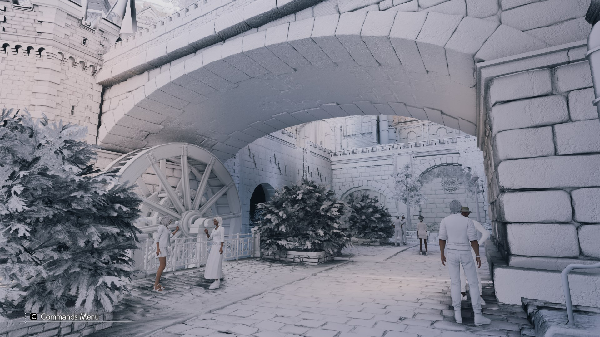
</p>

***Left:*** *Original Irradiance Blending (Baked Global Illumination + Cubemap "Irradiance")*
***Right:*** *Simplified Irradiance (Baked Global Illumination Only)*

<p float="left">
    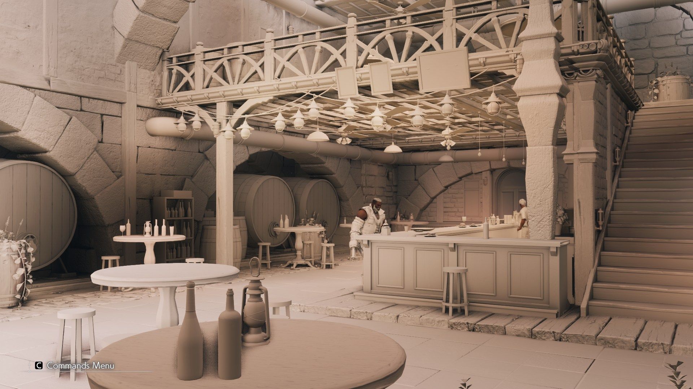
    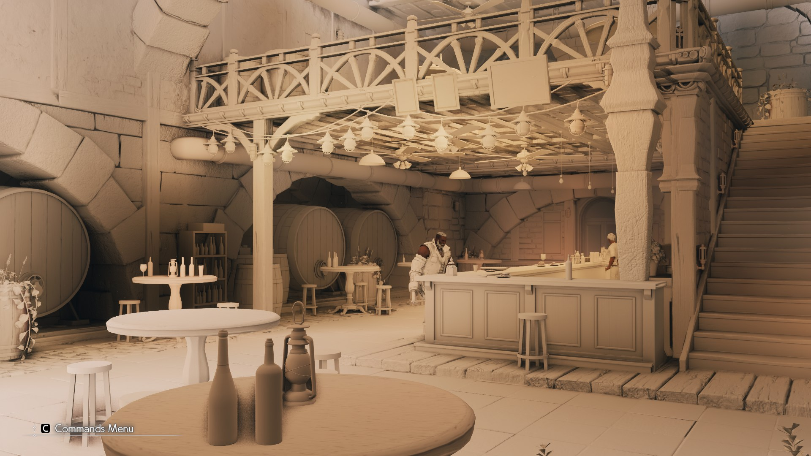
</p>

***Left:*** *Original Irradiance Blending (Baked Global Illumination + Cubemap "Irradiance")*
***Right:*** *Simplified Irradiance (Baked Global Illumination Only)*

Generally it looks fine but in most areas where...

1. There is bounce light emanating from the sun or large light sources
2. Areas with no "bounce" light but with pure skylight visibility
3. Interior areas where they might have some lights fully baked in the baked global illumination data

This combination they do actually leads to a loss of light/color that was originally in the lighting data. Not to mention the shading in some areas become inappropriate given the original lighting conditions. This is generally due to the fact that they actually try to combine this baked global illumination diffuse data with "reflection" probes. This is done by resampling the reflection probe within a volume and sample a very low "mip" level of that reflection to get an approximate "irradiance" term and blend it back with the main baked global illumination light probes based on luminance.

```HLSL
//default game irradiance blending
float irradianceVolumeLuminance = LuminanceRec709(irradianceVolume.rgb);
float irradianceVolumeLuminanceInverse = irradianceVolumeLuminance > 0.0 ? rcp(irradianceVolumeLuminance) : 0.0;

float cubemapIrradianceLuminance = LuminanceRec709(environment.CubemapIrradiance);

float cubemapIrradianceAndIrradianceVolume = cubemapIrradianceRoughLuminanceInverse * irradianceVolumeLuminance;
float cubemapIrradianceAndIrradianceVolumeInvert = cubemapIrradianceAndIrradianceVolume - 1.0;
float irradianceReject = saturate((cubemapIrradianceAndIrradianceVolumeInvert * cubemapIrradianceAndIrradianceVolumeInvert) / (cubemapIrradianceAndIrradianceVolumeInvert * cubemapIrradianceAndIrradianceVolumeInvert + 0.25));
float3 irradianceTarget = cubemapIrradianceLuminance * irradianceVolume.rgb * irradianceVolumeLuminanceInverse;

environment.irradiance = lerp(environment.CubemapIrradiance, irradianceTarget, irradianceReject) * cubemapIrradianceAndIrradianceVolume;
```

While generally I might be ok with this idea, and it's perfectly sound in theory, in practice I don't think it works too well mostly because the cubemap reflections the game has are incredibly sparse to begin with.

<p float="left">
    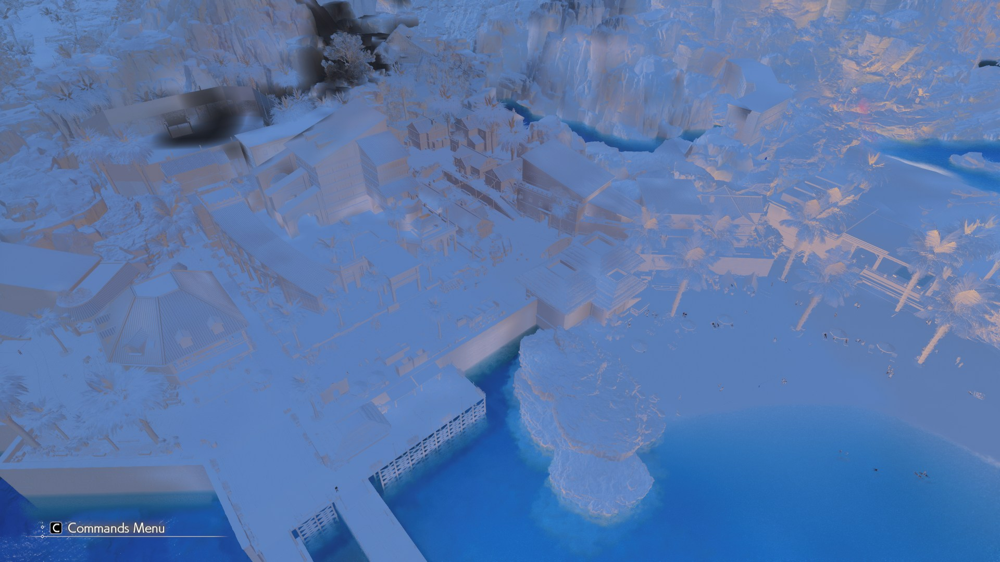
    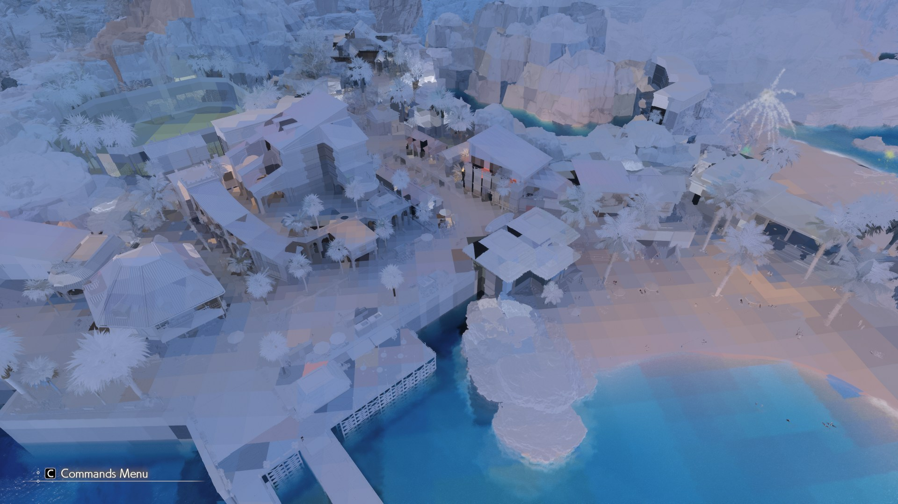
</p>

***Left:*** *Isolated Cubemap "Irradiance"*
***Right:*** *Baked Global Illumination Probes Only*

For some areas we do get increased contrast thanks to this blending but we lose out on accuracy and other aspects that should be coming from baked lighting term anyway. When one portion of that equation is "slacking" it will fudge the rest of the results with it. If the cubemaps had more coverage and "frequency" to begin with throughout the game world then I'd think this would be fine and would even look better in many conditions but unfortunately this isn't the case. Which leads to some of the result's you saw above. Admittedly it's a small difference in some areas, but in others like with the bridge shot it creates a final result that is quite different to what it's supposed to be. To get around this I elected just to keep things simple instead, have it to where we only sample from the baked global illumination light probes.

```HLSL
//new
environment.irradiance = irradianceVolume.rgb;
```

We avoid the problem with before of trying to blend these light probes with reflection probes, and this keep things simple and consistent. This also saves us from extra texture samples later as we only just sample the reflection probes for reflections, not also sampling them again for an approximate "irradiance". Again I would like to point out that if the reflection probes were more frequent I'd probably stay with it since it would improve accuracy, but considering how sparse/inaccurate are to begin with it's better to just keep it simple here.

#### Character Shading

With all of this work that we are doing improving irradiance/radiance this is something I wanted to highlight. This approach of blending the baked global illumination probes, with the sparse cubemap reflection volumes also was a contributing factor with one of the most important aspects of the game's visuals during gameplay *(not during cutscenes)*. The characters...

<p float="left">
    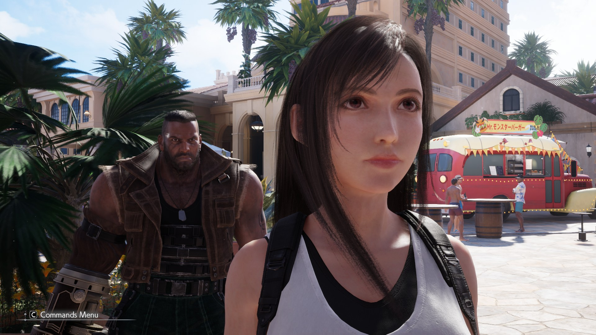
    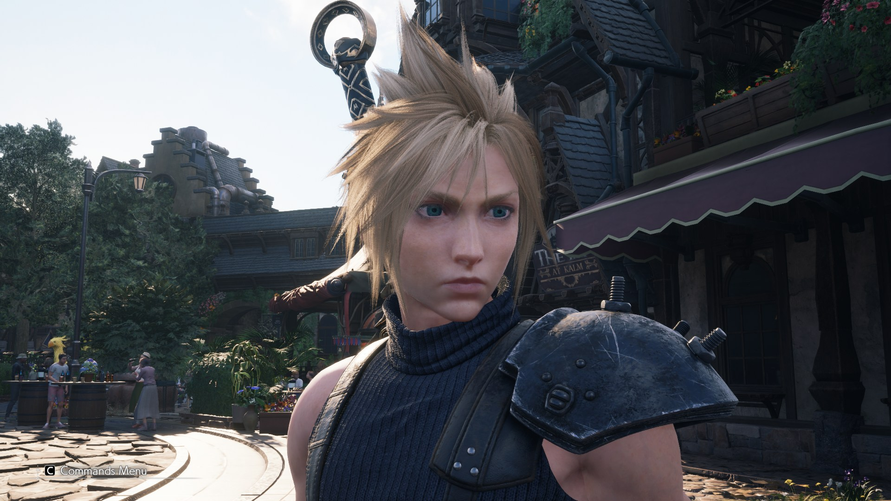
</p>

You can see here that the original game's irradiance/radiance term ends up adding too much "shading" and contrast here that winds up creating very awkward looking faces in many areas. This is again due to the fact that they try to combine this baked GI data with "reflection" probes. In combination with the specular/reflection light leak that we are working on mitigating this is leading to quite unflattering looks for these characters for most of the game world during gameplay. *(NOTE: this isn't an issue in cutscenes because artists explicitly go in and bring in lights and even reduce the environmental lighting contribution for those segments. In other words they cheat, but this is very typical and done even in film/tv-shows)* In addition the original application of the game's SSAO was too light and it unfortunately does nothing here to help with the shading of these characters.

When we reduce the specular light leak, and also force the irradiance term to only sample the baked global illumination lighting probes directly *(rather than blending with reflection probes)* their apperance looks much more natural especially when they are in ambient light. We don't recieve as much "shading" as we did before that was contributing to the unflattering apperance to begin with. 

<p float="left">
    
    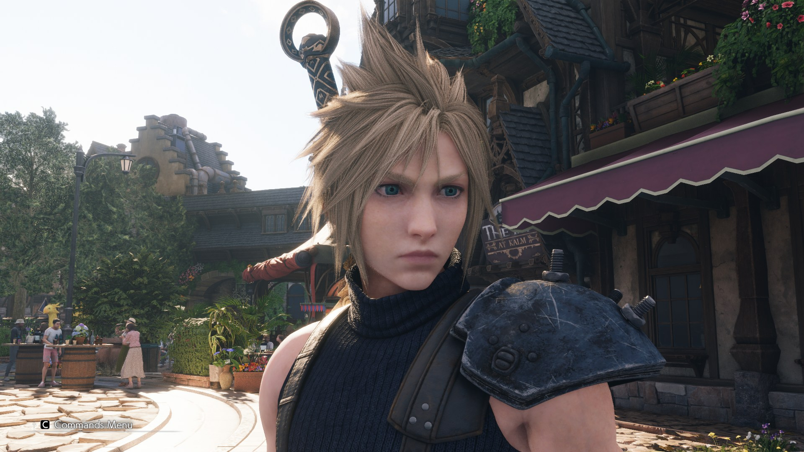
</p>

***Left:*** *Original Shading*
***Right:*** *Improved Shading (Reduced Specular Light Leak + Simplified Irradiance)*

<p float="left">
    
    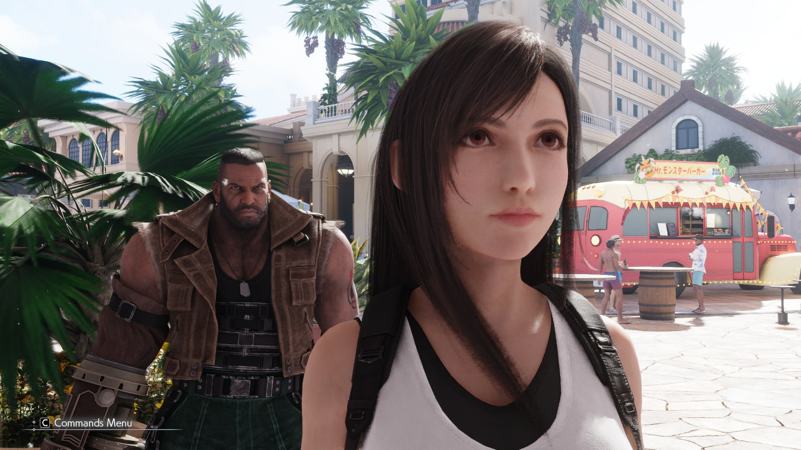
</p>

***Left:*** *Original Shading*
***Right:*** *Improved Shading (Reduced Specular Light Leak + Simplified Irradiance)*

Now granted their looks do flatten out, but this is actually normal considering that they are in ambient/shadowed lighting conditions to begin with! So this is accurate to the real world, and now their looks compared to before are more flattering in general. In addition also with some of the slight reworks to how occlusion is applied to both radiance/irradiance, it's more obvious now which helps give extra shape to the final look. Importantly it's accurate to the real world since bounced ambient light doesn't penetrate through most areas unblocked.

But... I'm not done yet! I think there is something else we can add here that will drastically improve the final apperance of the characters *(and even environments)* in these ambient lighting conditions. A camera light.

In photography you learn very early on that it is important to capture your subjects in good light. In most natural lighting conditions in the real world trying to capture faces in a flattering way can be quite difficult and often result's can be quite the opposite. Sure if you are in certain areas the look of natural light can look quite good *(especially if you have control and are able to shape it)* but on the whole this is usually not the case.

One very common and important practice that is done is to introduce your own lights, and often this is done with a flash. This flash adds in new light onto your subjects, filling in shadows when you are in less than ideal lighting conditions. Importantly along with filling in shadows, it introduces an eye highlight when done correctly.

<p float="left">
    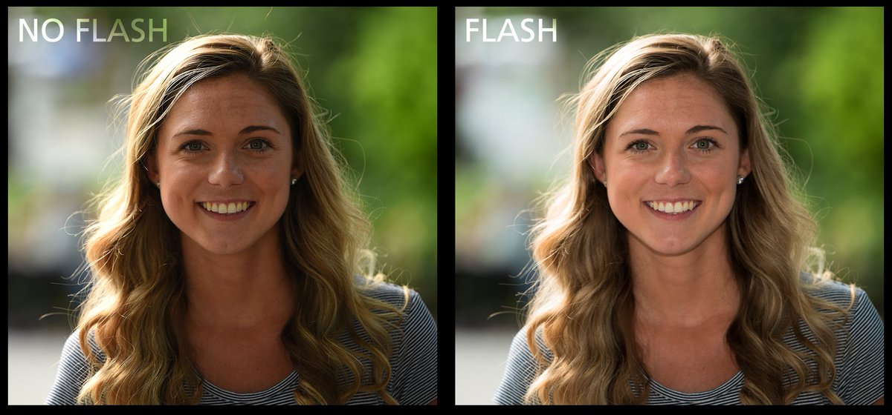
    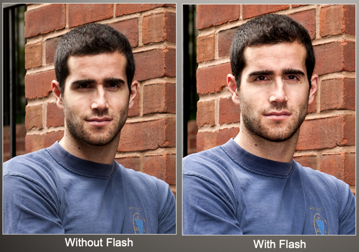
</p>

*[Real World Reference A](https://pbs.twimg.com/media/DdVrwxUVMAAZ1Rs.jpg) | [Real World Reference B](https://capitalphotographycenter.com/images/uploads/%C2%A9Marie_Joabar_Fill_Flash_-4.jpg)*

The final result is much more flattering for the subjects, and turning the original less than ideal natural lighting condition, into a more acceptable one. Now further steps beyond this of course is that in photography *(or even in film/tv/games)* you can introduce more elaborate lighting setups that can either ["motivate"](https://www.studiobinder.com/blog/what-is-motivated-lighting-in-film/) the natural light, or you can supress the environmental light with your [own artistic lighting environments](https://www.cined.com/unmotivated-light-as-a-storytelling-tool-when-is-it-appropriate/) entirely. 

In my case, I elected to keep it simple and try to follow the principles of ["motivated"](https://www.studiobinder.com/blog/what-is-motivated-lighting-in-film/) light so this new camera light wouldn't draw attention to itself. It should only elevate what was originally there.

<p float="left">
    
    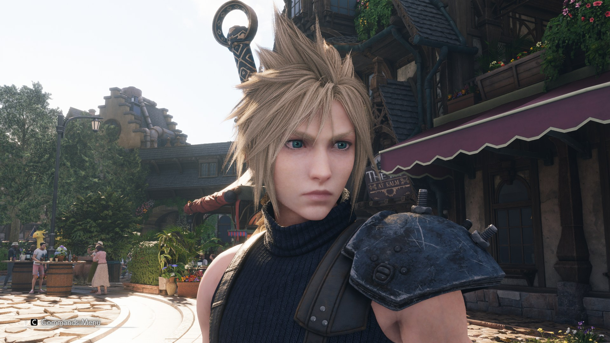
</p>

***Left:*** *Improved Shading (Reduced Specular Light Leak + Simplified Irradiance)*
***Right:*** *Camera Light + Improved Shading (Reduced Specular Light Leak + Simplified Irradiance)*

<p float="left">
    
    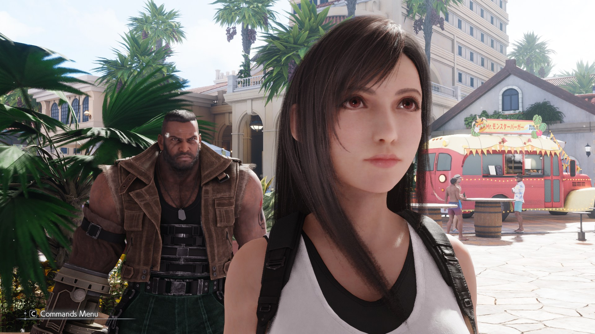
</p>

***Left:*** *Improved Shading (Reduced Specular Light Leak + Simplified Irradiance)*
***Right:*** *Camera Light + Improved Shading (Reduced Specular Light Leak + Simplified Irradiance)*

It's subtle, and you'll likely need to open the images in a new tab and flip back and fourth to see it's effects but it adds alot to the final apperance. It lifts the exposure of characters when in shadow and close to camera. Importantly also because it's a light source, it also creates an eye highlight that gives the characters more life when in these kinds of gameplay lighting conditions. The light color is derived from the baked global illumination probe data so the color matches ambient lighting conditions, so ultimately the difference here is with the actual light values itself and not with the color. Importantly also, wanting to preserve most of the original look and art-direction.

```GLSL
#define CAMERA_AMBIENT_LIGHT

//in (cm) units
#define CAMERA_AMBIENT_LIGHT_RANGE 250000.0
#define CAMERA_AMBIENT_LIGHT_BRIGHTNESS 1.0
#define CAMERA_AMBIENT_LIGHT_SPECULAR_BOOST 0.5
```

```HLSL
#if defined(CAMERA_AMBIENT_LIGHT)
    float distanceToCamera = distance(View_WorldCameraOrigin, worldPosition);
    float falloff = rcp(distanceToCamera);
    falloff *= falloff; //inverse square

    float cameraAmbientLight = falloff;
    cameraAmbientLight = clamp(cameraAmbientLight * CAMERA_AMBIENT_LIGHT_RANGE, 0.0f, 1.0f) * CAMERA_AMBIENT_LIGHT_BRIGHTNESS;
    cameraAmbientLight *= saturate(dot(gbufferData.WorldNormal, vector_viewDirection));
    cameraAmbientLight *= Vignette(vector_uvNormalized, 0.1f, 0.45);

    diffuse += cameraAmbientLight * globalIlluminationIrradiance;
    specular += globalIlluminationIrradiance * cameraAmbientLight * CalculateSpecularHighlight(gbufferData.WorldNormal, vector_viewDirection, gbufferData.Roughness) * CAMERA_AMBIENT_LIGHT_SPECULAR_BOOST;
#endif
```

*NOTE: The current implementation here admittedly is messy, but on the whole the effect is still incredibly cheap*.

#### Final Reflection Environment Timings

*NOTE: We are working with RenderDoc frame captures, which were captured on an RTX 3080 at native 3840x2160 with no dynamic resolution or DLSS. The game was also running at maximum graphical settings.*

Since nowe we've essentially reached the end of the modifications for this lighting shader, what do to timings look like with all of our modifications?

Starting first with the original ReflectionEnvironment shader this was our original timings.

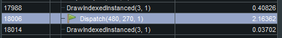

```2.16ms``` that's actually a little more expensive than I was expecting, but considering that it's effectively combing the reflection probes within the game world *(and irradiance volumes)* this actually makes some sense. I still think there is room for improvement but overall it's not too bad considering what it's achieving. Checking our reverse engineered shader at the start before any modifications...

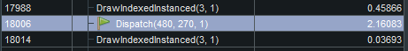

```2.16ms``` the costs are essentially the same! This is great, but now the real important deal is checking the actual timings with all of our modifications by the end. It should be more right?

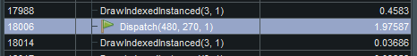

```1.97ms```, it's actually faster? At first I thought this was a fluke and that I accidentally had some terms disabled or omitted but nope this is the timings of the shader with it's modifications. 

As it turns out [earlier when I modified the game's "irradiance" term](#modifying-baked-irradiancediffuse-term) to only sample from the baked global illumination probes, instead of trying to also combine the approximate "irradiance" terms from the reflection probes this actually saved us some performance! This is because when simplifying that irradiance term, we just only do a single texture sample ultimately and we just use that "irradiance" render target from a previous draw directly. 

The logic also when it comes to sampling cubemap reflections in the game world, we actually do less work because we only sample them for reflections. Not doing another additional sample of those same cubemap reflections again just to get an approximate "irradiance" term that was messing with our results.

Sweet! Now let's move on to what I teased earlier, which was reworking that original "Radiance" term in the SampleGI shader.

## Turning Sample GI's "Reflection" to Reflection

Now as a consequence now of mostly killing the cubemap reflections in areas of occlusion... we can't exactly just leave this completely dark unfortunately. This would darken the overall apperance and also unfortunately reduce the ability to "read" specularity on materials within the environment. We need a way to retain some kind of reflection that isn't the inaccurate and sparse cubemaps that we are currently stuck with in the game. Ideally also these new reflections are more accurate and plausible.

Taking a look at the SampleGI shader where the game's baked global illumination probe data is sampled for both diffuse/irradiance, and used to modulate reflections/radiance with that first render target... I had an idea, and also a recollection of something I saw achieved in a much earlier title that proved to be quite effective.

### The Order: 1886 Inspiration

[MJP a while back shared a very indepth series breakdown of the baked lighting tech they devised for their title](https://therealmjp.github.io/posts/sg-series-part-5-approximating-radiance-and-irradiance-with-sgs/), which was quite impressive and very good quality for the time *(even today I'd argue)*. In PBR rendering, reflections are an extremely important part of the presentation. You cannot slack on it otherwise you will wind up with visual issues just like Rebirth and some other titles. 

In the Order 1886 they sought to improve the overall lighting presentation in an intresting way. The game utilized baked lighting, which was done for both quality and performance reasons. But instead of having the usual diffuse lightmap, they also baked a "specular" lightmap...

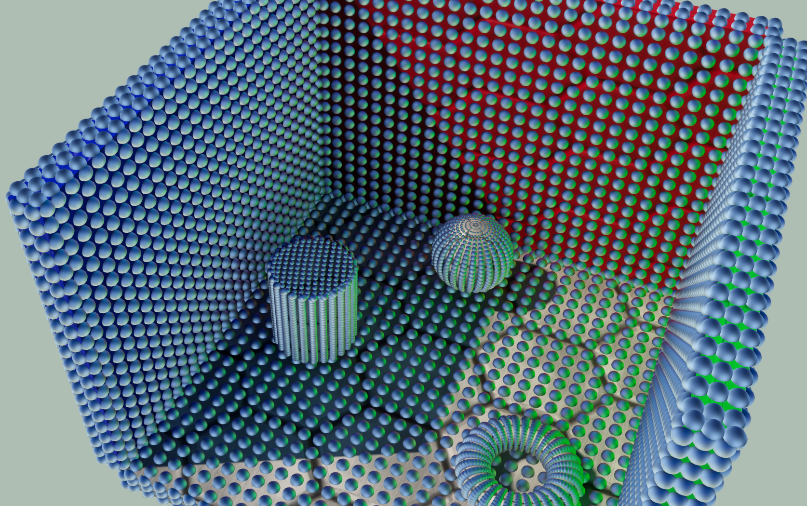
*[MJP: SG Series Part 5: Approximating Radiance and Irradiance With SG's](https://therealmjp.github.io/posts/sg-series-part-5-approximating-radiance-and-irradiance-with-sgs/)*

Now this idea is not new, and this predates as far back as [Half-Life 2](http://www.decew.net/OSS/References/sem_ss06_07-Independant%20Explanation.pdf), starting with the idea of essentially storing extra lighting information about the enviornment that can be used to improve the **diffuse** shading of light when using baked lightmaps. As time went on there were games that build upon this concept, but what's special here is this idea of storing more and more information about the lighting environment in the lightmap data. In this case jumping forward to here, it's about storing a specular or "reflection" lightmap.

This lightmap *(of which there are multiple texture sets storing different coefficents)*, is effectively storing a bunch of really compressed reflection cubemaps for each lightmap texel using Spherical Gaussians. Now of course this is usually done with spherical harmonics or other similar methods but this general approach to handling specular reflections was what led to such visually impressive results even today.

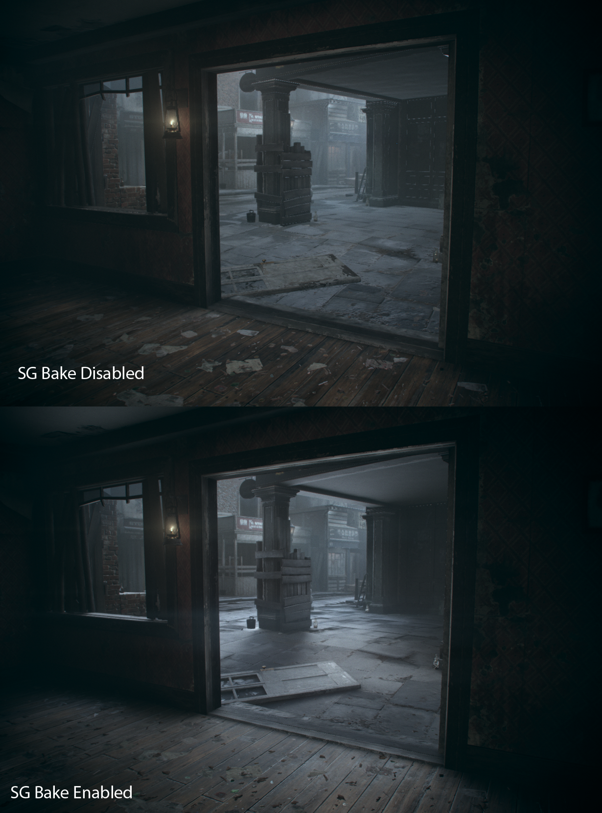
*[MJP: SG Series Part 5: Approximating Radiance and Irradiance With SG's](https://therealmjp.github.io/posts/sg-series-part-5-approximating-radiance-and-irradiance-with-sgs/)*

Now the issue of course is that you can only store so much data *(They had a large amount of lightmaps now to sample because of this)* so the actual "cubemap" ultimately is low resolution and blurry, but in practice that wasn't actually a bad thing at all!

Infact... they actually used this directly as their primary "rough" reflection term rather than the parallax corrected cubemaps they already had witihn the title. 

<p float="left">
    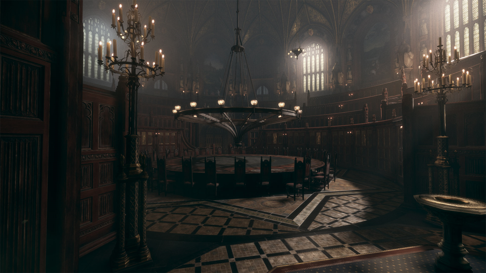
    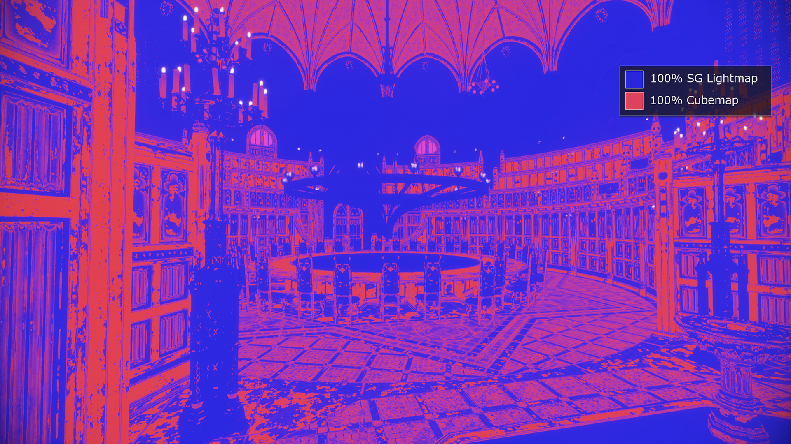
</p>

*[MJP: SG Series Part 5: Approximating Radiance and Irradiance With SG's](https://therealmjp.github.io/posts/sg-series-part-5-approximating-radiance-and-irradiance-with-sgs/)*
***Left:*** *In-Game Screenshot*
***Right:*** *Debug Term visualizing what the materials in the sample are mostly sampling their reflections from.*

They already had good coverage with their reflection probes, and this makes sense considering the linear and smaller scope of the game. But of course it is ultimately nothing compared to the data from their specular lightmaps which was effectively having a "rough reflection cubemap" for every lightmap texel. The spatial resolution was far better and more accurate even if it was rough. The result's frankly speak for themselves in the screenshots above.

**Now... I unfortunately do not expect in the slightest to even reach this kind of quality within this context, but there is a very important takeaway for me here. It's this idea that with our baked probe lighting data, it's already a represntation of the surrounding environment at a given point in space.** *(again effectively a cubemap reflection as I described earlier)* Now for people paying attention this might seem obvious but it didn't intuitively click with me for a long while until reading that fantastic series by MJP did.

That gave me an idea that's always sat in the back of my mind with projects that sample lighting from baked sources that are within game environments.

### Squeezing Rough Reflections out of Irradiance Data

Using that idea now I will attempt to effectively turn the "radiance" term the game was originally using, into something that more closely resembles a proper rough reflection term. This is technically the most accurate environmental data we have access to compared to the cubemaps because the baked global illumination probes are more frequent and have much better coverage and accuracy in relation to the environment they reside in. Do I expect to hit the same quality levels? No but it should still be a marginal improvement, and it means that we can importantly avoid much of the originally inaccurate cubemap reflections that was polluting our lighting results.

#### The game uses Ambient Cube?

With the baked probe based lighting in the game, this baked diffuse light data is stored in a small series of floating point coefficents. 

```HLSL
struct FProbeDirectionalField
{
    float3 BaseColor;
    float3 PositiveAxisLobes;
    float3 NegativeAxisLobes;
};
```

Now a couple of intresting things to note is that they only store a singular RGB light color ```BaseColor```. Then they also have two other sets of values that effectively only store just a brightness value that modulates the base color. ```PositiveAxisLobes``` and ```NegativeAxisLobes```. These values are pointing in 6 different directions to form a cube! 

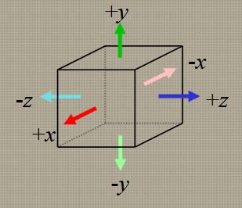

*[Jason Mitchell - Shading in Valves Source Engine](https://advances.realtimerendering.com/s2006/Mitchell-ShadingInValvesSourceEngine.pdf)*

From what I could gather this probe data closely resembles [Valve's Ambient Cube](https://advances.realtimerendering.com/s2006/Mitchell-ShadingInValvesSourceEngine.pdf) with some differences.

<p float="left">
    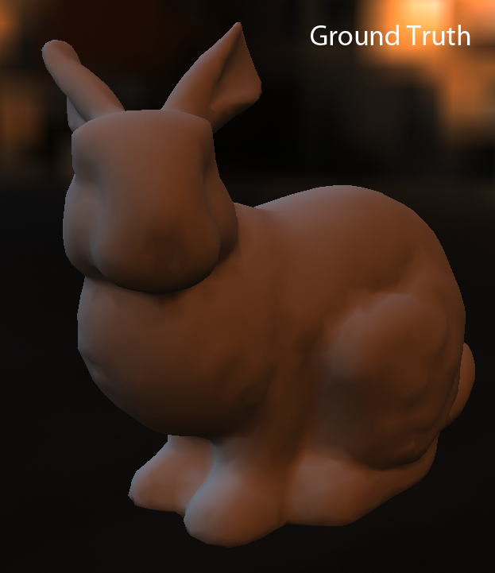
    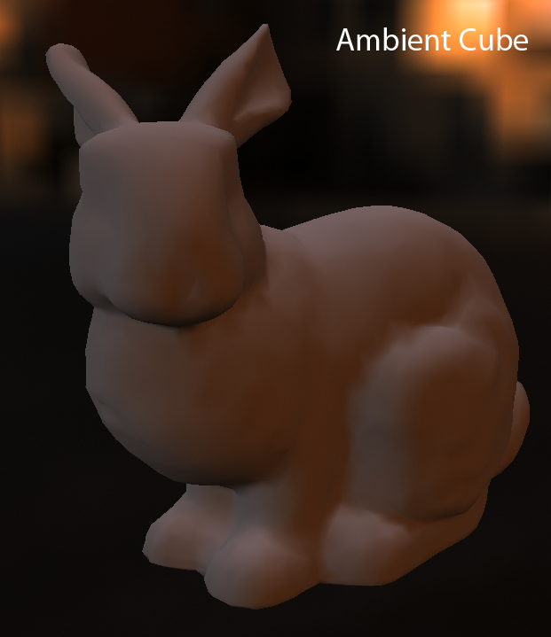
</p>

*[MJP: SG Series Part 5: Approximating Radiance and Irradiance With SG's](https://therealmjp.github.io/posts/sg-series-part-5-approximating-radiance-and-irradiance-with-sgs/)*

Now this was really intresting to me, Ambient Cube existed all the way back from [Half Life 2](https://advances.realtimerendering.com/s2006/Mitchell-ShadingInValvesSourceEngine.pdf) which introduced this probe format. For the most part it was good enough for the time, but as things went on better and higher quality and more efficent methods were devised/adopted that could more accurately represent lighting at a specific points.

However, there are some tricky parts to this. We only have a singular color? It looks like the developers elected to keep this lighting data very small and compact. Normally a full RGB light color would be stored for the different direction for better accuracy and lighting reconstruction. However, they only keep the main averaged light color, and instead just keep the luminance/intensity for each direction that gets used instead to modulate the main RGB color. The color accuracy of our diffuse lighting reconstruction is not going to be as accurate! Same with our radiance/reflection later.

Well that kinda sucks, and it does make me question if it was ultimately necessary to crunch the pre-baked lighting probe data this much. But... this data is what it is, and unfortunately given the context we cannot rebake the game's light probes or change their formats to store more data for better lighting reconstruction... so we just have to deal with it and make it work.

With that said, in the future I hope they take note and adopt them because lighting reconstruction is generally more accurate across the board. Not to mention that they also have a number of tricks that can be employed to reduce their memory consumption while still retaining great results. Spherical harmonics are known for their ringing in high contrast environments, which may be another posibility why they elected to use Ambient Cube which circumvents all of that... but there are already a couple of techniques that exist to reduce ringing when using spherical harmonics. *[(Geometrics Irradiance Evaluation or Zonal Harmonics ZH3)](https://www.activision.com/cdn/research/ZH3-I3D-Presentation-Slides.pdf)*

<p float="left">
    
    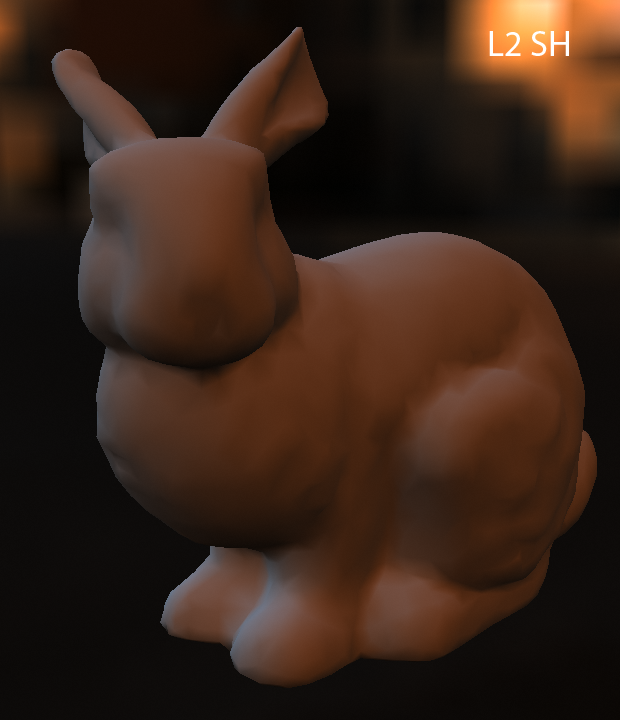
    
</p>

*[MJP: SG Series Part 5: Approximating Radiance and Irradiance With SG's](https://therealmjp.github.io/posts/sg-series-part-5-approximating-radiance-and-irradiance-with-sgs/)*

#### Reprojecting Ambient Cube to Spherical Harmonics

Now unfortunately to my current knowledge, there isn't really a whole lot we can do with ambient cube in terms of shading techniques. 

Since the introduction of [Ambient Cube](https://advances.realtimerendering.com/s2006/Mitchell-ShadingInValvesSourceEngine.pdf), it's become very common around that time also in the industry to store lighting probes using Spherical Harmonics, due to their quality and efficency. Ontop of that many clever techniques have come out since then that actually allow you to do a number of shading techniques to get far better quality and results... but nothing with Ambient Cube as far as I'm aware.

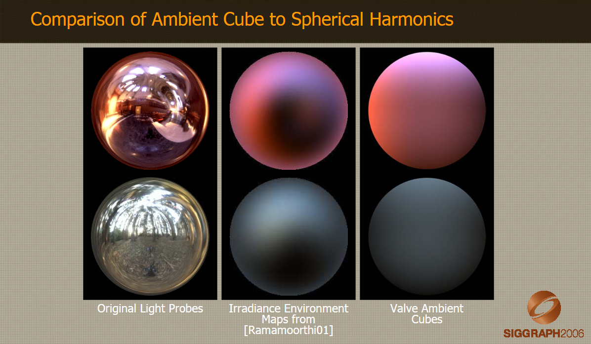
*[Jason Mitchell - Shading in Valves Source Engine](https://advances.realtimerendering.com/s2006/Mitchell-ShadingInValvesSourceEngine.pdf)*

So what we will do is take what we have and actually "convert" it into spherical harmonics. Now of course  the downside is that conversions always entail some kind of quality loss. Especially in here recall that we don't have good color accuracy *(we just have a single color)* but in practice I didn't find the changes to be all that significant and the end results still looked quite good. So let's go ahead and do that. In my case I elected to reproject back into spherical harmonics up to order 2. Given that we are working with irradiance data ultimately I thought this was fitting enough.

```HLSL
SphericalHarmonicsData AmbientCubeToSH2(FProbeDirectionalField field)
{
    static const float Y00  = 0.2820947918f;
    static const float Y1   = 0.4886025119f;
    static const float Y20  = 0.3153915653f;
    static const float Y22  = 0.5462742153f;

    float3 axisAverage = 0.5f * (field.PositiveAxisLobes + field.NegativeAxisLobes);
    float3 axisDifference = 0.5f * (field.PositiveAxisLobes - field.NegativeAxisLobes);

    float baseLuminance = dot(field.BaseColor, float3(0.2126f, 0.7152f, 0.0722f));
    float3 chromaticity = baseLuminance > 1e-6f ? field.BaseColor / baseLuminance : 0.0f;

    SphericalHarmonicsData result;

    //order 0
    result.Coefficient[0] = chromaticity * Y00 * (4.0f * PI / 3.0f) * (axisAverage.x + axisAverage.y + axisAverage.z);

    //order 1
    result.Coefficient[1] = chromaticity * Y1 * PI * axisDifference.y;
    result.Coefficient[2] = chromaticity * Y1 * PI * axisDifference.z;
    result.Coefficient[3] = chromaticity * Y1 * PI * axisDifference.x;

    //order 2
    result.Coefficient[4] = chromaticity * 0.0f;
    result.Coefficient[5] = chromaticity * 0.0f;
    result.Coefficient[6] = chromaticity * Y20 * (8.0f * PI / 15.0f) * (2.0f * axisAverage.z - axisAverage.x - axisAverage.y);
    result.Coefficient[7] = chromaticity * 0.0f;
    result.Coefficient[8] = chromaticity * Y22 * (8.0f * PI / 15.0f) * (axisAverage.x - axisAverage.y);

    return result;
}
```

Now that we have the lighting probe data converted into spherical harmonics, we can use the usual techniques reconstruct the "diffuse" lighting. And since our light probe data is effectively already "irradiance" we don't need to do [Ramamoorthi's](https://cseweb.ucsd.edu/~ravir/papers/envmap/envmap.pdf) technique to convolve the coefficent data for irradiance. So we just take the spherical harmonic coefficents and reconstruct the "diffuse" lighting like we usually do.

```HLSL
float3 EvaluateIrradiance(SphericalHarmonicsData sh, float3 direction)
{
    float3 color = float3(0, 0, 0);

    color += sh.Coefficient[0] * 0.2820947918f;
    color += sh.Coefficient[1] * 0.4886025119f * direction.y;
    color += sh.Coefficient[2] * 0.4886025119f * direction.z;
    color += sh.Coefficient[3] * 0.4886025119f * direction.x;
    color += sh.Coefficient[4] * 1.0925484306f * direction.x * direction.y;
    color += sh.Coefficient[5] * 1.0925484306f * direction.y * direction.z;
    color += sh.Coefficient[6] * 0.3153915653f * (3.0f * direction.z * direction.z - 1.0f);
    color += sh.Coefficient[7] * 1.0925484306f * direction.x * direction.z;
    color += sh.Coefficient[8] * 0.5462742153f * (direction.x * direction.x - direction.y * direction.y);

    return color;
}
```

Checking how our "radiance" term looks compared to before...

<p float="left">
    
    
</p>

***Left:*** *Ambient Cube Irradiance*
***Right:*** *Converted Spherical Harmonics Irradiance*
*NOTE: I recomend opening these images in a new tab and flipping back and fourth to see the full difference.*

Sweet, it  still looks good. Some of the light apperas to have shifted but in most areas it actually looks better in revealing some normal map details in the environment. Though we are not done yet! 

Now that we have our baked lighting probe data in spherical harmonics, we can leverage some techniques now to squeeze some juice out of these fruits.

#### Deconvolve Irradiance to Radiance

The first primary one here is that it's actually possible to "reconstruct" the original radiance coefficents from irradiance using an idea that I learned from [Pema](https://github.com/pema99) *(Thank you!)*. 

<p float="left">
    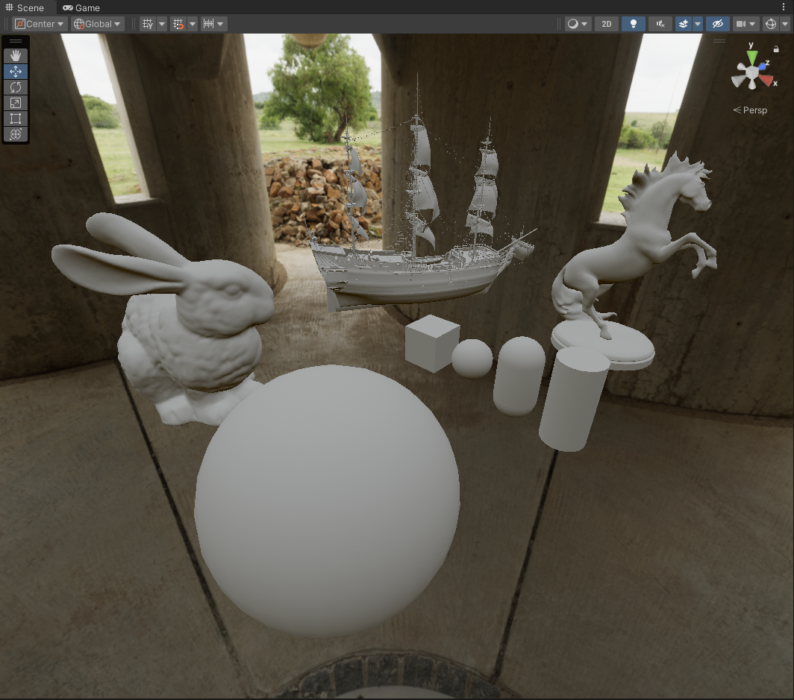
    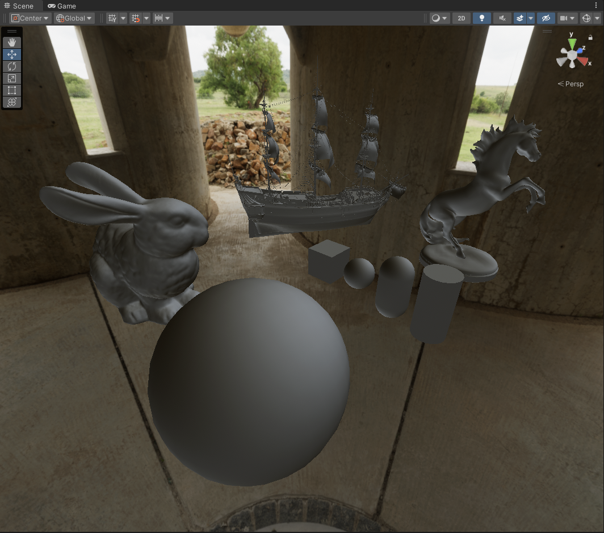
</p>

***Left:*** *Unity Example: Spherical Harmonic Irradiance*
***Right:*** *Unity Example: Spherical Harmonic Radiance*

Granted it's not perfect, and definetly doesn't help that we are working with data that was already converted from a different format *(and a uniform average color)* but it should still work reasonably well. The ultimate goal of what we are trying to do is turn this into a rough reflection term that we can use for a majority of the rough reflections in the game, which is also where many of those awkward reflection leaks come from.

In spherical harmonics typically when projecting the lighting environment, you project are projecting the "radiance" which is effectively the incoming light, into spherical harmonic coefficents. *(think if it like encoding the original lighting environment down into tiny cubemap)* Then you do what's called "irradiance convolution" which turns these "radiance" coefficents into "irradiance" which gives you your final diffuse lighting. 

In this case since we technically already have the diffuse lighting data in spherical harmonics from ambient cube, we can actually "undo" this irradiance convolution due to the nature of how that technique works, which is ultimately just multiplying some constants against the sets of coefficents. Theroetically this will give us back the original "radiance" term.

```HLSL
SphericalHarmonicsData DeconvolveLambertianIrradiance(SphericalHarmonicsData irradianceSH)
{
    SphericalHarmonicsData radianceSH;

    // L0
    //runtime: coefficent / PI
    //precomputed: coefficent * INV_PI
    radianceSH.Coefficient[0] = irradianceSH.Coefficient[0] * INV_PI;

    // L1
    //runtime: coefficent * (3.0 / (2.0 * PI)) 
    //precomputed: 0.47746482927568600730665129011754
    radianceSH.Coefficient[1] = irradianceSH.Coefficient[1] * 0.47746482927568;
    radianceSH.Coefficient[2] = irradianceSH.Coefficient[2] * 0.47746482927568;
    radianceSH.Coefficient[3] = irradianceSH.Coefficient[3] * 0.47746482927568;

    // L2
    //runtime: coefficent * (4.0 / PI)
    //precomputed: 1.2732395447351626861510701069801
    radianceSH.Coefficient[4] = irradianceSH.Coefficient[4] * 1.273239544735162;
    radianceSH.Coefficient[5] = irradianceSH.Coefficient[5] * 1.273239544735162;
    radianceSH.Coefficient[6] = irradianceSH.Coefficient[6] * 1.273239544735162;
    radianceSH.Coefficient[7] = irradianceSH.Coefficient[7] * 1.273239544735162;
    radianceSH.Coefficient[8] = irradianceSH.Coefficient[8] * 1.273239544735162;

    return radianceSH;
}
```

<p float="left">
    
    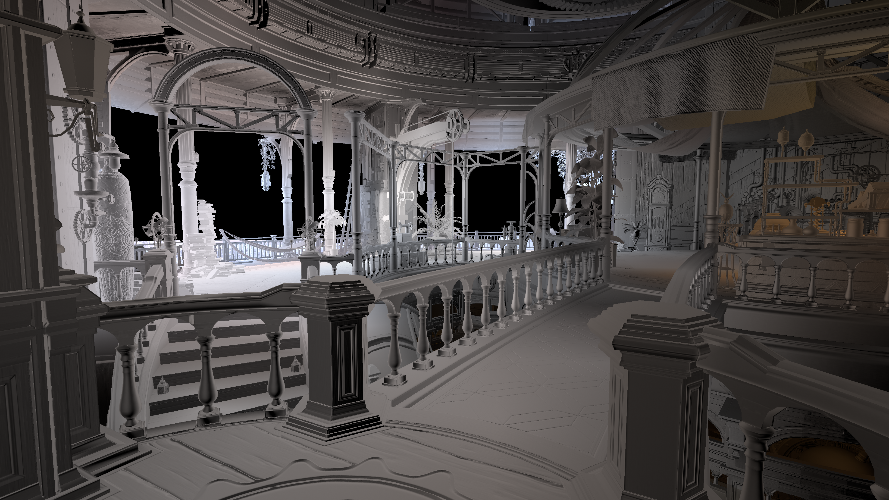
</p>

***Left:*** *Spherical Harmonics Irradiance*
***Right:*** *Converted Spherical Harmonics Irradiance*
*NOTE: I recomend opening these images in a new tab and flipping back and fourth to see the full difference.*

As expected the results are darker, but when we look more closely we can see that the term is more closely resembling a blurry reflection rather than a diffuse term. 

<p float="left">
    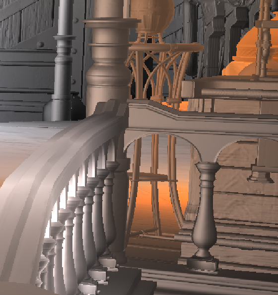
    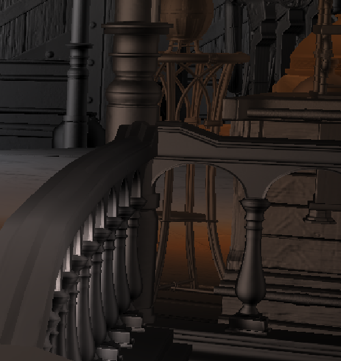
</p>

***Left:*** *Spherical Harmonics Irradiance*
***Right:*** *Spherical Harmonics "Radiance"*

This is good and I'm starting to see some shapes coming out now, but we can build upon this a little more.

#### Scaling Radiance With Surface Roughness

<p float="left">
    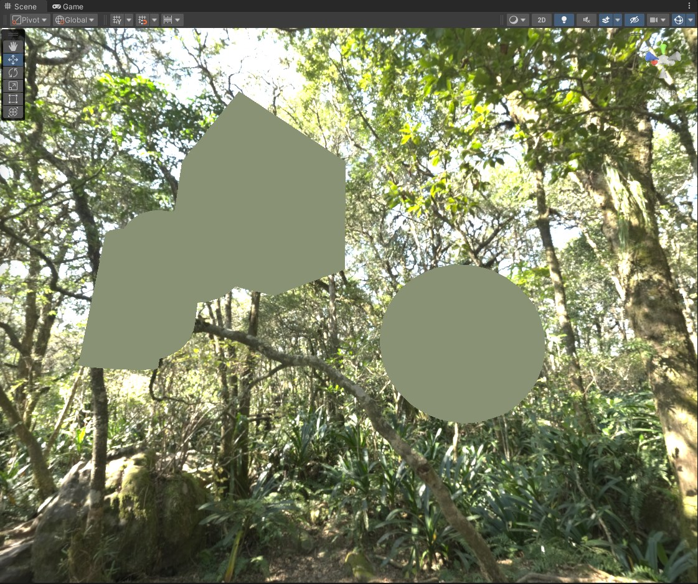
    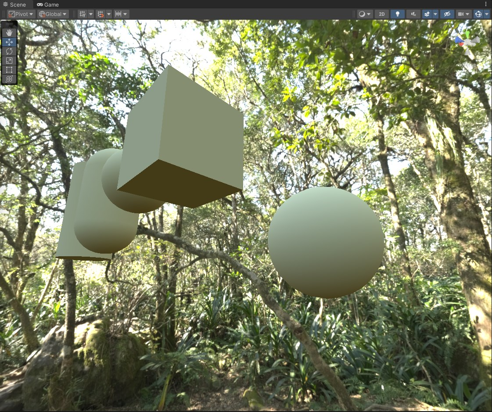
    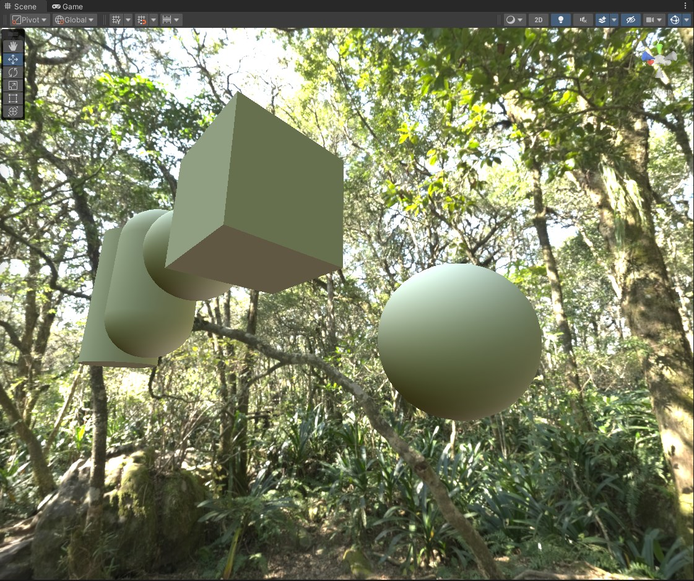
</p>

***Left:*** *Unity Example: Spherical Harmonics Radiance Order 0*
***Middle:*** *Unity Example: Spherical Harmonics Radiance Order 1*
***Right:*** *Unity Example: Spherical Harmonics Radiance Order 2*

With probe data, and in this context, the more spherical harmonic orders that we have. The better the quality of the "reconstruction" of the original environment. 

Typically with "cubemaps" and reflection sampling is that rougher materials will use a lower and intentionally blurrier representation of the environment to get those proper reflections. We can employ that same idea here by gradually fading in each of the spherical harmonic order coefficents. 

```HLSL
float3 EvaluateRoughnessFilteredRadiance(SphericalHarmonicsData sh, float3 direction, float perceptualRoughness)
{
    //GGX alpha
    float roughness = saturate(perceptualRoughness);
    float alpha = roughness * roughness;

    //roughness-dependent SH band attenuation.
    float l1Raw = exp(-alpha);
    float l2Raw = l1Raw * l1Raw * l1Raw; // exp(-3 * alpha)

    //algebraically simplified
    //(l1Raw - exp(-1)) / (1 - exp(-1))
    //(l2Raw - exp(-3)) / (1 - exp(-3))
    float l1Weight = saturate(l1Raw * 1.5819767069f - 0.5819767069f);
    float l2Weight = saturate(l2Raw * 1.0523956965f - 0.0523956965f);

    float x = direction.x;
    float y = direction.y;
    float z = direction.z;
    float xy = x * y;
    float yz = y * z;
    float xz = x * z;

    float zonalL2 = 3.0f * z * z - 1.0f;
    float azimuthalL2 = x * x - y * y;

    //L0: Y00 / PI
    float3 l0 = sh.Coefficient[0] * 0.0897935611f;

    //L1: Y1 * 3 / (2 * PI)
    float3 l1 = sh.Coefficient[1] * y + sh.Coefficient[2] * z + sh.Coefficient[3] * x;

    l1 *= 0.2332905149f;

    //L2 cross terms share the same basis constant.
    //1.0925484306 * 4 / PI
    float3 l2Cross = sh.Coefficient[4] * xy + sh.Coefficient[5] * yz + sh.Coefficient[7] * xz;

    l2Cross *= 1.3910758664f;

    //Remaining L2 terms:
    //0.3153915653 * 4 / PI = 0.4015690130
    //0.5462742153 * 4 / PI = 0.6955379332
    float3 l2 = l2Cross + sh.Coefficient[6] * (0.4015690130f * zonalL2) + sh.Coefficient[8] * (0.6955379332f * azimuthalL2);
    return l0 + l1Weight * l1 + l2Weight * l2;
}
```

This is an adaptation of what I saw and learned from ["Spherical Harmonic Exponentials for Efficient
Glossy Reflections"](https://highperformancegraphics.org/untracked/2025/presentations/Pa5_1_hpg_2025_slides.pdf), where they actually leveraged spherical harmonics more directly to handle glossy reflections. Granted that in the presentation they are working with high order spherical harmonics, not order 2 since it's too low resolution... but still I thought it was applicable and plus I'm trying to squeeze the best that I can out of this!

In practice, what this ends up looking like is that these rough reflections will change depending on the materials that are in the scene.

<p float="left">
    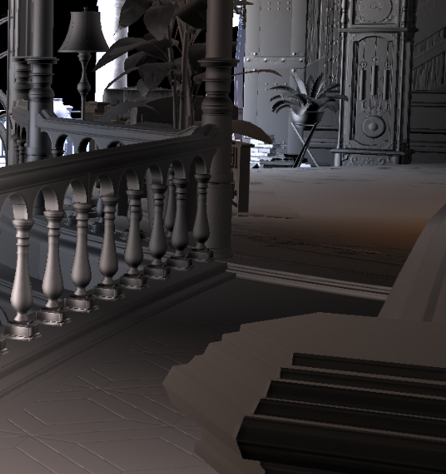
    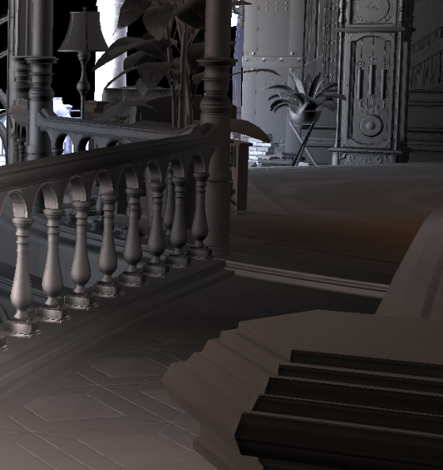
</p>

***Left:*** *Spherical Harmonics "Radiance"*
***Right:*** *Spherical Harmonics "Radiance" with variable surface roughness*

Lookin pretty good now! There is an increased degree of accuracy now also since now we have materials that have variable roughness, which in-of-itself can add back in detail to our final radiance term in a way that makes sense. But we are still not done yet!

#### Dominant Direction Specular

The next neat thing we can do, now that we have spherical harmonic coefficents, is that it is actually possible to derive the dominant direction of light for the environment. With this direction we can treat it as a fresh new reflection "highlight" that actually scales with material roughness. This will help the entire reflection term across the board and give us much better results. Now granted this scales with material roughness and we are mostly creating this to be a rough environment reflection term, but thats ok! It is helpful and this can even help give an extra specular "kick" for smooth and reflective materials in a way that makes sense and is perfectly plausible. It's Multi-Purpose!

```HLSL
struct FSHDominantLight
{
    float3 Direction;
    float3 PeakRadiance;
    float3 HighlightRadiance;
    float  Directionality;
};

FSHDominantLight ExtractDominantLight(SphericalHarmonicsData radianceSH)
{
    static const float Y00 = 0.2820947918f;
    static const float Y1  = 0.4886025119f;

    float3 firstMoment = float3(
        LuminanceRec709(radianceSH.Coefficient[3]), // X
        LuminanceRec709(radianceSH.Coefficient[1]), // Y
        LuminanceRec709(radianceSH.Coefficient[2])  // Z
    );

    float momentLength = length(firstMoment);
    float dcCoefficient = max(LuminanceRec709(radianceSH.Coefficient[0]), 1e-6f);
    float3 averageRadiance = max(radianceSH.Coefficient[0] * Y00, 0.0f);

    FSHDominantLight light;
    light.Direction = momentLength > 1e-6f ? firstMoment / momentLength : float3(0.0f, 0.0f, 1.0f);
    light.Directionality = saturate((Y00 / Y1) * momentLength / dcCoefficient);
    light.PeakRadiance = max(EvaluateIrradiance(radianceSH, light.Direction), 0.0f);
    light.HighlightRadiance = max(light.PeakRadiance - averageRadiance, 0.0f) * light.Directionality;

    return light;
}
```

We can "extract" the dominant direction of light from the spherical harmonic environment, along with other data that we can use to help modulate this specular term later. *(Right now only light.Direction ultimately matters here)*. Once we have this we run this function to get the necessary data, and input this dominant light direction into a GGX specular.

```HLSL
//calculates a GGX Specular using the dominant direction of light
float3 dominantSpecularHighlight = EvaluateDominantSHHighlight(dominantLight, worldNormal, directionToCamera, roughness);

radiance += dominantSpecularHighlight;
```

Worth pointing out here that the GGX Specular I slightly modified to have no fresnel or f0 terms. This is because again we are essentially building a "rough" reflection term, and later this final "reflection" color gets applied with fresnel according to material properties so that it all looks correct.

Anyway, with that mentioned, here are the results...

<p float="left">
    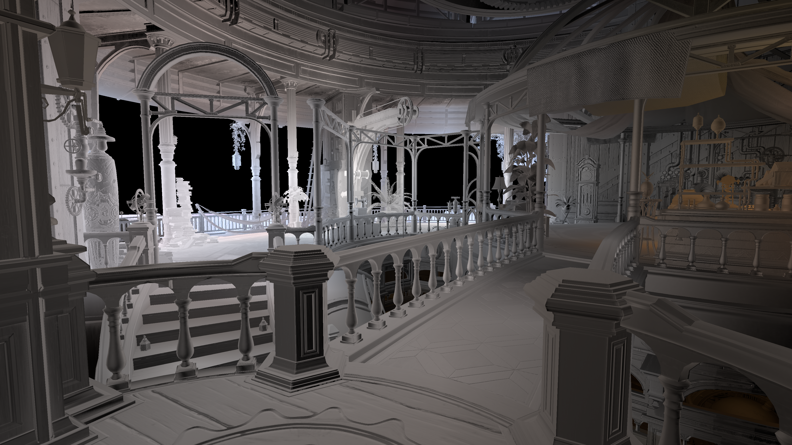
    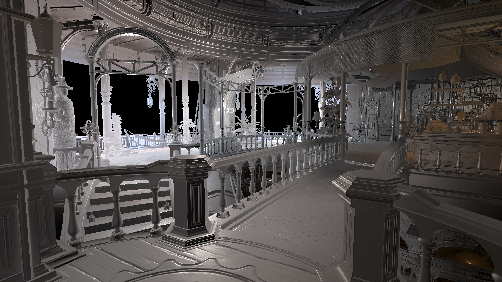
</p>

***Left:*** *Spherical Harmonics Radiance*
***Right:*** *Spherical Harmonics Radiance + Dominant Specular*
*NOTE: I recomend opening these images in a new tab and flipping back and fourth to see the full difference.*

Oh nice! We get a very nice specular highlight now, that actually is plausible and comes from the dominant direction of light within this global illumination term.

<p float="left">
    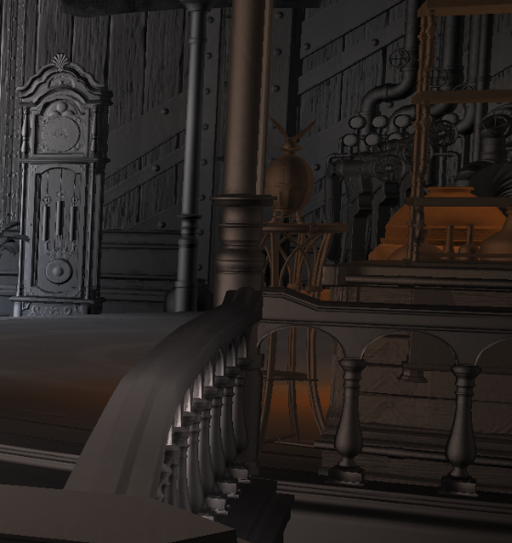
    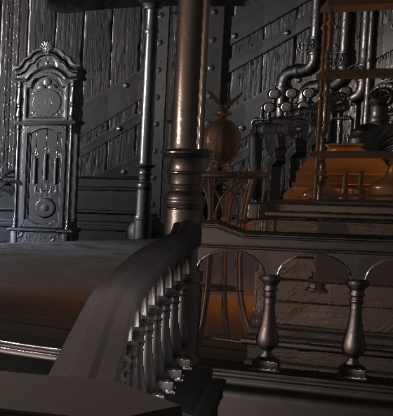
</p>

***Left:*** *Spherical Harmonics Radiance*
***Right:*** *Spherical Harmonics Radiance + Dominant Specular*

Lookin very good now! Order 2 Spherical Harmonics is already pretty rough especially for rough reflections, but being able to add back in this term is what really helps us sharpen up these reflections in a plausible way that will improve the final radiance term as a whole. Now of course I have gone a little futher ultimately and implemented some "artistic" changes here in an attempt to bring more specular highlights to the overall radiance term. Because remember, for a large majority of reflections I would prefer to use this term over the super sparse/inaccurate cubemaps that the game currently has so we're doing our best here.

<p float="left">
    
    
</p>

***Left:*** *Spherical Harmonics Radiance + Dominant Specular*
***Right:*** *Spherical Harmonics Radiance + Dual Dominant Specular + Camera View Specular + Dominant Light Specular Occlusion*

<p float="left">
    
    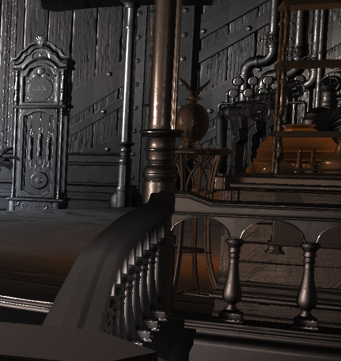
</p>

***Left:*** *Spherical Harmonics Radiance + Dominant Specular*
***Right:*** *Spherical Harmonics Radiance + Dual Dominant Specular + Camera View Specular + Dominant Light Specular Occlusion*

The additions are an extra specular highlight on the opposite end of the dominant direction of light at reduced intensity. A camera-position based specular highlight also at reduced intensity, and then finally a simple "half-lambert" occlusion term based on the dominant direction to drop the intensity of the radiance term on the opposite end of the dominant light to give extra "shape". While some of it I probably wouldn't do, I'm still kind of limited in the grand scheme of things but I think this looks pretty good now for the most part and is somewhat acceptable to use as a rough reflection term.

#### Sample GI Timings

Housekeeping, gotta make sure everything is still in check! Performance matters after all! Checking the original RenderDoc replay timing of the original compute shader pass...

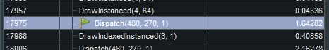

```1.64ms``` which is a little more expensive than I expected for this kind of draw, but we'll just roll with it. We do have to sample from a number of different sources in the shader and also do leak-reduction and such. Let's check the reverse engineered shader...

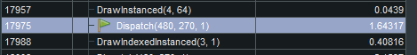

```1.63ms``` just a tiny bit faster but again take that with a grain of salt. RenderDoc replay timings have a bit of noise but in general the shader is pretty accurate. Now for brevity sake let's check the final timings with all of our new additions *(all of the spherical harmonic conversion, deconvolution, dominant direction specular highlights, etc.)*

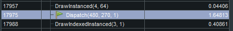

```1.64ms``` awesome! The timings are essentially the same! This is expected as we aren't doing anything overly complex, we are just reworking some terms and adding some lightweight specular/dominant light shading terms. There is probably more things we can do in the future with this pass, but this is good enough for now.

#### Sample GI: Final In-Game Results...

The most important thing now is checking how this looks in the RenderDoc capture, and in the final game...

<p float="left">
    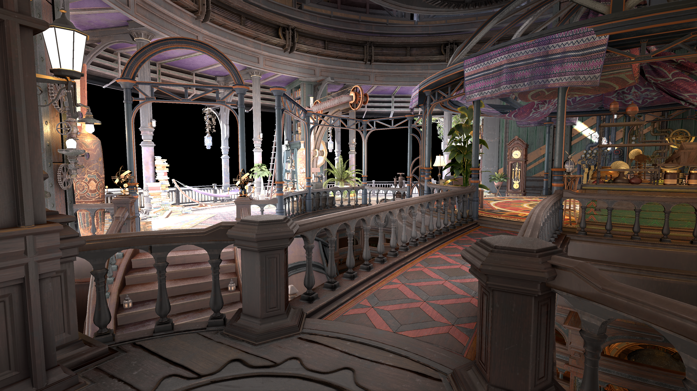
    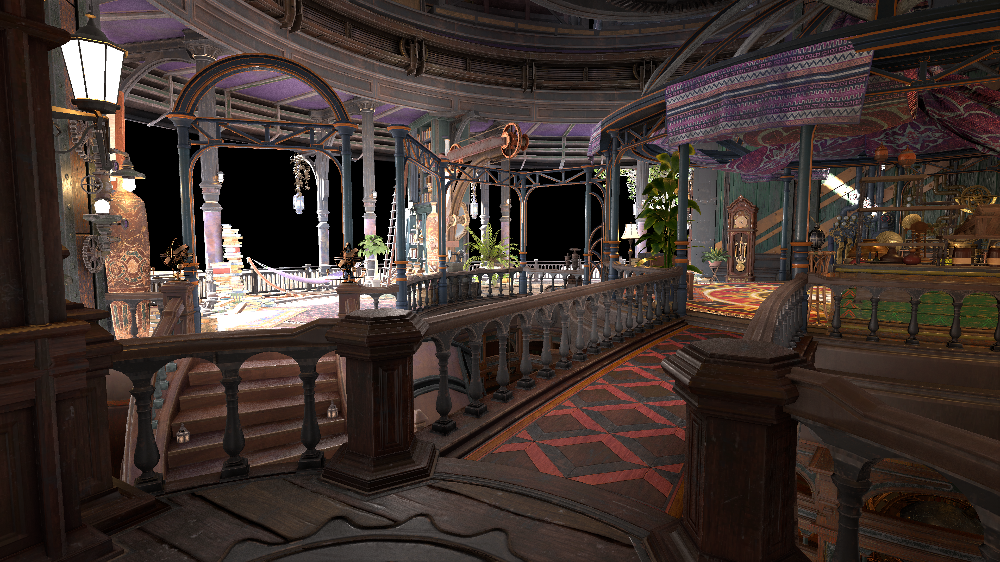
</p>

***Left:*** *Improved Reflection Environment with Original Unmodified Sample GI*
***Right:*** *Improved Reflection Environment with Modified Sample GI*

WIth our adjustments done before, when we now check the result's of both shaders feeding the result's into the final image we can see now that it looks way better! That wash we saw from before from the specular reflections has mostly vanished now. In it's place we have our own radiance term that is in full swing, much more prevalant now compared to the original leaky stretched cubemaps and everything still looks good! We can get a good read on the specular materials that are in the scene as well so we haven't lost all that data!

In some areas also we get a more accurate specular response/highlight than we did before thanks to the dominant direction specular!

<p float="left">
    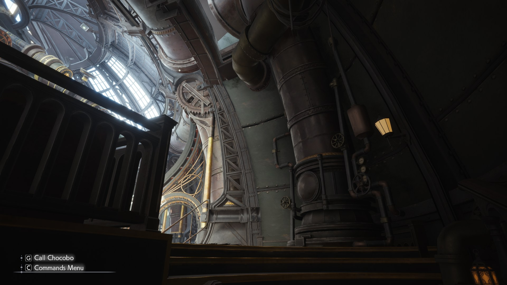
    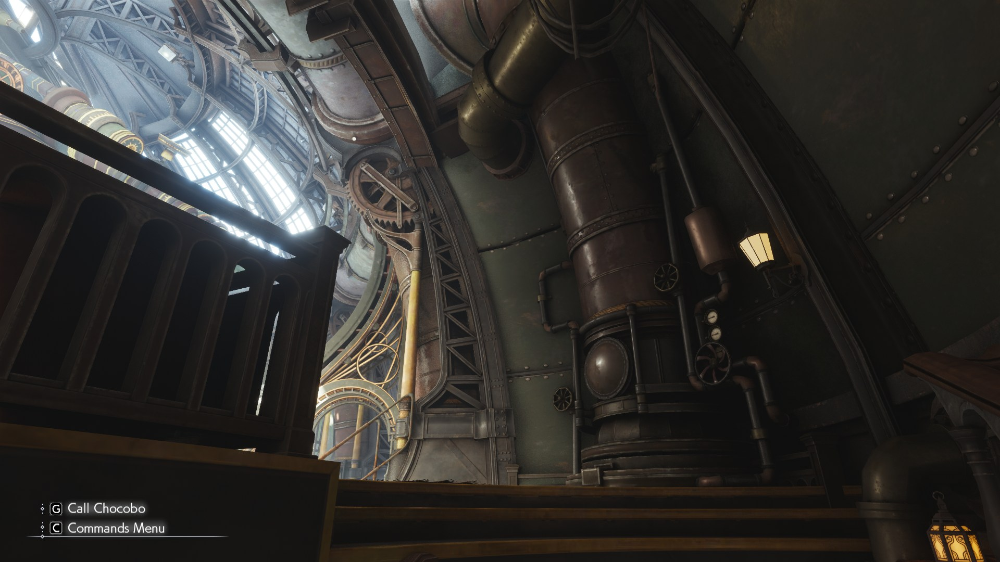
</p>

***Left:*** *Original Game*
***Right:*** *Improved Reflection Environment with Modified Sample GI*

Looks pretty good! Differences are somewhat small if you are not paying attention but that's ok, the terms overall are much more accurate and have plausibility to them!

## Screen Space Reflections *(SSR)*


The original game's SSR pass looks to be mostly fine, but when I took a closer look at some of the terms I noticed some whacky stuff happening. Just for demonstration I will shift to a different frame capture that reveals the SSR and it's quirks more clearly than it does in this current environment that we are working on.

<p float="left">
    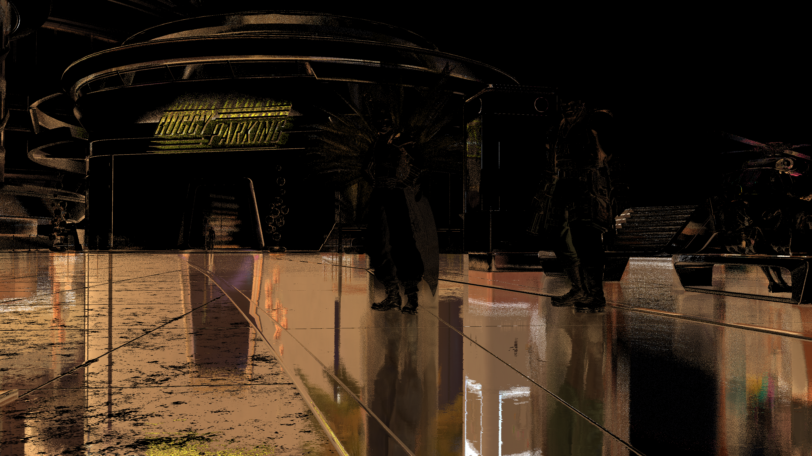
    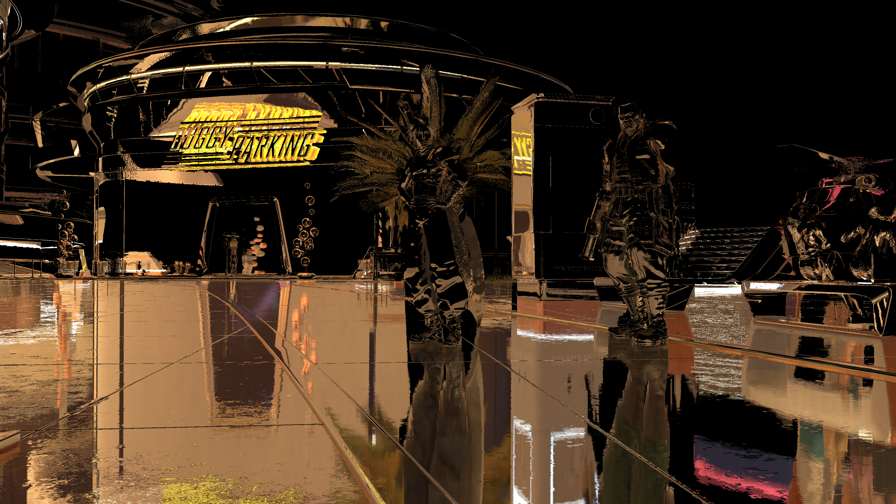
</p>

***Left:*** *Original SSR*
***Right:*** *SSR Maxed Out (for demonstration, to make differences more visible)*

This is a frame capture at the golden saucer, which is a great stress test for reflections as many materials in that environment are quite reflective and metallic. There is alot of flat surfaces to which allows us to more easily get a glimpse into what SSR is giving us. In this case also I have turned up the quality settings on the SSR to make things even more visible. 

The first thing I noticed off the bat was the same issue as before with the environment cubemap reflections, and even when sampling the radiance term from the baked global illumination. For some reason they are stretching reflection vectors with roughness. My only speculation for them doing this is a couple of reasons...

- Trying to extend coverage of SSR? I.e. when SSR data is just at the edge of being cut off you can stretch the reflection to squeeze more coverage out for cheap. However since stretched reflection vectors don't blend too well with the other unstretched reflection terms you might as well stretch all of them to retain consistency.
- Maybe they thought in their tests that stretching such vectors led them to result's that supposedly looked better with rougher materials?

Either way, to me it doesn't work well in practice because reflections become quite incoherent and inaccurate. Many of the reflective materials in the game also are not anisotropic specular so I don't see the reasoning behind doing this on the whole. Left me quite stumped. This also certainly led to some exagerated artifacts in some reflective surfaces in the game.

<p float="left">
    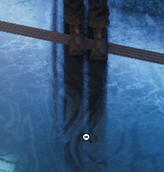
    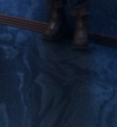
</p>

***Left:*** *Original SSR*
***Right:*** *Improved SSR*

So this was the first thing I wanted to resolve, so checking in our RenderDoc frame capture...

<p float="left">
    
    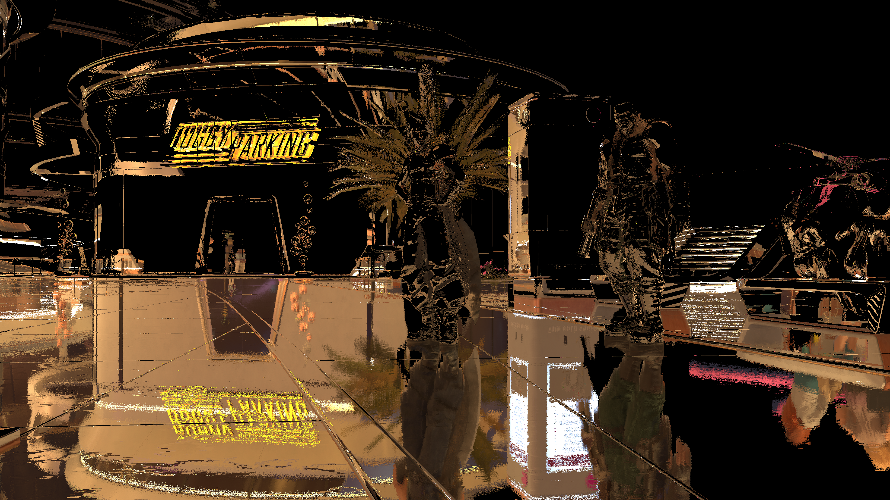
</p>

***Left:*** *Original Stretched SSR Reflection Vectors*
***Right:*** *Corrected SSR Reflection Vectors*

First thing of course was scrapping their original stretched-roughness-scaled reflection vector, and replacing it with a simpler but normal *(and accurate)* reflection vector. Notice now how the reflections of cloud and barret appear much more coherent, same with the reflection of the building behind them. This also helps fix some awkawrd reflections in some areas with characters or even objects partially showing up on reflective surfaces and having almost an awkard looking SSAO-like artifact. 

```HLSL
//original game implementation
float normalDotView = dot(surface.normal, viewDirection);
float3 sharpDirection = normalize(2.0f * (normalDotView * surface.normal - viewDirection) + abs(normalDotView) * surface.normal);
float roughnessBias = surface.roughness * surface.roughness * surface.roughness;
float3 reflectionDirection = normalize(lerp(sharpDirection, surface.normal, roughnessBias));
```

```HLSL
//corrected
float3 reflectionDirection = normalize(reflect(-viewDirection, surface.normal));
```

It's more correct now, but we are not done.

These are pin sharp reflections, initally they try to do a "distance" fade with the SSR where for rougher materials the coverage of the SSR term gets massively reduced. While for more reflective and smoother materials the SSR coverage increases. Not a bad idea honestly, and it's cheap in practice. However you can only really get away with doing this if you have very good quality fallback reflections, but unfortunately the game doesn't appear to have them. There are no parallax corrected cubemaps, and the ones that we do have are also very sparse and inadequately placed so the result's can be quite rough.

So in my case, the next best thing that we can do is that since we can't rely on fallbacks we just have to make the SSR look as good as possible. The reflection vectors are unstretched and look correct now, but we need a way to properly blur or "filter" these reflections so they look correct for rougher materials. We don't have access to mips unfortunately, so the next best thing we can do is turn this SSR into something very similar to [Stohastic Screen Space Reflections](https://www.ea.com/news/stochastic-screen-space-reflections). *(minus the resolve/cleanup steps afterward due to limitations)*

This comes from [Mirror's Edge Catalyst](https://www.ea.com/news/stochastic-screen-space-reflections), but we build on the work that is already achieved here but we just simply "disperse" the reflection ray depending on surface roughness. Since again we have TAA/DLSS later in the rendering pipeline we can accumulate these randomized "disperesd" rays overtime for cleaner results. The downside of course is that this will definetly introduce more noise in certain conditions, but the quality of the reflections improve significantly.

So to start, we use the following function now to calculate our new "reflection direction". The variant we are using here is a simplified isotropic GGX specular.

```HLSL
//helper method
float3x3 GetLocalFrame(float3 localZ)
{
    float x = localZ.x;
    float y = localZ.y;
    float z = localZ.z;
    float sz = sign(z);
    float a = rcp(sz + z);
    float ya = y * a;
    float b = x * ya;
    float c = x * sz;

    float3 localX = float3(c * x * a - 1, sz * b, c);
    float3 localY = float3(b, y * ya - sz, y);

    return float3x3(localX, localY, localZ);
}

//main method
half3 ImportanceSampleGGX_VNDF(
    half2 random,
    half3 vector_normalDirectionWorld,
    half3 vector_viewDirectionWorld,
    half roughness,
    out bool valid)
{
    half3x3 localToWorld = GetLocalFrame(vector_normalDirectionWorld);
    half3 localView = mul(vector_viewDirectionWorld, transpose(localToWorld));

    //isotropic GGX means one alpha stretches both tangent axes equally.
    half3 stretchedView = normalize(half3(roughness * localView.x, roughness * localView.y, localView.z));
    half3 tangent = stretchedView.z < 0.9999h ? normalize(cross(half3(0.0h, 0.0h, 1.0h), stretchedView)) : half3(1.0h, 0.0h, 0.0h);
    half3 bitangent = cross(stretchedView, tangent);

    half radius = sqrt(random.x);
    half phi = MATH_PI_TWO * random.y;
    half diskX = radius * cos(phi);
    half diskY = radius * sin(phi);
    half projectionBlend = 0.5h * (1.0h + stretchedView.z);
    diskY = (1.0h - projectionBlend) * sqrt(1.0h - diskX * diskX) + projectionBlend * diskY;

    half3 localHalfVector = diskX * tangent + diskY * bitangent + sqrt(max(0.0h, 1.0h - diskX * diskX - diskY * diskY)) * stretchedView;

    //unstretch the sampled visible normal back onto the GGX ellipsoid.
    localHalfVector = normalize(half3(roughness * localHalfVector.x, roughness * localHalfVector.y, max(0.0h, localHalfVector.z)));

    half viewDotHalf = saturate(dot(localView, localHalfVector));
    half3 localReflection = 2.0h * viewDotHalf * localHalfVector - localView;
    half3 outgoingDirection = mul(localReflection, localToWorld);

    valid = dot(vector_normalDirectionWorld, outgoingDirection) >= 0.001h;
    return outgoingDirection;
}
```

So now instead of calculating the usual reflection direction like we were before, this effectively replaces that.

```HLSL
//random vector for the GGX specular ray direction, should be animted every frame
//also best to use blue noise
float4 random = GetRandom(pixelPosition, rayIndex);

//if the randomized GGX specular ray is valid
bool validMicrofacetSample;

//calculate reflection direction
//this internally calls the ImportanceSampleGGX_VNDF
float3 traceDirection = ComputeReflectionTraceDirection(surface, viewDirection, random.xy, validMicrofacetSample);

//if our resulting reflection ray is not valid, then don't bother tracing reflections!
if (!validMicrofacetSample)
    return resolved;

//construct the reflection ray
ScreenRay ray = BuildScreenRay(surface, traceDirection, roughnessSquared, random.z);

//perform the same usual raymarch against the scene buffer to get the final reflection color
TraceResult trace = TraceHierarchicalZ(ray, random.w);
```

<p float="left">
    
    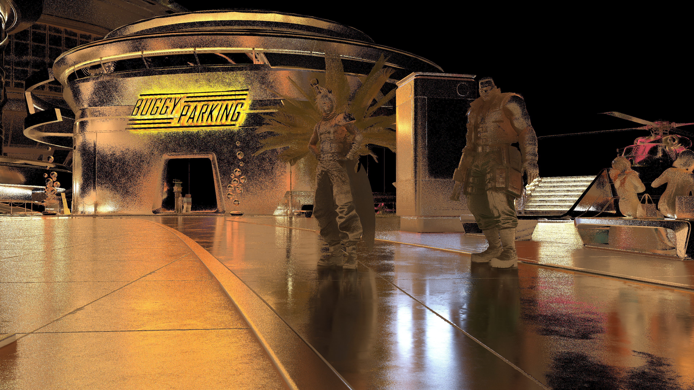
</p>

***Left:*** *Corrected SSR Reflection Vectors*
***Right:*** *Corrected SSR Reflection Vectors With Surface Roughness*

Looking fantastic now! Let's go back to the original frame capture and see how this looks in context.

#### SSR: Final In-Game Results...

<p float="left">
    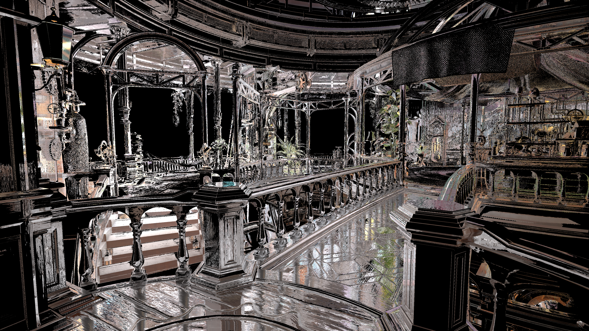
    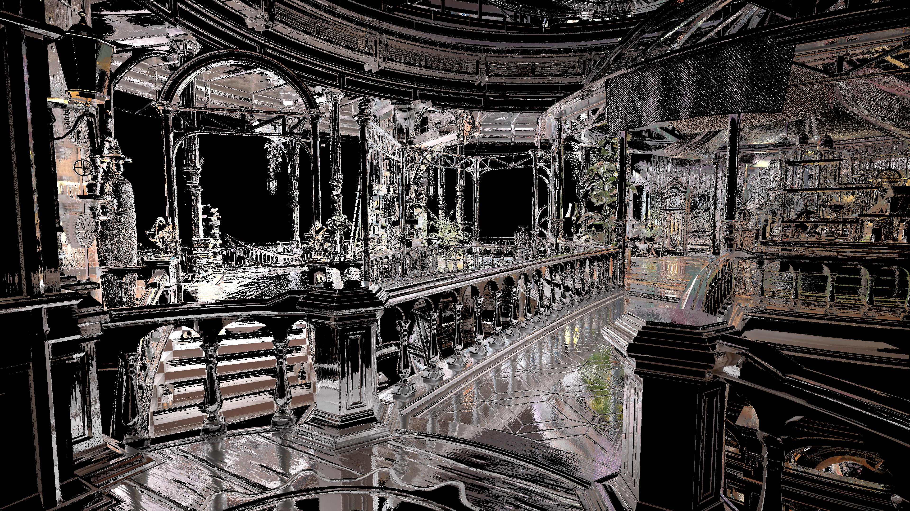
    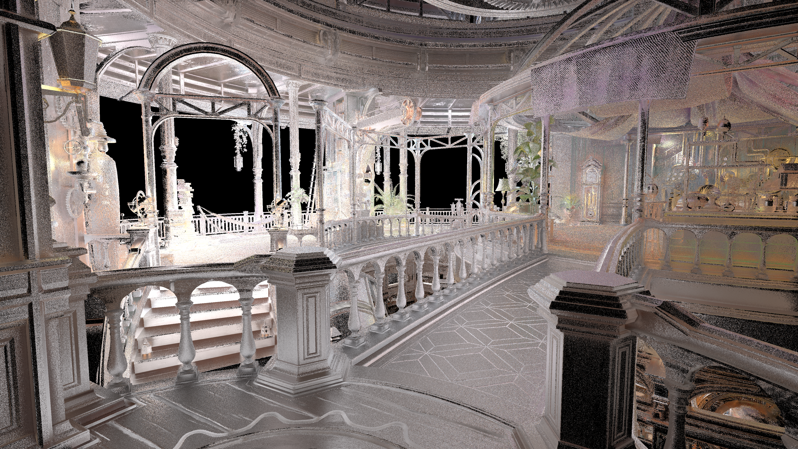
</p>

***Left:*** *Original SSR (Maxed Out)*
***Middle:*** *Corrected Reflection Vectors (Maxed Out)*
***Right:*** *Corrected Reflection Vectors + Surface Roughness Support (Maxed Out)*

Now of course though this is showing you ideally what the SSR looks like in motion when the TAA/DLSS resolves the image, in actuality for performance reasons we have to keep the SSR rays to 1 sample per pixel for performance reasons. Otherwise things can get very expensive very fast, at the expense of noise. So for a singular frame it winds up looking like this...

<p float="left">
    
    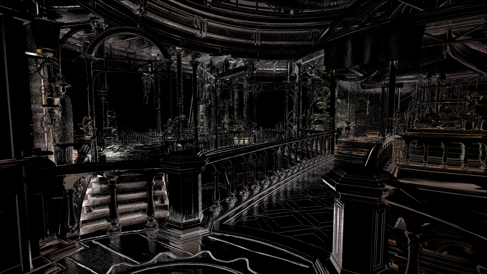
    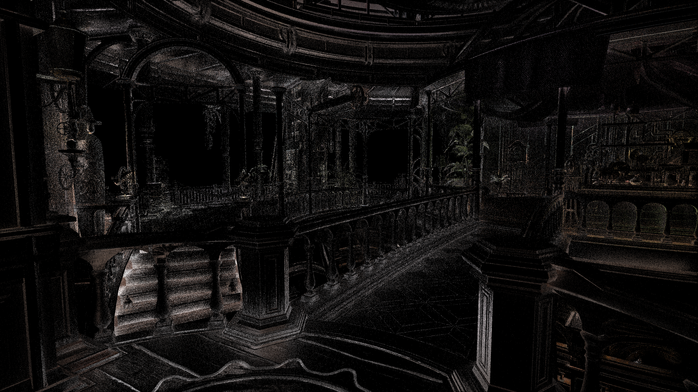
</p>

***Left:*** *Original SSR*
***Middle:*** *Corrected Reflection Vectors*
***Right:*** *Corrected Reflection Vectors + Surface Roughness Support*

Not bad! When we check how things look in-game with the improved SSR, it's a significant improvement!

### SSR Future Notes

Ideally in the future, I'd like to instead move from [Stohastic Screen Space Reflections](https://www.ea.com/news/stochastic-screen-space-reflections) to [Screen Space Cone Trace Reflections](https://www.tobias-franke.eu/publications/hermanns14ssct/hermanns14ssct_poster.pdf). This solves the noise problem single-handedly, and also allows us to retain smooth glossy reflections without needing to randomize ray samples and introduce noise in the final image. Making it much more stable in motion, and arguably much cheaper as well just by leveraging pre-filtered mip maps of the framebuffers.

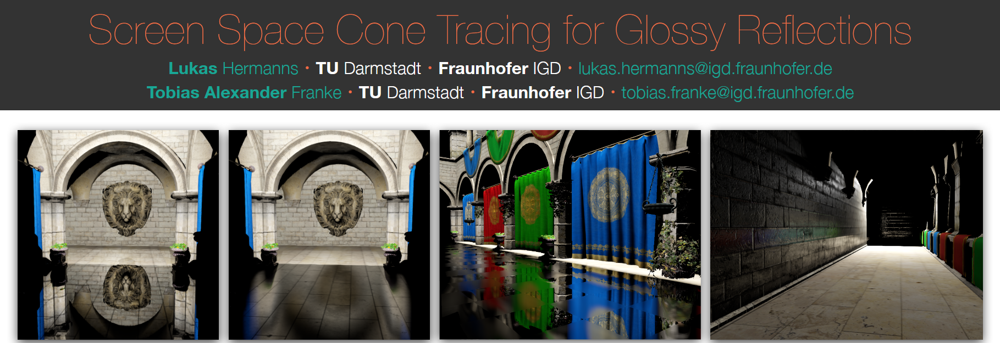

Granted this technique is not perfect, as we do lose some BRDF specular accuracy as it cannot perfectly replicate specular enlongation that you get with [Stohastic Screen Space Reflections](https://www.ea.com/news/stochastic-screen-space-reflections). So in some respects this could be viewed as a downgrade, but the results will still be perfectly good enough in motion and importantly remain stable and noiseless.

<p float="left">
    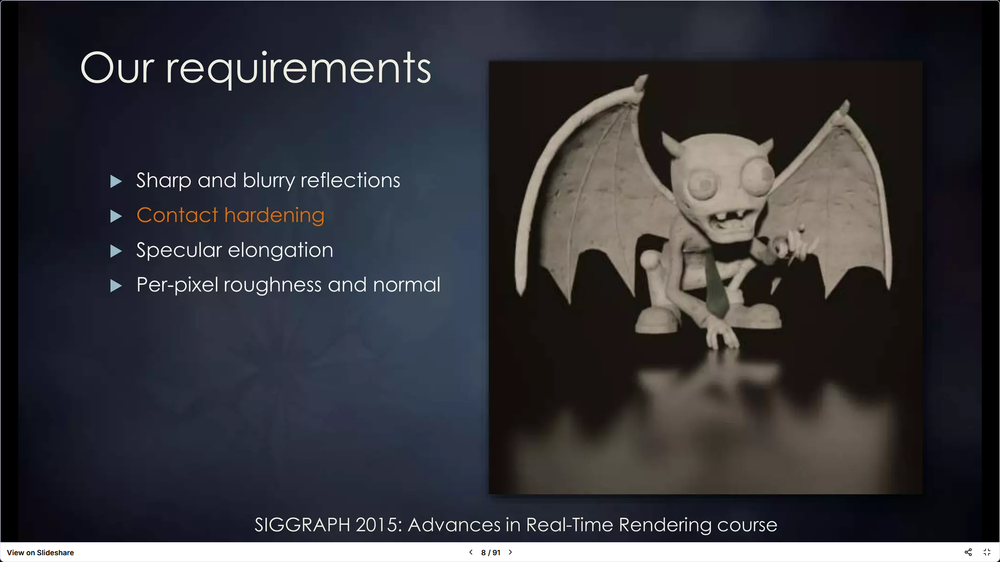
    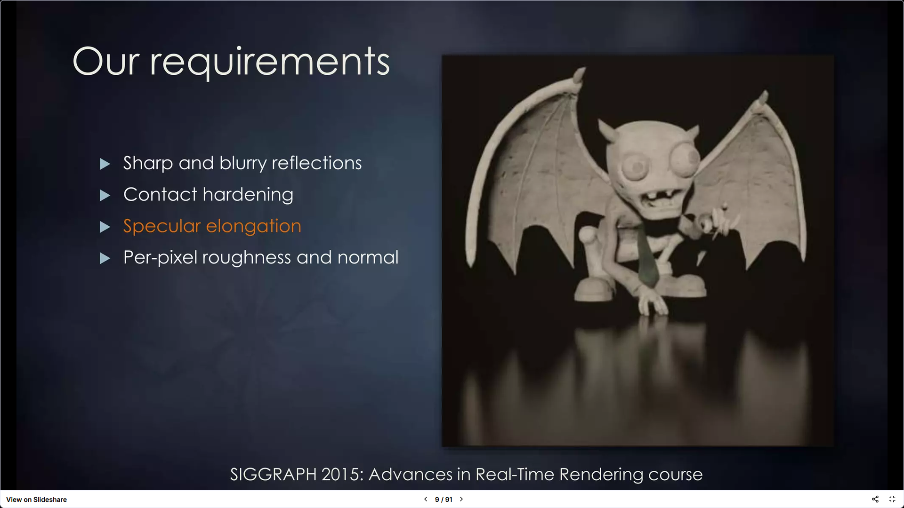
</p>

*[Stohastic Screen Space Reflections](https://www.ea.com/news/stochastic-screen-space-reflections)*

### SSR Timings

As usual, we have to check our timings. Can't just do things willy nilly and call it a day. We have to make sure we are still within a reasonable frame-time.

The original shader timing within RenderDoc at 3840x2160 on an RTX 3080 is the following...

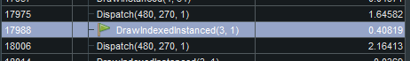

Roughly ```0.41ms```, which isn't too bad. Now let's check the reverse engineered shader...

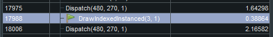

On average the results are a little faster at ```0.38ms``` to ```0.39ms```, I was able to optimize a few small terms here and there, but generally this is good. Now checking timings with the unstretched reflection vectors.

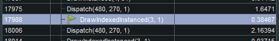

On average the results are about the same at ```0.38ms```, maybe a fit faster but I take this with a grain of salt due to RenderDoc replay timing noise. Now let's check the final thing we did which was turning it into effectively Stohastic Screen Space Reflections.

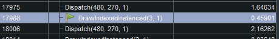

Timings are roughly ```0.45ms``` to ```0.46ms```. Not bad! As expected it is a little more expensive than the original SSR, this is to be expected as introducing noise/randomization reduces cache coherency performance, but that's still pretty good! Ideally in the future with [SSCT](https://www.tobias-franke.eu/publications/hermanns14ssct/hermanns14ssct_poster.pdf) we can improve upon this aspect for performance/quality sake.

### SSR In-Game

So checking the results in the actual game with the Shader Injector framework.

<p float="left">
    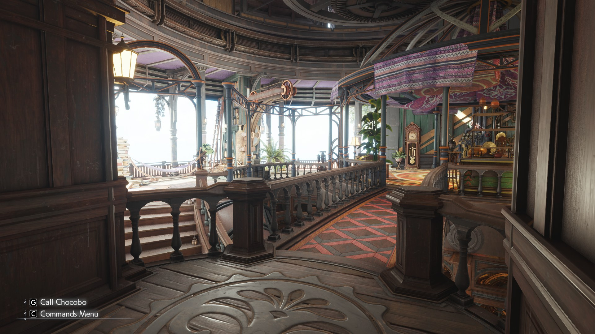
    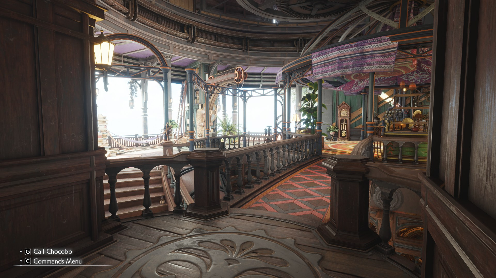
</p>

***Left:*** *Modified Shaders with Original SSR*
***Right:*** *Modified Shaders with Adjusted SSR*

You'll have to flip back and fourth between the images in a new tab to get a sense of the effects in this environment but when you do you can see that certain areas thanks to the roughness support, and the increased coverage of the SSR that it contributes not only to helping with reducing the specular/reflection leak, but also helps with re-introducing the environmental colors that we had a hard time trying to retain with the cubemap reflections, and the reworked radiance GI term.

To show off the result's more clearly we can move to the gold saucer which is made up of many reflective materials, and the benifits here become very prevelant.

<p float="left">
    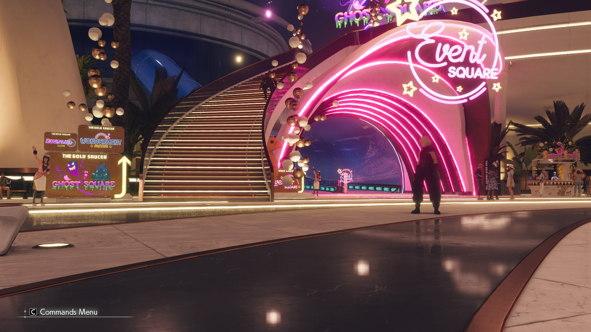
    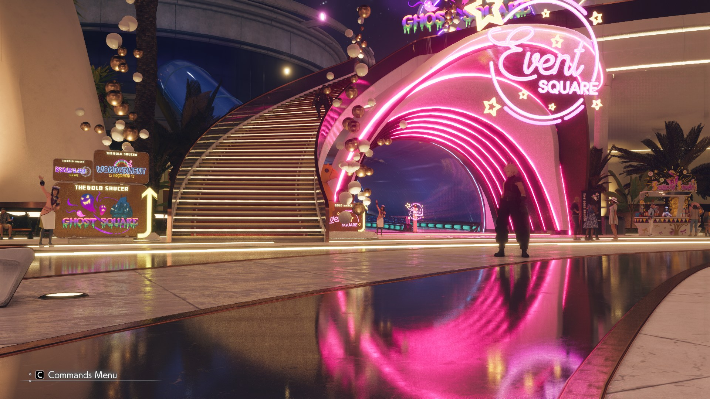
</p>

***Left:*** *Modified Shaders with Original SSR*
***Right:*** *Modified Shaders with Adjusted SSR*

## Bonus: Screen Space Ground Truth Visibility Bitmask Ambient Occlusion + Global Illumination

Covering this last because the current implementation with this I am not happy with in it's current state, even though for the most part I think it looks ok for most of the games areas, but in others it can rear it's ugly head. Importantly though performance is very heavy for this effect and it needs additional work *[(downscaling, filtering, upsampling)](https://frostbone25.github.io/p/adventures-global-illumination-downscaling/)*, but we can still cover it!

I will keep it brief but the SSAO that the game uses I think is servicable for the most part, but since of course I have full access now to do what I wish I elected to implement a technique that I saw recently that could massively improve occlusion, and also add in bounce light from both direct lighting sources and emissives. That technique is Screen-Space Ground-Truth Visibility Bitmask Ambient Occlusion. The implementation mostly stems from this [shadertoy](https://www.shadertoy.com/view/lfdBWn) demoing the results.

<p float="left">
    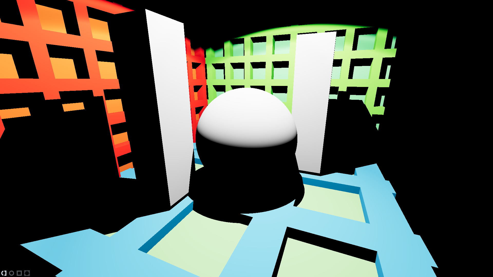
    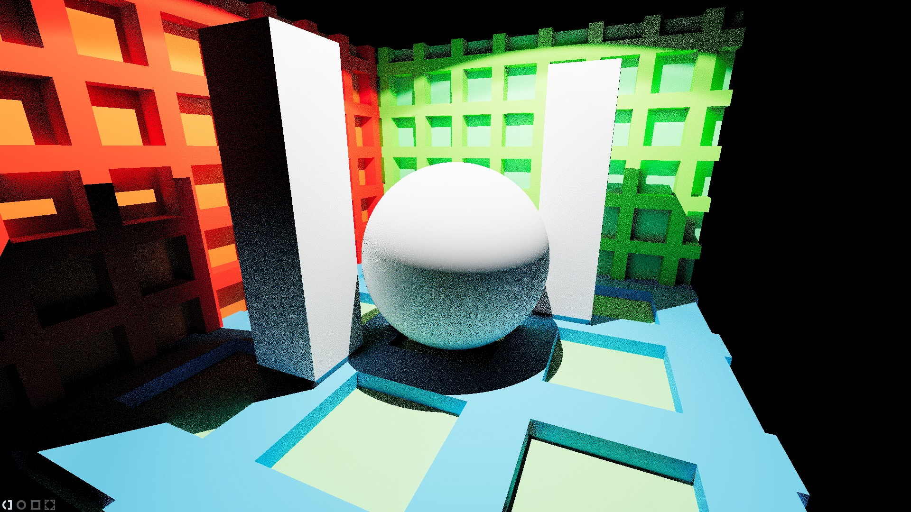
</p>

*[GT-VBGI Implementation by TinyTexel](https://www.shadertoy.com/view/lfdBWn)*
***Left:*** *ShaderToy: Direct Lighting Only*
***Right:*** *ShaderToy: Direct Lighting + GTVBGI*

It's the strongest SSAO/SSGI technique that I have seen as of late and wanted to implement it into the game. Now in an offical capacity I probably wouldn't implement this as I think for the most part the SSAO + Indirect Lighting solutions the game has is fine. I would think if they increased the frequency of the baked global illumination probes they had, as well as also introducing much more frequent reflection probes that also are parallax corrected that they can totally get away with what they were doing initally and it would look far better and for much cheaper. Final results would also be much more stable.

But! Given that this is a mod, I am mostly free to experiment and add in such effects to improve the overall presentation. I have my own qualms with SSGI of course but considering that we can only improve the indirect lighting by so much in our current context, this is the only card we can play.

<p float="left">
    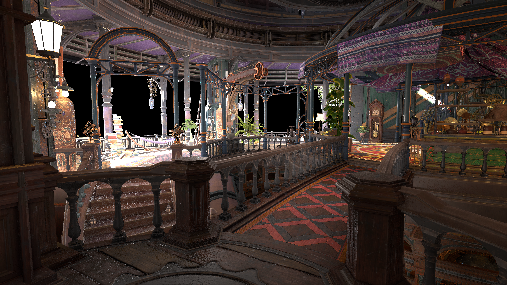
    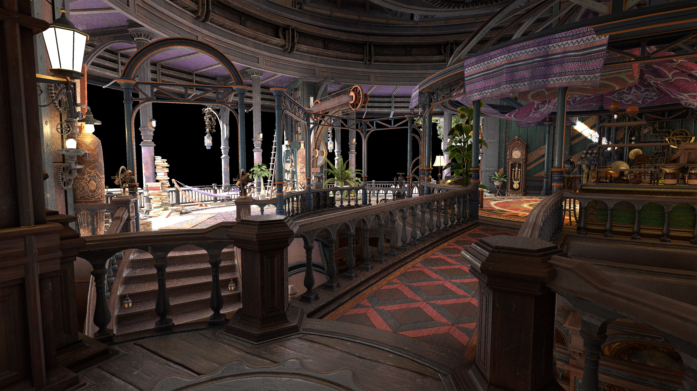
</p>

***Left:*** *Modified Shaders with no GTVBGI*
***Right:*** *Modified Shaders with GTVBGI*

Nice! You can see that the overall "directionality" of the scene is actually better than it was before! Areas that are cluttered with many objects or have quite a bit of size now do a better job of occluding ambient light. Overall this leads to an even more reduced specular light leak than before, and occlusion

 In addition in areas of direct light or emissives recieve a local bounce light which aids greatly to the overall indirect lighting.

<p float="left">
    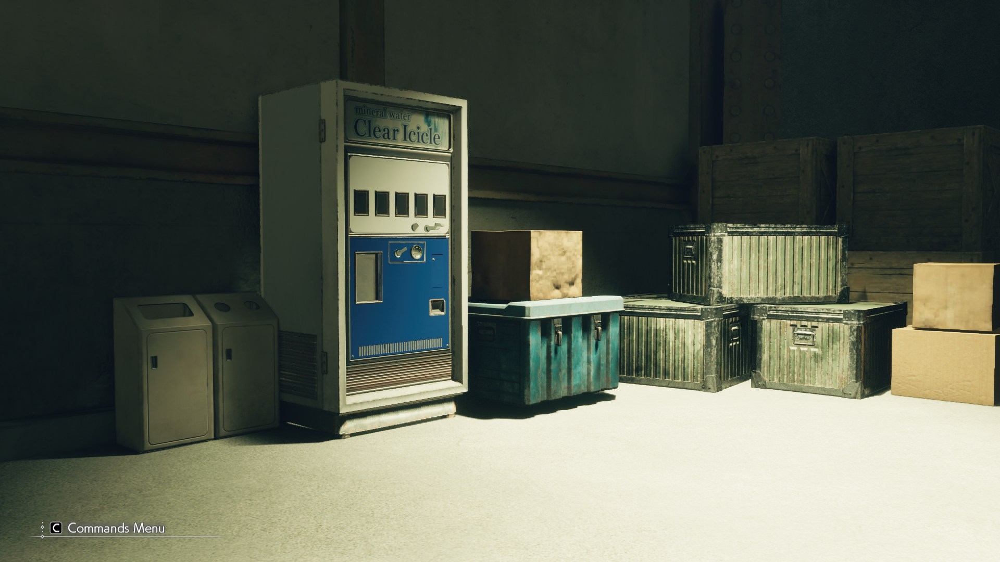
    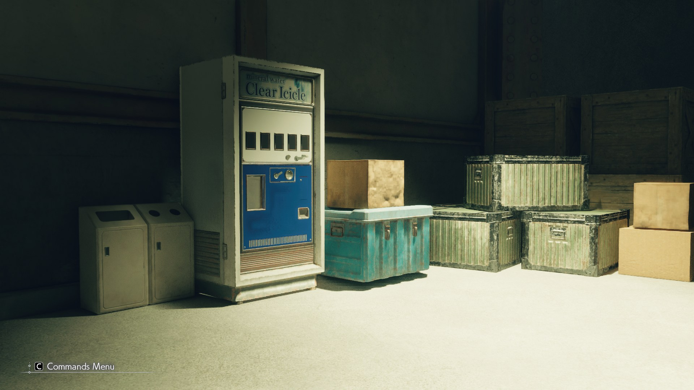
</p>

***Left:*** *In-Game: Modified Shaders with no GTVBGI*
***Right:*** *In-Game: Modified Shaders with GTVBGI*

Now of course the current downsides to this implementation is the sheer cost of it in it's current state. Normally these effects are done in a much lower resolution, however currently due to framework limitations *(I can't introduce new rendering passes just yet)* these effects run at full-screen resolution... which is a very bad idea!


Our final modified timings for our ReflectionEnvironment.hlsl shader sits roughly around ```1.97ms```. When we introduce the GT-VBAO *(just the ambient occlusion)* this cost grows by quite a bit.

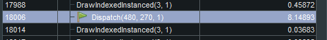

Yikes! ```8.14ms```, this is not what you want for any rendering draw as this cost is quite sigificant and will reduce performance by quite a bit. Remember that for the most part we want most of our draws to be as far below ```1ms``` as we can manage on the whole, less is always better. The original and even the modified shader did sit a double that cost but introducing this is certainly a big no-no and that is just with the GT-VBAO. If we enable the bounce light portion this impact gets even worse!

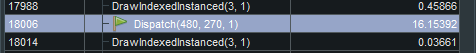

```16.15ms```! That is awful! Now granted this is timings on an RTX 3080 at native 3840x2160 with no dynamic resolution, but still, that is not at all what you want. This cost will scale with screen resolution.

In addition to add insult into injury there is no filtering that is done. The only filtering that exists is the game's TAA/DLSS which for the most part does a suprisingly good job at mitigating noise artifacts but still it is quite prevelant even in low light areas.

Ideally from here when I'm able to [introduce rendering passes](https://frostbone25.github.io/p/adventures-global-illumination-downscaling/), the first primary objective is taking these passes and doing a unique draw for SSGI/AO at a much lower screen resolution. From there we can do [filtering](https://frostbone25.github.io/p/adventures-global-illumination-downscaling/) at a reduced resolution as well to reduce the noise and improve the quality, and then conversely [introduce a couple of upsampling draws](https://frostbone25.github.io/p/adventures-global-illumination-downscaling/) to scale the SSGI/AO back up to screen resolution at good quality. [I've done this before](https://frostbone25.github.io/p/adventures-global-illumination-downscaling/) in the past with lighting buffers before and there are significant visual and performance gains when doing so, so this is currently the next big thing to do.

# Conclusion

All in all I'm pretty happy with what I've been able to achieve for the most part! Even suprised myself in certain areas what could be done.

I hope that eventually some of these changes can be implemented *(or atleast considered and implemented in some fashion)* into the games. I have provided replay timings of the shaders with the additions and for the most part I believe that many of them can make it to all platforms that the game is deployed on without any noticable performance penalties. *(I'd be happy to lend a hand if necessary)*

I would like to leave with some my own personal thoughts as I've been paying close attention to the discourse surrounding the mod. The response to it though has been overwhelmingly positive, which says alot and definetly is something I think should be considered for the future of the games. With that said there are a few that voice their concerns about the mod shifting the original "art-direction" of the scenes/areas in the game. While for some areas they are correct, what is missing is that this visual upgrade is ultimately "incomplete" without collaboration with the original art-team. This is the final layer that would be achieved if changes were done in an actual development context.

Currently I cannot dial everything in 100% because on the whole the shader changes apply across the entire game. What takes these improvements to the next level, is doing it in collaboration with the original art-team behind the game. This kind of relationship mirrors that in the industry where in my position with this mod I would be part of the "tech-art" team, working in tandem with the character/environment artists to achieve the most optimal results with all of the accuracy improvements to the rendering. Dialing in settings for specific game assets/areas.

A small demonstration of this, one of my friends and testers with the Shader Injector mod [(Ninjagrime)](https://x.com/ninjagrime1) is the author of quite a few cosmetic mods for the games as a whole. However the way they authored their ambient occlusion maps originally for their [Advent Children Cloud Costume](https://www.nexusmods.com/finalfantasy7rebirth/mods/562) here did not play nice due to the [Micro Shadows technique](https://frostbone25.github.io/p/ff7-rebirth-contact-shadows/#micro-shadows) over occluding the color and specular reflections. While on the whole this worked great for the majority of the environmental art adding in tons of rich detail, in certain cases like this it can reveal sore spots for imperfectly adjusted/authored ambient occlusion maps. With a bit of work we managed to track down the issue, and properly rebuild the intended ambient occlusion maps that matched the expected standard of the game materials. Along with some color adjustments we were able to achieve the final result in collaboration.

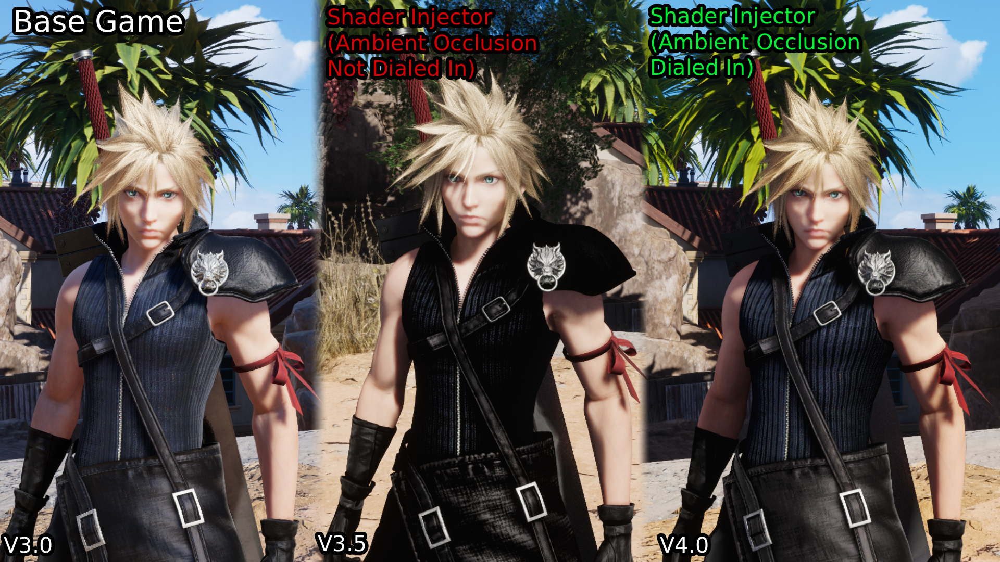

The final output is a much stronger final result than the original base game with that original cosmetic mod. In combination with the underlying technical improvements to the rendering, the art has been re-adjusted to retain the original style and the final results are oustanding! This is only a small scale adjustment granted on just character materials, but these kinds of adjustments are ultimately what needs to be done in collaboration with the rest of the art of the game.

The final parting note also is for those that conflate technical shading improvements/fixes with the shifting of the supposed "intentional" artistic decisions. I would invite them to instead take a closer look at the first game in the series FF7 Remake which set a very high bar both artistically/technically. Much of the visual flaws that unfortunately appeared here in Rebirth are due to technical limitations that were not present in the first game. The most notable one of course being specular light leak that most of this article spent resolving. This is common for many titles, and the line regarding what constitutes an intentional artistic decision, versus one that was made imperfectly out of technical constraints is blurry when looking at the final product. Though considering that the first game Final Fantasy 7 Remake recieved a graphics update with Intergrade, I do not think these critiques ultimately hold any weight as that proves that when the team is given the opportunity to improve the presentation, they will jump at it.

To add on to that, in both games feature pre-rendered cinematic cutscenes that have a drastically superior bar of quality that ultimately to many of us represent the designers/developers true vision of the games if they were not bound by production/hardware constraints. Many of these improvements to the rendering on the game bring the visuals closer to those goal posts.

# References / Sources
List of references that helped with my implementations and understanding.

- [An Efficient Representation for Irradiance Environment Maps](https://cseweb.ucsd.edu/~ravir/papers/envmap/envmap.pdf)

- [Spherical Harmonic Exponentials for Efficient Glossy Reflections](https://highperformancegraphics.org/untracked/2025/presentations/Pa5_1_hpg_2025_slides.pdf)

- [In-depth: Extracting dominant light from Spherical Harmonics](https://www.gamedeveloper.com/programming/in-depth-extracting-dominant-light-from-spherical-harmonics)

- [Bent Normal Specular Occlusion (page 11)](https://www.activision.com/cdn/research/Practical_Real_Time_Strategies_for_Accurate_Indirect_Occlusion_NEW%20VERSION_COLOR.pdf)

- [Spherical Harmonics (ZH3)](https://torust.me/ZH3.pdf)

- [Precomputed Global Illumination in Frostbite](https://media.contentapi.ea.com/content/dam/eacom/frostbite/files/gdc2018-precomputedgiobalilluminationinfrostbite.pdf)

- [Stohastic Screen Space Reflections](https://www.ea.com/news/stochastic-screen-space-reflections)

- [Screen Space Cone Trace Reflections](https://www.tobias-franke.eu/publications/hermanns14ssct/hermanns14ssct_poster.pdf)

- [Jason Mitchell - Shading in Valves Source Engine](https://advances.realtimerendering.com/s2006/Mitchell-ShadingInValvesSourceEngine.pdf)

- [ZH3: QUADRATIC ZONAL HARMONICS](https://www.activision.com/cdn/research/ZH3-I3D-Presentation-Slides.pdf)

- [MJP: SG Series Part 1: A Brief (and Incomplete) History of Baked Lighting Representations](https://therealmjp.github.io/posts/sg-series-part-1-a-brief-and-incomplete-history-of-baked-lighting-representations/)

- [MJP: SG Series Part 2: Spherical Gaussians 101](https://therealmjp.github.io/posts/sg-series-part-2-spherical-gaussians-101/)

- [MJP: SG Series Part 3: Diffuse Lighting From an SG Light Source](https://therealmjp.github.io/posts/sg-series-part-3-diffuse-lighting-from-an-sg-light-source/)

- [MJP: SG Series Part 4: Specular Lighting From an SG Light Source](https://therealmjp.github.io/posts/sg-series-part-4-specular-lighting-from-an-sg-light-source/)

- [MJP: SG Series Part 5: Approximating Radiance and Irradiance With SG's](https://therealmjp.github.io/posts/sg-series-part-5-approximating-radiance-and-irradiance-with-sgs/)

- [MJP: SG Series Part 6: Step Into The Baking Lab](https://therealmjp.github.io/posts/sg-series-part-6-step-into-the-baking-lab/)


*By: David Matos*