*By: David Matos*

Sharing my personal notes and experimentation with modding contact shadows into one of my most favorite games in recent memory, Final Fantasy 7 Rebirth.

*NOTE: This will be updated as time goes on with any new or incorrect information.*

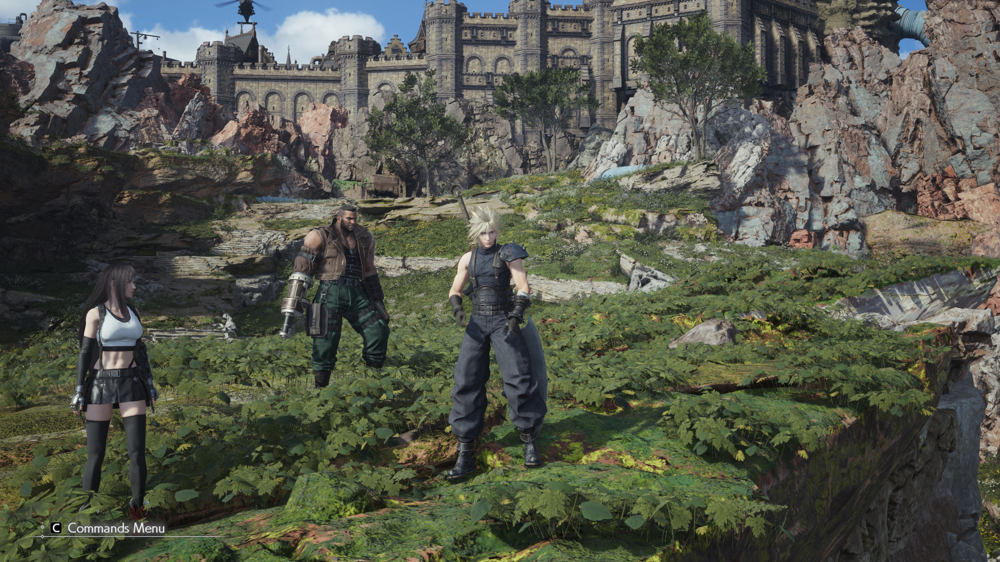
[*Final Fantasy 7 Rebirth, Square Enix*](https://www.square-enix.com/ffvii/en-us/games/rebirth/)

#### Table of Contents
- [Preface](#preface)
    - [Context](#context)
    - [Lighting Solutions - Ray Tracing?](#lighting-solutions---ray-tracing)
    - [Lighting Solutions - Increase Shadow Map Resolution?](#lighting-solutions---increase-shadow-map-resolution)
    - [Lighting Solutions - Increase Shadow Map Cascades?](#lighting-solutions---increase-shadow-map-cascades)
    - [Lighting Solutions - Shadow Map Caching?](#lighting-solutions---shadow-map-caching)
    - [Lighting Solutions - Contact Shadows](#lighting-solutions---contact-shadows)
- [Brief RenderDoc Breakdown](#brief-renderdoc-breakdown)
- [Implementation](#implementation)
- [Micro Shadows](#micro-shadows)
- [Contact Shadows](#contact-shadows)
    - [Limitations](#limitations)
    - [Getting Good Results](#getting-good-results)
    - [Naive Contact Shadows (World Space)](#naive-contact-shadows-world-space)
    - [Optimization: Reduce Sample Counts](#optimization-reduce-sample-counts)
    - [Quality Boost: Introduce Jitter (Blue Noise)](#quality-boost-introduce-jitter-blue-noise)
    - [Optimization: Switching to Interleaved Gradient Noise (IGN)](#optimization-switching-to-interleaved-gradient-noise-ign)
    - [Optimization: Clip Space](#optimization-clip-space)
    - [Optimization: Early Sky Out](#optimization-early-sky-out)
    - [Optimization: Further Sample Reduction](#optimization-further-sample-reduction)
    - [Bonus: Dual Depth Sampling](#bonus-dual-depth-sampling)
    - [Bonus: Depth Point Sampling](#bonus-depth-point-sampling)
    - [Bonus: Checkerboard Rendering Optimization](#bonus-checkerboard-rendering-optimization)
- [Final Results](#final-results)
- [References / Sources](#references--sources)

## Preface

#### Context

After waiting a little over a year to play a sequel to one of my favorite franchises on PC in 2024, I finally got to play the game. I was taken a back by the sheer amount of content, and variety that was in the game. The story was fantastic, the gameplay was stellar, full of depth, and it was a genuinely awesome experience that was well worth the wait...

But... the back of my mind, there is a little graphics gremlin that was nagging me during some segments of the game. I couldn't hold him at bay so unfortunately I let him speak... and his words led to some realizations about the game's rendering.

Rebirth unfortunately has some short-comings in regards to it's lighting quality during gameplay. Now during cutscenes or other more curated segments the game looks great, asset quality and art direction is fantastic. However in some areas during gameplay, it's very clear that there are cutbacks that were done to the lighting for performance sake. Especially when you consider how the previous game in the series, Final Fantasy 7 Remake, looked in similar areas.

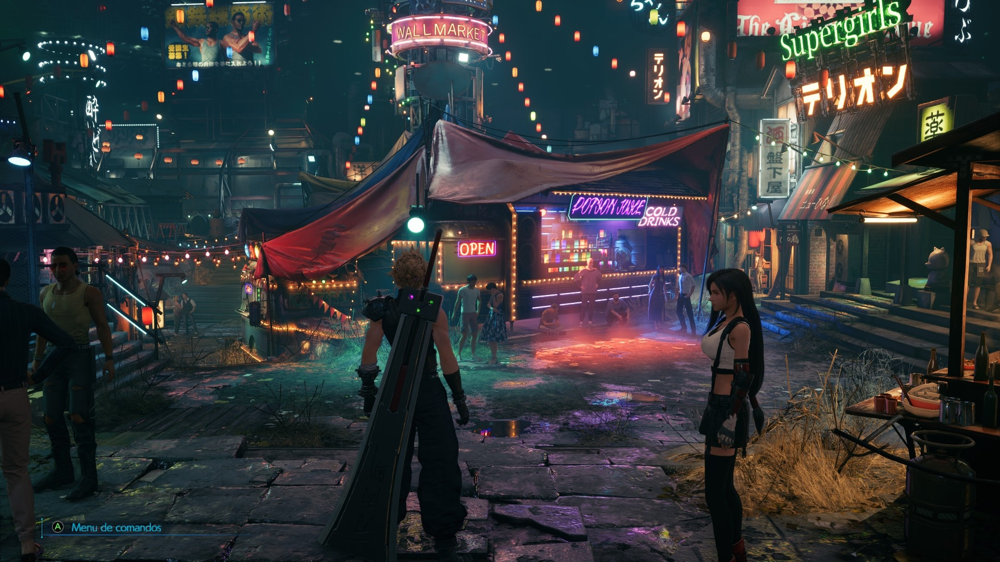
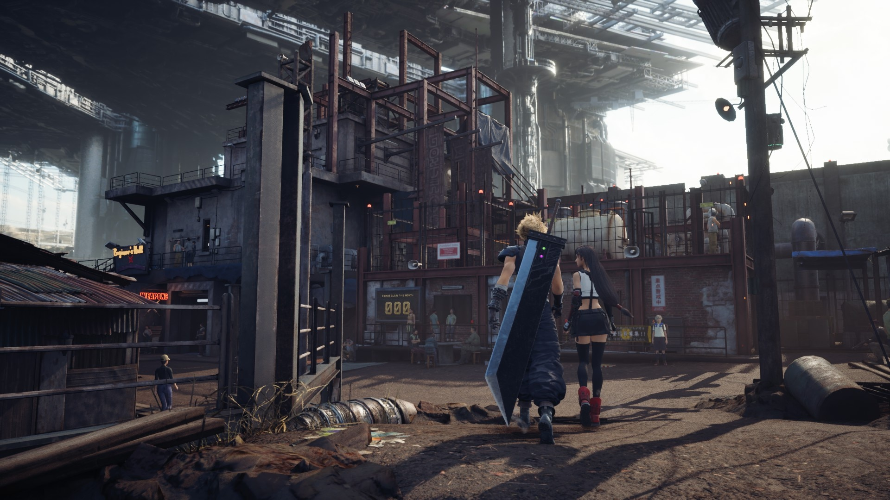
[*Final Fantasy 7 Remake Intergrade, Square Enix*](https://www.square-enix.com/ffvii/en-us/games/remake/)

And comparing somewhat similar scenes in Rebirth...

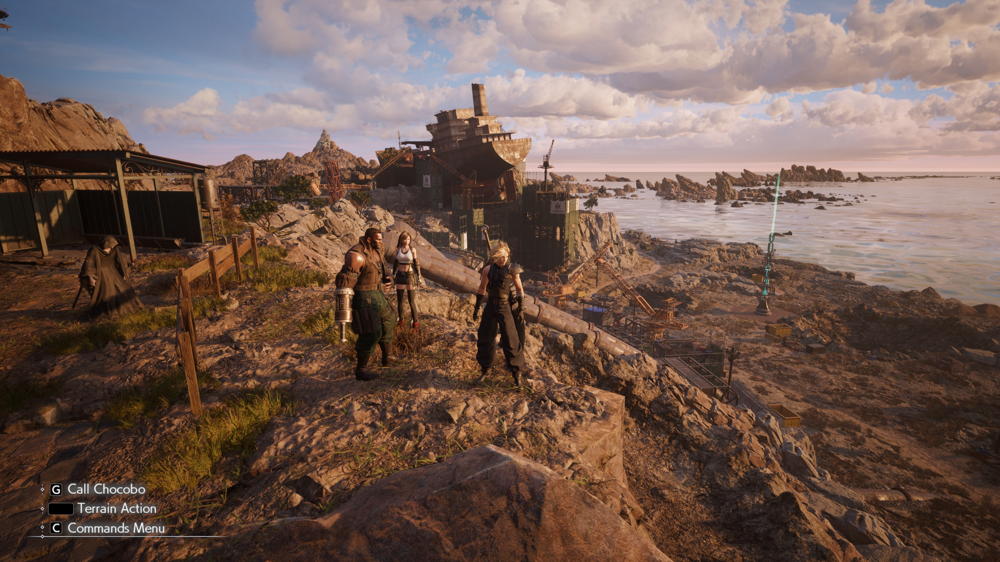

[*Final Fantasy 7 Rebirth, Square Enix*](https://www.square-enix.com/ffvii/en-us/games/rebirth/)

When you compare similar areas to Rebirth, the generalized cutbacks made become quite apparent. From Remake to Rebirth they switched from pre-computed lightmaps to pre-computed light probes. 

From a practicality standpoint, this is the right call considering the size of Rebirth's world, and even I would have done the same *(although one could argue that games like Horizon Zero Dawn managed it)*.

With that said though, from a quality standpoint the quality of global illumination especially in ambient areas will suffer the most. Going from pre-computed lightmaps to pre-computed light probes means you lose out on alot of spatial resolution, so things because very blurry and blobby.

Now given the constraints, you really can't do a whole lot without resorting to some more complex rasterization effects or elaborate GI setups to get half decent results. Doing all of that would definetly eat into your frametime budget more than you would probably want for a game that is centered around fast action. So... honestly for the most part I can forgive the quality of the global illumination that we ended up with.

*Side Note: Just for the record I know it's not impossible to make such a open world look great in ambient areas. Games like [Far Cry 3](https://www.ubisoft.com/en-us/game/far-cry/far-cry-3), [Assassin's Creed Unity](https://www.ubisoft.com/en-us/game/assassins-creed/unity), and even [The Divsion](https://www.ubisoft.com/en-us/game/the-division) managed to get very impressive results in their time with tigher constraints than today's hardware... but those are different teams, with different technology bases, different production pipelines, different timelines, and constraints.*

So let's be reasonable here... let's assume that we are under very tight constraints that were imposed on the FF7R team *(prioritizing high framerate and fast action with good clarity)*... so within these constraints, what can we do to improve the quality of our game lighting?

#### Lighting Solutions - Ray Tracing?

I want to knock this one off first because it's usually the one that is one everyones minds...  Ray-Tracing is amazing and when done well can solve so many problems in one go, but even with today's hardware it is still incredibly expensive and creates it's own large set of problems that need solving.

First off you'd need to have an acceleration structure that essentially stores all of the triangles within your scene, but Rebirth is a huge open world so that means billions of triangles that need to be stored and held in memory. Rebuilding that every frame is out of the queston unless you have some crazy cascade like scheme. Precomputation would be a valid option but then you'd have to hold all of that data in memory, so you'd have deal with it in smaller chunks. All of that even with precomputation would most certainly introduce a lot of overhead to just managing all of that data, and also dealing with dynamic meshes into the mix.

Ontop of that, once you have the acceleration structure you still have the issue of needing to calculate your lighting. For most path-traced games *(Cyberpunk and RE9 come to mind)* you can only manage a small amount of rays for every pixel for a decent playable frame rate, sometimes maybe even a ray for every 1/2th pixel or even 1/4th! With a small amount of rays for every pixel that also means lots of noise! That noise needs to be piped through many layers of filtering *(Temporal Filtering, ReSTIR, ATrous Wavelet, etc.)* just to get something half decent at the end that often is not sharp enough to resolve good detail in motion, and even worse that is usually just for only one shading component "diffuse", for specular shading it needs it's own pipeline and set of filters/solutions which just piles on more costs and problems.

I could go on... but I think you get the picture. That isn't to say I'm not a fan of Ray-Tracing, I am but we need to be realistic and reasonable here given the constraints, and unfortunately Ray-Tracing is a no go because there are just too many problems to solve with it... So what else can we do?

#### Lighting Solutions - Increase Shadow Map Resolution?

The first and obvious thing would be to bump the resolution of the Directional Light Shadowmap. In the case of FF7 Rebirth, and most UE engine games a console or .ini tweaks can allow you to increase the resolution.

It's simple, effective... but costly! Increasing the resolution means more memory, and more pixel invocations... but heres another caveat! This only works up to a certain point, depending on the shadow distance that the directional light covers we may only have so many pixels in our shadowmap to cover an area with enough detail. Geuss what also, Rebirth is an open world, so we need to be able to see shadows really far away!

If we continue to increase the shadowmap resolution we will hit VRAM/Memory limits as we can only hold so much data, and depending on the distance coverage of the shadowmap we can only resolve so much detail.

Well that sucks... what else can we do?

#### Lighting Solutions - Increase Shadow Map Cascades?

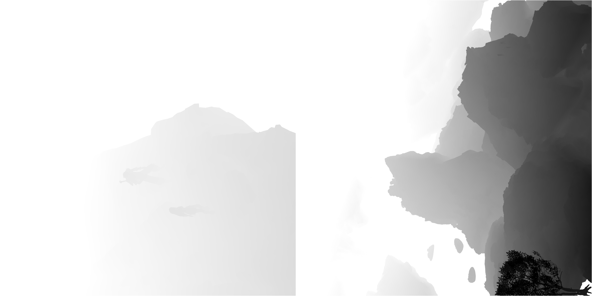

Building on the increased shadow map resolution idea, if we can't cover the entire world with one large single shadow map texture... why not cover it with multiple textures instead?

This is effectively what [Cascaded Shadow Maps (CSM)](https://dev.epicgames.com/documentation/unreal-engine/use-cascaded-shadows?application_version=4.27) are, and fortunately Rebirth is already using this *(along with most of the industry, it's very common)*. It works like this...

- Cascade 0 (1024x1024): Render the scene 100 units across
- Cascade 1 (1024x1024): Render the scene 250 units across
- Cascade 2 (1024x1024): Render the scene 500 units across
- Cascade 3 (1024x1024): Render the scene 1000 units across

The more cascades we do, the better coverage we get of our scene, and because each cascade is at a different scale we can allocate far more pixels for certain areas closer to the player camera. With some manual fine tuning of the distances for each cascade we can get some exceptionally good looking results with this. Awesome!

Except... there are problems with this technique as well.

For each Shadowmap Cascade, you need to re-render the scene *(because it's just another shadowmap)*. That means for 4 Cascades *(which is usually the standard at most)* you need to re-render the whole scene 4 different times! That is alot of draw calls that will eventually tank your performance. Even worse, the greater the scene complexity gets *(i.e. the bigger the world)* the heavier this gets!

Because of this, Rebirth sticks to 2 Shadow cascades. 1 Cascade realtively close to the camera, and the other a reasonable distance away. The rest just remains unshadowed.

#### Lighting Solutions - Shadow Map Caching?

Shadowmap Caching? 

*(NOTE: I believe the game is already using this actually, though I haven't been able to verify just yet but let's assume they aren't)*.

Usually Shadowmaps are rendered every frame, but turns out we actually don't have to do that!

Shadowmap Caching is simple, for certain lights or maybe even cascades we can actually update them at a slower rate. This gives us performance gains as we don't have to re-render every frame. We can even take this idea further and "pre-compute" a shadowmap that we can just simply pull whenever we want and not have to redraw the scene. Awesome!

Except... just like shadowmaps you still have to deal with the problem of memory. Holding too many shadowmap textures in VRAM/memory can lead to problems, and again with the scale of Rebirth's world there wouldn't be enough to reasonably hold all of the needed data for the quality level we'd want to hit.

In addition also rendering shadows at slower rates can introduce new problems. Objects rendered in a delayed shadowmap can create "false" occlusion issues if they are moving, and visual problems where shadows will jaggedly update.

Well darn... things are looking grim... is there anything else we can do?

#### Lighting Solutions - Contact Shadows

Now we get into the whole reason why this article exists, but turns out there is a technique here thats been around for a long time and has been used by many games in the industry at this point. [Screen-Space Contact Shadows!](https://panoskarabelas.com/posts/screen_space_shadows/)

Instead of utilizing shadow maps, we can calculate shadows somewhat accurately just by using the camera depth buffer and a given light direction. If games can calculate screen-space ambient occlusion with half decent results along with other similar techniques, then we should be able to calculate shadows with screen-space information as well!

The biggest win of this technique is that there is no need for re-drawing the scene for a Shadowmap, and dealing with those kinds of issues. All we need is a depth buffer and some floats that tell us where the light is, the direction, and trace shadows in screen space for every light draw. Requires minimal setup, costs roughly as much as SSAO, and scales far better than most of the other rasterization techniques.

Now, just like the lighting solutions before, there are issues with this technique as well. But considering the context that we are in, this effect is actually perfectly suited for this kind of situation! This is where things get intresting, and the eventual lead-up as to why this article and mod exists...

Rebirth is built on UE4, UE4 has quite a feature set when it comes to graphical features. Among them are [contact shadows that are built-in to the engine by default!](https://dev.epicgames.com/documentation/unreal-engine/contact-shadows-in-unreal-engine?lang=en-US) But heres the real head-scratcher... Rebirth does not use them at all? Unfortunately with modding using FFVII Hook and many commands it appears that many of those graphical features including contact shadows have been stripped out. Why?

This single problem has led me down a spiral *(hence this mod and article :D)* and on a journey to be able to see and play the game with this effect integrated. So... let's get into it!

## Brief RenderDoc Breakdown

Here is a breakdown of how a frame is rendered in Rebirth using [RenderDoc](https://renderdoc.org/) for this whole process. Unfortunately I am not [Muhammad](https://mamoniem.com/author/muhammad/) or [Adrian Courreges](https://www.adriancourreges.com/blog/2020/12/29/graphics-studies-compilation/) so this will be a very brief breakdown of Rebirth's rendering. *(And that would veer the focus of this article off too far)*. This should be just enough to give you some idea of what's going on under the hood.

Both FF7 Remake and FF7 Rebirth are both built on a modified UE4 technology base, UE4 uses a [Deferred Renderer Pipeline](https://en.wikipedia.org/wiki/Deferred_shading). *(In english this means that any shading is done later in rendering process)*. We draw the scene multiple times into multiple different graphics buffers *(GBuffers)* that can then be used later to do our actual shading. Hence the name deferred, the shading is deferred to a later point in time.

In the case of rebirth, the renderer draws to **7 different GBuffers + Depth**...


*RT0 | R16G16B16A16_FLOAT: Full black except for alpha channel, I'm not sure what this is used for yet...*


*RT1 | R10G10B10A2_UNORM: WorldNormal (RGB), SelectiveOutputMask (A)*

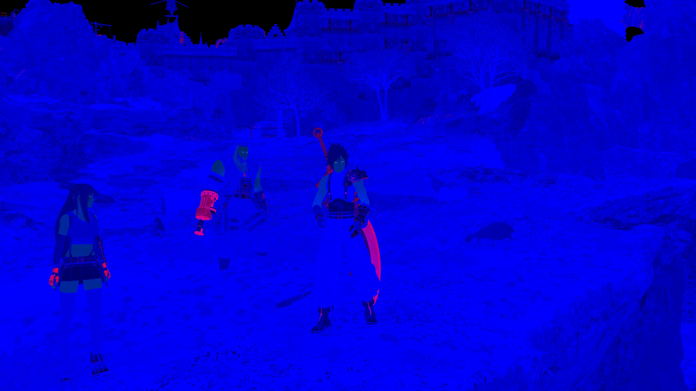
*RT2 | B8G8R8A8_TYPELESS: Metallic (R) Specular (G) Roughness (B) ShadingModelID (A)*

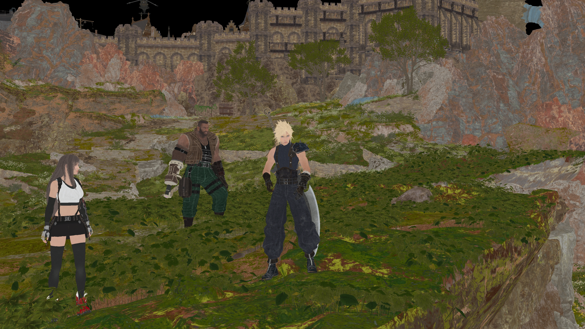
*RT3 | B8G8R8A8_TYPELESS: BaseColor (RGB) GBufferAO (A)*

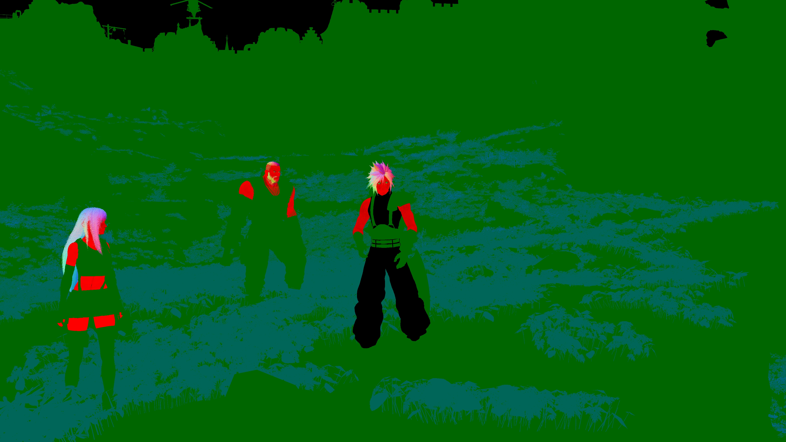
*RT4 | B8G8R8A8_TYPELESS: Custom Data, This is quite multi-purpose for different parts of the image depending on the ShadingModelID.*

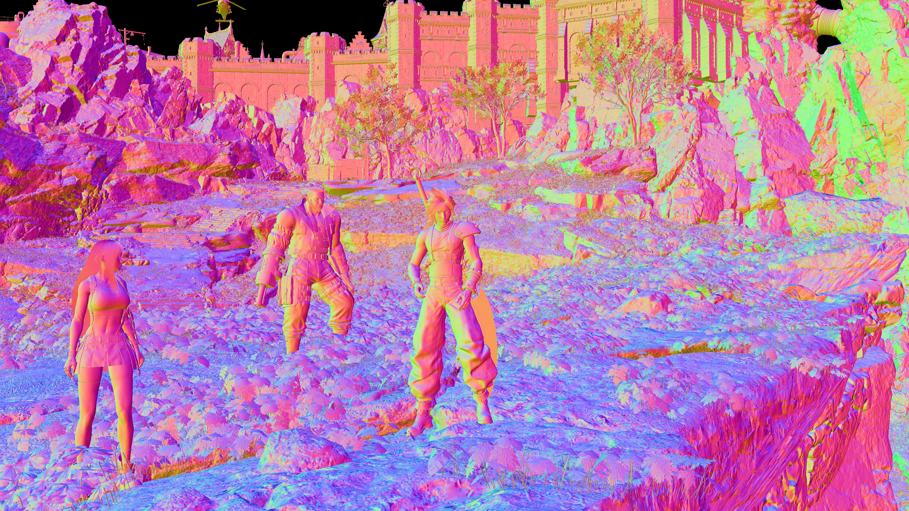
*RT5 | B8G8R8A8_TYPELESS: WorldNormals repeated again, not sure what the purpose of this is.*

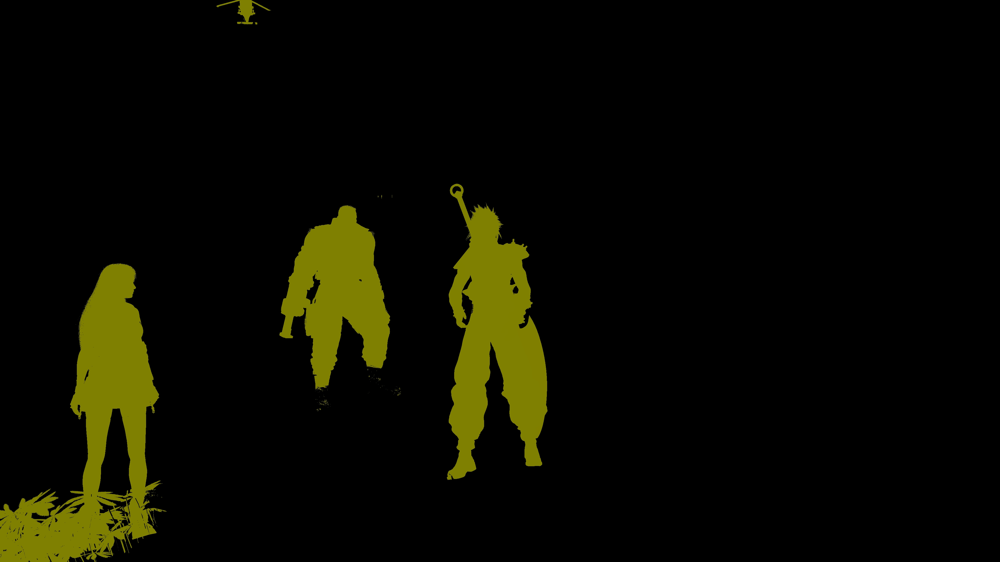
*RT6 | R16G16_UNorm: Velocity Buffer*

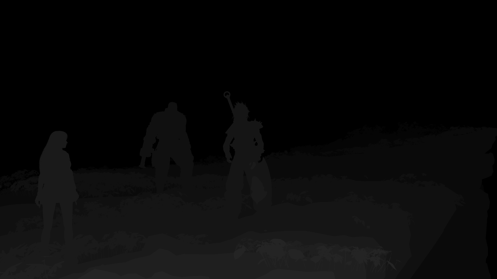
*Depth | D32S8_TYPELESS: Scene Depth*

Just to also show you the rendering timeline...

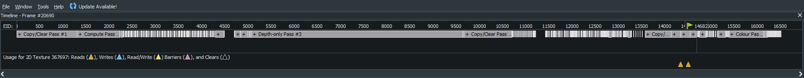
*[RenderDoc](https://renderdoc.org/) Timeline*

This occurs almost near the end of the pipeline *(the flag on the timeline is where the Deferred GBuffer finishes drawing)*, it looks like Rebirth has a VAST amount of events up before the actual GBuffer drawing which I won't go into, but most of them boil down to just...

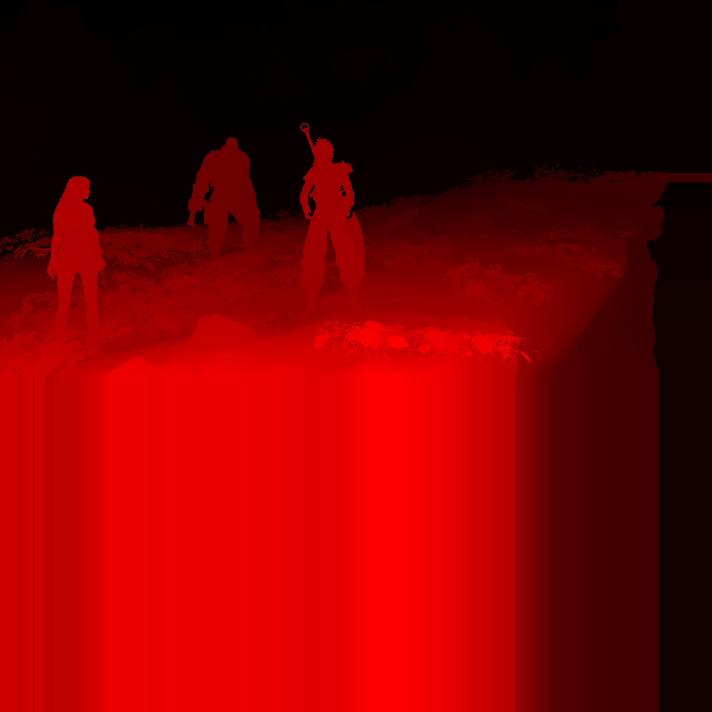
*Hierarchical-Z Buffer (HZB) Occlusion: Rendering the world to determine what objects to occlude later (with mips).*


*Shadow Map Draws: Rendering of the world through the perspective of some lights for shadowmaps. In this case the sun/directional light*

Among other miscellaneous tasks necessary for the game to render a frame that you will eventually see, but by this point after the GBuffer drawing we essentially have almost everything we need to start doing actual shading with the game. Fast forwarding just a few small rendering events and we stumble upon our Directional Light *(sunlight)* draw pass which will shade the scene with the sunlight.

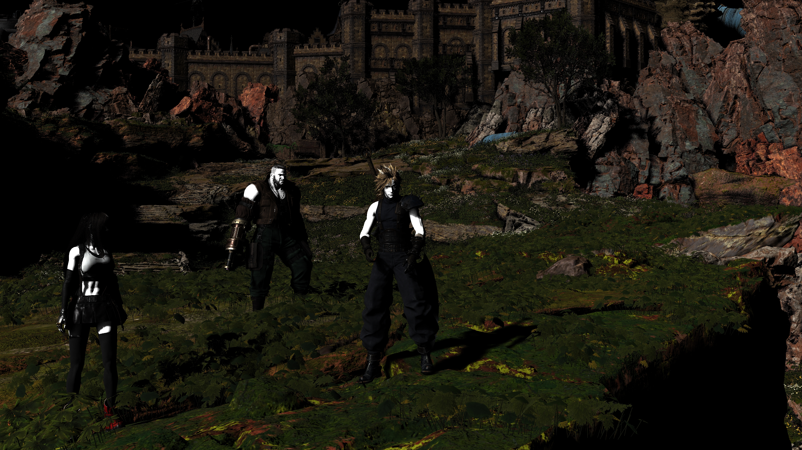

## Implementation

Going forward we will be using [RenderDoc](https://renderdoc.org/) not only for timings, but [RenderDoc](https://renderdoc.org/) also allows us to modify shaders and be able to replay them in the pipeline to see how they work *(not during runtime though)*

Now just before we get into the implementation of these effects we need to get baseline timings before we start adding things that could slow us down later. These baselines will help keep ourselves in check later so we don't build something too expensive.

[RenderDoc](https://renderdoc.org/) has a very useful feature where for a given capture, you can actually replay it and get timing values from it to see generally how much time each induvidual draw or operation takes. Granted the timings will not match the original game/application 1:1, and you have to run it multiple times to get a good average but even then it will be off by some factors, but for the most part it's good enough in that it will show you if one or more draws are more expensive than the other. 

It's important do this so we can orient ourselves later to check how expensive things have gotten. With that said, here is the original shader timings for the Directional Pixel Light Shader that the game is using within [RenderDoc](https://renderdoc.org/)...

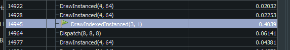

General timings for it are ```0.4ms```, which is moderately expensive... but remember that this is [RenderDoc](https://renderdoc.org/) so the actual in-game timings are likely faster/smaller than that. Still, this is an important baseline to keep in mind so we can check if we are slower, or faster before we move forward.

Now the other thing is that since that is a compiled shader, I cannot accurately decompile it into a shader that I can edit and make changes. I don't have the source code, so I'll have to reverse engineer the own shader.

Fortunately Unreal released their shader source files for UE4, and with some searching and trial and error I managed to mostly rebuild Unreal's Deferred Directional Pixel Light shader. It's not 1:1 also as there are some modifications that have been done for the game. I've done my best to match the original game shading as close as possible. For the most part it's almost indiscernable visually minus some specualrity differences that I have yet to fully iron out.

The good part is that the timings are almost the same so that means we have a good baseline to go from. Ideally when we start adding more and more effects we should see the timing values rise, and we'll know how far off we are from baseline.

So... with our baseline set now at roughly ```0.4ms```, let's get to work!

### Micro Shadows

This was the first thing that I wanted to try, as it's a very simple and cheap *(but very effective)* technique that was introduced in [Uncharted 4](https://advances.realtimerendering.com/other/2016/naughty_dog/). 

[Micro Shadows](https://advances.realtimerendering.com/other/2016/naughty_dog/) are a very low cost way of adding detail to a surface or object in direct light by simulating micro shadows using the material ambient occlusion.

```HLSL
float ComputeMicroShadowing(float AO, float NdotL, float opacity)
{
    float aperture = 2.0 * AO * AO;
    float microshadow = saturate(NdotL + aperture - 1.0);
    return lerp(1.0, microshadow, opacity);
}
```

To apply it to our shading all we need to do is just call the function, pass in the necessary terms and multiply it against our final light.

```HLSL
//pseudo code!
//lightAttenuation will factor in other light terms, like shadows
//if it's a local light it should also factor in distance falloffs and whatnot
//...

lightAttenuation *= ComputeMicroShadowing(GBufferData.GBufferAO, NdotL, 1.0f);

//add diffuse and specular
finalColor += diffuseLight;
finalColor += specularLight;

//apply attenuation
//NOTE: theroetically the micro shadowing and other shadowing terms we do should always be affecting both the diffuse and specular.
finalColor *= lightAttenuation;
```

Now let's see how it looks in the game, looking at the original first then with microshadows...

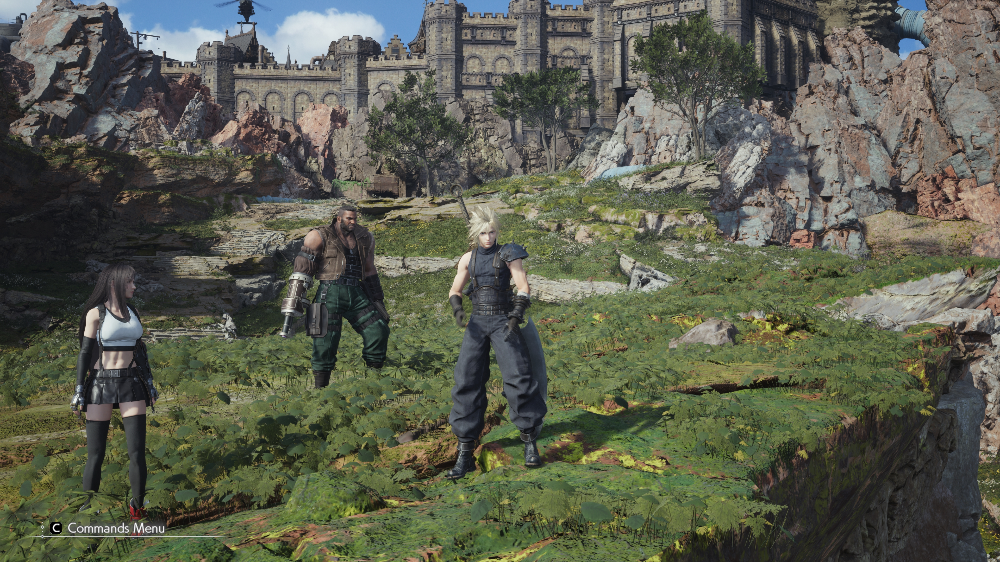
*No Micro Shadows*

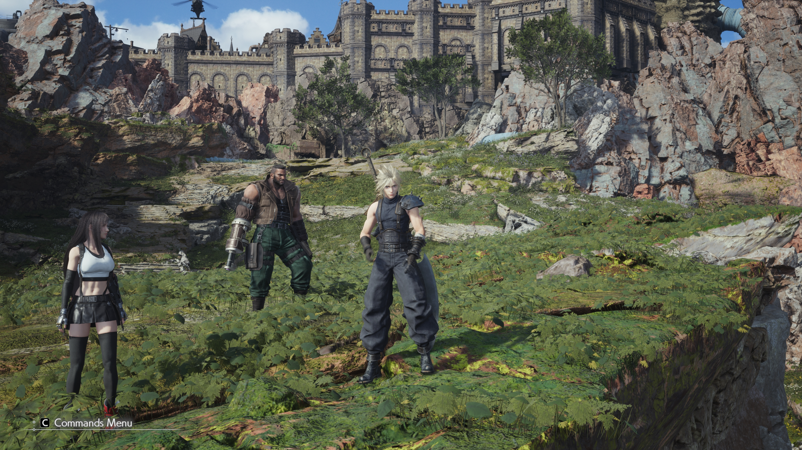

*With Micro Shadows*

You will need to compare both images side by side and flip between them to see the full effect on the final rendered image, but to help with that I will show the micro-shadow effect in pure isolation.

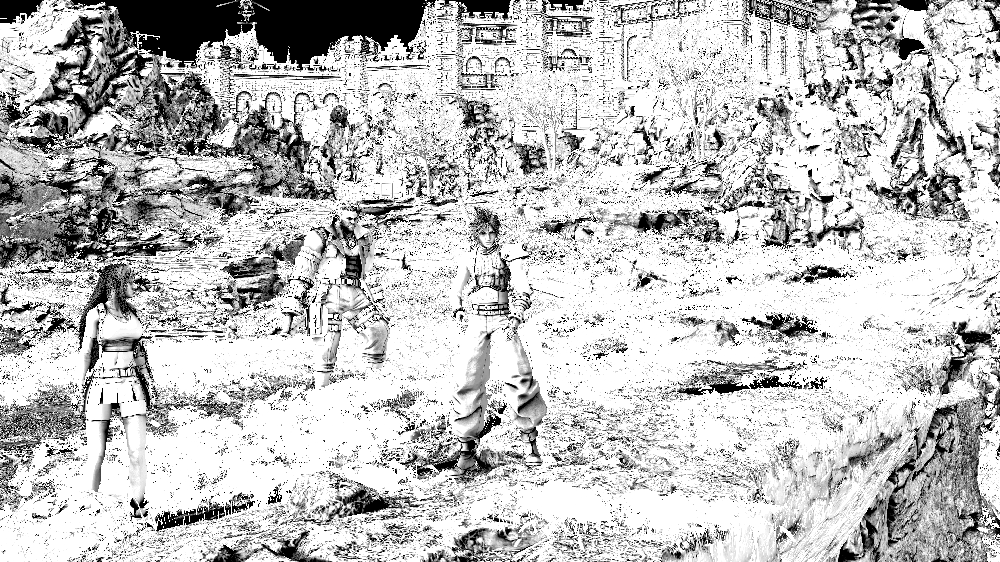

The beauty of the technique is in it's simplicity. It is a bit of a hack, but it's physically plausible and the result's are quite effective at adding detail just by leveraging the authored material ambient occlusion maps. Holes, crevices, and other details that are in the occlusion map are amplified.

Checking our timings...

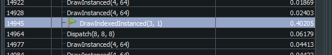

Generally they fall in the same exact ```0.4ms``` range. Like I said, super cheap!

That certainly helped a bit... but I'm not fully satisfied yet! I want to go further and really try to build extra shadows for the scene.

### Contact Shadows

Now just before we get into the meat of things, a brief explanation on what Contact Shadows actually are...

**Contact Shadows** is a screen-space shadowing technique that works by raymarching from a shaded point toward a light source and testing whether the ray intersects scene geometry reconstructed from the depth buffer.
- If we are hitting scene geometry on our way to the light, that point is occluded *(in-shadow)*
- If the ray reaches the light without hitting geometry, the point receives direct lighting.

Now unlike traditional shadow maps, Contact Shadows operate entirely in screen-space and use information already available in the depth buffer. This makes them relatively inexpensive while still providing small-scale shadow detail.

Ok... sounds plausible enough, but there are drawbacks with this technique...

#### Limitations

**We only trace visible geometry** 

Contact Shadows only have access to geometry that was visible when the depth buffer was generated. In plain English that means if an object isn't visible to the camera, it effectively doesn't exist as far as the Contact Shadow pass is concerned. Due to this there a few artifacts that can happen...

- Off-screen objects cannot cast contact shadows.
- Objects entering or leaving the screen can cause shadows to appear or disappear.
- Occlusion information may be incomplete when geometry is hidden behind other geometry.

**We are testing against limited geometry information**.

Contact Shadows do not test against actual scene geometry. Instead, they reconstruct geometry from the depth buffer. The depth buffer only stores the closest visible surface at each pixel and contains no information about things like surface thickness, backfaces, hidden or interior geometry and so on.

Due to this issue, most implementations introduce a thickness value when performing intersection tests. Choosing a value that is too small can cause rays to miss thin objects, while values that are too large can create false self-shadowing and other artifacts.

#### Getting Good Results

I probably did a bad job of selling the effect, but that's ok! It's important to learn about the problems first so we can configure and setup this effect in a way where we can maximize the best results from it. 

So... how do we do that?

- Shadow ray lengths should generally be kept short. Longer rays increase the likelihood of missing occluders, encountering missing geometry, and producing visible artifacts. *(NOTE: This is also where it gets it's name, because it excels at adding small-scale shadows where objects make contact with nearby surfaces)*
- Thickness values should remain relatively small. Excessive thickness can lead to over-occlusion and funky self-shadowing artifacts, while values that are too small may allow thin geometry to leak light through.

If we keep all of that in mind, then our contact shadows can provide us a significant amount of additional shadow detail at a relatively low cost!

So... with all of that yapping done... let's go ahead and try it out!

#### Naive Contact Shadows (World Space)

Starting out, we will do things in world-space. 

Remembering the concept... given a point in 3D space *(vector_worldPosition)*, and the direction of the light *(vector_worldLightDirection)*, we want to march our ray for *(CONTACT_SHADOWS_SAMPLES)* amount of samples. Within each sample we will read the depth texture and check if our ray is inside geometry or not.

First some configuration variables to define how we do this effect, these eventually will be tweaked later as well.

```HLSL
//how many marches we do against the scene depth buffer
#define CONTACT_SHADOWS_SAMPLES 64

//how far out do the rays go
#define CONTACT_SHADOWS_RAY_LENGTH 100.0

//the assumed thickness of the depth
#define CONTACT_SHADOWS_THICKNESS 0.35

//this is an offset to our starting position so we avoid self-occlusion artifacts
#define CONTACT_SHADOWS_BIAS 1e-04

//this is an offset to our starting position using the surface normal so we avoid self-occlusion artifacts
#define CONTACT_SHADOWS_NORMAL_BIAS 1e-04
```

Now heres the actual function.

```HLSL
float ContactShadowWorldSpace(
    float3 vector_worldPosition,
    float3 vector_worldNormal, //this isn't required, but this is used as an offset for our starting position
    float3 vector_worldLightDirection,
    float random)
{
    //based on the amount of samples, and the ray length, calculate how spaced out each march should be
    float raymarchStepSize = CONTACT_SHADOWS_RAY_LENGTH / CONTACT_SHADOWS_SAMPLES;

    //our starting point
    float3 rayOrigin = vector_worldPosition;

    //NOTE: using the geometry normal, we offset our starting position so that we don't occlude ourselves
    rayOrigin += vector_worldNormal * CONTACT_SHADOWS_NORMAL_BIAS; //normal bias

    //advance the ray once with jitter
    rayOrigin += vector_worldLightDirection * (random * raymarchStepSize); 

    float3 rayStep = vector_worldLightDirection * raymarchStepSize;

    [loop]
    for (int i = 0; i < CONTACT_SHADOWS_SAMPLES; i++)
    {
        float3 vector_samplePosition = rayOrigin + rayStep * i;
        float2 vector_sampleUV = WorldToScreenUV(vector_samplePosition);

        if (vector_sampleUV.x < 0.0 || vector_sampleUV.x > 1.0 || vector_sampleUV.y < 0.0 || vector_sampleUV.y > 1.0)
            break;

        float sampledDepth = SceneTexturesStruct_SceneDepthTexture.SampleLevel(View_SharedBilinearClampedSampler, vector_sampleUV, 0).r;
        float3 vector_sampleWorldPosition = ReconstructWorldPosition(vector_sampleUV, sampledDepth);
        float rayDepth = distance(vector_samplePosition, View_WorldCameraOrigin);
        float sceneDepth = distance(vector_sampleWorldPosition, View_WorldCameraOrigin);
        float depthDiff = rayDepth - sceneDepth;

        if (depthDiff > CONTACT_SHADOWS_BIAS && depthDiff < CONTACT_SHADOWS_THICKNESS * 100)
            return 0.0;
    }

    return 1.0;
}
```

Just like the [Micro Shadows](#micro-shadows), we apply this to the light attenuation as such.

```HLSL
//pseudo code!
//you'll need to calculate vector_worldPosition, vector_normalDirection and access to vector_lightDirection
//lightAttenuation will factor in other light terms, like shadows
//if it's a local light it should also factor in distance falloffs and whatnot
//...

//micro shadowing from before
lightAttenuation *= ComputeMicroShadowing(GBufferData.GBufferAO, NdotL, 1.0f);

//NEW: our contact shadows!
lightAttenuation *= ContactShadowWorldSpace(
    vector_worldPosition.xyz, //vector_worldPosition
    vector_normalDirection, //vector_worldNormal
    vector_lightDirection); //vector_worldLightDirection

//add diffuse and specular
finalColor += diffuseLight;
finalColor += specularLight;

//apply attenuation
//NOTE: again just like micro shadowing, the terms should always be affecting both the diffuse and specular.
finalColor *= lightAttenuation;
```

Ok sweet, it's all setup, now lets check the results!


*Micro Shadows Only*

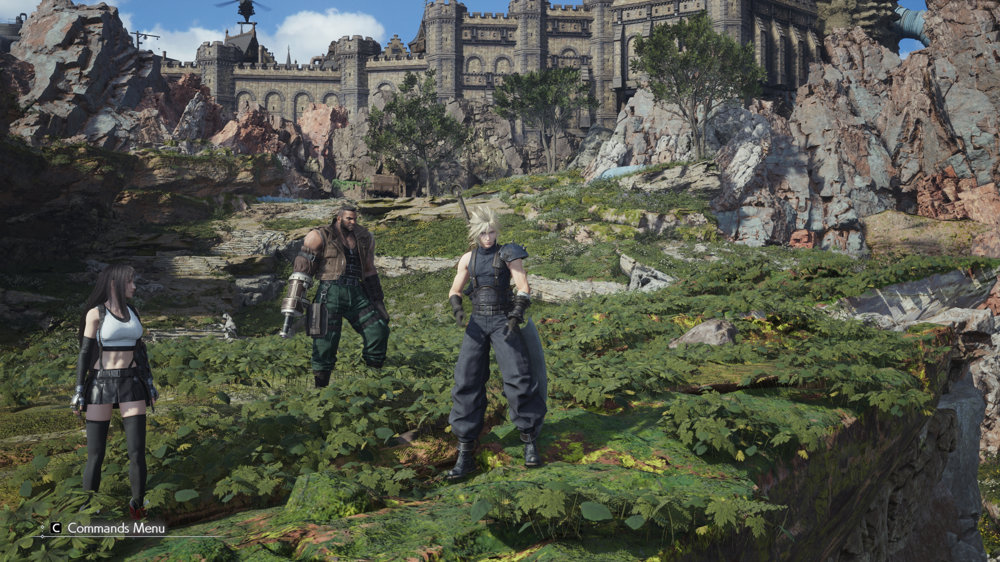
*Micro Shadows + Contact Shadows*

Wow! What a difference, so much detail in the scene gets revealed. All of the foliage also that was excluded from the shadowmaps now are casting shadows again. Near contact points also the shadows sharpen up and the overall shadow resolution appears much higher!

If we take a closer peek...

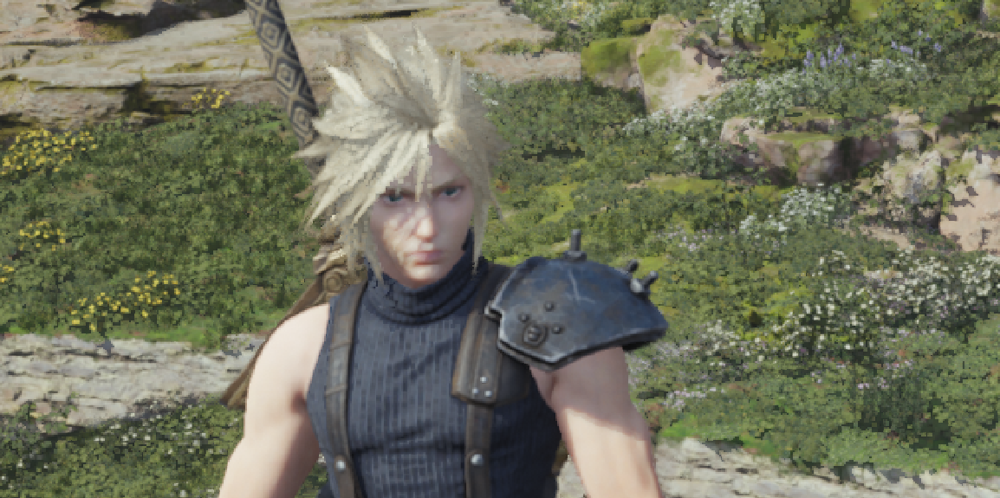
*Micro Shadows + Contact Shadows*

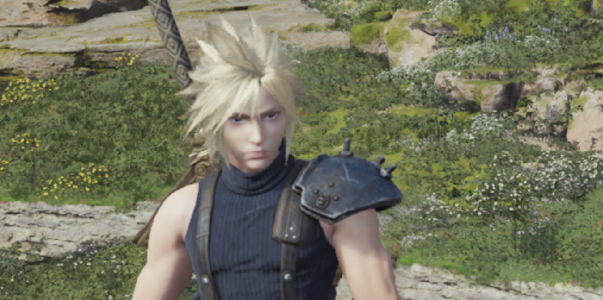
*Micro Shadows Only*

Look at that! Cloud recieves shadows from his hair, that kind of detail would be too small scale to be resolved by the main shadowmaps. The shadow underneath his shoulder-pad also became sharper, and even behind him many foliage details start casting their shadows onto the scene.

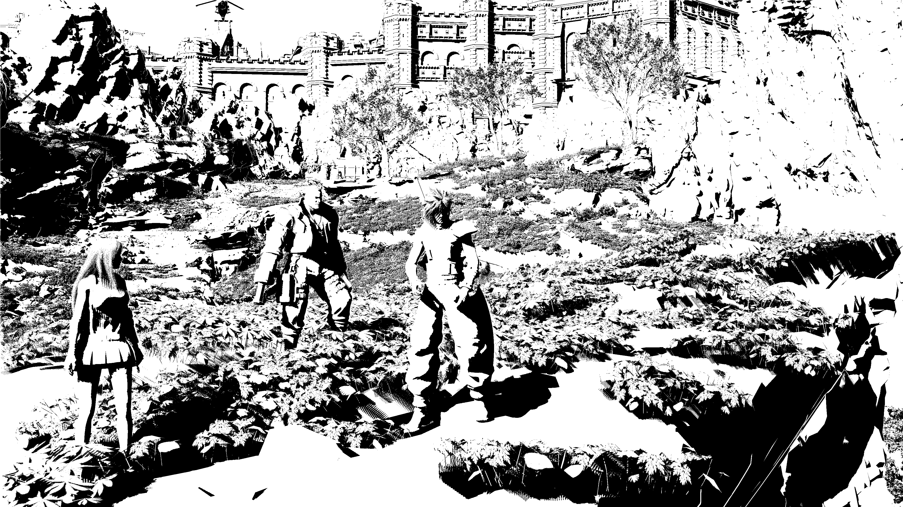
*Contact Shadows Term*

Well... I geuss we're done right? What do the timings look like...

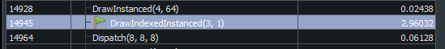

``2.96ms`` Oh boy... that is not good...

The shader with the added effect is really slow! *(baseline timings were roughly ```0.4ms```)* 

Well... time to really dig in and optimize things, atleast now we got it working so lets see what we can do.

#### Optimization: Reduce Sample Counts

So the first obvious thing we can reduce the sample count, initally I had the sample count set to 64 so lets knock it down by half.

```HLSL
//previously was 64
#define CONTACT_SHADOWS_SAMPLES 32
```

Now what do the timings look like?

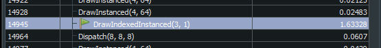

``1.6ms``, Ok that is much better! Still far from ideal, but that makes things a little more managable. However we reduced the sample count though... so that means our quality is worse right?

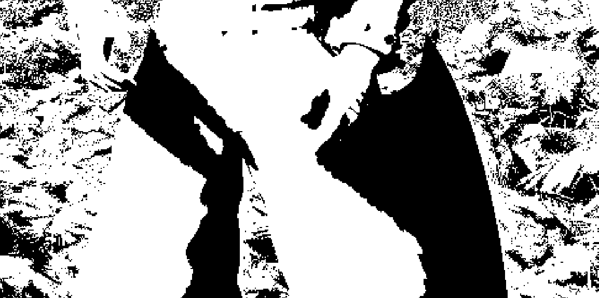
*64 Samples*

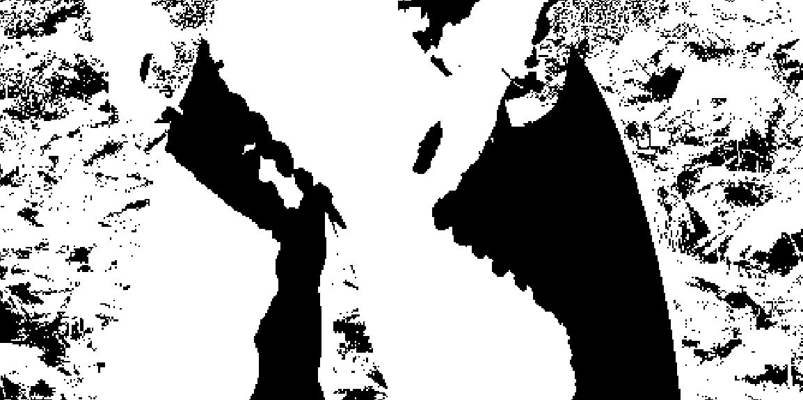
*32 Samples*

Yeah it's definetly worse, and what is wierd is that we are seeing this wierd stepping like artifact *(which is a side effect of raymarching, we march in steps)*. If we reduce samples even more those stepping artifacts will become even more apparent. We could try to reduce the ray length also to shorten the the distance between samples but that means we won't be tracing rays that far anymore. 

What else can we do?

#### Quality Boost: Introduce Jitter (Blue Noise)

Fortunately we are in luck, as there is a way that we can mitigate these raymarch stepping artifacts. The solution is noise! *(or jitter, or dithering)*

To explain quickly why this will work, currently stepping uniformly into the depth buffer for every pixel which is why we are seeing the stepping. If we go in an introducing jitter into the step, then this will actually allow us to "randomly" march at different intervals to cover broader areas.

Seems sound... lets try it!


*32 Samples with Blue Noise*

Ok that actually looks pretty good! I'm actually seeing some areas that before were not even visible with the 64 Samples non-jittered result.

The only drawback is now we have noise everywhere... but fortunately we have TAA later in the rendering pipeline so we can rely on it to clean up the noise and blend results temporally.

Anyway... how are the timings now, they should be the same right?

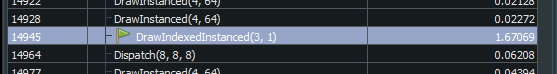

```1.64ms``` It's actually more expensive using noise? But we are at the same sample count! How is this happening?

Well... the answer comes down to coherence. 

To keep the explanation as simple as I can, heres the quick context. We are working with shaders here, and shaders run on GPUs. GPUs are essentially big multi-core processors. They are extremely good at processing large groups of pixels that perform similar work. 

Now before we introduced jitter, neighboring pixels were marching through the scene using nearly identical sample locations. This allowed the GPU to access memory efficiently and reuse cached data. Great for performance!

However... once we added noise, every pixel now follows a slightly different path. The sample count remains the same, but memory accesses become less coherent, cache efficiency decreases, and performance becomes worse! Arghhhhh!

Fortunately... we're not out of options yet!

For jitter we're currently using [Blue Noise](https://blog.demofox.org/2018/01/30/what-the-heck-is-blue-noise/). Compared to White Noise, [Blue Noise](https://blog.demofox.org/2018/01/30/what-the-heck-is-blue-noise/) produces a more visually pleasing distribution of samples and tends to hide artifacts much better. Now whether it's white or blue noise it doesn't really matter here because both are very random *(white noise more so technically)* and due to that nature that actually is contributing to a loss of coherence.

So now we have an interesting question... can we find a sampling pattern that sits somewhere between perfectly uniform and completely random?

#### Optimization: Switching to Interleaved Gradient Noise (IGN)

Enter [Interleaved Gradient Noise](https://blog.demofox.org/2022/01/01/interleaved-gradient-noise-a-different-kind-of-low-discrepancy-sequence/), this is a noise pattern that comes from [Jorge Jimenez](https://www.iryoku.com/next-generation-post-processing-in-call-of-duty-advanced-warfare/). Unlike Blue Noise or White Noise, [Interleaved Gradient Noise](https://blog.demofox.org/2022/01/01/interleaved-gradient-noise-a-different-kind-of-low-discrepancy-sequence/) is designed to be low-discrepancy, which just means that neighboring pixels receive values that are distributed more evenly and predictably *(as opposed to uneven, random distribution)*. 

The goal isn't to be perfectly random, but about providing good sample coverage while maintaining some degree of coherence. Introducing enough variation to break up visible stepping artifacts, while remaining structured enough to be more GPU-friendly than purely random sampling patterns.

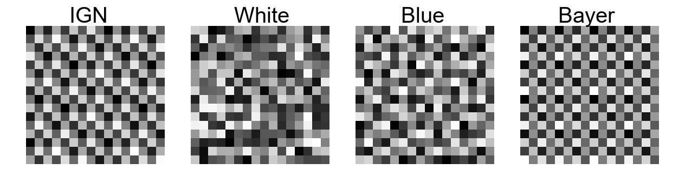
*[Image from Demofox]((https://blog.demofox.org/2022/01/01/interleaved-gradient-noise-a-different-kind-of-low-discrepancy-sequence/))*

Ok, I geuss I'm sold... lets try it out!

```HLSL
float InterleavedGradientNoise(float2 pixCoord, int frameCount)
{
	const float3 magic = float3(0.06711056f, 0.00583715f, 52.9829189f);
	const float2 frameMagicScale = float2(2.083f, 4.867f);
	pixCoord += frameCount * frameMagicScale;
	return frac(magic.z * frac(dot(pixCoord, magic.xy)));
}
```

Plugging this in place of the Blue Noise that we were using earlier...


*32 Samples with Blue Noise*

Interesting... the noise seems reduced by quite a bit which is great for quality. The stepping artifacts also arent that visible either! This is definetly looking better, but the real question is... is the GPU happier with this?

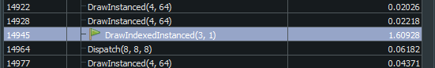

```1.6ms``` the timings went back down! The GPU is happier with that, awesome!

But again we still are not done, like I said earlier while knocking the sample count down further led to much better timings, ```1.6ms``` is still bad and not where I want it to be. Remember that the original shader timings without contact shadows was ```0.4ms```, so we still have roughly ```~1.2ms``` to shave off at the most.

What are some other optimizations we can actually do to improve performance?

#### Optimization: Clip Space

Well other than just toying with the sample counts and ray lengths... we can actually change our raymarching strategy! 

Our original function traces contact shadows in world space, which seems fine and easy enough... but as it's turns out we are actually doing quite a bit more work than we need to.

For each raymarch step we advance a world-space position, project that position into clip/screen space, sample the depth buffer, and then perform our intersection tests. Since these operations occur inside the raymarch loop, their cost quickly adds up especially with the large amount of samples.

Recall that Contact Shadows ultimately is just screen-space effect, not world space. The depth buffer already exists in screen space, and every occlusion test eventually happens against that screen-space data.

So instead of marching a ray through world space and repeatedly projecting it back to the screen, we can perform the raymarch directly in clip space. This removes much of the per-step transformation work and allows the shader to operate in the same space as the depth buffer it is testing against.

The end result is the same shadowing solution, but with significantly less work performed inside the raymarch loop.

Awesome, lets do it!

```HLSL
float ContactShadowClipSpace(
    float3 vector_worldPosition,
    float3 vector_worldNormal,
    float3 vector_worldLightDirection,
    float random)
{
    //minor micro optimization, precompute 1.0f / CONTACT_SHADOWS_SAMPLES so we only end up doing a mul
    float invSamples = rcp(CONTACT_SHADOWS_SAMPLES);

    float3 rayOrigin = vector_worldPosition;

    float4 clipStart = mul(View_WorldToClip, float4(rayOrigin, 1));
    float4 clipEnd = mul(View_WorldToClip, float4(rayOrigin + vector_worldLightDirection * CONTACT_SHADOWS_RAY_LENGTH, 1));

    float3 ndcStart = clipStart.xyz / clipStart.w;
    float3 ndcEnd = clipEnd.xyz / clipEnd.w;

    float rayLinearStart = LinearEyeDepth(ndcStart.z);
    float rayLinearEnd   = LinearEyeDepth(ndcEnd.z);

    float rayLinearDepth = lerp(rayLinearStart, rayLinearEnd, random * invSamples);
    float rayLinearStep = (rayLinearEnd - rayLinearStart) * invSamples;

    const float2 uvScale = float2(0.5, -0.5);
    float2 uvStep = (ndcEnd.xy - ndcStart.xy) * (invSamples * uvScale);
    float2 uv = mad(ndcStart.xy, uvScale, 0.5) + uvStep * random;

    [loop]
    for (int i = 0; i < CONTACT_SHADOWS_SAMPLES; i++)
    {
        if (any(uv < 0.0) || any(uv > 1.0))
            break;

        float depth = SceneTexturesStruct_SceneDepthTexture.SampleLevel(View_SharedBilinearClampedSampler, uv, 0).r;
        float linearDepth = View_InvDeviceZToWorldZTransform.z / (depth - View_InvDeviceZToWorldZTransform.w);
        float penetration = rayLinearDepth - linearDepth;

        if (penetration > CONTACT_SHADOWS_BIAS && penetration < CONTACT_SHADOWS_THICKNESS)
            return 0.0;

        rayLinearDepth += rayLinearStep;
        uv += uvStep;
    }

    return 1.0;
}
```

It's worth mentioning that moving from world space to clip space changes some of the ray traversal math. The important takeaway is that we eliminate the space conversions that were previously happening inside the raymarch loop.

Now because our depth comparisons now occur in projected space rather than world space, parameters such as CONTACT_SHADOWS_THICKNESS will need to be adjusted. Aside from that though it still functions the same. 

So! how do our contact shadows look now? If we did everything right it should look mostly the same...

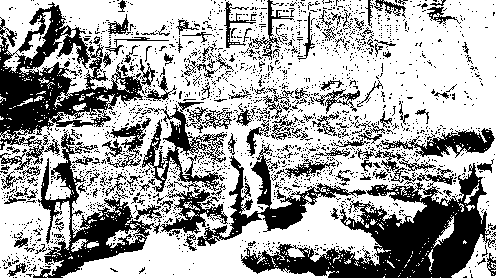
*World Space Version*

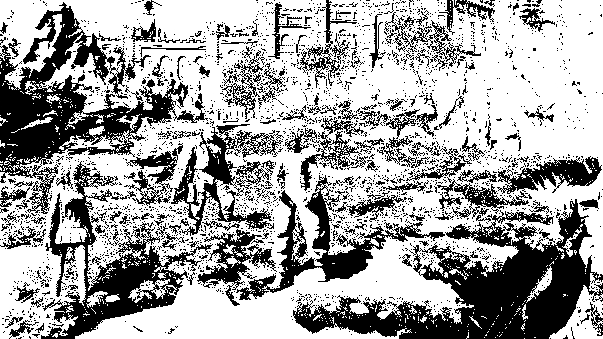
*Clip Space Version*

Ok good, it does. Thats a good sign, means our math all works as it should... now what about the timings?

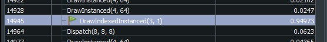

```1.0ms``` Oh wow, that killed effectively ```0.6ms```, Awesome! Not only do things now run much better, but they still look the same, fantastic! 

But there is still a little more that we can do...

timing-early-sky-out.png

#### Optimization: Early Sky Out

One small and simple thing we can do for optimization, is just before we do contact shadows we can check depth. for any pixels that are basically really far out. This is important especially for sky pixels, we wouldn't want to do contact shadow tracing on sky pixels as it'd just be a waste so we can just do a simple distance check to ensure that we are only doing contact shadows within a specific distance.

```HLSL
//optimization: early out for sky
if(GBufferData.Depth < 1000000)
{
    //do contact shadows
}
```

Visually there is no difference, but timing wise there is a small bit of improvement *(hard to fully pin down from the noise within RenderDocs replay timings)*

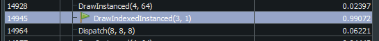

```0.99ms - 0.98ms``` It's really small, but every little bit helps.

#### Optimization: Further Sample Reduction

Now with the different techniques in place, especially with the noise, our contact shadows is as good as I can get it. However it's still too many samples, texture reads seem to be the main performance bottleneck so I will reduce the quality all the way down 8 samples, which is actually usually the common sample count even in unreals own implementation.

```HLSL
//dropped from 32 to 8
#define CONTACT_SHADOWS_SAMPLES 8
```

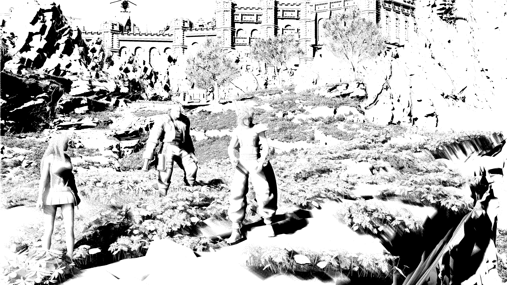

It still looks suprisingly great! Now definetly when you compare the shadows near the contacts of objects are much weaker, and this is because with 8 samples now, the step size is much larger now than it was with 32. To compensate for this, we can knock down the max ray length so the step size is a little closer together. This does mean that we will lose out on some slightly longer shadows, but in turn we will regain our sharper contact shadows.

```HLSL
//dropped from 100 to 50
#define CONTACT_SHADOWS_RAY_LENGTH 50.0
```

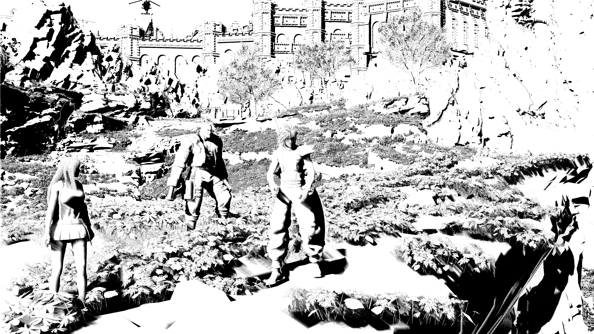

Still looking fantastic! The shadows near geometry contacts regained their sharpness/intensity. Importantly I can now see the finer details of clouds hair casting shadows on his face more clearly, and same for all of the foliage on the ground. 

Now... we dropped both the sample count and ray length quite a bit, so... what are the final timings now?

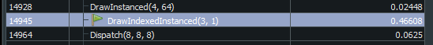

```0.46ms - 0.47ms```, Sweet! Our contact shadows now is way more optimized than where it started out, and still can pack quite a punch to the final image all for a reasonable cost!

#### Bonus: Dual Depth Sampling

I left this for last as a bonus, but also in "[Rendering Tiny Glades With Entirely Too Much Ray Marching](https://www.youtube.com/watch?v=jusWW2pPnA0)" the main plus they did for improving the results of their contact shadows was actually sampling the depth textures twice. One with point sampling, the other with bilinear filtering.

The result was a significant reduction in contact shadow self-occlusion issues, the only reason I'm leaving this for last is while this does improve the quality, it means 2 depth texture samples now in the loop which makes it quite a bit more expensive.

```HLSL
float ContactShadowClipSpaceDualDepth(
    float3 vector_worldPosition,
    float3 vector_worldNormal,
    float3 vector_worldLightDirection,
    float random)
{
    float invSamples = rcp(CONTACT_SHADOWS_SAMPLES);

    float3 rayOrigin = vector_worldPosition;
    float4 clipStart = mul(View_WorldToClip, float4(rayOrigin, 1));
    float4 clipEnd = mul(View_WorldToClip, float4(rayOrigin + vector_worldLightDirection * CONTACT_SHADOWS_RAY_LENGTH, 1));

    float3 ndcStart = clipStart.xyz / clipStart.w;
    float3 ndcEnd = clipEnd.xyz / clipEnd.w;

    float rayLinearStart = LinearEyeDepth(ndcStart.z);
    float rayLinearEnd   = LinearEyeDepth(ndcEnd.z);

    float rayLinearDepth = lerp(rayLinearStart, rayLinearEnd, random * invSamples);
    float rayLinearStep = (rayLinearEnd - rayLinearStart) * invSamples;

    const float2 uvScale = float2(0.5, -0.5);
    float2 uvStep = (ndcEnd.xy - ndcStart.xy) * (invSamples * uvScale);
    float2 uv = mad(ndcStart.xy, uvScale, 0.5) + uvStep * random;

    [loop]
    for (int i = 0; i < CONTACT_SHADOWS_SAMPLES; i++)
    {
        if (any(uv < 0.0) || any(uv > 1.0))
            break;

        float pointDepth = SceneTexturesStruct_SceneDepthTexture.SampleLevel(View_SharedPointClampedSampler, uv, 0).r;
        float bilinearDepth = SceneTexturesStruct_SceneDepthTexture.SampleLevel(View_SharedBilinearClampedSampler, uv, 0).r;

        float2 depths = float2(pointDepth, bilinearDepth);
        float2 linearDepths = View_InvDeviceZToWorldZTransform.z / (depths - View_InvDeviceZToWorldZTransform.w);

        float minDepth = min(linearDepths.x, linearDepths.y);
        float maxDepth = max(linearDepths.x, linearDepths.y);

        float penetration = rayLinearDepth - minDepth;
        float depthDistance = maxDepth - rayLinearDepth;

        if (depthDistance < 0.0 && penetration < CONTACT_SHADOWS_THICKNESS)
            return 0.0;

        rayLinearDepth += rayLinearStep;
        uv += uvStep;
    }

    return 1.0;
}
```

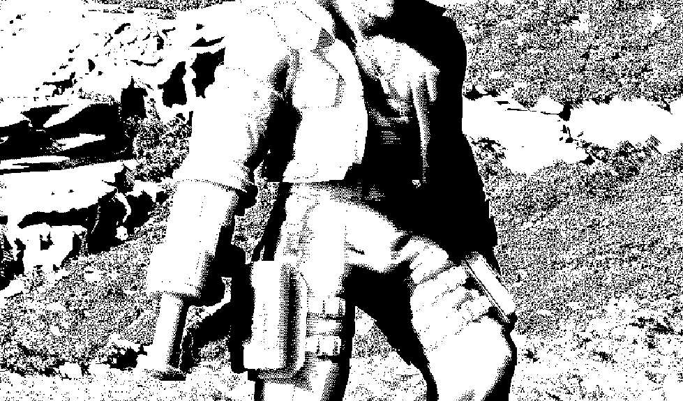
*Single Depth Sample*

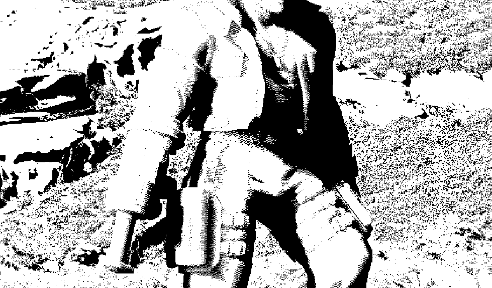
*Dual Depth Samples*

Checking the timings...

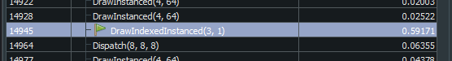

```0.56ms - 0.57ms```, quite a bit more than just singular depth sampling. For that cost I would probably rather just increase sample counts, but you can see the options.

#### Bonus: Depth Point Sampling

Another intresting idea from the same place "[Rendering Tiny Glades With Entirely Too Much Ray Marching](https://www.youtube.com/watch?v=jusWW2pPnA0)" for improving the results of their contact shadows was actually sampling the depth texture using point sampling rather than bilinear filtering. While for the most part the point sampled depth was intended to be used in tandem with the bilinear sampled one, using it by itself actually can lead to better results in some cases.

```HLSL
//bilinear depth
//float sampledDepth = SceneTexturesStruct_SceneDepthTexture.SampleLevel(View_SharedBilinearClampedSampler, vector_sampleUV, 0).r;

//point depth
float sampledDepth = SceneTexturesStruct_SceneDepthTexture.SampleLevel(View_SharedPointClampedSampler, vector_sampleUV, 0).r;
```

These screenshots are from a different capture but it's one case where the benifits of using point sampling were quite obvious.

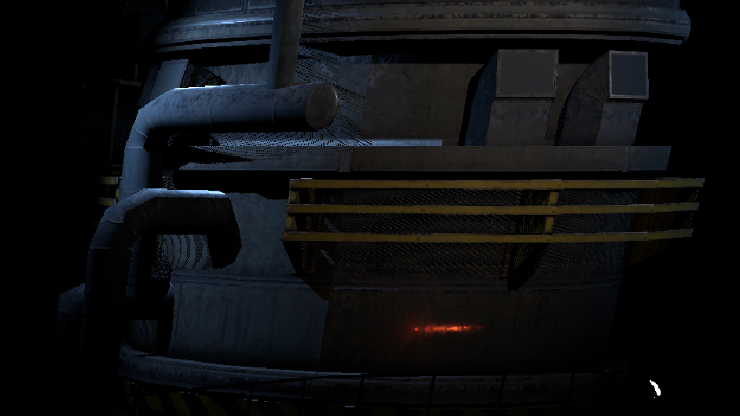
*Bilinear Depth Sampling*

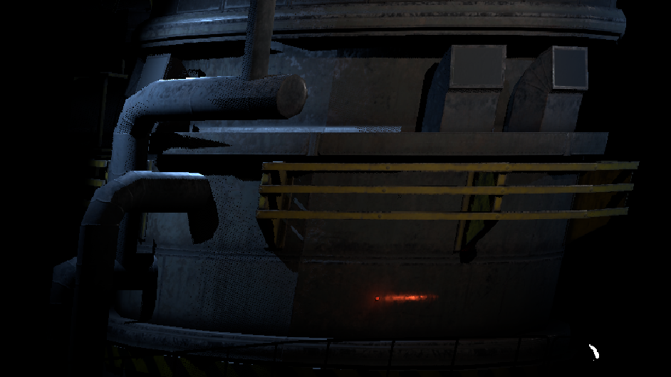
*Point Depth Sampling*

No timings on this because it's effectively free, all we are doing is just sampling the same depth texture that we did before but with point sampling instead of bilinear. It helps with reducing self-occlusion.

#### Bonus: Checkerboard Rendering Optimization

One other small optimization idea we can do if we are really trying to squeeze as much as possible out of this, is to do checkerboard rendering. You should only do this if you have TAA or some temporal filtering, that of which Rebirth already does fortunately.

The idea is simple, we only do contact shadows for every other pixel within a 2x2 grid. The rest become blank, but using the framecount *(or some frame index, a value that changes every frame)* on the next frame we shift the checkerboard so we are doing the other set of pixels that we skipped out on before. Then it repeats...

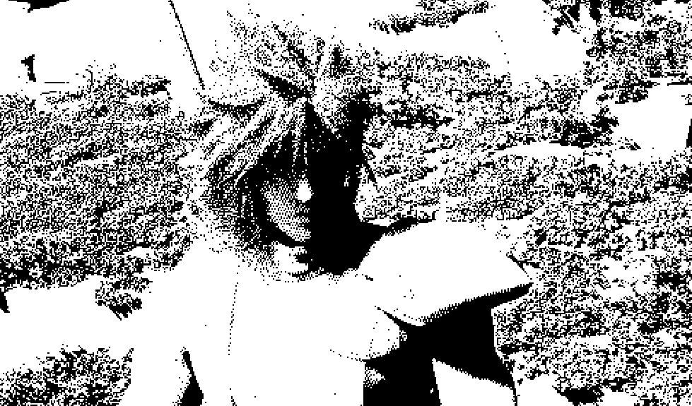
*Checkerboard Off*

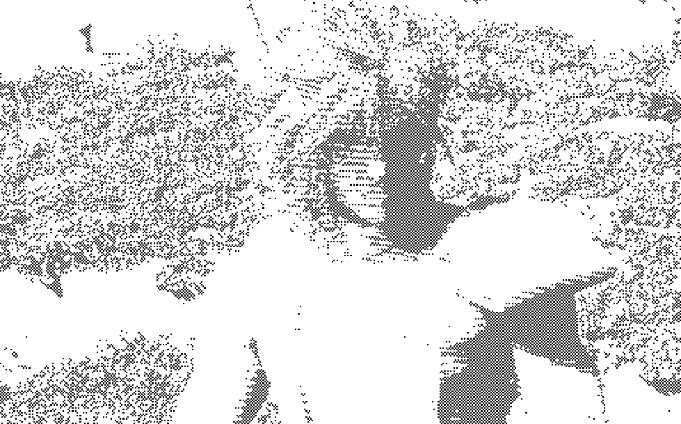
*Checkerboard On*

## Final Results

With that we have sucessfully managed to implement contact shadows into FF7 Rebirth! 

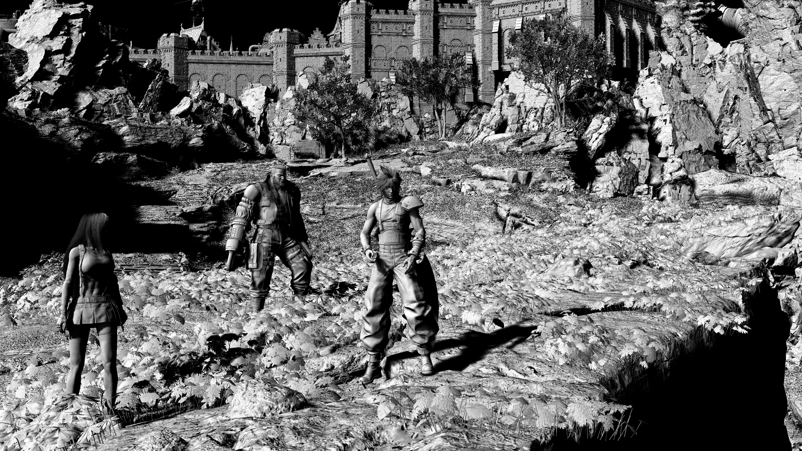
*Light Attenuation: Shadowmaps * NdotL (Original)*

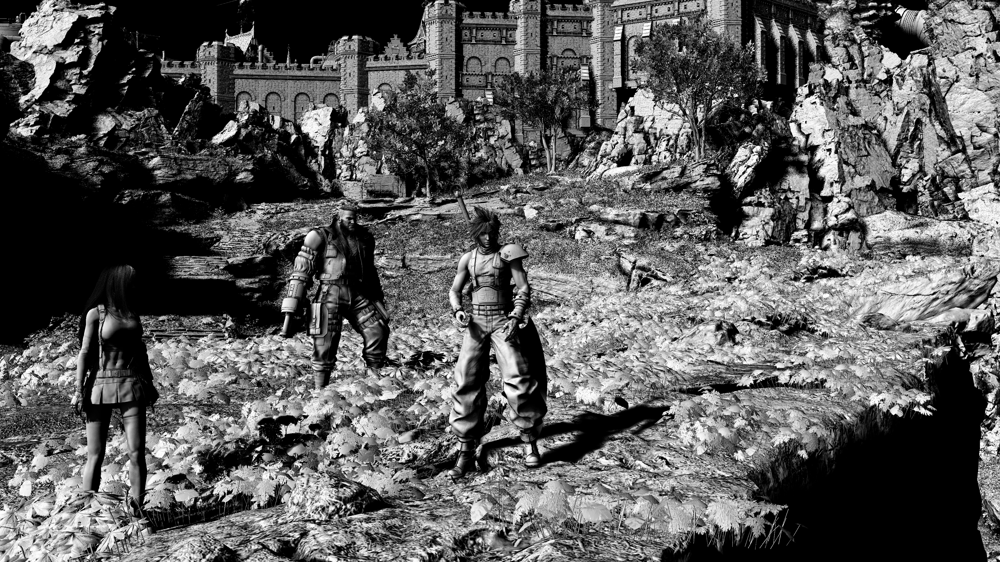
*Light Attenuation: Shadowmaps * NdotL * Micro Shadows*

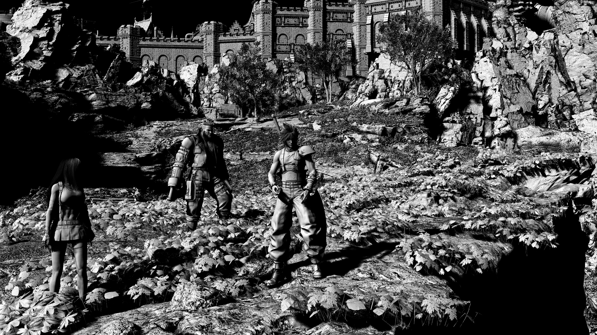
*Light Attenuation: Shadowmaps * NdotL * Micro Shadows * Contact Shadows*

Now with our final optimized results...


It's looking better than ever! Now I do want to point out something very important, because in deferred rendering lights are shaded in full screen pixel draws usually. It means every light is shaded this way. So contact shadows can also be used for local lights for a similar cost as well to the directional lights, and arguably in some areas within rebirth this is the one place that would definetly give you the most bang for your buck.

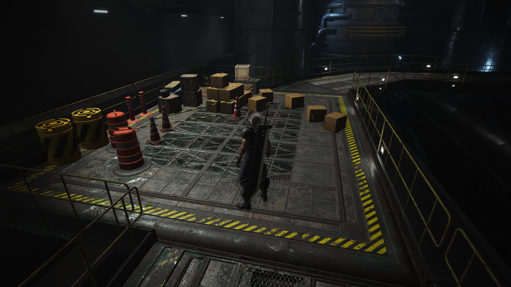
*Original*

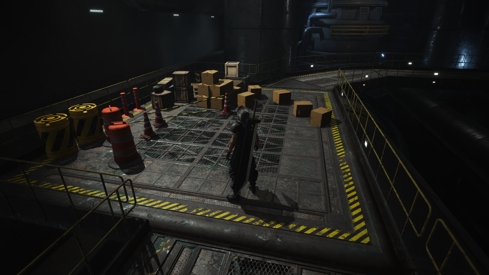
*Micro Shadows + Contact Shadowing for Local Light passes*

Now this was done just through RenderDoc but there is a whole other part of this story...

I built a shader injector mod, that allows me to actually take this modified RenderDoc shader, compile it and replace the original shader bytecode at runtime within the actual game so I could play with this modified shader during gameplay... and it's awesome!

[](https://www.youtube.com/watch?v=ta1WpIeoP1s)

# References / Sources
List of references that helped with my implementations and understanding.

- [Unreal Engine Contact Shadows documentation](https://dev.epicgames.com/documentation/unreal-engine/contact-shadows-in-unreal-engine?lang=en-US)

- [Unreal Engine CSM documentation](https://dev.epicgames.com/documentation/unreal-engine/use-cascaded-shadows?application_version=4.27)

- [Rendering Tiny Glades With Entirely Too Much Ray Marching](https://www.youtube.com/watch?v=jusWW2pPnA0)

- [Technical Art of Uncharted 4](https://advances.realtimerendering.com/other/2016/naughty_dog/)

- [Panos Karabelas / Screen space shadows](https://panoskarabelas.com/posts/screen_space_shadows/)

- [demofox / Interleaved Gradient Noise: A Different Kind of Low Discrepancy Sequence](https://blog.demofox.org/2022/01/01/interleaved-gradient-noise-a-different-kind-of-low-discrepancy-sequence/)

- [demofox / What the Heck is Blue Noise?](https://blog.demofox.org/2018/01/30/what-the-heck-is-blue-noise/)

- [RenderDoc](https://renderdoc.org/)

*By: David Matos*