Sharing my notes, and experiments with optimizing my real-time Global Illumination lighting buffers. The main goal is to reduce the rendering cost while maximizing final image quality and stability.

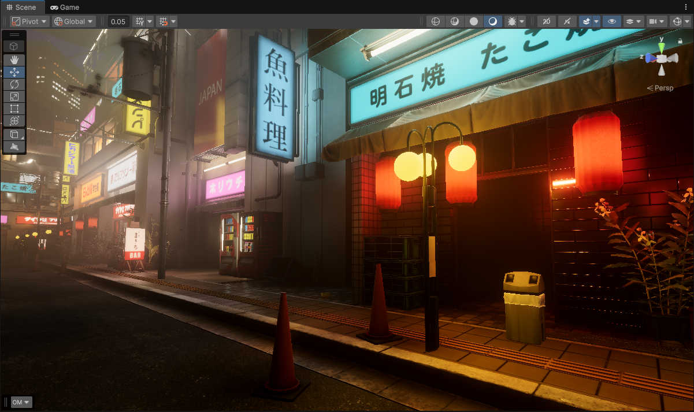
*[Japanese Urban City Night Pack Environment](https://www.fab.com/listings/ce956075-e76c-4374-94a7-ea6226ae00de) in Unity*

#### Table of Contents
- [Preface](#preface)
- [Upsampling](#upsampling)
    - [Upsampling - Chain Setup](#upsampling---chain-setup)
    - [Upsampling - The Basics (Point, Bilinear)](#upsampling---the-basics-point-bilinear)
    - [Upsampling - Wider Blur Filters](#upsampling---wider-blur-filters)
    - [Upsampling - Depth Aware](#upsampling---depth-aware)
    - [Upsampling - Depth and Normal Aware](#upsampling---depth-and-normal-aware)
- [Temporal Instabilities](#temporal-instabilities)
    - [Temporal Instability Solutions: Temporal Filtering?](#temporal-instability-solutions-temporal-filtering)
    - [Investigations into Temporal Instabilities](#investigations-into-temporal-instabilities)
    - [Temporal Instability Solutions: Downsampling?](#temporal-instability-solutions-downsampling)
    - [Downsampling - Drawbacks](#downsampling---drawbacks)
    - [Temporal Solution Comparisons](#temporal-solution-comparisons)
- [Upsampling - How to go further?](#upsampling---how-to-go-further)
    - [Spherical Harmonics](#spherical-harmonics)
    - [Spherical Harmonics: How to apply it?](#spherical-harmonics-how-to-apply-it)
    - [Spherical Harmonic Optimizations: Compute Shader](#spherical-harmonic-optimizations-compute-shader)
    - [Spherical Harmonic Optimizations: Render Target Packing](#spherical-harmonic-optimizations-render-target-packing)
    - [Spherical Harmonic Bonuses](#spherical-harmonic-bonuses)
- [How to go even further and beyond?](#how-to-go-even-further-and-beyond)
- [References / Sources](#references--sources)

## Preface

In a Real-Time rendering context, when computing any image-space effects, **it's very common as a performance measure to never compute those effects at full screen resolution.** The reason for this is simple, the more pixels we have, the more work we do.

Say our final target resolution is ```1920 x 1080```. Using this resolution will equate to... ```1920 x 1080 = 2,073,600 pixels```

That is a lot of pixels! Now what you need to consider is that when doing things at this target resolution *(for each of these 2 million pixels)* you are going to run a set of shader instructions/operations for every pixel, for the given effect.

For some light-weight effects like bloom, or tonemapping the amount of overall work that you'll be doing per pixel is fairly small. 

However for more complicated effects like SSAO *(Screen-Space Ambient Occlusion)*, SSR *(Screen Space Reflections)*, or full on lighting buffers for Global Illumination *(either using Ray-Tracing, Voxel Cone-tracing, etc.)* The amount of overall work needed for those effects is significant. 


*Full Resolution Global Illumination (Voxel Cone Tracing)*

The end result is that for a large amount of total pixels, you end up doing a large amount of work and your overall performance plummets.

You can cut back on the amount of work you do per pixel, which is a viable strategy. Unfortunately though with most of these effects/algorithims you can only simplify it so much. The work is required in order to do the effect in the first place.

So if you can't reduce the amount of work you do per-pixel, you can reduce the amount of pixels that we do work for in the first place. It's the easiest and also the most effective strategy.

Again our target resolution is ```1920 x 1080 = 2,073,600 pixels```. If we reduce the target resolution by half we wind up with the following... 
```
Full Width:  1920
Full Height: 1080
Half Width:  (1920 / 2) = 960
Half Height: (1080 / 2) = 540
Final Resolution: 960 x 540 = 518,400 pixels
```

Down from 2 million pixels, to just 500 thousand. That is a pretty nice cost saving! We cut down the amount of work we were doing by half! What happens if we go further by going down a quarter?

```
Full Width:     1920
Full Height:    1080
Half Width:     (1920 / 2)  = 960
Half Height:    (1080 / 2)  = 540
Quarter Width:  (960  / 2)  = 480
Quarter Height: (540  / 2)  = 270
Final Resolution: 480 x 270 = 129,600 pixels
```

Sweet! From 500 thousand to now just a little over a 100 thousand pixels. That is a massive reduction, factor in the work needed for every pixel we end up with a pretty significant reduction in our final workload needed for the effect.

*(NOTE: I would like to point out that there are definetly a lot of over-generalizations that is happening here with this example. Obviously there are some caveats and edge cases as always... but the concept remains the same. The less work you have to do, the better your performance).*

However... as attractive as the numbers and instruction counts come out to be, this does come with it's own set of tradeoffs.


*Raw 1/4th Resolution Diffuse Global Illumination (Voxel Cone Tracing)*

Optimization is a game of tradeoffs, and reducing resolution will introduce some problems...
- Increase the size of pixels, which means increased aliasing/pixelation artifacts.
- Depending on the effect, misalignment of parts of the image no longer align fully with the original.
- Decreased temporal stability with the pixels being much larger, so the more the final pixel value changes between frames the more flickering and instability occurs.

Yikes! 

If your effects don't need to utilize scene depth/normal or any other related buffers this might be fine. But for my case where I'm calculating a lighting buffer that large parts of my project will be lit by... this is not good at all. We can't use this as is, so we need to do some work in order to make it usable. 

But wait... didn't we also mention that we were trying to reduce the workload in the first place per pixel? Yeah... and this is where the true difficulties of optimization come in. It's a game of tradeoffs, so you need to be careful when doing the work needed to make something usable, because you might end up doing more work in the end than it was to just render the effect at a better resolution in the first place!

So what can we do? Well fortunately... the industry has come up with many solutions that we can employ here to squeeze some more juice out of these shrunken fruits without exploding the final costs.

## Upsampling 

The basic idea with upsampling in this context is to "cheat" by essentially creating more data, without actually calculating more data. In our case with images we are trying to create more pixels, without actually calculating all of those new pixels *(At least not using the original heavy way to calculate those pixels, because it was expensive to begin with!)*. 

It's also important to note here that we will be covering classic upsampling methods that exist, not machine learning-based techniques like DLSS, FSR, Intel XeSS, etc. 

While the end goal is the same, those technologies are aimed at upsampling a final rendered image *(not an image within the pipeline that is to help with the final rendered image)*, and are usually quite heavy.

### Upsampling - Chain Setup

I would also like to preface that these upsamples happen in multiple stages, it is not one single pass. This is by design and intentional in order to maximize pixel coverage and performance.

If you have done blur effects, you understand that it's common to do blur effects in two passes. For example if your doing a wide blur that spans across 32 pixels in each direction, you do it in two passes. 

```HLSL
//Blur Pass 1 (Horizontal Pass)
for(int i = 0; i < 32; i++)
{
    //spread pixels around horizontally
}

//||||||||||||||||||||||||||||||||||||||||||

//Blur Pass 2 (Vertical Pass)
for(int i = 0; i < 32; i++)
{
    //reusing the previous horizontal blurred render target
    //spread pixels around vertically...
}

//||||||||||||||||||||||||||||||||||||||||||
//End Result
//(32 + 32) = 64 samples
```

Versus in a single pass, the amount of samples you end up doing is multiplicative...

```HLSL
//Single-Pass Blur
for(int x = 0; x < 32; x++)
{
    for(int y = 0; y < 32; y++)
    {
        float2 offset = float2(x, y) * TexelSize;

        //spread pixels around horizontally and vertically...
    }
}

//||||||||||||||||||||||||||||||||||||||||||
//End Result
//(32 x 32) = 1024 samples!!!
```


While the upsampling stages are not structured like this exactly, the concept is similar in that we do a relatively small amount of work in a pass. Then this work gets reused again in the next pass, and we do the same thing again spreading things around more but just at a different resolution. 


Also, because we are operating on a different resolution this affects our scale since we are working per pixel/texel *(Lower resolution means we effectively spread pixels around at a larger scale, higher resolution means we spread pixels around at a smaller scale)*.

Versus just 1 singular pass where we have to span across many pixel regions in order to get the same result, doing potentially thousands or more samples per pixel to achieve the same result, just like with the single pass blur example.

Each upsample pass/stage is essentially split by a power of two. 
- Full Target Screen Resolution *(No Upsample Passes)*
- 1/2th Target Screen Resolution *(1 Upsample Pass)*
- 1/4th Target Screen Resolution *(2 Upsample Passes)*
- 1/8th Target Screen Resolution *(3 Upsample Passes)*
- 1/16th Target Screen Resolution *(4 Upsample Passes)*
- 1/32th Target Screen Resolution *(5 Upsample Passes)*

In practice for 1/4th Resolution...
1. *(Inital Effect)* Calculate effect at 1/4th resolution
3. *(Upsample Stage 1)* Upsample from 1/4th -> 1/2th
4. *(Upsample Stage 2)* Upsample from 1/2th -> Full Resolution

All upsampling related segments utilize this chaining process going forward. 


Now lets explore what I did in regards to how I spread those pixels around...

### Upsampling - The Basics (Point, Bilinear)

The most basic-basic upsampling we can do is just to duplicate/copy the original pixel we have into the neighboring regions *(via Point Filtering)*. 


*1/4th Resolution (2 upsample passes)*

We can see this does not look good at all for what we ultimately want to achieve. Point filtering just simply copies the data we have into more regions, but it does not look good here. 

We get visible blocking and pixelation, and the colors themselves are not properly aligned with the scene like it is with full resolution. 

This can be improved by using bilinear filtering which will gradually "fade" between one pixel, and the next within a 2x2 pixel region.

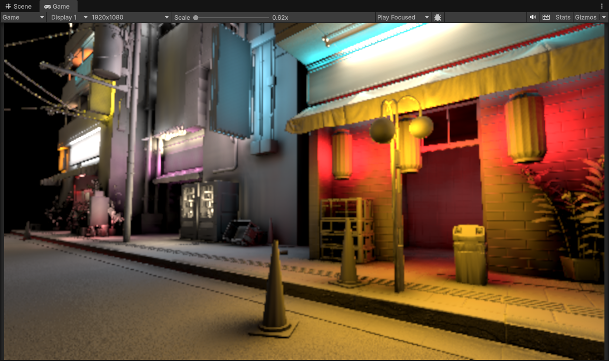
*1/4th Resolution (2 upsample passes)*

It's an improvement... It's certianly more desirable than the point filtering, but the blockiness is still very visible. Additionally the colors themselves are not properly aligned with the scene like it was with full resolution. 

Bilinear filtering does help *(and the cost is essentially free, virtually all modern hardware now supports it)* but obviously it's not enough... 

We need to cover a wider pixel region!

### Upsampling - Wider Blur Filters


*1/4th Resolution (2 upsample passes)*

Here I am showing off a 9-tap single-pass gaussian blur. 

We can see that now the underlying effect is much smoother compared to bilinear filtering. The pixelation artifacts and blockiness are much less visible now. Awesome! 

```HLSL
float4 UpsampleGaussian9Tap(float2 uv, float2 texelSize)
{
    float4 uvOffset = texelSize.xyxy * float4(1.0f, 1.0f, -1.0f, 0.0f);

    half4 color = LowResColorSample(uv - uvOffset.xy);
    color += LowResColorSample(uv - uvOffset.wy) * 2.0f;
    color += LowResColorSample(uv - uvOffset.zy);
    color += LowResColorSample(uv + uvOffset.zw) * 2.0f;
    color += LowResColorSample(uv) * 4.0f;
    color += LowResColorSample(uv + uvOffset.xw) * 2.0f;
    color += LowResColorSample(uv + uvOffset.zy);
    color += LowResColorSample(uv + uvOffset.wy) * 2.0f;
    color += LowResColorSample(uv + uvOffset.xy);

    return color * 0.0625f;
}
```

I am using a 9-tap single-pass gaussian blur. Not multi-pass, just single pass but at a very small radius. You could use different variants like a box filter, or a smaller kernel like a 5-tap or a 7-tap hexagonal.

But of course while we did mitigate most of the pixelation/blockiness, we still are left with the other problem with doing things at low resolution. 

**That being that piels do not align with the underlying scene well at all.** The wider filtering we are doing here just looks like a wierd bloom or blur effect. None of the details of the scene are preserved and it will only get worse with lower and lower resolutions.


*1/8th Resolution (3 upsample passes)*

We need to somehow more intelligently determine what spots will recieve more blur, and what spots will try to remain sharp. 

So how can we do this?

### Upsampling - Depth Aware

Enter depth upsampling. 

We build on the idea before where we need to spread our pixel across to more areas than just that 2x2 block. This fixes the pixelation/aliasing problems, **but we need to be smarter as to how to spread those pixels around.**

Fortunately, due to the nature of this effect *(Diffuse Global Illumination)* we already have access to a depth buffer which we used initally to calculate lighting for the visible surfaces in the scene.


*Raw Scene Depth*

The depth buffer essentially tells us where surfaces are in the scene. Let's reuse it here to guide our upsampling filter!

Using the depth buffer we can determine roughly where there are continous smooth/flat surfaces, or if there are large gaps/discontinuities. 


The left side is zoomed into a pixel region of the depth buffer where we can see that alot of the pixels here are roughly the same. So when we compute the depth differences between the pixels in this region, it will be small or the same. This means that we should spread pixels around here more easily.

The right side is zoomed into a pixel region of the depth buffer where we can see that there a lot of differences and discontinuity. So when we compute the depth differences between the pixels in this region, it will be large. This means that we should NOT spread pixels around here that easily.

```HLSL
float4 UpsampleGaussian9TapDepthAware(float2 uv, float2 texelSize)
{
    float highResDepth = HighResDepthSample(uv);

    float2 uv0 = uv + float2(-texelSize.x, -texelSize.y); //top left
    float2 uv1 = uv + float2( 0.0,         -texelSize.y); //top
    float2 uv2 = uv + float2( texelSize.x, -texelSize.y); //top right
    float2 uv3 = uv + float2(-texelSize.x,          0.0); //left
    float2 uv5 = uv + float2( texelSize.x,          0.0); //right
    float2 uv6 = uv + float2(-texelSize.x,  texelSize.y); //bottom left
    float2 uv7 = uv + float2( 0.0,          texelSize.y); //bottom
    float2 uv8 = uv + float2( texelSize.x,  texelSize.y); //bottom right

    float lowResDepth0 = LowResDepthSample(uv0);
    float lowResDepth1 = LowResDepthSample(uv1);
    float lowResDepth2 = LowResDepthSample(uv2);
    float lowResDepth3 = LowResDepthSample(uv3);
    float lowResDepth4 = LowResDepthSample(uv); //center
    float lowResDepth5 = LowResDepthSample(uv5);
    float lowResDepth6 = LowResDepthSample(uv6);
    float lowResDepth7 = LowResDepthSample(uv7);
    float lowResDepth8 = LowResDepthSample(uv8);

    float depthWeight0 =       (1.0 / (abs(highResDepth - lowResDepth0) + 1e-4));
    float depthWeight1 = 2.0 * (1.0 / (abs(highResDepth - lowResDepth1) + 1e-4));
    float depthWeight2 =       (1.0 / (abs(highResDepth - lowResDepth2) + 1e-4));
    float depthWeight3 = 2.0 * (1.0 / (abs(highResDepth - lowResDepth3) + 1e-4));
    float depthWeight4 = 4.0 * (1.0 / (abs(highResDepth - lowResDepth4) + 1e-4)); //center
    float depthWeight5 = 2.0 * (1.0 / (abs(highResDepth - lowResDepth5) + 1e-4));
    float depthWeight6 =       (1.0 / (abs(highResDepth - lowResDepth6) + 1e-4));
    float depthWeight7 = 2.0 * (1.0 / (abs(highResDepth - lowResDepth7) + 1e-4));
    float depthWeight8 =       (1.0 / (abs(highResDepth - lowResDepth8) + 1e-4));

    float4 color0 = LowResColorSample(uv0);
    float4 color1 = LowResColorSample(uv1);
    float4 color2 = LowResColorSample(uv2);
    float4 color3 = LowResColorSample(uv3);
    float4 color4 = LowResColorSample(uv); //center
    float4 color5 = LowResColorSample(uv5);
    float4 color6 = LowResColorSample(uv6);
    float4 color7 = LowResColorSample(uv7);
    float4 color8 = LowResColorSample(uv8);

    float4 color = 
        color0 * depthWeight0 + 
        color1 * depthWeight1 + 
        color2 * depthWeight2 + 
        color3 * depthWeight3 + 
        color4 * depthWeight4 + 
        color5 * depthWeight5 + 
        color6 * depthWeight6 + 
        color7 * depthWeight7 + 
        color8 * depthWeight8;

    float totalWeight = 
        depthWeight0 + 
        depthWeight1 + 
        depthWeight2 + 
        depthWeight3 + 
        depthWeight4 + 
        depthWeight5 + 
        depthWeight6 + 
        depthWeight7 +
        depthWeight8;

    return color / max(totalWeight, 1e-6); //avoid divide by zero with max
}
```

By using Depth upsampling here and weighting (multiplying) each of our taps based on how the depth changes, we can see how this affects our blur filter now...


*1/4th Resolution (2 upsample passes)*

We can actually see some of original sharp edges of some of the objects in the scene coming back now!

For some effects like volumetric fog, or mabye even SSAO, this is usually where your work would end.

But with something as complicated as calulating diffuse global illumination however, I discovered that this still wasn't quite convincing enough for me *(and mabye even for you)*. 

The quality is certainly better than it was, but there were still large portions of the scene here where surfaces that originally had plenty of detail now get smeared over when we compare with the original expensive full resolution buffer.


*Full Resolution (0 upsample passes)*

So using depth helps, but it looks like we need more information about the scene in order to better spread our pixels around. Is there another attribute aside from just depth that we can utlize to help align/place pixels even more?

### Upsampling - Depth and Normal Aware

Enter depth-normal upsampling. 

Once again we build on the idea before with depth aware upsampling. Now we add an additional attribute, so along with using the scene depth buffer, we will also use scene normal buffer to help more with retaining the edges of objects and even some normal mapped details. 

Just like the depth buffer, we also used the normal buffer in our inital lighting calculations to find the orientation of a surface and calculate the lighting of that point. Lets reuse it again here to guide our upsample filtering.

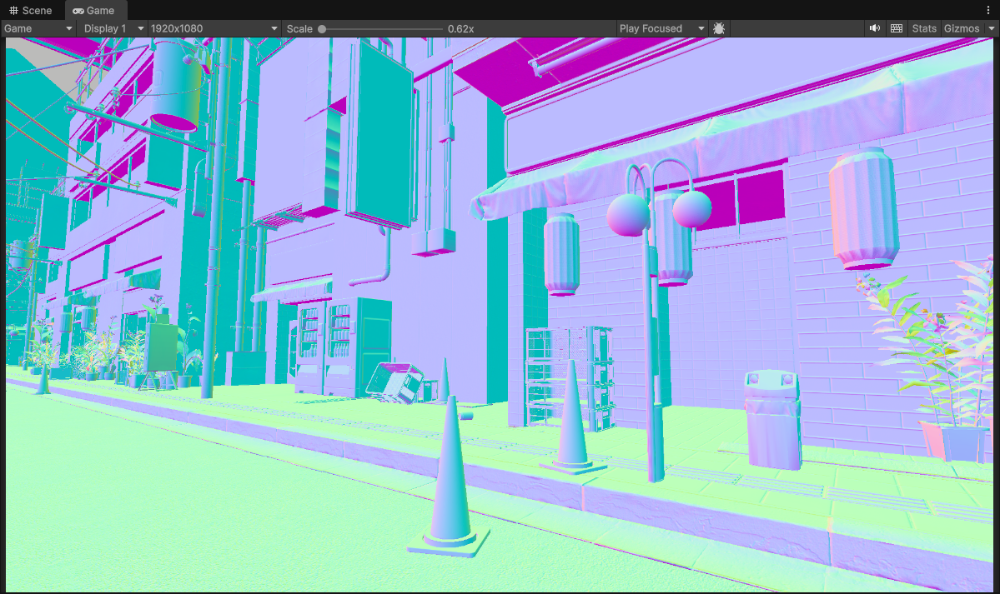
*Scene Normals ([0..1] range)*

Normals tell us the orientation of surfaces in a scene.

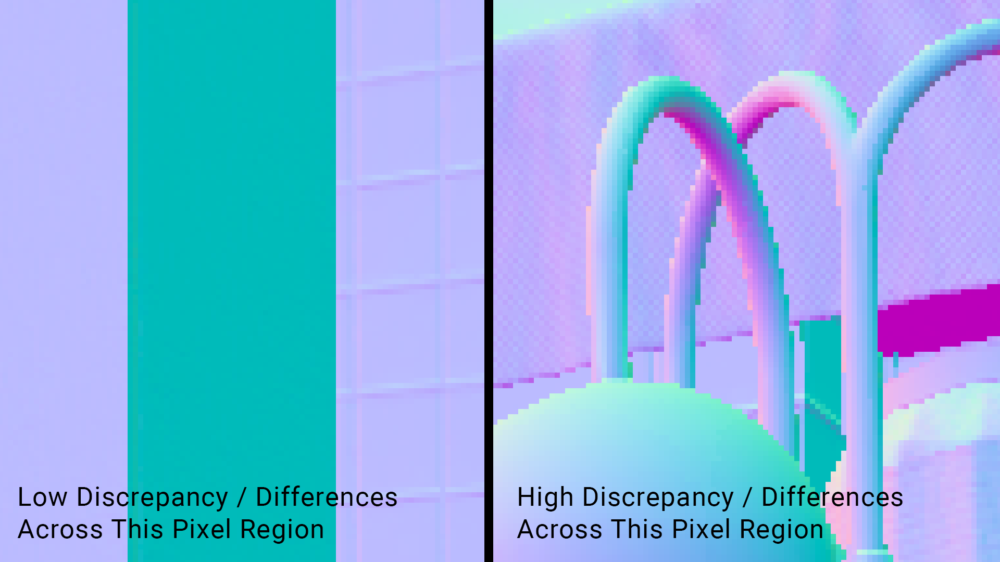

The left side is zoomed into a pixel region of the normal buffer where we can see that alot of the pixels here are roughly the same. So when we compute the normal differences between the pixels in this region, it will be small or the same. This means that we should spread pixels around here more easily.

The right side is zoomed into a pixel region of the normal buffer where we can see that there a lot of differences and discontinuity. So when we compute the normal differences between the pixels in this region, it will be large. This means that we should NOT spread pixels around here that easily.

```HLSL
float4 UpsampleSmooth_Gaussian9Tap_DepthNormalAwareInterpolated(float2 uv, float2 texelSize)
{
    float highResDepth = HighResDepthSample(uv);
    float3 highResNormal = HighResNormalSample(uv);

    float2 uv0 = uv + float2(-texelSize.x, -texelSize.y); //top left
    float2 uv1 = uv + float2( 0.0,         -texelSize.y); //top
    float2 uv2 = uv + float2( texelSize.x, -texelSize.y); //top right
    float2 uv3 = uv + float2(-texelSize.x,          0.0); //left
    float2 uv5 = uv + float2( texelSize.x,          0.0); //right
    float2 uv6 = uv + float2(-texelSize.x,  texelSize.y); //bottom left
    float2 uv7 = uv + float2( 0.0,          texelSize.y); //bottom
    float2 uv8 = uv + float2( texelSize.x,  texelSize.y); //bottom right

    float lowResDepth0 = LowResDepthSample(uv0);
    float lowResDepth1 = LowResDepthSample(uv1);
    float lowResDepth2 = LowResDepthSample(uv2);
    float lowResDepth3 = LowResDepthSample(uv3);
    float lowResDepth4 = LowResDepthSample(uv);
    float lowResDepth5 = LowResDepthSample(uv5);
    float lowResDepth6 = LowResDepthSample(uv6);
    float lowResDepth7 = LowResDepthSample(uv7);
    float lowResDepth8 = LowResDepthSample(uv8);

    float3 lowResNormal0 = LowResNormalSample(uv0);
    float3 lowResNormal1 = LowResNormalSample(uv1);
    float3 lowResNormal2 = LowResNormalSample(uv2);
    float3 lowResNormal3 = LowResNormalSample(uv3);
    float3 lowResNormal4 = LowResNormalSample(uv);
    float3 lowResNormal5 = LowResNormalSample(uv5);
    float3 lowResNormal6 = LowResNormalSample(uv6);
    float3 lowResNormal7 = LowResNormalSample(uv7);
    float3 lowResNormal8 = LowResNormalSample(uv8);

    float depthWeight0 =       (1.0 / (abs(highResDepth - lowResDepth0) + 1e-4));
    float depthWeight1 = 2.0 * (1.0 / (abs(highResDepth - lowResDepth1) + 1e-4));
    float depthWeight2 =       (1.0 / (abs(highResDepth - lowResDepth2) + 1e-4));
    float depthWeight3 = 2.0 * (1.0 / (abs(highResDepth - lowResDepth3) + 1e-4));
    float depthWeight4 = 4.0 * (1.0 / (abs(highResDepth - lowResDepth4) + 1e-4));
    float depthWeight5 = 2.0 * (1.0 / (abs(highResDepth - lowResDepth5) + 1e-4));
    float depthWeight6 =       (1.0 / (abs(highResDepth - lowResDepth6) + 1e-4));
    float depthWeight7 = 2.0 * (1.0 / (abs(highResDepth - lowResDepth7) + 1e-4));
    float depthWeight8 =       (1.0 / (abs(highResDepth - lowResDepth8) + 1e-4));

    //NOTE: this might be able to be approximated or simplified some more
    float normalPower = 10.0f;
    float normalWeight0 = pow(saturate(dot(highResNormal, lowResNormal0)), normalPower);
    float normalWeight1 = pow(saturate(dot(highResNormal, lowResNormal1)), normalPower);
    float normalWeight2 = pow(saturate(dot(highResNormal, lowResNormal2)), normalPower);
    float normalWeight3 = pow(saturate(dot(highResNormal, lowResNormal3)), normalPower);
    float normalWeight4 = pow(saturate(dot(highResNormal, lowResNormal4)), normalPower);
    float normalWeight5 = pow(saturate(dot(highResNormal, lowResNormal5)), normalPower);
    float normalWeight6 = pow(saturate(dot(highResNormal, lowResNormal6)), normalPower);
    float normalWeight7 = pow(saturate(dot(highResNormal, lowResNormal7)), normalPower);
    float normalWeight8 = pow(saturate(dot(highResNormal, lowResNormal8)), normalPower);

    float4 color0 = LowResColorSample(uv0);
    float4 color1 = LowResColorSample(uv1);
    float4 color2 = LowResColorSample(uv2);
    float4 color3 = LowResColorSample(uv3);
    float4 color4 = LowResColorSample(uv);
    float4 color5 = LowResColorSample(uv5);
    float4 color6 = LowResColorSample(uv6);
    float4 color7 = LowResColorSample(uv7);
    float4 color8 = LowResColorSample(uv8);

    //combined weights
    float w0 = depthWeight0 * normalWeight0;
    float w1 = depthWeight1 * normalWeight1;
    float w2 = depthWeight2 * normalWeight2;
    float w3 = depthWeight3 * normalWeight3;
    float w4 = depthWeight4 * normalWeight4;
    float w5 = depthWeight5 * normalWeight5;
    float w6 = depthWeight6 * normalWeight6;
    float w7 = depthWeight7 * normalWeight7;
    float w8 = depthWeight8 * normalWeight8;

    //weighted accumulation
    float4 color =
        color0 * w0 + 
        color1 * w1 + 
        color2 * w2 +
        color3 * w3 + 
        color4 * w4 + 
        color5 * w5 +
        color6 * w6 + 
        color7 * w7 + 
        color8 * w8;

    float totalWeight = w0 + w1 + w2 + w3 + w4 + w5 + w6 + w7 + w8;

    color /= max(totalWeight, 1e-6);

    return color;
}
```

Implementing it very similarly here with the depth, we just do 9 taps *(or whatever amount your underlying filter is doing)* with normal, then calculate the deviations that happen between the pixel regions and we weigh these with our depth.

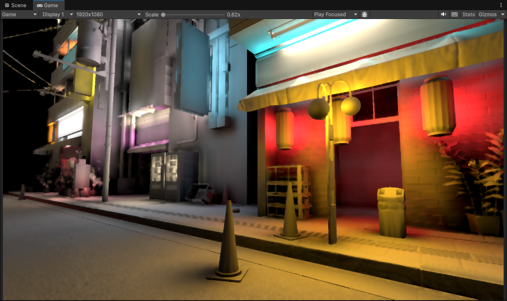
*1/4th Resolution (2 upsample passes)*

Nice! We can see now that this is a significant improvement over just depth-aware upsampling. Geometry edges are almost fully preserved now, and much less pixelation artifacts are visible at the same time.

In fact this gives me enough confidence in that I might push things further by dropping the resolution to 1/8th and see how things hold up.


*1/8th Resolution (3 upsample passes)*

Surpisingly well, some pixelation is more visible now of course but the depth-normal aware upsampling is doing a fantastic job of keeping all of the geometry edges and some of the normals sharp and visible.

But even then... there are still some things that irk me even at 1/4th resolution, and the issues get more visible when dropping down to 1/8th now. Geometry edges are kept in-tact but most of the original normal-mapped material details of the scene are mostly gone now. Pixelation details also are starting to become even more visible.

Is there a way to hide those pixelation artifacts some more, and mabye even bring back normal-mapped details?

*Spoiler: Yes!*

#### Optimization Bonus

Now I would like to point out here that depending on your setup this depth-normal upsampling will cost an extra render target, which means more texture lookups to factor in this normal buffer read like you see in this implementation.

An additional optimization here that you can that is to pack a singluar float4 render target with both depth *(16-bit half precision)* and normal *(encoded into a 2 channel using octahedron/spherical coordinates/etc).* 
- RG: Depth (Half Precsion 16-bit)
- BA: Normal (Encoded into 2 component 16-bit)

This would reduce the texture fetches, at the expense of adding additional instructions for unpacking the render target for use in the filter. *(You are basically trading memory for ALU here. Fortunately with most modern hardware now being more capable, this is prefered so that way you are not bound by memory access speeds with texture reads)*.

```HLSL
//PUSEDO CODE
void UnpackDepthNormalTarget(in float4 depthNormal, out float depth, out float3 normal)
{
    //take 'depthNormal' which should be RGBA32 (or RGBA64 if you want more precision)
    //RG: 16 bits half precision depth
    //BA: 16 bits encoded normal (normal can be encoded with spherical coordinates/octahedron)

    //decode and output depth...

    //decode and output normal...
}
```

```HLSL
//optimizations made
// + texture fetches are reduced by 10 (19 now, compared to 29 before)
//   achieved with a packed RGBA Depth Normal render target.
//   trading for more ALU for unpacking instructions 
// + re-wrote normal weights and replaced pow with 4 mul's (hardcoded pow 4.0)
// + re-wrote depth weights to use HLSL rcp()
float4 UpsampleSmooth_Gaussian9Tap_DepthNormalAwareInterpolatedOptimized(float2 uv, float2 texelSize)
{
    float4 highResDepthNormal = HighResDepthNormalSample(uv);

    float highResDepth;
    float3 highResNormal;
    UnpackDepthNormalTarget(highResDepthNormal, highResDepth, highResNormal);

    float2 uv0 = uv + float2(-texelSize.x, -texelSize.y); //top left
    float2 uv1 = uv + float2( 0.0,         -texelSize.y); //top
    float2 uv2 = uv + float2( texelSize.x, -texelSize.y); //top right
    float2 uv3 = uv + float2(-texelSize.x,          0.0); //left
    float2 uv5 = uv + float2( texelSize.x,          0.0); //right
    float2 uv6 = uv + float2(-texelSize.x,  texelSize.y); //bottom left
    float2 uv7 = uv + float2( 0.0,          texelSize.y); //bottom
    float2 uv8 = uv + float2( texelSize.x,  texelSize.y); //bottom right

    float4 lowResDepthNormal0 = LowResDepthNormalSample(uv0);
    float4 lowResDepthNormal1 = LowResDepthNormalSample(uv1);
    float4 lowResDepthNormal2 = LowResDepthNormalSample(uv2);
    float4 lowResDepthNormal3 = LowResDepthNormalSample(uv3);
    float4 lowResDepthNormal4 = LowResDepthNormalSample(uv);
    float4 lowResDepthNormal5 = LowResDepthNormalSample(uv5);
    float4 lowResDepthNormal6 = LowResDepthNormalSample(uv6);
    float4 lowResDepthNormal7 = LowResDepthNormalSample(uv7);
    float4 lowResDepthNormal8 = LowResDepthNormalSample(uv8);

    float lowResDepth0;
    float lowResDepth1;
    float lowResDepth2;
    float lowResDepth3;
    float lowResDepth4;
    float lowResDepth5;
    float lowResDepth6;
    float lowResDepth7;
    float lowResDepth8;

    float3 lowResNormal0;
    float3 lowResNormal1;
    float3 lowResNormal2;
    float3 lowResNormal3;
    float3 lowResNormal4;
    float3 lowResNormal5;
    float3 lowResNormal6;
    float3 lowResNormal7;
    float3 lowResNormal8;

    UnpackDepthNormalTarget(lowResDepthNormal0, lowResDepth0, lowResNormal0);
    UnpackDepthNormalTarget(lowResDepthNormal1, lowResDepth1, lowResNormal1);
    UnpackDepthNormalTarget(lowResDepthNormal2, lowResDepth2, lowResNormal2);
    UnpackDepthNormalTarget(lowResDepthNormal3, lowResDepth3, lowResNormal3);
    UnpackDepthNormalTarget(lowResDepthNormal4, lowResDepth4, lowResNormal4);
    UnpackDepthNormalTarget(lowResDepthNormal5, lowResDepth5, lowResNormal5);
    UnpackDepthNormalTarget(lowResDepthNormal6, lowResDepth6, lowResNormal6);
    UnpackDepthNormalTarget(lowResDepthNormal7, lowResDepth7, lowResNormal7);
    UnpackDepthNormalTarget(lowResDepthNormal8, lowResDepth8, lowResNormal8);

    //replaced (1.0 / difference) with HLSL rcp()
    float depthWeight0 =       rcp(abs(highResDepth - lowResDepth0) + 1e-4);
    float depthWeight1 = 2.0 * rcp(abs(highResDepth - lowResDepth1) + 1e-4);
    float depthWeight2 =       rcp(abs(highResDepth - lowResDepth2) + 1e-4);
    float depthWeight3 = 2.0 * rcp(abs(highResDepth - lowResDepth3) + 1e-4);
    float depthWeight4 = 4.0 * rcp(abs(highResDepth - lowResDepth4) + 1e-4);
    float depthWeight5 = 2.0 * rcp(abs(highResDepth - lowResDepth5) + 1e-4);
    float depthWeight6 =       rcp(abs(highResDepth - lowResDepth6) + 1e-4);
    float depthWeight7 = 2.0 * rcp(abs(highResDepth - lowResDepth7) + 1e-4);
    float depthWeight8 =       rcp(abs(highResDepth - lowResDepth8) + 1e-4);

    //NOTE: this might be able to be approximated or simplified even more
    float normalWeight0 = saturate(dot(highResNormal, lowResNormal0));
    float normalWeight1 = saturate(dot(highResNormal, lowResNormal1));
    float normalWeight2 = saturate(dot(highResNormal, lowResNormal2));
    float normalWeight3 = saturate(dot(highResNormal, lowResNormal3));
    float normalWeight4 = saturate(dot(highResNormal, lowResNormal4));
    float normalWeight5 = saturate(dot(highResNormal, lowResNormal5));
    float normalWeight6 = saturate(dot(highResNormal, lowResNormal6));
    float normalWeight7 = saturate(dot(highResNormal, lowResNormal7));
    float normalWeight8 = saturate(dot(highResNormal, lowResNormal8));

    //NOTE: power has been reduced to 4, so the normal effect may not appear as strong but saves you from doing a pow op
    //you could just stack more mul's if you wanted a stronger effect
    normalWeight0 *= normalWeight0 * normalWeight0 * normalWeight0; //hardcoded pow 4.0
    normalWeight1 *= normalWeight1 * normalWeight1 * normalWeight1; //hardcoded pow 4.0
    normalWeight2 *= normalWeight2 * normalWeight2 * normalWeight2; //hardcoded pow 4.0
    normalWeight3 *= normalWeight3 * normalWeight3 * normalWeight3; //hardcoded pow 4.0
    normalWeight4 *= normalWeight4 * normalWeight4 * normalWeight4; //hardcoded pow 4.0
    normalWeight5 *= normalWeight5 * normalWeight5 * normalWeight5; //hardcoded pow 4.0
    normalWeight6 *= normalWeight6 * normalWeight6 * normalWeight6; //hardcoded pow 4.0
    normalWeight7 *= normalWeight7 * normalWeight7 * normalWeight7; //hardcoded pow 4.0
    normalWeight8 *= normalWeight8 * normalWeight8 * normalWeight8; //hardcoded pow 4.0

    float4 color0 = LowResColorSample(uv0);
    float4 color1 = LowResColorSample(uv1);
    float4 color2 = LowResColorSample(uv2);
    float4 color3 = LowResColorSample(uv3);
    float4 color4 = LowResColorSample(uv);
    float4 color5 = LowResColorSample(uv5);
    float4 color6 = LowResColorSample(uv6);
    float4 color7 = LowResColorSample(uv7);
    float4 color8 = LowResColorSample(uv8);

    //combined weights
    float w0 = depthWeight0 * normalWeight0;
    float w1 = depthWeight1 * normalWeight1;
    float w2 = depthWeight2 * normalWeight2;
    float w3 = depthWeight3 * normalWeight3;
    float w4 = depthWeight4 * normalWeight4;
    float w5 = depthWeight5 * normalWeight5;
    float w6 = depthWeight6 * normalWeight6;
    float w7 = depthWeight7 * normalWeight7;
    float w8 = depthWeight8 * normalWeight8;

    //weighted accumulation
    float4 color =
        color0 * w0 + 
        color1 * w1 + 
        color2 * w2 +
        color3 * w3 + 
        color4 * w4 + 
        color5 * w5 +
        color6 * w6 + 
        color7 * w7 + 
        color8 * w8;

    float totalWeight = w0 + w1 + w2 + w3 + w4 + w5 + w6 + w7 + w8;

    color /= max(totalWeight, 1e-6);

    return color;
}
```

## Temporal Instabilities

Now, quick spoiler there is still a couple of more additional stages needed to improve the quality even more but I wanted to take a pause real quick because there is something very important here that we need to consider before moving forward.

Remember that context wise we are in a game setting *(or a real-time context)*. The camera will be moving and changing, so will the scene... so how does our work hold up when the camera starts to move?


*1/8th Resolution (3 upsample passes)*

Yikes! Not good at all. 

There is a lot of flickering, and the lower we go resolution wise the worse the artifacts and flickering get...


*1/16th Resolution (4 upsample passes)*

This does make some sense... If you remember one of the tradeoffs I mentioned with reducing resolution is that since pixels become larger, that means when a pixel changes it's much more visible.

One of the issues I noticed when even using just upsampling is that in motion I had a lot of aliasing and instability when reducing the resolution of the lighting. 

Not good at all... is there a way to fix this?

### Temporal Instability Solutions: Temporal Filtering?

Fortunately the industry has come up with a way to resolve such an issue. The technique is called temporal filtering. The idea is that you use previous frames and reproject into the current frame to gradually fade in any new pixel changes that occur. 

I did go forward and implement this...


*1/8th Resolution (3 upsample passes) with Full Resolution Temporal Filtering*

Ok good, this definetly solves a lot of the flickering!

But...

It's still visible in some spots, and just like any solution this introduces it's own set of problems. Problems that I find quite destructive to my final image quality.

1. **Temporal Filtering relies on good Temporal Resolution.** In english this means that the more frames you have, the better the quality/resolve. However! In games you often don't have the greatest temporal resolution anyway *(low FPS)*, and it can fluctuate! So the resolve worsens especially if you are on low spec hardware!

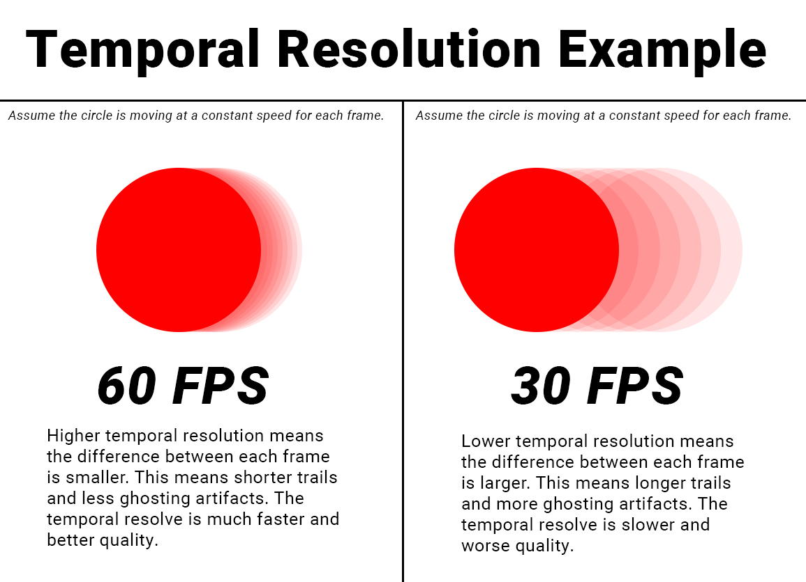

2. **Temporal Filtering introduces ghosting/trailing artifacts.** While additional attributes and conditions can be introduced to mitigate these artifacts, they will still be present in your image and you will have to constantly tweak and fight these artifacts that still muddy up your image quality in the end.


*1/8th Resolution With Full Resolution Temporal Filtering (3 upsample passes)*


*1/8th Resolution With Full Resolution Temporal Filtering, very visible trailing artifacts.*

Part of my attempts to fix this also was to try doing the temporal filtering at 1/8th resolution instead of at full resolution. 

Any artifacts brought on by the temporal filtering natrually would get blurred/smoothed out with the chained depth-normal aware upsampling that happens after. 

Though I also suspected that some of the flickering artifacts with the upsample would come back when we do the temporal filter at a lower resolution. Since now we can no longer fade pixel changes at a finer scale with the higher resolution to alleviate some of those flickers in the first place.


*1/8th Resolution Temporal Filtering with 3 depth-normal aware upsample passes after.*

Yep, so some of the flickering artifacts have came back, that makes sense since now we are no longer doing the temporal filter at full resolution. So it can't take care of some of the flickering artifacts brought on by the upsampling.

As a plus atleast it seems the sharp trailing artifacts appear to be mostly gone now, but there seems to be some other oddities going on...

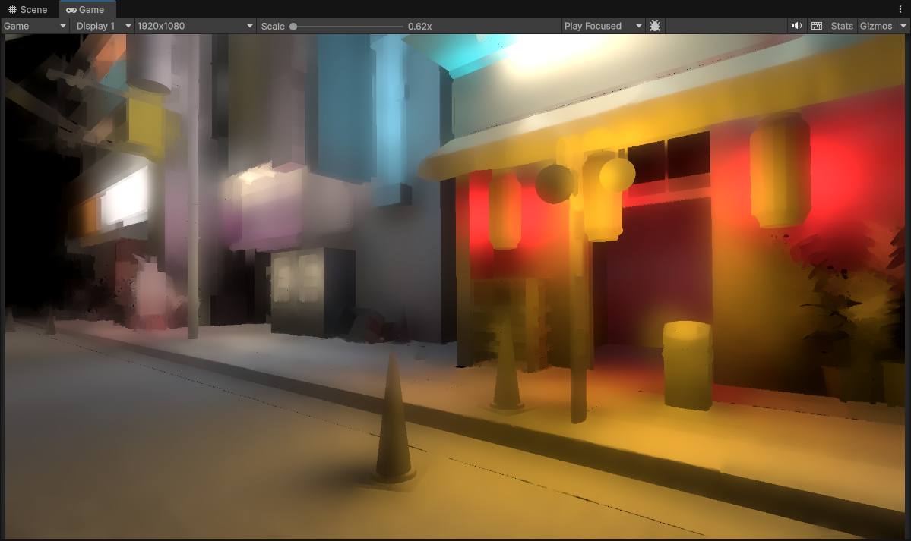
*1/8th Resolution With Full Resolution Temporal Filtering (3 upsample passes)*

It appears that the image overall has gotten a lot softer. In addition also I am still seeing ghosting trails behind objects like I was before.


The only difference now is that it's less sharp and more blurred out. It is an improvement over doing it at full resolution but even with some more tweaking these ghosts are still very visible and contribute to a much softer final image.

As a result most of these problems were enough to make me want to avoid using Temporal Filtering altogether. It ended up creating more problems than it was intended to solve so temporal filtering for me is out of the window here. There has to be another way to somehow smooth out these results without resorting to temporal filtering and the problems it creates. 

Back to the drawing board...

### Investigations into Temporal Instabilities

I was geuinely curious as where this source of instability/flickering was coming from and if there was any kind of solution to solve it. 

The global illumination technique I am using here is called Voxel Cone Tracing. I won't explain what it does because that is not what this article is about *(and it would take too long)*, but the algorithim itself does not introduce any inherent noise or a large amount of instability/flickering with how I have it setup. 

So the flickering/instability has to be coming from somewhere else... 

I decided to have a look at the other componets that get used to calculate the lighting. The main buffers that get used in the lighting calculations are the depth and normal buffers. If we look at the raw depth and normal buffer we are using for our inital lighting calculation, they look fine in motion.

<p float="left">
    
    
</p>

*Left: Full Resolution Depth | Right: Full Resolution Scene Normals ([0..1] range)*

But wait, we are looking at the full resolution buffers here, and the lighting gets calculated at a reduced resolution. Ok, so let's look at the buffers when it's being used in that low resolution context directly...

<p float="left">
    
    
</p>

*Left: 1/8th Resolution Depth | Right: 1/8th Resolution Scene Normals ([0..1] range)*

Interesting... there is a lot of flickering and instability happening here, why?

Well this is because when we are calculating lighting at a low resolution, we are using these high resolution buffers as-is. This is a problem because we can't use it at the full resolution *(we are working at 1/8th resolution)* so only portions of it gets used. As a result we actually wind up skipping pixels! 

I'll show you what I mean.

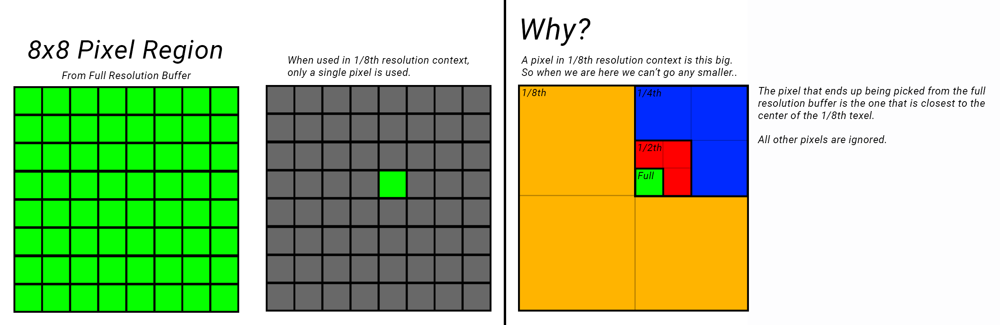

So here we are calculating at 1/8th resolution, when we just use the full resolution buffer as is, turns out it's picking only a single pixel from an entire region essentially 8x8 pixel region. Out of 64 possible pixels we are just picking out only 1 pixel! 

As a result this leads to the flickering that we are seeing, because now the changes between pixels are much more drastic leading to this increased aliasing and flickering. This is also happening in our upsampling stages as well since we are using low resolution depth/normals to check differences with the high resolution variants.

Ok, is there a way we can actually utilize those other 63 pixels that are just flat out being skipped?

### Temporal Instability Solutions: Downsampling?

So before we can use our buffers in the 1/8th resolution context, we need to actually prepare them so they can be used in that 1/8th context properly. Downsampling can help us with that.

Downsampling is about taking a large set of data, and effectively "compressing" it down to a smaller set. It's essentially the reverse/opposite of upsampling we were doing earlier.

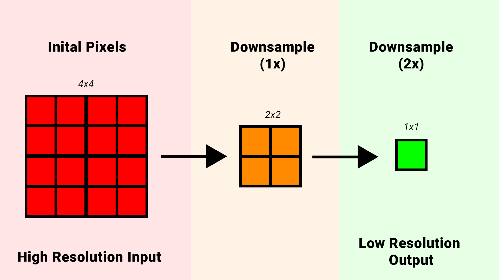

The simplest and most common downsampling algorithim used is just a simple average. Essentially you take any given number of samples, add them together and then divide by the sample count.

```
4 5 4 4 4 6 5 4 7 6 6 4 (12 samples)
4 + 5 + 4 + 4 + 4 + 6 + 5 + 4 + 7 + 6 + 6 + 4 = 59 / 12 = 4.917
```

Notice how there are some outlier samples in the set *(7)* but due to the other larger quanity of numbers that are similar in range the final averaged value comes out roughly to 4 - 5.

In the context of pixels/images, if a lot of pixels remain roughly the same then the final value will virtually be the same, but if there is some outliers in the set the influence of those samples natrually will get reduced/averaged out. This is an interesting behavior because one of the problems I mentioned that comes from reduced resolution is that pixel changes become more visible. If the surrounding pixels are mostly the same then the pixel changes will get averaged out.

So it sounds like there is an inherent temporal behavior happening here... Okay that seems sound... why not use it for those scene buffers as well.

In my pipeline I introduce passes now where I downsample both scene normal buffer and depth buffer so I can prepare them for use in the low resolution lighting calculations. It's similar to the upsampling chain setup, but I just do it in reverse now for downsampling.

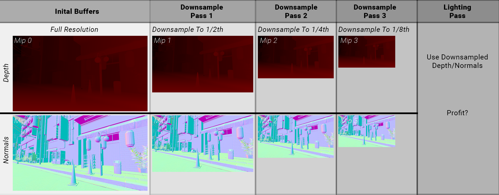

*NOTE: This was my inital downsampling pipeline, however an optimization [that I mentioned earlier](#optimization-bonus) that you can do is to pack both depth and normals into a single RGBA32 render target. This would save memory (and texture fetches later) and also simplify the pipeline here to just 1 render target that gets downsampled. Reducing draws and shader invocations, I recomend doing it.*

<p float="left">
    
    
</p>

*Left: 1/8th Resolution Scene Depth | Right: 1/8th Resolution Scene Normals ([0..1] range)*

In my case I just use a very simple 2x2 downsample average. Different downsampling filters could likely be utilized here but I wanted to start simple.

```HLSL
float4 DownsampleAverage2x2(float2 uv, float2 texelSize)
{
    float4 color = ColorSample(uv + float2(texelSize.x, 0)) +
    ColorSample(uv - float2(texelSize.x, 0)) +
    ColorSample(uv + float2(0, texelSize.y)) +
    ColorSample(uv - float2(0, texelSize.y));
    return color * 0.25f;
}
```

So let's apply this downsample filter chain and check what the normal buffer looks like in motion now...

<p float="left">
    
    
</p>

Ooooo! So after applying a downsample filter to our normal buffer *(and depth buffer)*, much of the flickering actually vanishes when looking at the buffers by itself. This is promising...

I went ahead and applied the same downsampling process to the depth buffer as well. Now I'm left with these scene buffers downsampled to the resolution that the lighting gets calculated at, so lets use them now for calculating lighting *(and the upsampling stages)* and see what happens... *(Looking at the still frame first)*


*1/8th Resolution (3 upsample passes)*

Ok interesting... I can actually see a lot less pixelation now compared to before even in a still frame, and the lighting results are slightly different. Some spots do appear wierder *(I'll explain why that is in a bit)* but for the most part everything still looks pretty good.

So how does this look in motion now?


*1/8th Resolution (3 upsample passes)*

Wow! Massive difference!

We can see this gets more dramatic also when we reduce the resolution much further and pile up more progressive upsamples. It remains pretty stable temporally, even when we are as low as 1/16th resolution! 


*1/16th Resolution (4 upsample passes)*

Granted we can make out some funk in the quality. The pixelation does get more visible when we go lower, but of course that is because downsampling is not a perfect solution. Every solution introduces their own set of issues, but I find the issues here much more tame and less visible than temporal filtering artifacts like ghosting/trails that we saw before *(and being bound by temporal resolution)*. Importantly for me, the scene remains sharp even in motion.

Still, I want to explore why our lighting looks a little different *(might even be considered worse in some areas)*.

### Downsampling - Drawbacks

With downsampling, we reduce a set of pixels down to one, and effectively construct a fresh and unique new pixel value. Ok sure that makes sense, that is what we were trying to do in order to gain temporal stability in the first place.

But I want to explain the drawbacks of downsampling in this context, and why some graphics programmers shy away from doing this *(and for good reason)*.

The reason being that with downsampling, you are creating a fresh new pixel out of a set of original pixels. In the context of depth, you are taking a set of original depth values, are a creating a fresh new unqiue depth value. **A depth value that of which does not exist in the original depth buffer.** *(Same with the normal buffer)*

If you recall back to the basic math example from earlier...

```
4 5 4 4 4 6 5 4 7 6 6 4 (12 samples)
4 + 5 + 4 + 4 + 4 + 6 + 5 + 4 + 7 + 6 + 6 + 4 = 59 / 12 = 4.917
```

The final averaged value is 4.917, which is close to 5 but **4.917 is a value that never actually existed in the original set.**

Technically this means that if you are doing a lighting calculation for example, you use depth to reconstruct the position of a pixel so you can calculate the lighting at that point. 

**When you introduce downsampling, that depth value actually changes so when you calculate position now, it actually gets shifted and that means the lighting at a given surface point is actually not 100% accurate.** It's in the wrong spot! Either its slightly pushed forward or slightly pushed backwards depending on the surrounding pixels of that region. In our image in some spots this can actually introduce a "halo" around some objects in the foreground.


*1/8th Resolution (3 upsample passes)*

This also applies to the normals as well, surface normals within an area get averaged to form a new normal value. This normal value is then shifted in a different direction leading to slightly different lighting results for some surfaces.

Now if this is a concern, there are different downsampling filters that exist. For instance with depth it's common to actually use a min or max filter since those will pick either the closest *(or farthest)* pixel that was in the set and use that. However Min/Max does not average out pixel changes across an area so that inherent temporal behavior I described with averaging does not happen.

This is why temporal filtering is also attractive to some graphics programmers *(and by extension, why some of the industry is pushing for it)*. It is because it does a better job at retaining "correctness" or accuracy of those original samples. 

Some even take it as far introducing "jittering". If you remember also from earlier when I described the inital problem of how we only picked 1 pixel out of a region of 8x8 pixels...

**[INSERT EXAMPLE GRAPHIC HERE WITH A 1X1 PIXEL REGION AND 8X8 PIXEL REGION]**

With jittering, we still ultimately choose 1 pixel from the region, but with the concept of time/temporal in the mix we actually change which pixel we choose within that region every frame.

**[INSERT EXAMPLE GRAPHIC HERE WITH A 1X1 PIXEL REGION AND 8X8 PIXEL REGION AND DOING JITTERING]**

You can see here across 4 frames we chose 4 different pixels from that region. Natrually the temporal filtering will blend these pixels together and we retain correctness.

But that is still 4 pixels out of a total of 64 in that 8x8 region, we could introduce more jitter samples across time. But covering the full 64 samples across 64 frames requires a lot of temporal resolution. Temporal resolution that often we don't have, considering the common target framerate for games are 60 frames a second, and a lot can change in a second!

You could also try not dropping the resolution that far. For example just going down to a quarter resolution *(rather than 1/8th)* gives you a 4x4 pixel region of 4x4 = 16 pixels. Less samples that you need to cover, but still thats 16 frames of blending needed across time.

An interesting solution that the industry is also adopting is a combination of these two ideas so to speak. This amounts to Spatio-Temporal upsampling and this interestingly actually starts leading into the core ideas behind upscalars like FSR, DLSS, Intel XeSS. Where you have a spatial component of the filter that takes care of smoothing out pixels across an area, and the temporal component takes care of smoothing out pixel changes across time.

However... as I pointed out, temporal filtering at large still introduces visual issues that I'm not a fan of so I would like to avoid it if I can.

So ultimately I just went forward with downsampling as my main solution for temporal stability as the gains were to significant to ignore. Outside of that I don't know any other techniques or solutions that could be employed. *(NOTE: If you do have a solution or know of one, PLEASE LET ME KNOW!)*.

This doesn't apply just to depth of course, this applies to the other scene buffers that get downsampled as well. Normals will be shifted, and with the Specular buffer those values get shifted as well.

#### Temporal Solution Comparisons

<p float="left">
    
    
</p>

*Left: 1/8th Resolution With Full Resolution Temporal Filter | Right: 1/8th Resolution With Downsampled Buffers*

<p float="left">
    
    
</p>

*Left: 1/8th Resolution No Downsampled Buffers | Right: 1/8th Resolution With Downsampled Buffers*

<p float="left">
    
    
</p>

*Left: 1/16th Resolution No Downsampled Buffers | Right: 1/16th Resolution With Downsampled Buffers*

So to conclude this section I want to share what the pipeline looks. You might have missed it but I also mentioned that the downsampled buffers also get used in each of the upsampling stages. They are all stored in the mip levels so with each progressive upsample we use the respective mip level *(that holds the downsampled render target)* which helps alot with improving temproal stability in the final image. We also pointed out that it improves the spatial quality as well reducing pixelation on the final frame.


## Upsampling - How to go further?


*1/8th Resolution (3 upsample passes)*

Shifting gears back to improving the spatial quality of the lighting *(now with the temporal component at a decent spot)*, even with the downsampled buffers and the best upsampling I was able to find, this still was not convincing enough for me even at lower resolutions because surfaces still get smeared too much!

So we need to take a step back and think as to why this is really happening. Why are the surfaces looking so smeary/blurry? 

Well when we do lighting, surface position matters a great deal. That is mostly already covered though fortunately thanks to the depth-aware upsampling that we do. 

Another factor that significantly affects the lighting of a surface is it's orientation, or normal. The depth-normal-aware upsampling again help with this but it's still not enough... so what's missing?

Do we need another scene attribute?

Well for diffuse lighting we have the surface position, and the surface normal. We do have surface roughness and metallic, but those are meant for specular and don't have an effect on the actual diffuse term... mabye surface occlusion? 

Sure lets try that. Most materials/objects in my project have an authored ambient occlusion map, let's try factoring that in. 


*Full Resolution Scene Material Occlusion*

Applying occlusion by just multiplying the final lighting buffer with it.

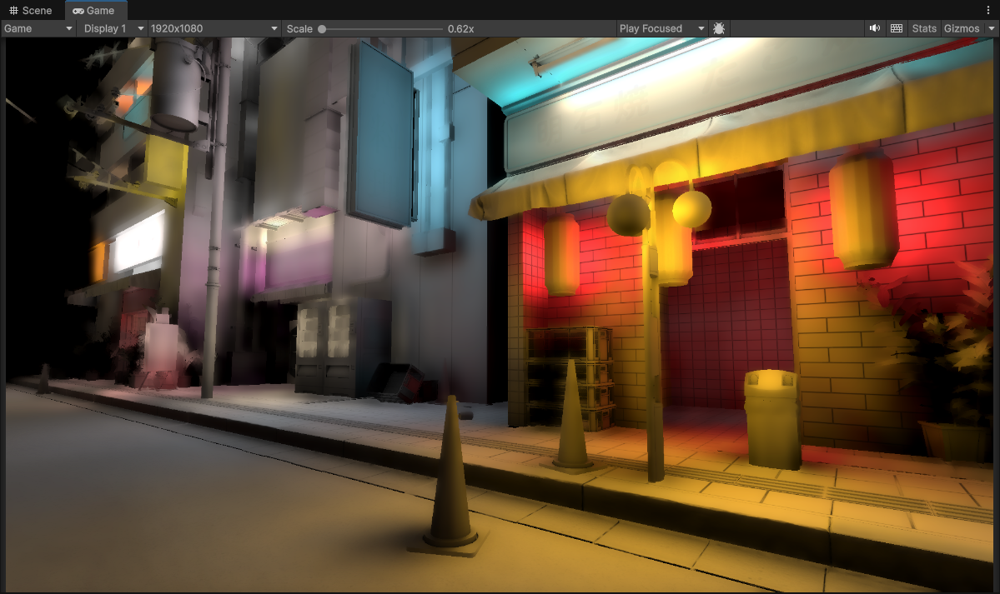
*1/8th Resolution (3 upsample passes) + Full Resolution Material Occlusion*

Ok... that helped, but it's not good enough. 

We can still see underneath it that things are blurred and smeary, some objects in the scene still turn into a blobby mess. 

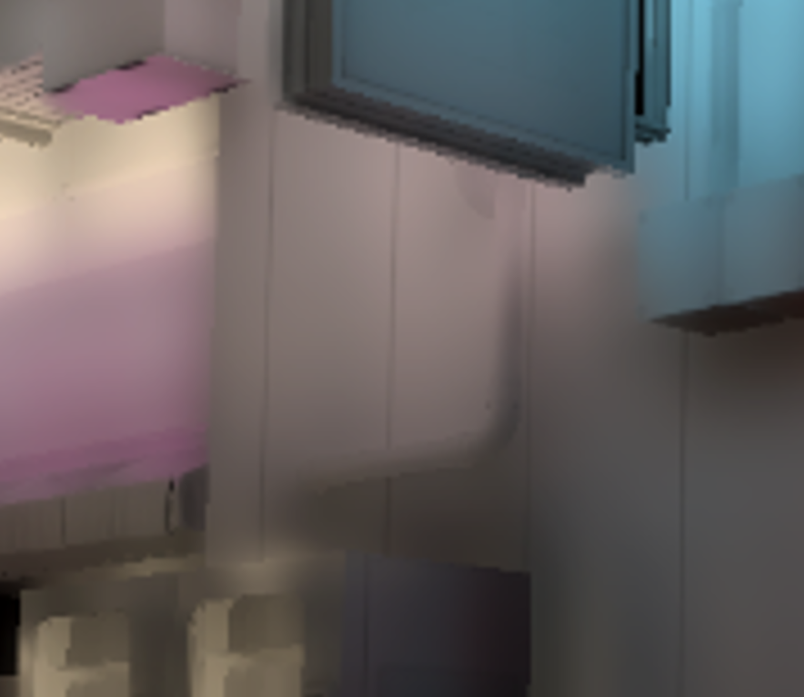
*1/8th Resolution (3 upsample passes) + Full Resolution Material Occlusion*

What's worse is that some object's in my project don't *(and wont)* have authored ambient occlusion maps, so those will be left out completely!

We don't have any other scene attributes we can really utilize here to push things further, so we are kind of stuck. We have to look deeper, and really examine why things are blurred and smeary.

Now conceptually for each pixel we only have a single color that we are juggling around a given image region. We are much more selective now as to where we place this color value. But it's only just a color value... mabye we need more than just 1 color value per pixel?

Ok sure, having more color values would help, but in order to get more data shouldn't we increase resolution to do that? 

We can... but that leads to worse performance, and that goes against what we were trying to do in the first place, which was reduce resolution and do all this upsampling!

Ok... is there another way we can increase the amount of data without doing that?

### Spherical Harmonics


*Image by Iñigo Quilez illustrating the directions that Spherical Harmonics can represent. 3 orders are represented here from top to bottom. Order 0, 1, 2, 3.*

You may have heard or know of it, mabye not. The fancy name does tend to scare away quite a few people but it's fairly simple in practice. 

The general problem we are faced with is that we need to introduce more data in order to shade more accurately. We need more lighting information at a given pixel than just one single color. This is where spherical harmonics can help us.

Spherical harmonics take a given spherical signal/data, and sum it up to a set of coefficents that you sample later. *(You can think of them almost like a really small cubemap)*. Spherical Harmonics have orders, the more orders you have the more data/coefficents you end up with *(and effectively better quality)*.

I've set up an example in a different project here to demonstrate Spherical Harmonics. It is a simple environment that will be lit entirely with an HDRI cubemap that is projected into spherical harmonic coefficents. Starting with Order 0, graphically it's the single top element.

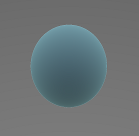

This single float3 coefficent is the average color of the whole lighting environment. Technically this is exactly what is happening with our current lighting setup, it is just a single color we are throwing around.


*Spherical Harmonics Order 0 (1 total coefficent)*


*Scene Wireframe*

I shared the wireframe here to show the scene since you wouldn't be able to make it out otherwise. But with how this scene is setup, having a single color is not enough to light these objects correctly. 

Things like occlusion of course could be used to help with shading just like we tried before...

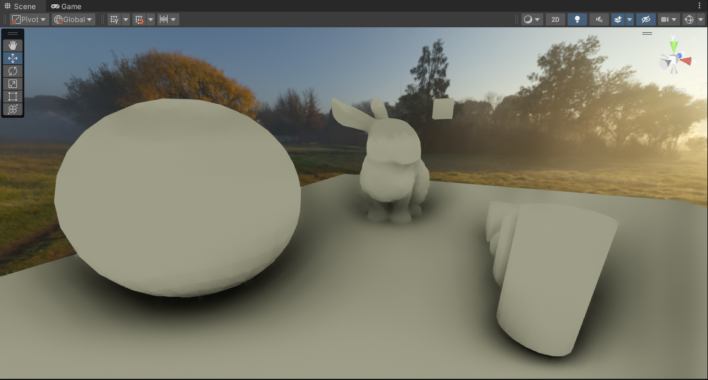
*Spherical Harmonics Order 0 (1 total coefficent) + SSAO*

But as we also saw and learned previously... 

Occlusion, regardless of what kind of flavor we may be using here *(SSAO, Material Occlusion, Lightmaps, etc)* is still not enough. More importantly it does not solve the underlying problem of the smeary/blurry lighting. Again this is because we are dealing with just a single color for the lighting.

We need more information than just a single color from our lighting environment. So lets bump the order up so we can gather more data to better shade our scene! With Order 1 we add 3 extra coefficents that are oriented to a specific direction...


*Spherical Harmonics Order 1 (3 coefficents this order introduces)*

This is now where you see the upsides to using spherical harmonics, because each coefficent now essentially provides us with more detailed information about the lighting environment...
- **Spherical Harmonic Coefficent 0** *(L = 0, M = 0)*: Describes the average color of the whole lighting environment.
- **Spherical Harmonic Coefficent 1** *(L = 1, M = -1)*: Describes the average left/right lighting color of the environment.
- **Spherical Harmonic Coefficent 2** *(L = 1, M = 0)*: Describes the average top/down lighting color of the environment.
- **Spherical Harmonic Coefficent 3** *(L = 1, M = 1)*: Describes the average forward/back lighting color of the environment.

At shading time we take the coefficents, project them reconstruct the spherical harmonic enviornment and then sample using the surface normal. 

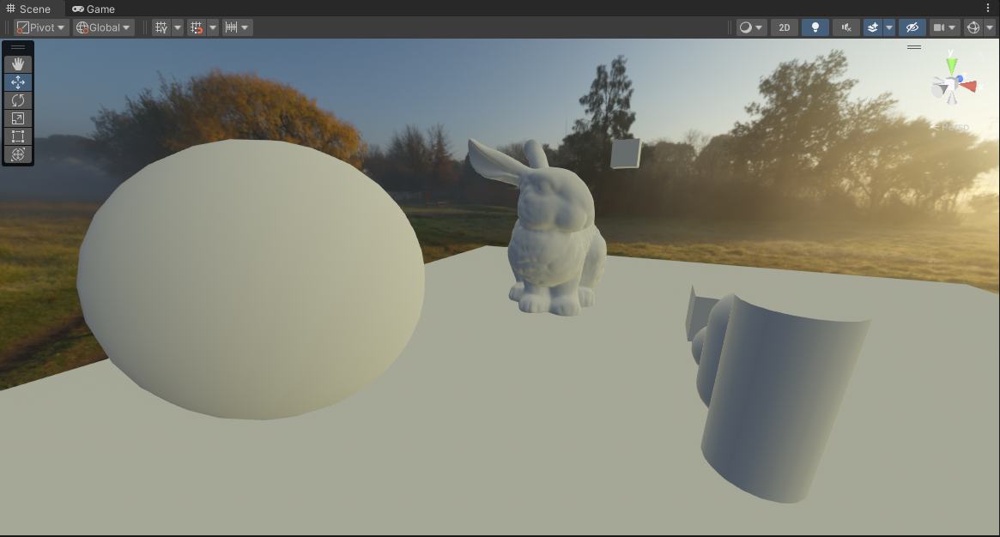
*Spherical Harmonics Order 1 (4 total coefficents)*

You can see now we can read depth and shapes from the scene now since we are shading with more than just a single color from the environment. Depending on the orentation of the surface we get different colors that corespond to the lighting environment. 

All of that just from 4 float3 colors!

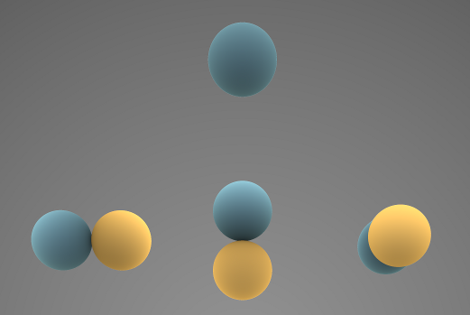
*Spherical Harmonics Order 0 and 1 (4 total coefficents)*

Now we could go further and introduce more orders, which would give us better resolution and quality... However introducing more coefficents would make things a little heavier memory wise and even a little more expensive at evaluation time.

Remember that with each new Spherical Harmonic order you introduce a new set of coefficents that makeup that order and need to be sampled.

With Diffuse/Irradiance Lighting, it's very common to at most use up to Order 1. This is because diffuse lighting tends to always be very blurry and low-frequency. Using more orders on a phenomena that is natrually blurry and low-frequency would be wasteful. *(At most Order 2 is used for Diffuse/Irradiance)*

So to keep things light and simple, we will just stick with up to Order 1 Spherical Harmonics. I would dive more into detail but just trust me on this :D

Ok fine, so how can we use it?

### Spherical Harmonics: How to apply it?

```HLSL
//ORDER = 0 | M = 0
float SphericalHarmonicBasis0(float3 dir)
{
    //return 0.5f * sqrt(1.0f / PI);
    return 0.282094791773878f; //precomputed
}

//ORDER = 1 | M = -1
float SphericalHarmonicBasis1(float3 dir)
{
    //return sqrt(3.0f / (4.0f * PI)) * dir.y;
    return 0.48860251190292f * dir.y; //precomputed
}

//ORDER = 1 | M = 0
float SphericalHarmonicBasis2(float3 dir)
{
    //return sqrt(3.0f / (4.0f * PI)) * dir.z;
    return 0.48860251190292f * dir.z; //precomputed
}

//ORDER = 1 | M = 1
float SphericalHarmonicBasis3(float3 dir)
{
    //return sqrt(3.0f / (4.0f * PI)) * dir.x;
    return 0.48860251190292f * dir.x; //precomputed
}
```

These are the spherical harmonic basis functions, but in order to use these we need to shift things a bit in our original lighting function. 

```HLSL
float3 finalIrradiance = float3(0, 0, 0);

for(int i = 0; i < ConeTraceDirections; i++)
{
    //get ray direction over a HEMI-SPHERE that is oriented with the surface normal
    float2 random = Hammersley2dSeq(i, ConeTraceDirections);
    float3 vector_rayDirection = SampleHemisphereCosine(random.x, random.y, vector_sceneShadingNormals);

    //do cone tracing...

    //add final result
    finalIrradiance += coneTraceResult;
}

//average samples
finalIrradiance /= ConeTraceDirections;
```

Instead of returning/outputing the ***final*** singular color lighting based on the surface position and orientation at a given point... We want to return more data/colors that describe the lighting environment at that specific point. 

We shift things to where we switch to calculating the full 360 degree lighting environment from that point *(instead of a hemisphere like before)* and store that result into SH coefficents that can be sampled later.

```HLSL
float3 irradianceL0 = float3(0, 0, 0);
float3 irradianceL10 = float3(0, 0, 0);
float3 irradianceL11 = float3(0, 0, 0);
float3 irradianceL12 = float3(0, 0, 0);

for(int i = 0; i < ConeTraceDirections; i++)
{
    //get ray direction over a SPHERE
    //not a hemisphere since we want info about the whole spherical lighting environment
    float2 random = Hammersley2dSeq(i, ConeTraceDirections);
    float3 vector_rayDirection = SampleSphereUniform(random.x, random.y);

    //do cone tracing...

    //then add final results...

    //spherical harmonics order 0
    irradianceL0 += coneTraceResult.rgb * SphericalHarmonicBasis0(vector_rayDirection);

    //spherical harmonics order 1
    irradianceL10 += coneTraceResult.rgb * SphericalHarmonicBasis1(vector_rayDirection);
    irradianceL11 += coneTraceResult.rgb * SphericalHarmonicBasis2(vector_rayDirection);
    irradianceL12 += coneTraceResult.rgb * SphericalHarmonicBasis3(vector_rayDirection);
}

//average samples
float scalar = (2.0f * PI / ConeTraceDirections);
irradianceL0 *= scalar;
irradianceL10 *= scalar;
irradianceL11 *= scalar;
irradianceL12 *= scalar;

//you can also do other things with the SH coefficents here...
//1. convolve coefficents for irradiance
//2. deringing
```

Now, in practice though with render targets and fragment shaders we typically only output 1 RGBA color. 

But in our case we have these 4 RGB colors that we now need to return? We can't exactly squeeze 4 RGB colors into a single output RGBA. So how can we output all the data that we need?

I'm going to keep things brief at first, but later [I explain the specifics of the packing and optimizations later here](#spherical-harmonic-optimizations-render-target-packing), but a short summary is that we can actually do some basic swizzling to pack the 4 RGB colors into just effectively 3 float4's.

That alleviates the pressure a bit but we still end up with 3 float4s. Well we need to change things in our backend quite a bit to something that would allow us to output more data from a shader. [A compute shader can do this](#spherical-harmonic-optimizations-compute-shader), so we move our lighting calculation function into one and at the end of it we output the packed float4 coefficents into 3 render targets simultanoeusly.

```HLSL
RWTexture2D<float4> VoxelConeTraceSHA;
RWTexture2D<float4> VoxelConeTraceSHB;
RWTexture2D<float4> VoxelConeTraceSHC;

#pragma kernel VoxelConeTracing
[numthreads(THREAD_GROUP_SIZE_X, THREAD_GROUP_SIZE_Y, THREAD_GROUP_SIZE_Z)]
void VoxelConeTracing(uint3 id : SV_DispatchThreadID)
{
    //the 3 float4's that we will output...
    float4 irradianceSHA = float4(0, 0, 0, 0);
    float4 irradianceSHB = float4(0, 0, 0, 0);
    float4 irradianceSHC = float4(0, 0, 0, 0);

    //calculate cone tracing like normal...

    //pack the spherical harmonic irradiance coefficents
    SphericalHarmonicsPackIrradiance_ColorL1(
        //input coefficents
        irradianceL0, 
        irradianceL10, 
        irradianceL11, 
        irradianceL12,

        //output color
        irradianceSHA,
        irradianceSHB,
        irradianceSHC);

    //output the float4's simultanoeusly
    VoxelConeTraceSHA[id.xyz] = irradianceSHA;
    VoxelConeTraceSHB[id.xyz] = irradianceSHB;
    VoxelConeTraceSHC[id.xyz] = irradianceSHC;
}
```

<p float="left">
    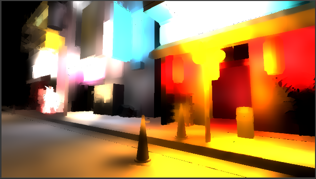
    
    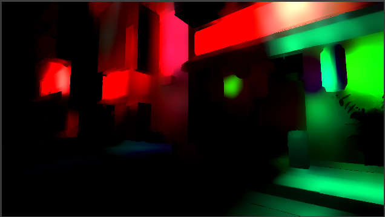
</p>

*Left To Right: SHA (Render Target 0) | SHB (Render Target 1) | SHC (Render Target 2)*

I still retain all of the upsampling and filtering passes I had before, but I just do them with each of the SH render targets. *[(I also moved these to a compute shader)](#spherical-harmonic-optimizations-compute-shader)*

After upsampling the SH render targets to full resolution, I do an additional final pass where we sample the SH lighting environment using the full resolution scene normal, and this is the result.


*1/8th Resolution (3 upsample passes)*

Woah! We can see now that scene details are retained very well now. Normal maps and granular details are actually visible and no longer overly smeared, and all of the underlying of the scene artwork is kept in tact. 

More importantly also the final lighting now is properly convincing at the resolution it is running at. We have full lighting information!

<p float="left">
    
    
</p>

*Left: 1/8th Resolution No SH + Occlusion | Right: 1/8th Resolution with SH*

That pipe I pointed out initally, well now we can make it out pretty well!

We can take the occlusion term we had previously and multiply it with our final upsampled spherical harmonic lighting to get the final results.


*1/8th Resolution + Full Resolution Occlusion (3 upsample passes)*

This is currently the best I've been able to come up with in regards to getting very good and usable results with very low resolution lighting input. Remember, this is all coming from lighting that is calculated at 1/8th screen resolution which originally would have looked like this.


*1/8th Resolution Raw (No Upsampling/Downsampling)*

The best part also is that we can actually drop the resolution even lower, and details will still be mostly retained. 

*NOTE: These screenshots don't have occlusion term factored in.*

<p float="left">
    
    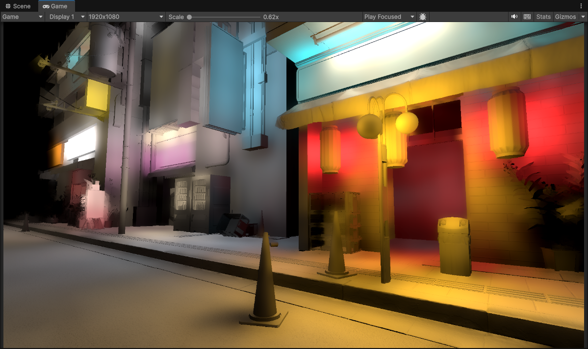
</p>

*Left: 1/16th Resolution No Spherical Harmonics (4 upsample passes) | Right: 1/16th Resolution With Spherical Harmonics (4 upsample passes)*

<p float="left">
    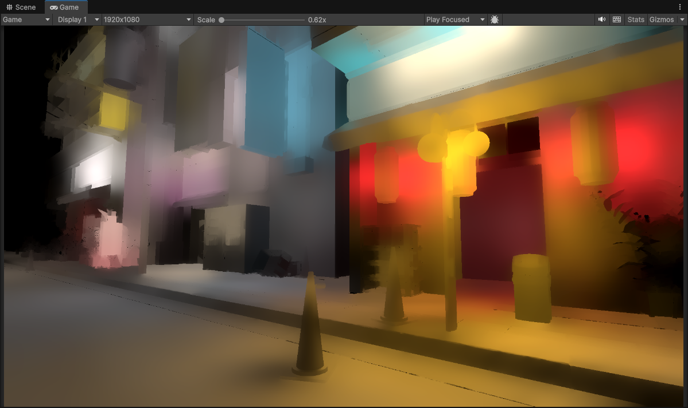
    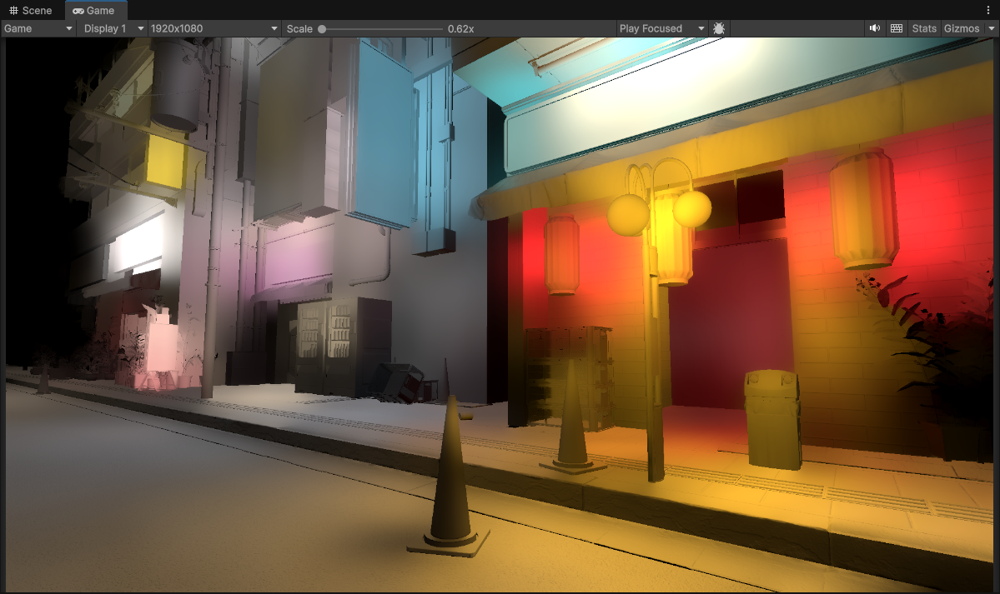
</p>

*Left: 1/32th Resolution No Spherical Harmonics (5 upsample passes) | Right: 1/32th Resolution With Spherical Harmonics (5 upsample passes)*

### Spherical Harmonic Optimizations: Compute Shader

With my inital setup with spherical harmonics, I ran the lighting calculation fragment shader effectively 3 times for each of the spherical harmonic render targets. In addition the upsampling passes would also get multiplied since each of SH render targets needed upsampling to full resolution. 

For inital prototyping and proof of concept it worked fine, but this definetly was not ideal and had some performance degredations.

One of the things I did to alleviate this was to move both the main lighting calculation, and the upsampling pass into compute shader kernels. 

That way I just execute the main lighting compute shader kernel once, and that would allow me to simultanoeusly write to the 3 SH render targets that I have *(Rather than needing to run the lighting calculation fragment shader 3 times)*. The same also for the upsampling kernel, simultaneously upsampling the 3 render targets.

```HLSL
RWTexture2D<float4> VoxelConeTraceSHA;
RWTexture2D<float4> VoxelConeTraceSHB;
RWTexture2D<float4> VoxelConeTraceSHC;

#pragma kernel VoxelConeTracing
[numthreads(THREAD_GROUP_SIZE_X, THREAD_GROUP_SIZE_Y, THREAD_GROUP_SIZE_Z)]
void VoxelConeTracing(uint3 id : SV_DispatchThreadID)
{
    //the 3 float4's that we will output...
    float4 irradianceSHA = float4(0, 0, 0, 0);
    float4 irradianceSHB = float4(0, 0, 0, 0);
    float4 irradianceSHC = float4(0, 0, 0, 0);

    //calculate cone tracing like normal...

    //pack the spherical harmonic irradiance coefficents
    SphericalHarmonicsPackIrradiance_ColorL1(
        //input coefficents
        irradianceL0, 
        irradianceL10, 
        irradianceL11, 
        irradianceL12,

        //output color
        irradianceSHA,
        irradianceSHB,
        irradianceSHC);

    //output the float4's simultanoeusly
    VoxelConeTraceSHA[id.xyz] = irradianceSHA;
    VoxelConeTraceSHB[id.xyz] = irradianceSHB;
    VoxelConeTraceSHC[id.xyz] = irradianceSHC;
}
```

### Spherical Harmonic Optimizations: Render Target Packing

I also mentioned that I had 3 SH render targets. Which might not make sense considering we are dealing with Order 1 Spherical Harmonics which leaves you with 4 float3's.

1. RGBA Render Target 0
    - R: L0.r
    - G: L0.g
    - B: L0.b
    - A: *(Unused)*
2. RGBA Render Target 1
    - R: L1X.r
    - G: L1X.g
    - B: L1X.b
    - A: *(Unused)*
3. RGBA Render Target 2
    - R: L1Y.r
    - G: L1Y.g
    - B: L1Y.b
    - A: *(Unused)*
3. RGBA Render Target 3
    - R: L1Z.r
    - G: L1Z.g
    - B: L1Z.b
    - A: *(Unused)*

You could have 4 render targets, but that is a bit wasteful memory wise. Turns out we can just pack those 4 float3's into 3 float4's with some basic swizzling. *(moving each of the components around)*

NOTE: The render targets are RGBA64. Each component is 16 bit half precison, not 8 bit because we are dealing with lighting. We need HDR for proper shading results.

1. RGBA Render Target 0
    - R: L0.r
    - G: L0.g
    - B: L0.b
    - A: L1X.r
2. RGBA Render Target 1
    - R: L1X.g
    - G: L1X.b
    - B: L1Y.r
    - A: L1Y.g
3. RGBA Render Target 2
    - R: L1Y.b
    - G: L1Z.r
    - B: L1Z.g
    - A: L1Z.b

Now currently I still utilize 3 Render Targets, but this can actually be taken much further as you can do some clever packing techniques to where you can shrink things down to 2 Render Targets. 

Trading color accuracy for luminance, in this case the first Order 0 coefficent remains as is, but Order 1 coefficents store luminance rather than a full RGB color. 

1. RGBA Render Target 0: (L0.r, L1.g, L1.b, L1X)
    - R: L0.r
    - G: L0.g
    - B: L0.b
    - A: L1X
2. RGHalf Render Target 1: (L1Y, L1Z)
    - R: L1Y
    - G: L1Z

There are likely other clever packing schemes that exist, you are welcome to try them and if it works for you, then do it! *(If you also know of any other additional techniques for this please let me know! I'm still on the lookout)*

### Spherical Harmonic Bonuses

Another bonus of said effects is that since we have information on the lighting environment beyond just a single color now for every pixel. 

With spherical harmonics we can actually do a trick to where we can calculate the dominant direction of light from the SH environment. This dominant direction vector can then be used to derive a specular highlight term that can enhance the quality of our global illumination reflection buffer!

The dominant direction also in theory can also be used for potentially more things *(like localized contact shadows, or micro shadows, etc)*.

## Future: How to go even further and beyond?

Where to go from here of course? 

At this point I am mostly satisified with the results, but I am still actively exploring techniques or other avenues to improve results even further.

A big part of global illumination is specular/reflections. We only looked at diffuse/irradiance here, but often reflections are handled in a seperate pass. SSR is a potential solution here *(and a common industry one)* but that has obvious drawbacks with only being a screen-space effect. It would be ideal if both diffuse and specular/reflections could be done once in a single pass.

At the time of writing I have my eyeballs set on radiance caching with octahedron maps. 

Spherical harmonics are great but don't contain enough information to store radiance *(or reflection)*. Having effectively a low resolution cubemap per pixel *(or area)* would be more useful. That is where octahedral mapping can come in. That octahedron map can be used for reflections directly, and diffuse/irradiance can also be derived from it using spherical harmonics just like we did before.

The only issue with the approach is that memory wise it will be considerably heavier, needing to store effectively a cubemap per pixel. Potentially more expensive also since now you are juggling alot more data, and you need very good probe interpolation across pixels. 

I do have a prototype working, but it needs alot more work before I'd consider it to be usable and viable. Probe interpolation currently being a difficult problem to solve well.

# References / Sources
List of references that helped with my implementations and understanding.

- [(theinstructionlimit) gaussian-blur-revisited-part-one](https://theinstructionlimit.com/gaussian-blur-revisited-part-one)

- [(theinstructionlimit) gaussian-blur-revisited-part-two](https://theinstructionlimit.com/gaussian-blur-revisited-part-two)

- [(bartwronski) bilinear-down-upsampling-pixel-grids-and-that-half-pixel-offset](https://bartwronski.com/2021/02/15/https://bartwronski.com/2021/02/15/bilinear-down-upsampling-pixel-grids-and-that-half-pixel-offset/)

- [(c0de517e) downsampled-effects-with-depth-aware](https://c0de517e.blogspot.com/2016/02/downsampled-effects-with-depth-aware.html)

- [(hikiko-blog) depth_aware_upsampling_experiments](https://web.archive.org/web/20200819181017/https://eleni.mutantstargoat.com/hikiko/category/igalia/depth-aware-upsampling-experiments/)

- [(patapom) SHPortal](https://patapom.com/blog/SHPortal/)